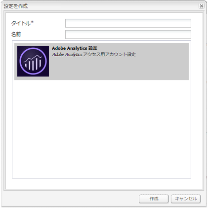
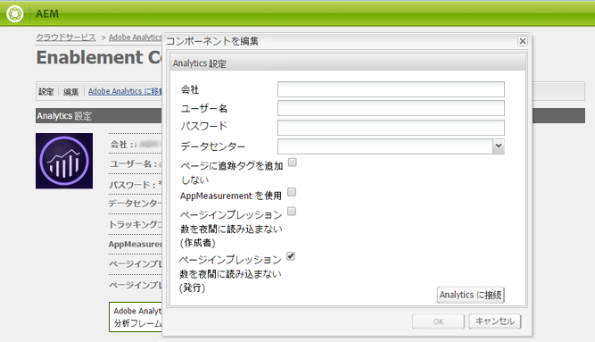
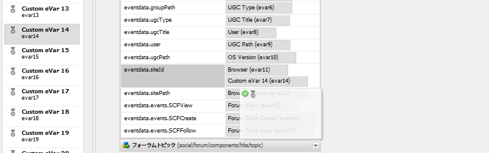

# コミュニティ機能のための Analytics の設定 {#analytics-configuration-for-communities-features}

>[!CAUTION]
>
>AEM 6.4 の拡張サポートは終了し、このドキュメントは更新されなくなりました。 詳細は、 [技術サポート期間](https://helpx.adobe.com/jp/support/programs/eol-matrix.html). サポートされているバージョンを見つける [ここ](https://experienceleague.adobe.com/docs/?lang=ja).

## 概要 {#overview}

Adobe AnalyticsとAdobe Experience Manager(AEM) は、共にAdobe Marketing Cloudのソリューションです。

Adobe AnalyticsをAEM Communities用に設定して、メンバーがサポートされている Communities 機能とやり取りする際に、レポートの生成元となるAdobe Analyticsにイベントを送信することができます。

例えば、イネーブルメントコミュニティサイトのメンバーが、割り当てられたビデオリソースを表示すると、リソースプレーヤーは、ビデオハートビートデータを含むイベントを Analytics に送信します。 コミュニティサイトから、管理者はビデオの再生に関する様々なレポートを表示できます。

さらに、以下に対して分析が必要です。

* パブリッシュ環境では、次の操作を実行します。

   * コミュニティのレポート [トレンド](trends.md)
   * サイト訪問者に対し、「最も多く閲覧された」、「最もアクティブ」、「最も「いいね！」が多い」で並べ替えることを許可します
   * UGC リストでの表示回数

* オーサー環境では、次の操作をおこないます。

   * でのパーティシペーションデータの表示 [メンバー管理コンソール](members.md) （閲覧、投稿、フォロー、「いいね！」）
   * イネーブルメントリソースのトレンドの概要、ビデオハートビート、ビデオデバイス [レポート](reports.md)

サポートされるコミュニティ機能は次のとおりです。

* [イネーブルメントリソース](resources.md)
* [フォーラム](forum.md)
* [Q&amp;A](working-with-qna.md)
* [ブログ](blog-feature.md)
* [ファイルライブラリ](file-library.md)
* [Calendar](calendar.md)

この節では、Analytics レポートスイートを Communities の機能と接続する方法について説明します。 基本的な手順は次のとおりです。

1. [暗号鍵のレプリケート](#replicate-the-crypto-key) すべてのAEMインスタンスで暗号化/復号化が正しく行われるようにする
1. Adobe Analyticsの準備 [レポートスイート](#adobe-analytics-report-suite-for-video-reporting)
1. AEM Analytics の作成 [クラウドサービス](#aem-analytics-cloud-service-configuration) および [枠組み](#aem-analytics-framework-configuration)
1. [Analytics を有効にする](#enable-analytics-for-a-community-site) コミュニティサイトの
1. [検証](#verify-analytics-to-aem-variable-mapping) Analytics からAEM変数へのマッピング
1. 特定 [主発行者](#primary-publisher)
1. [公開](#publish-community-site-and-analytics-cloud-service) コミュニティサイト
1. 設定 [レポートデータのインポート](#obtaining-reports-from-analytics) Adobe Analyticsからコミュニティサイトへ

## 前提条件 {#prerequisites}

Analytics for Communities の機能を設定するには、アカウント担当者と協力してAdobe Analyticsアカウントを設定し、 [レポートスイート](#adobe-analytics-report-suite-for-video-reporting). 設定が完了したら、次の情報を利用できるようになります。

* 会社名

   Adobe Analyticsアカウントに関連付けられている会社
* ユーザー名

   Analytics アカウントの管理を許可されたユーザーのログインユーザー名

   （Web サービスアクセス権限を含める必要があります）

* パスワード

   認証済みユーザーのログインパスワード

* Analytics データセンター

   アカウントの Analytics データセンターの URL

* レポートスイート

   使用する Analytics レポートスイートの名前

## ビデオレポート用のAdobe Analyticsレポートスイート {#adobe-analytics-report-suite-for-video-reporting}

Adobe Marketing Cloud の [Report Suite Manager](https://experienceleague.adobe.com/docs/?lang=jaanalytics/admin/manage-report-suites/new-report-suite/new-report-suite.html)を設定すると、コミュニティサイトでコミュニティ機能のレポートを提供できるように、Analytics レポートスイートを設定できます。

にサインインする [Adobe Marketing Cloud](https://experienceleague.adobe.com/docs/analytics/analyze/analysis-workspace/home.html?lang=ja) と [会社名とユーザ名](analytics.md#prerequisites)を使用する場合、以下の項目を含む新しいレポートスイートまたは既存のレポートスイートを設定できます。

* [11 個のコンバージョン変数](https://experienceleague.adobe.com/docs/analytics/admin/admin-tools/conversion-variables/conversion-var-admin.html?lang=ja) (evar)

   * **`evar1`** 経由 **`evar11`** 有効
   * 既存の eVar を転用（名前を変更）したり、新しい eVar を作成してコミュニティ機能に使用したりできます。

* [7 件の成功イベント](https://experienceleague.adobe.com/docs/analytics/admin/admin-tools/success-events/success-event.html?lang=ja) （イベント）

   * **`event1`** 経由 **`event7`** 有効
   * 型 **`Counter`**

      * not **`Counter (no subrelations)`**
   * 既存のイベントを転用（名前を変更）したり、新しいイベントを作成してコミュニティ機能に使用したりできます


* [ビデオ管理](https://experienceleague.adobe.com/docs/media-analytics/using/media-overview.html?lang=ja)

   * ビデオレポートコンソール

      * Enable（有効） `Video Core`
      * 「保存」を選択します
   * ビデオコア指標コンソール

      * `Use Solution Variables` を選択します。
      * 「保存」を選択します


を使用している場合、 **新しいレポートスイート**&#x200B;新しいレポートスイートには 4 つの evar と 6 つのイベント変数しか設定できませんが、Communities では 11 個の evar と 7 個のイベント変数が必要です。

を使用する場合、 **既存のレポートスイート**&#x200B;を使用する場合、 [変数マッピングの変更](#modifying-analytics-variable-mapping) コミュニティサイト用に Analytics フレームワークをアクティブ化する前に、以下を実行します。 コミュニティ専用の変数に関するご不明な点は、アカウント担当者にお問い合わせください。

>[!CAUTION]
>
>**内の変数を既に使用している既存のレポートスイートを使用する場合**
>
>* **`evar1`** から **`evar11`** まで
>* **`event1`** から **`event7`** まで
>
>**次に、コミュニティサイトが公開される前に、** Analytics がコミュニティサイトに対して有効になっている場合に、Analytics 変数に自動的にマッピングされたAEM変数を移動して、既存のマッピングを復元することが重要です。
>
>既存のマッピングを復元し、AEM変数を他の Analytics 変数に移動するには、 [Analytics 変数のマッピングの変更](#modifying-analytics-variable-mapping).
>
>そうしないと、回復不能なデータが失われる可能性があります。

### ビデオハートビート分析 {#video-heartbeat-analytics}

Video Heartbeat Analytics のライセンスが必要な場合、 `Marketing Cloud Org Id` が割り当てられます。

次の後にビデオハートビートレポートを有効にするには [ビデオレポート用の Analytics レポートスイートの設定](#adobe-analytics-report-suite-for-video-reporting):

* の作成 [Analytics クラウドサービス](#aem-analytics-cloud-service-configuration)
* 有効にする [コミュニティサイトの分析](#enable-analytics-for-a-community-site)
* を関連付ける `Marketing Cloud Org Id` コミュニティサイトで

この `Marketing Cloud Org Id` は [コミュニティサイトの作成](sites-console.md#enablement) または後から [修正](sites-console.md#modifying-site-properties) コミュニティサイトのプロパティ。 [](#aem-analytics-cloud-service-configuration)


Video Heartbeat Analytics が有効な場合、ビデオプレーヤーの JavaScript(JS) コードは、Video Heartbeat ライブラリコード（JS も含む）をインスタンス化し、10 秒ごとに（設定不可）Analytics ビデオトラッキングサーバーにビデオステータスの更新を送信するすべてのロジックを処理します。

有効にしない場合、ビデオハートビートコードはインスタンス化されず、ビデオの進行状況と再開位置のトラッキングのみがレポート用に SRP に保持されます。

## AEM Analytics Cloud Service Configuration {#aem-analytics-cloud-service-configuration}

オーサーインスタンスの標準 UI を使用して、Adobe AnalyticsとAEMコミュニティサイトを統合する新しい Analytics 統合を作成するには、次の手順を実行します。

* グローバルナビゲーションから： **[!UICONTROL ツール/導入/Cloud Services]**
* 下にスクロールして **[!UICONTROL Adobe Analytics]**
* 次のいずれかを選択 **[!UICONTROL 今すぐ設定]** または **[!UICONTROL 設定を表示]**


### 設定を作成ダイアログ {#create-configuration-dialog}

* 選択 `[+]` 隣のアイコン **[!UICONTROL 利用可能な設定]** 新しい設定を作成するには

設定を作成ダイアログで、入力する値で設定が識別されます。



* **[!UICONTROL タイトル]**

   （必須）設定の表示タイトル。

   例えば、 *イネーブルメントコミュニティ分析*

* **[!UICONTROL 名前]**

   （オプション）指定しない場合、名前はデフォルトで、タイトルから派生した有効なノード名になります。

   例えば、 *コミュニティ*


* **[!UICONTROL テンプレート]**

   `Adobe Analytics Configuration` を選択します。

* 選択 **[!UICONTROL 作成]**
   * 設定ページを起動して開きます `Analytics Settings` ダイアログ

### Analytics 設定ダイアログ {#analytics-settings-dialog}

新しい Analytics 設定を初めて作成すると、設定が表示され、Analytics 設定を入力するための新しいダイアログが表示されます。 このダイアログでは、 [前提条件のアカウント情報](#prerequisites) アカウント担当者から取得します。



* **[!UICONTROL Company（会社）]**

   Adobe Analyticsアカウントに関連付けられている会社

* **[!UICONTROL ユーザー名]**

   Analytics アカウントの管理を許可されたユーザーのログインユーザー名

* **[!UICONTROL パスワード]**

   認証済みユーザーのログインパスワード

* **[!UICONTROL データセンター]**

   レポートスイートをホストしている Analytics データセンターを選択します。

* **[!UICONTROL ページに追跡タグを追加しない]**

   デフォルトのままにする（オフ）

* **[!UICONTROL AppMeasurement を使用]**

   デフォルトのままにする（オフ）

* **[!UICONTROL ページインプレッション数を夜間に読み込まない (作成者)]**

   デフォルトのままにする（オフ）

* **[!UICONTROL ページインプレッション数を夜間に読み込まない (発行)]**

   デフォルトのままにする（オン）

設定を保存するには：


* 選択 **[!UICONTROL Analytics に接続]**

   * 成功しなかった場合、

      * エントリの先頭にスペースが含まれていないことを確認します
      * 別のデータセンターを試す
      * アカウント担当者にお問い合わせください

* 選択 **[!UICONTROL OK]**


### フレームワークを作成 {#create-framework}

Adobe Analyticsへの基本的な接続を正常に設定したら、コミュニティサイトのフレームワークを作成または編集する必要があります。 このフレームワークの目的は、コミュニティ機能 (AEM) 変数を Analytics（レポートスイート）変数にマッピングすることです。

* 選択 `[+]` 隣のアイコン **[!UICONTROL 使用可能なフレームワーク]** 新しいフレームワークを作成するには


* **[!UICONTROL タイトル]**

   （必須）フレームワークの表示タイトル

   例えば、 *イネーブルメントコミュニティフレームワーク*

* **[!UICONTROL 名前]**

   （オプション）指定しない場合、名前はデフォルトで、タイトルから派生した有効なノード名になります。

   例えば、 *コミュニティ*

* **[!UICONTROL テンプレート]**

   `Adobe Analytics Framework` を選択します。

* 選択 **[!UICONTROL 作成]**

Analytics フレームワークを作成すると、設定用のフレームワークが開きます。

## AEM Analytics Framework 設定 {#aem-analytics-framework-configuration}

このフレームワークの目的は、AEM変数を Analytics 変数（eVar およびイベント）にマッピングすることです。 マッピングに使用できる Analytics 変数は次のとおりです [レポートスイートで定義される](#adobe-analytics-report-suite-for-video-reporting).


### レポートスイートの選択 {#select-report-suite}

ビデオレポート用に設定されたレポートスイートを選択します。

レポートスイートがまだ作成されていない、または適切に設定されていない場合は、前の節を参照してください。\
[ビデオレポート用のAdobe Analyticsレポートスイート](#adobe-analytics-report-suite-for-video-reporting)

サイドキックは不要で、レポートスイート設定へのアクセスを妨げないように最小化されている場合があります。

#### 「項目を追加」を選択する前後のレポートスイートダイアログ {#report-suites-dialog-before-and-after-selecting-add-item}


1. 選択 **[!UICONTROL 項目を追加+]** 2 つのドロップダウンボックスが表示されます
1. を選択します。 `Report suite` 会社アカウントに関連付けられているレポートスイートを選択できるようにする必要があります
1. 選択 **[!UICONTROL はい]** 表示されるダイアログで、次の操作を実行します。 ```Load default server settings? Do you want to load the default server settings and overwrite current values in the Server section?```
1. を選択します。 `Run Mode`\
   選択 **[!UICONTROL 公開]**


これで、Analytics Cloud サービスとフレームワークが完了しました。 マッピングは、この Analytics サービスを有効にしてコミュニティサイトを作成した後に定義されます。

## コミュニティサイト用に Analytics を有効にする {#enable-analytics-for-a-community-site}

### 新しいコミュニティサイト用に有効化 {#enable-for-new-community-site}

Analytics クラウドサービスを追加するには、以下を実行します。 [新しいコミュニティサイトの作成](sites-console.md):


* 手順 3
* 以下 [「ANALYTICS」タブ](sites-console.md#analytics):

   * 次を確認します。 **[!UICONTROL Analytics を有効にする]** チェックボックス
   * ドロップダウンボックスからフレームワークを選択します

* 必要に応じて、Analytics フレームワーク設定に戻り、変数のマッピングを調整します。

### 既存のコミュニティサイトに対して有効にする {#enable-for-existing-community-site}

Analytics クラウドサービスを [既存のコミュニティサイト](sites-console.md#modifying-site-properties):


* 次に移動： **[!UICONTROL コミュニティ/サイト]** コンソール
* コミュニティサイトのサイトを編集アイコンを選択します。
* 設定を選択
* 「Analytics」セクションで、以下の操作をおこないます。

   * 次を確認します。 **[!UICONTROL Analytics を有効にする]** チェックボックス
   * ドロップダウンボックスからフレームワークを選択します


* 必要に応じて、Analytics フレームワーク設定に戻り、変数のマッピングを調整します。

### カスタマイズされたサイトの有効化 {#enable-for-customized-sites}

Analytics のトラッキングと読み込みがコミュニティサイトに対して適切に機能するように、ページ要素 `scf-js-site-title` class 属性と href 属性が存在する必要があります。 そのような要素は、変更されていないページ内に存在するなど、1 つだけページ上に存在する必要があります `sitepage.hbs` コミュニティサイト用のスクリプト の値 `siteUrl` 抽出され、Adobe Analyticsに *サイトパス*.

```xml
# present in default sitepage.hbs

>[!CAUTION]
>
>AEM 6.4 has reached the end of extended support and this documentation is no longer updated. For further details, see our [technical support periods](https://helpx.adobe.com/support/programs/eol-matrix.html). Find the supported versions [here](https://experienceleague.adobe.com/docs/).
# only one scf-js-site-title class should be included

>[!CAUTION]
>
>AEM 6.4 has reached the end of extended support and this documentation is no longer updated. For further details, see our [technical support periods](https://helpx.adobe.com/support/programs/eol-matrix.html). Find the supported versions [here](https://experienceleague.adobe.com/docs/).
# this example sets it to be hidden as it serves no visual purpose

>[!CAUTION]
>
>AEM 6.4 has reached the end of extended support and this documentation is no longer updated. For further details, see our [technical support periods](https://helpx.adobe.com/support/programs/eol-matrix.html). Find the supported versions [here](https://experienceleague.adobe.com/docs/).
<div
    class="navbar-brand scf-js-site-title"
    href="{{siteUrl}}.html"
    style="visibility: hidden;"
>
</div>
```

の **カスタマイズされたコミュニティサイト** が `sitepage.hbs` スクリプトを使用する場合は、要素が存在することを確認します。 この `siteUrl`変数は、クライアントに提供される前にサーバーでレンダリングされる際に設定されます。

の **汎用AEMサイト** コミュニティコンポーネントを含むが、 [サイト作成ウィザード](sites-console.md)の場合は、要素を追加する必要があります。 href の値は、サイトへのパスにする必要があります。 例えば、サイトのパスが `/content/my/company/en`、次を使用します。

```xml
<div
    class="navbar-brand scf-js-site-title"
    href="/content/my/company/en.html"
    style="visibility: hidden;"
>
</div>
```

## Analytics for Communities の機能 {#analytics-for-communities-features}

Analytics は、複数のコミュニティ機能で自動的に使用されます。

オーサー環境の [OSGi 設定](../../help/sites-deploying/configuring-osgi.md), `AEM Communities Analytics Component Configuration`は、Analytics 用に実装されたコンポーネントの一覧を提供します。 変数の自動マッピングは、リストされているコンポーネントによって決定されます。

Analytics 用に実装される新しいカスタムコンポーネントを作成する場合は、この設定済みコンポーネントのリストに追加する必要があります。

### コンポーネント設定 {#component-configuration}


注意：の `journal` コンポーネントは、ブログ機能の実装に使用されます。

### Analytics とAEM変数のマッピング {#mapped-analytics-to-aem-variables}

Analytics を有効にし、クラウド設定フレームワークを選択した状態でコミュニティサイトを保存すると、AEM変数は、evar1 と event1 で始まる Analytics の eVar およびイベントに自動的にマッピングされ、1 ずつ増分されます。

evar1 ～ evar11 および event1 ～ event7 内の変数のいずれかをマッピングした既存のレポートスイートを使用する場合は、次の操作が必要です。 [AEM変数の再マッピング](#modifying-analytics-variable-mapping) 元のマッピングを復元します。

次に、 [はじめにのチュートリアル](getting-started-enablement.md):


#### 各イベントと共に送信される eVar のマップ {#map-of-evars-sent-with-each-event}

|  | イネーブルメントリソースタイプ | サイトのタイトル | 関数タイプ | グループタイトル | グループ化とパス | UGC タイプ | UGC タイトル | ユーザー（メンバー） | UGC パス | サイトパス |
|------------------------|------------------------|-----------|--------------|------------|-----------|---------|----------|--------------|---------|----------|
|  | **eVar1** | **eVar2** | **eVar3** | **eVar4** | **eVar5** | **eVar6** | **eVar7** | **eVar8** | **eVar9** | **eVar10** |
| event1Resource Play | (a) | - | - | - | - | - | - | - | 一 | - |
| event2SCFView | (a) | (b) | ハ | (d) | (e) | (f) | (g) | (h) | 一 | ヌ |
| event3SCFCreate (Post) | - | (b) | ハ | (d) | (e) | (f) | (g) | (h) | 一 | ヌ |
| event4SCFFollow | - | (b) | ハ | (d) | (e) | (f) | (g) | (h) | 一 | ヌ |
| event5SCFVoteUp | - | (b) | ハ | (d) | (e) | (f) | (g) | (h) | 一 | ヌ |
| event6SCFVoteDown | - | (b) | ハ | (d) | (e) | (f) | (g) | (h) | 一 | ヌ |
| event7SCFRate | - | (b) | ハ | (d) | (e) | (f) | (g) | (h) | 一 | ヌ |

**eVar値の例：**

* [MIME タイプ](https://www.iana.org/assignments/media-types):video/mp4
* [コミュニティサイトのタイトル](sites-console.md#step13asitetemplate):Geometrixxコミュニティ
* [コミュニティ機能名](functions.md):フォーラム
* [コミュニティグループ名](creating-groups.md#creating-a-new-group):ハイキング
* コミュニティグループコンテンツへのパス：/content/sites/communities/en/groups/hiking
* [UGC コンポーネント resourceType](essentials.md):social/forum/components/hbs/topic
* UGC コンポーネントのタイトル：ハイキングトピック
* ログイン（許可可能 ID）:aaron.mcdonald@mailinator.com
* UGC への SRP パス：/content/usergenerated/asi/.../forum/jmtz-topic3 または *フォローするコンポーネントのパス*:/content/sites/communities/en/jcr:content/content/primary/forum
* コミュニティサイトコンテンツへのパス：/content/sites/community/en

### Analytics 変数のマッピングの変更 {#modifying-analytics-variable-mapping}

Analytics の eVar およびイベントとAEM変数とのマッピングは、コミュニティサイトで Analytics を有効にした後、フレームワーク設定から表示されます。

Analytics を有効にしてからコミュニティサイトを公開する前に、左側のパネルから目的の Analytics eVar またはイベントをドラッグし、マッピングテーブルの関連する行にドロップすることで、フレームワーク内でマッピングを変更できます。

マッピングの重複を避けるには、置き換えられた Analytics の eVar またはイベントを必ず行から削除するように、マウスポインターを置き、Analytics 変数要素の右側に表示される「X」を選択してください。

Communities の eVar やイベントがレポートスイートに以前存在したマッピングを上書きする場合、データの損失を避けるために、Communities 機能のAEM変数を他の Analytics の eVar やイベントに割り当て、元のマッピングを復元します。

>[!CAUTION]
>
>コミュニティサイトが開かれる前に再マッピングが重要です。 [公開済み](#publishing-the-community-site) Analytics を有効にしないと、データが失われるリスクがあります。

#### 手順 1 の例：Analytics evar14 をマッピングテーブルにドラッグ {#example-step-dragging-analytics-evar-into-mapping-table}



#### 手順 2 の例：置き換えられた evar11 を削除するには「x」を選択します。 {#example-step-selecting-x-to-remove-replaced-evar}


#### 手順 3 の例：AEM var eventdata.siteId が Analytics evar14 に再マッピングされました {#example-step-aem-var-eventdata-siteid-remapped-to-analytics-evar}


## コミュニティサイトの公開 {#publishing-the-community-site}

### Analytics とAEM変数とのマッピングの検証 {#verify-analytics-to-aem-variable-mapping}

コミュニティサイトを公開する前に変数のマッピングを確認しておくとよいでしょう。このサイトでは、Analytics クラウドサービスとフレームワークも公開しています。

次の節を参照してください。

* [Analytics とAEM変数のマッピング](#mapped-analytics-to-aem-variables)
* [Analytics 変数のマッピングの変更](#modifying-analytics-variable-mapping)

>[!CAUTION]
>
>**内の変数を既に使用している既存のレポートスイートを使用する場合**
>
>* **`evar1`** から **`evar11`** まで
>* **`event1`** から **`event7`** まで
>
>**次に、コミュニティサイトが公開される前に、** 既存のマッピングを復元し、（Analytics がコミュニティサイトで有効になっている場合に）自動的にマッピングされた Communities AEM変数を他の Analytics 変数に移動することが重要です。 この再マッピングは、すべてのコミュニティコンポーネントで一貫している必要があります。
>
>そうしないと、回復不能なデータが失われる可能性があります。

### プライマリ発行者 {#primary-publisher}

選択したデプロイメントが [パブリッシュファーム](topologies.md#tarmk-publish-farm)その場合、1 つのAEMパブリッシュインスタンスを、レポートデータを書き込むためのポーリングAdobe Analyticsのプライマリパブリッシャーとして識別する必要があります [SRP](working-with-srp.md).

デフォルトでは、 `AEM Communities Publisher Configuration` OSGi 設定では、パブリッシュインスタンスがプライマリパブリッシャーとして識別されます。これにより、パブリッシュファーム内のすべてのパブリッシュインスタンスがプライマリとして自己識別されます。

したがって、すべてのセカンダリパブリッシュインスタンスの設定を編集して、 **プライマリ発行者** チェックボックス。

具体的な手順については、 [コミュニティのデプロイ](deploy-communities.md#primary-publisher).

>[!CAUTION]
>
>複数のパブリッシュインスタンスからのポーリングを防ぐように、プライマリパブリッシャーを設定することが重要です。

### 暗号鍵のレプリケート {#replicate-the-crypto-key}

Adobe Analyticsの資格情報は暗号化されます。 オーサーとパブリッシャー間で暗号化された分析資格情報のレプリケーションまたは送信を容易にするには、すべてのAEMインスタンスが同じプライマリ暗号化キーを共有する必要があります。

それには、 [暗号鍵のレプリケート](deploy-communities.md#replicate-the-crypto-key).

### コミュニティサイトとAnalytics Cloudサービスを公開 {#publish-community-site-and-analytics-cloud-service}

Analytics クラウドサービスをコミュニティサイトに対して有効にし、必要に応じて [Analytics 変数とAEM変数のマッピングが調整されました](#mapped-analytics-to-aem-variables)を使用する場合は、次の手順で設定をパブリッシュ環境にレプリケートする必要があります。 [（再）コミュニティサイトを公開する](sites-console.md#publishing-the-site).

## Analytics からレポートを取得する {#obtaining-reports-from-analytics}

### レポート管理 {#report-management}

作成者およびプライマリパブリッシャーの [OSGi 設定](../../help/sites-deploying/configuring-osgi.md), `AEM Communities Analytics Report Management`は、Analytics に対するクエリに使用されます。

オーサー環境では、クエリはリアルタイムレポート用です。

プライマリパブリッシャでは、クエリを使用して、レポートインポータの Analytics データのインポートに備えて情報を提供します。

クエリ間隔のデフォルト値は 10 秒です。

### レポートインポーター {#report-importer}

Analytics が有効なコミュニティサイトが公開されると、プライマリパブリッシャーは [OSGi 設定](../../help/sites-deploying/configuring-osgi.md), `AEM Communities Analytics Report Importer`CRXDE で個別に設定されない設定に対して、デフォルトのポーリング間隔を設定するように設定できます。

ポーリング間隔は、データを取り込んでに保存するためのAdobe Analyticsへのリクエストの頻度を制御します [SRP](working-with-srp.md).

データが「ビッグデータ」に分類される場合、ポーリングの頻度が高いほど、コミュニティサイトに大きな負荷がかかる可能性があります。

デフォルトのポーリング **インポート間隔** が 12 時間に設定されている場合、


### コンポーネントレポートのカスタマイズ {#component-report-customization}

現在、追跡する指標をカスタマイズするために、リポジトリにノードが作成され、その指標に関するレポートを生成する期間が定義されます。

現在、このカスタマイズの例はフォーラムトピックのみです。

* プライマリパブリッシャー
* 管理者権限でログイン
* に移動します。 [CRXDE Lite](../../help/sites-developing/developing-with-crxde-lite.md)

   * 例： [http://localhost:4503/crx/de](http://localhost:4503/crx/de)

* 以下 `jcr:content` 言語ルートのノード

   * 例：`/content/sites/engage/en/jcr:content`

* Analytics レポート用に設定されたコンポーネントに移動します。

   * 例：`analytics/reportConfigs/social_forum_components_hbs_topic`

* 作成された期間に注意してください。

   * `last30Days`
   * `last90Days`
   * `thisYear`

* 注意： `total`ノード

   * の変更 `interval` プロパティは、レポートインポーターの間隔を上書きします
   * 値は秒単位で、4 時間 (14400秒 ) に設定されます


## Analytics でのユーザーデータの管理 {#manage-user-data-in-analytics}

Adobe Analyticsには、ユーザーデータへのアクセス、データの書き出し、削除をおこなえる API が用意されています。 詳しくは、 [アクセス要求および削除要求の送信](https://experienceleague.adobe.com/docs/analytics/admin/data-governance/gdpr-submit-access-delete.html).

## リソース {#resources}

* Adobe Marketing Cloud: [Analytics ヘルプとリファレンス](https://experienceleague.adobe.com/docs/analytics/landing/home.html)
* AEM: [Adobe Analyticsとの統合](../../help/sites-administering/adobeanalytics.md)
* AEM: [Analytics と外部プロバイダー](../../help/sites-administering/external-providers.md)
