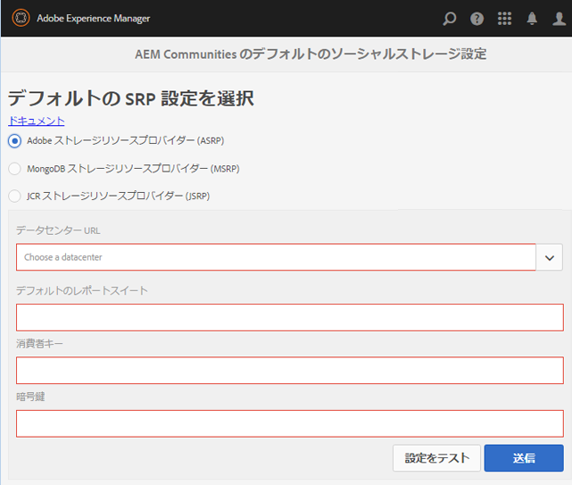

# ASRP - Adobe ストレージリソースプロバイダー {#asrp-adobe-storage-resource-provider}

## ASRP について {#about-asrp}

AEM Communitiesが ASRP を共通ストアとして使用するように設定されている場合、同期やレプリケーションを必要とせずに、すべてのオーサーインスタンスとパブリッシュインスタンスからユーザー生成コンテンツ (UGC) にアクセスできます。

関連トピック [SRP オプションの特性](working-with-srp.md#characteristics-of-srp-options) および [推奨されるトポロジ](topologies.md).

## 要件 {#requirements}

ASRP を使用するには、追加のライセンスが必要です。

UGC 用の ASRP を使用するようにAEM Communitiesサイトを設定するには、次のアカウント担当者にお問い合わせください。

* データセンター URL （ASRP エンドポイントのアドレス）
* 消費者キー
* 秘密鍵
* レポートスイート ID

消費者と秘密鍵は、会社のすべてのレポートスイートで共有されます。 テナントごとに 1 つのレポートスイートがあります。

## 設定 {#configuration}

### ASRP を選択 {#select-asrp}

この [ストレージ設定コンソール](srp-config.md) では、使用する SRP の実装を指定するデフォルトのストレージ設定を選択できます。

**作成者**:

* グローバルナビゲーションから： **[!UICONTROL ツール/コミュニティ/ストレージ設定]**

* 選択 **[!UICONTROL Adobeストレージリソースプロバイダ (ASRP)]**
* 次の情報は、プロビジョニングプロセスから取得されます

   * **[!UICONTROL データセンター URL]**

      プルダウンして、アカウント担当者が特定した実稼動データセンターを選択します。

   * **[!UICONTROL デフォルトのレポートスイート]**

      デフォルトのレポートスイート名を入力

   * **[!UICONTROL 消費者キー]**

      消費者キーを入力

   * **[!UICONTROL 暗号鍵]**

      秘密鍵を入力

* 選択 **[!UICONTROL 送信]**

パブリッシュインスタンスを準備します。

* [暗号鍵のレプリケート](#replicate-the-crypto-key)
* [設定のレプリケート](#publishing-the-configuration)

設定を送信した後、接続をテストします。

* 選択 **[!UICONTROL 設定をテスト]**
オーサーインスタンスとパブリッシュインスタンスごとに、ストレージ設定コンソールからデータセンターへの接続をテストします。

* 最後に、プロファイルデータのサイト URL が [リンクの外部化](#externalize-links).

### 暗号鍵のレプリケート {#replicate-the-crypto-key}

消費者キーと秘密鍵は暗号化されます。 キーを正しく暗号化/復号化するには、すべてのAEMインスタンスでプライマリ Granite 暗号キーが同じである必要があります。

次の手順に従います。 [暗号鍵のレプリケート](deploy-communities.md#replicate-the-crypto-key).

### リンクを外部化 {#externalize-links}

正しいプロファイルとプロファイルイメージリンクを作成するには、 [Link Externalizer の設定](../../help/sites-developing/externalizer.md).

必ず、データセンター URL（ASRP エンドポイント）からルーティング可能な URL にドメインを設定してください。

### 時間同期 {#time-synchronization}

ASRP エンドポイントでの認証を正常におこなうには、ホストされているAEM Communitiesを実行しているマシンを、と同期する必要があります ( 例： [ネットワークタイムプロトコル (NTP)](https://www.ntp.org/).

### 設定の公開 {#publishing-the-configuration}

ASRP は、すべてのオーサーインスタンスとパブリッシュインスタンスで共通ストアとして識別される必要があります。

パブリッシュ環境で同じ設定を使用できるようにするには、次の手順を実行します。

* **作成者**:

   * メインメニューからに移動します。 **[!UICONTROL [ ツール ] > [ 操作 ] > [ レプリケーション ]]**
   * 選択 **[!UICONTROL ツリーをアクティベート]**
   * **[!UICONTROL 開始パス]**:

      * 参照先 `/etc/socialconfig/srpc/`
   * オフ **[!UICONTROL 変更済みのみ]**
   * 選択 **[!UICONTROL 有効化]**

## AEM 6.0 からのアップグレード {#upgrading-from-aem}

>[!CAUTION]
>
>公開済みのコミュニティサイトで ASRP を有効にした場合、既ににに保存されている UGC はすべて [JCR](jsrp.md) オンプレミスストレージとクラウドストレージの間でデータが同期されないので、は表示されなくなります。

**`AEM Communities Extension`** は、以前、AEM 6.0 のソーシャルコミュニティでクラウドサービスとして導入されました。 AEM 6.1 Communities 以降、クラウド設定は必要ありません。単に [ストレージ設定コンソール](srp-config.md).

新しいストレージ構造により、 [アップグレード](upgrade.md#adobe-cloud-storage) ソーシャルコミュニティからコミュニティにアップグレードする際の手順

## ユーザーデータの管理 {#managing-user-data}

以下に関する情報： *ユーザー*, *ユーザープロファイル* および *ユーザーグループ*&#x200B;パブリッシュ環境に入力されることが多い場合は、次にアクセスします。

* [ユーザー同期](sync.md)
* [ユーザーとユーザーグループの管理](users.md)

## トラブルシューティング {#troubleshooting}

### アップグレード後に UGC が消える {#ugc-disappears-after-upgrade}

既存のAEM 6.0 ソーシャルコミュニティサイトからアップグレードする場合は、必ず [アップグレード手順](upgrade.md#adobe-cloud-storage)を設定しない場合、UGC は *表示* 失われる。

### 認証エラー {#authentication-errors}

データセンター URL に対する認証エラーを受け取り、AEM error.log に古いタイムスタンプに関するメッセージが含まれている場合は、時刻の同期がおこなわれていることを確認します。

次のようなツールを使用することをお勧めします。 [ネットワークタイムプロトコル (NTP)](https://www.ntp.org/) すべてのAEMオーサーサーバーとパブリッシュサーバーを時間同期する場合。

### 検索に新しいコンテンツが表示されない {#new-content-does-not-appear-in-searches}

Adobeクラウドストレージインフラストラクチャは、 *最終的な一貫性* 拡張とパフォーマンスの目標を達成するのに役立ちます。 そのため、新しいコンテンツはすぐには利用できず、検索結果に表示されるまで数秒かかる場合があります。

最終的な一貫性に影響する間隔は監視されますが、新しいコンテンツが検索に表示されるまでに数秒以上かかる場合は、アカウント担当者にお問い合わせください。

### UGC が ASRP で表示されない {#ugc-not-visible-in-asrp}

ストレージオプションの設定を確認して、ASRP がデフォルトのプロバイダーに設定されていることを確認します。 デフォルトでは、ストレージリソースプロバイダーは ASRP ではなく JSRP です。

すべてのオーサーインスタンスとパブリッシュAEMインスタンスで、ストレージ設定コンソールに再度アクセスするか、AEMリポジトリを確認します。

* JCR で、 [/etc/socialconfig](http://localhost:4502/crx/de/index.jsp#/etc/socialconfig/)

   * 次を含まない [srpc](http://localhost:4502/crx/de/index.jsp#/etc/socialconfig/srpc) ノードの場合、ストレージプロバイダーが JSRP であることを意味します。
   * srpc ノードが存在し、ノードが含まれる場合 [defaultconfiguration](http://localhost:4502/crx/de/index.jsp#/etc/socialconfig/srpc/defaultconfiguration)に設定する場合、デフォルトの設定のプロパティでは、ASRP をデフォルトのプロバイダーとして定義する必要があります
