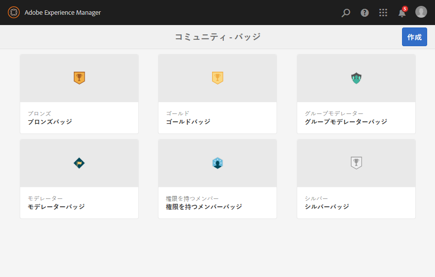
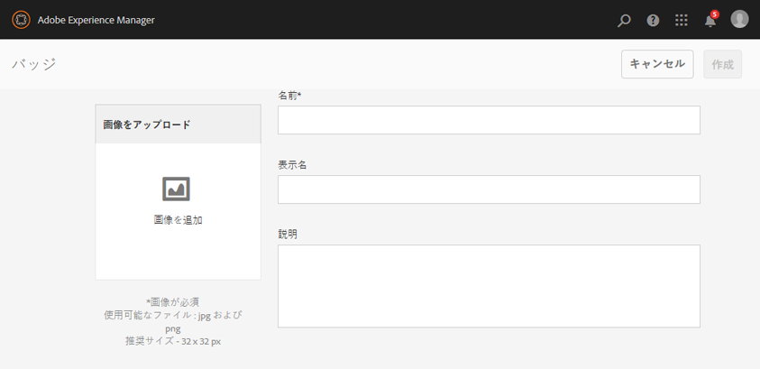

# バッジコンソール {#badges-console}

>[!CAUTION]
>
>AEM 6.4 の拡張サポートは終了し、このドキュメントは更新されなくなりました。 詳細は、 [技術サポート期間](https://helpx.adobe.com/jp/support/programs/eol-matrix.html). サポートされているバージョンを見つける [ここ](https://experienceleague.adobe.com/docs/?lang=ja).

## バッジについて {#about-badges}

コミュニティのバッジコンソールを使用すると、獲得（授与）時またはコミュニティで特定の役割を担う（割り当てられた）時に、メンバーに対して表示できるカスタムバッジを追加できます。

### バッジの表示 {#badge-visibility}

現在、コミュニティメンバーが獲得したバッジや割り当てられたバッジは、その名前とアバターと共に以下の場所に表示されます。

* プロファイル
* [フォーラム](forum.md)
* [Q&amp;A](working-with-qna.md)
* [リーダーボード](enabling-leaderboard.md)
* [アイディエーション](ideation-feature.md)

オーサー環境でバッジコンソールに移動するには、次の手順を実行します。

* グローバルナビゲーションから： **[!UICONTROL ツール/コミュニティ/バッジ]**

このコンソールには、現在使用可能なバッジと、新しいバッジを追加できるバッジが表示されます。

## バッジを作成 {#create-badge}

バッジは、適切に小さい画像（高さが 26～32 ピクセルの 72dpi）をアップロードし、名前を付けて作成します。 バッジの画像は、リポジトリ ( ) の `/etc/community/badging/images` とは、パブリッシュ環境に自動的にレプリケートされます。

パブリッシュ環境がパブリッシャーのファームである場合は、次の設定が必要です。 [ユーザー同期](sync.md).

* **[!UICONTROL 画像をアップロード]**

   (*必須*)JPEGまたは PNG 形式の 72dpi での推奨サイズが 32 x 32 ピクセルのバッジ画像。

* **[!UICONTROL 名前]**

   (*必須*) バッジ名。 これがデフォルトです `Display Name` リポジトリのノード名。 この `Name` は有効なリポジトリノード名ではありません。変更されます。

* **[!UICONTROL 表示名]**

   (*オプション*) UI でバッジに表示する名前です。 デフォルトは、 `Name`.

* **[!UICONTROL 説明]**

   (*オプション*) バッジの説明。

## 追加情報 {#additional-information}

スコアルールとバッジルールの設定について詳しくは、 [スコアとバッジ](implementing-scoring.md).

メンバーのバッジの管理については、 [メンバーコンソール](members.md).
