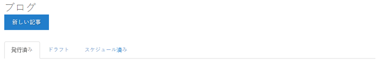
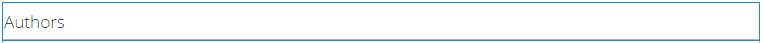
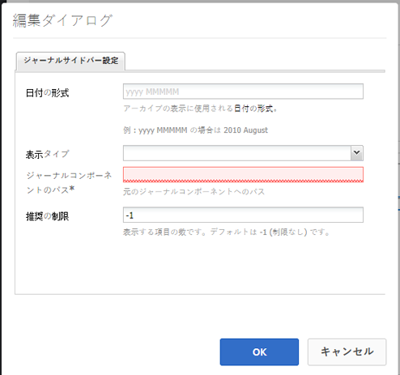
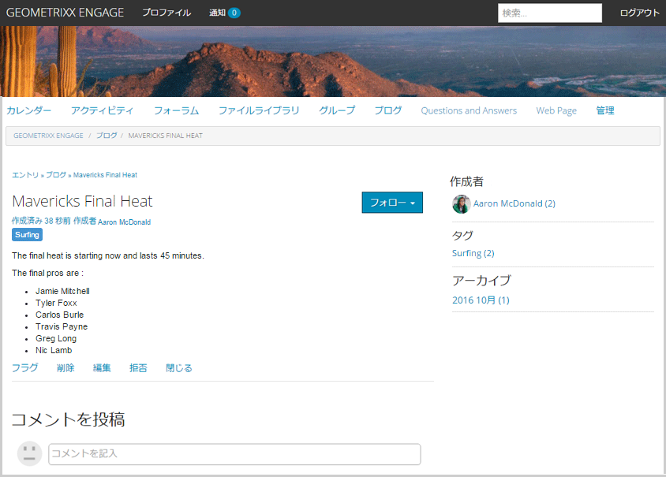
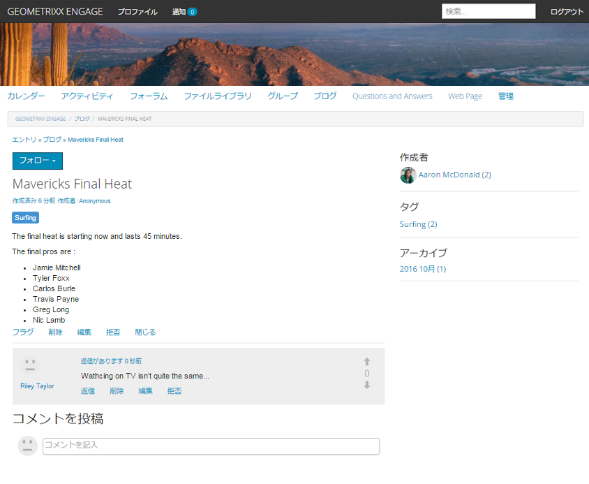
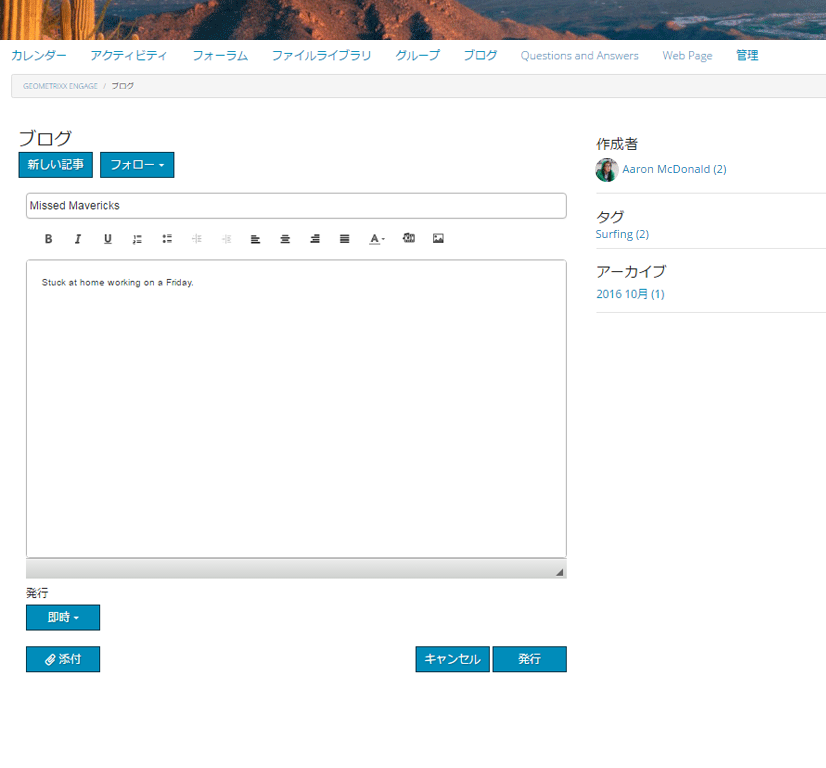
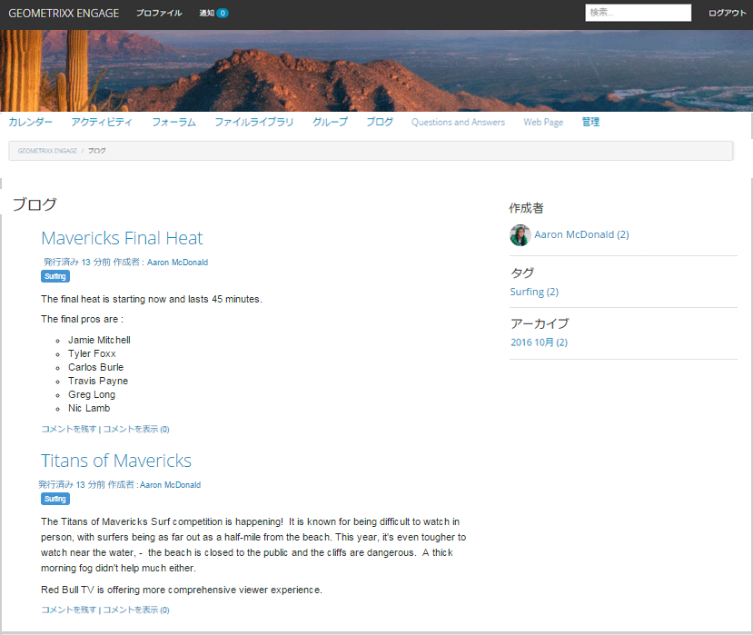

# ブログ機能 {#blog-feature}

## はじめに {#introduction}

AEM Communitiesのブログ機能は、オーサリングアクティビティから、パブリッシュ環境でおこなわれる真のコミュニティアクティビティに変わりました。

ブログ機能は、ジャーナル形式でのコミュニティ情報の提供をサポートしています。 ブログエントリは、許可されたメンバー（登録済みのサインインユーザー）によってパブリッシュ環境で作成されます。

ブログ機能には次の機能があります。

* ブログ記事とコメントの公開側での作成
* リッチテキストの編集
* インライン画像（ドラッグ&amp;ドロップのサポートを含む）
* 組み込みのソーシャルネットワークコンテンツ ([oEmbed のサポート](blog-developer-basics.md#allowing-rich-media))
* ドラフトモード
* 公開の予定
* 代理で作成 (a) [特権を持つ人](users.md#privileged-members-group) 別のコミュニティメンバーに代わってコンテンツを作成できます )
* [コンテキスト内モデレートと一括モデレート](moderate-ugc.md) ブログ記事とコメントの

ドキュメントのこの節では、

* AEMサイトへのブログ機能の追加
* ブログコンポーネントの設定

>[!NOTE]
>
>コンポーネント `Journal`および `Journal Sidebar` タイトルが `Blog` および `Blog Sidebar`.
>
>AEM 6.0 以前のリリースで見つかったブログ機能が削除されました。 テンプレートに基づいており、作成者のみがオーサー環境でコンテンツを作成できます。

## ページへのブログコンポーネントの追加 {#adding-blog-components-to-a-page}

作成モードでページにブログを追加する場合は、コンポーネントブラウザーを使用して

* `Communities / Blog`
* `Communities / Blog Sidebar`

ブログが表示されるページ上の場所にドラッグします。

必要な情報については、 [コミュニティコンポーネントの基本](basics.md).

次の場合に [必要なクライアント側ライブラリ](blog-developer-basics.md#essentials-for-client-side) が含まれる場合、この方法で `Blog`コンポーネントが表示されます。

また、 `Blog Sidebar` が表示されます。

### ブログの設定 {#configuring-blog}

配置された `Blog` アクセスして選択するコンポーネント `Configure` 編集ダイアログを開くアイコン。

 

#### 「設定」タブ {#settings-tab}

以下 **[!UICONTROL 設定]** タブで、ブログの基本機能を指定します。

* **[!UICONTROL 添付サムネールを許可]**
オンにすると、添付された画像のサムネールが作成されます。

* **[!UICONTROL 添付サムネールの最大サイズ]**
添付サムネール画像の最大サイズ（ピクセル単位）。 デフォルト値は 800 x 800 です。

* **[!UICONTROL サムネールの最小画像サイズ]**
インライン画像のサムネールを生成するための画像の最小サイズ（バイト単位）。 デフォルト値は100000バイト (100 KB) です。

* **[!UICONTROL サムネールの最大サイズ]**
インライン画像のサムネール画像の最大サイズ（ピクセル単位）。 デフォルト値は 800 x 800 です。

* **[!UICONTROL 権限を持つメンバーを許可]**
オンにすると、権限を持つメンバーのみコンテンツを作成できます。

* **[!UICONTROL 許可された権限を持つメンバー]**
コンテンツの作成を許可された権限を持つメンバーを追加します。

* **[!UICONTROL オーサー編集モードでユーザー生成コンテンツをブロックする]**
有効にすると、オーサーモードでの編集中にユーザー生成コンテンツがブロックされます。

* **[!UICONTROL ジャーナルタイトル]**
ページに表示するブログタイトル。
   >注意：
   >ジャーナルタイトルは、ブログの URL を自動的に作成するために使用されます。 ブログの URL を作成するために、ここに指定したジャーナルタイトルから最大 50 文字（一意性のために 5 文字が追加）が使用されます。

* **[!UICONTROL ジャーナルの説明]**
ブログの説明。

* **[!UICONTROL 1 ページのトピック数]**

   1 ページに表示されるブログエントリ/コメントの数を定義します。 初期設定は 10 です。

* **[!UICONTROL モデレート]**

   オンにすると、ブログエントリとコメントの投稿を公開サイトに表示する前に承認が必要になります。 初期設定はオフです。

* **[!UICONTROL 終了]**

   オンにすると、新しいブログエントリとコメントに対してブログが閉じられます。 初期設定はオフです。

* **[!UICONTROL リッチテキストエディター]**

   オンにすると、マークアップを使用してブログエントリとコメントを入力できます。 初期設定はオンです。

* **[!UICONTROL タグ付けを許可]**

   オンにすると、メンバーは投稿にタグラベルを追加できます ( **[!UICONTROL タグフィールド]** 」タブ ) をクリックします。 初期設定はオフです。

* **[!UICONTROL ファイルのアップロードを許可]**

   オンにすると、ブログエントリまたはコメントに添付ファイルを追加できます。 初期設定はオフです。

* **[!UICONTROL 最大ファイルサイズ]**

   次の場合にのみ関連します。 `Allow File Uploads` がオンになっている。 このフィールドは、アップロードするファイルのサイズ（バイト単位）を制限します。 初期設定は104857600(10 MB) です。

* **[!UICONTROL 許可されるファイルタイプ]**

   次の場合にのみ関連します。 `Allow File Uploads` がオンになっている。 「ドット」区切り文字を使用したファイル拡張子のコンマ区切りリスト。 例：.jpg、.jpeg、.png、.doc、.docx、.pdf ファイルタイプが指定されている場合、指定されていないファイルのアップロードは許可されません。 初期設定では何も指定されず、すべてのファイルタイプが許可されます。

* **[!UICONTROL 添付する画像ファイルの最大サイズ]**

   「ファイルのアップロードを許可」がオンの場合にのみ関連します。 アップロードされた画像ファイルの最大バイト数。 初期設定は2097152 (2 MB) です。

* **[!UICONTROL 応答を許可]**

   オンにすると、ブログエントリに投稿されたコメントに対する返信を許可します。 初期設定はオフです。

* **[!UICONTROL ユーザーによるコメントおよびトピックの削除を許可]**

   オンにすると、メンバーは投稿したコメントやブログエントリを削除できます。 初期設定はオフです。

* **[!UICONTROL フォローを許可]**

   オンにすると、次の機能がブログ記事に含まれ、メンバーは [通知済み](notifications.md) 新しい投稿の数。 初期設定はオフです。

* **[!UICONTROL メール購読を許可]**

   オンにすると、新しい投稿をメールでメンバーに通知することを許可します ([購読](subscriptions.md)) をクリックします。 必要 `Allow Following` チェックされ [電子メール設定済み](email.md). 初期設定はオフです。

* **[!UICONTROL 投票を許可]**

   オンにすると、ブログエントリに投票機能が含まれます。 初期設定はオフです。

* **[!UICONTROL バッジを表示]**

   オンにすると、獲得および割り当て済みを表示します [バッジ](implementing-scoring.md) メンバーのブログエントリを含む 初期設定はオフです。

* **[!UICONTROL おすすめコンテンツを許可]**

   オンにすると、アイデアを [おすすめコンテンツ](featured.md). 初期設定はオフです。

#### 「ユーザーモデレート」タブ {#user-moderation-tab}

以下 **[!UICONTROL ユーザーモデレート]** 「 」タブで、モデレート設定を指定します。

* **[!UICONTROL 投稿を拒否]**

   オンにすると、信頼できるメンバーのモデレーターは、投稿を拒否し、公開フォーラムに投稿が表示されなくなります。 初期設定はオフです。

* **[!UICONTROL トピックを閉じる / 再度開く]**

   オンにすると、信頼されているメンバーモデレーターは、トピックを閉じてさらに編集やコメントを行ったり、トピックを再度開いたりできます。 初期設定はオフです。

* **[!UICONTROL 投稿にフラグを設定]**

   オンにすると、メンバーは他のユーザーのトピックまたはコメントに「不適切」のフラグを設定できます。 初期設定はオフです。

* **[!UICONTROL フラグ設定理由リスト]**

   オンにすると、メンバーはトピックまたはコメントに「不適切」のフラグを設定した理由をドロップダウンリストから選択できます。 初期設定はオフです。

* **[!UICONTROL カスタムフラグ設定理由]**

   オンにすると、メンバーはトピックまたはコメントに「不適切」のフラグを設定した独自の理由を入力できます。 初期設定はオフです。

* **[!UICONTROL モデレートのしきい値]**

   メンバーがトピックまたはコメントに何回フラグを設定したらモデレーターに通知するかを指定します。 初期設定は 1 （1 回）です。

* **[!UICONTROL フラグ付けの制限]**

   トピックまたはコメントに何回フラグを設定したら、公開ビューで非表示にするかを指定します。 -1 に設定した場合、フラグ付きのトピックまたはコメントが公開ビューで非表示になることはありません。 それ以外の場合は、この数はモデレートのしきい値以上にする必要があります。 デフォルトは 5 です。

#### 「タグフィールド」タブ {#tag-field-tab}

以下 **[!UICONTROL タグフィールド]** 」タブで、次の場合に適用できるタグを指定します。 **[!UICONTROL タグ付けを許可]** が **[!UICONTROL 設定]** タブ：

* **[!UICONTROL 許可された名前空間]**

   次の場合に関連 `Allow Tagging` が **[!UICONTROL 設定]** タブをクリックします。 適用できるタグは、チェックされた名前空間カテゴリ内のタグに限定されます。 名前空間のリストには、「標準タグ」（デフォルトの名前空間）と「すべてのタグを含める」が含まれます。 初期設定はオフです。これは、すべての名前空間が許可されていることを意味します。

* **[!UICONTROL 推奨の制限]**

   フォーラムに投稿するメンバーに提案として表示するタグの数を入力します。 値が —1 の場合は制限がないことを意味します。 初期設定は 0 です。

### ブログのサイドバーの設定 {#configuring-blog-sidebar}

をダブルクリックして、 `Blog Sidebar` コンポーネントを選択すると、編集ダイアログが開きます。

以下 **[!UICONTROL ジャーナルのサイドバー設定]** タブで、アーカイブの日付形式と、サイドバーに表示するエントリの種類を指定します。

* **[!UICONTROL 日付の形式]**

   ブログエントリのアーカイブに表示する形式。 この形式では、Java の規則に従ったプレースホルダーが使用されます。

   * yyyy:2015 年のような 1 年
   * yy:短い年（例： &#39;15&#39;）
   * MMMM:6 月のように 1 か月
   * MMM:短い月、6 月のように
   * MM:月番号（06 など）

   デフォルトは「yyyy MMMMM」で、例えば「2015 June」と表示されます。

* **[!UICONTROL 表示タイプ]**

   サイドバーに表示するブログエントリのタイトルとタイプ。 選択肢は次のどちらかです。

   * 作成者
   * カテゴリ
   * アーカイブ

* **[!UICONTROL ジャーナルコンポーネントのパス]**

   *（オプション）* ブログ記事の表示元となるブログリソースの場所。 空白の場合、resourceType のコンポーネントが使用されます `social/journal/components/hbs/journal` が同じページに表示されます。

   * 例：`/content/sites/engage/en/blog/jcr:content/content/primary/blog`

* **[!UICONTROL 推奨の制限]**

   表示するブログ記事の数。 値が —1 の場合は制限がないことを意味します。 初期設定は —1 です。

## サイト訪問者エクスペリエンス {#site-visitor-experience}

公開環境では、ブログ機能には最新のブログ記事が表示され、その後に古いブログ記事が作成順に表示されます。 ブログのサイドバーを使用すると、サイト訪問者はフィルターを適用して、表示されるブログ記事の選択を制限できます。

ブログ記事の後に、コメントを投稿または表示するためのリンクが表示されます。

ブログ記事を選択すると、ブログ記事とコメントが表示されます（有効な場合）。

その他の機能は、サイト訪問者がモデレーター、管理者、コミュニティメンバー、権限を持つメンバー、匿名のどちらであるかによって異なります。

### 記事の操作 {#working-with-articles}

新しいブログ記事を作成する場合は、次の方法を選択できます。

1. 直ちに公開
1. 下書きの公開
1. スケジュールされた日時に公開

ブログ記事は、パブリッシュ時にオーサリングできるメンバーに対して適切なタブ（パブリッシュ済み、ドラフト、スケジュール済み）に表示されます。

#### モデレーターと管理者 {#moderators-and-administrators}

サインインしているユーザーがモデレーターまたは管理者の権限を持っている場合、そのユーザーは [モデレートタスク](moderate-ugc.md) （コンポーネントの設定によって許可される）ブログに投稿されたすべてのブログ記事とコメント。

### メンバー {#members}

サインインしているユーザーがコミュニティメンバーまたは [特権を持つ人](users.md#privileged-members-group) （設定に応じて）、 `New Article` 新しいブログ記事を作成して投稿するには、以下を実行します。

具体的には、次のような場合があります。

* 新しいブログ記事を作成
* 別のメンバーに代わって新しいブログ記事を投稿
* ブログ記事にコメントを投稿する
* 自分のブログ記事またはコメントを編集する
* 自分のブログ記事またはコメントを削除する
* 他のユーザーのブログ記事またはコメントにフラグを設定する

 

### 匿名 {#anonymous}

サインインしていないサイト訪問者は、投稿されたブログ記事やコメントの読み取り、サポートされている場合は翻訳のみが可能ですが、ブログ記事やコメントの追加や他のユーザーの記事やコメントへのフラグ付けはできません。

## 追加情報 {#additional-information}

詳しくは、 [ブログの基本事項](blog-developer-basics.md) 開発者向けのページ

ブログエントリとコメントのモデレートについては、 [ユーザー生成コンテンツのモデレート](moderate-ugc.md).

ブログエントリとコメントのタグ付けについては、 [ユーザー生成コンテンツのタグ付け](tag-ugc.md).

ブログエントリとコメントの翻訳については、 [ユーザー生成コンテンツの翻訳](translate-ugc.md).
