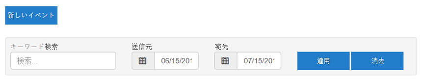
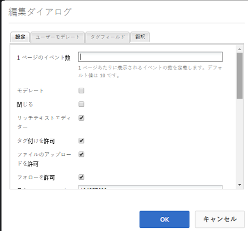
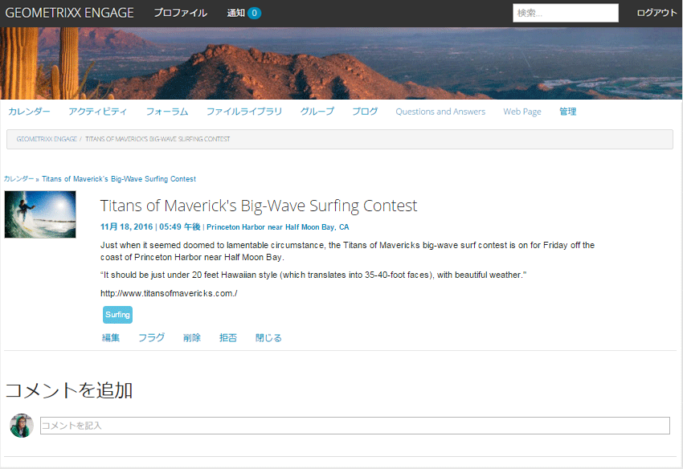
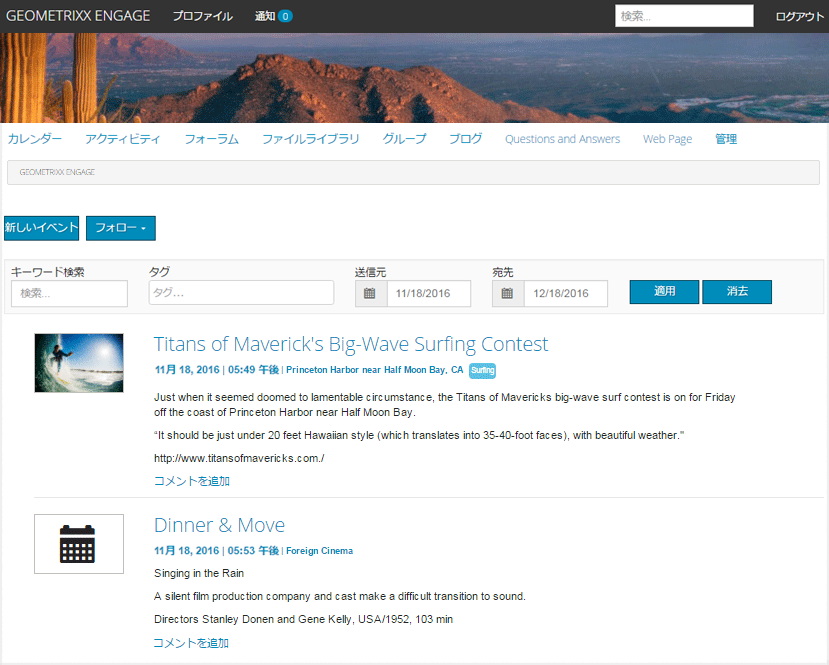
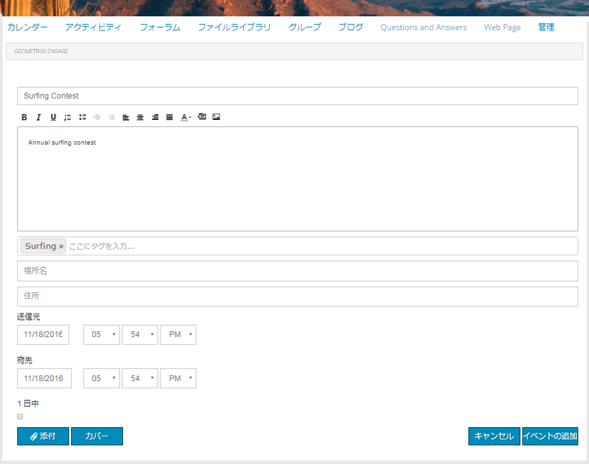
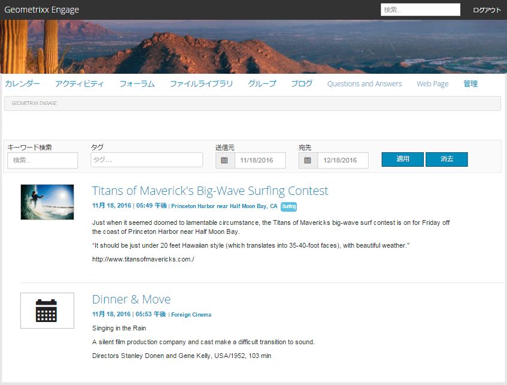

# カレンダー機能 {#calendar-feature}

## はじめに {#introduction}

カレンダー機能は、すべてのサイト訪問者またはサインインしているサイト訪問者（コミュニティメンバー）のみが閲覧できるコミュニティイベント情報をカレンダー形式で提供します。イベントを追加できるのは許可されたメンバーだけです。

ドキュメントのこのセクションでは、以下の内容について説明します。：

* カレンダー機能のAEMサイトへの追加
* の設定 `Calendar`コンポーネント

## カレンダーをページに追加 {#adding-a-calendar-to-a-page}

を追加するには、以下を実行します。 `Calendar` コンポーネントをオーサリングモードでページに追加する場合は、コンポーネントブラウザーを使用して

* `Communities / Calendar`

コンポーネントを探し、ページ上の適切な位置（ユーザーにレビューしてもらう機能の近くなど）にドラッグします。

必要な情報については、 [コミュニティコンポーネントの基本](basics.md).

次の場合に [必要なクライアント側ライブラリ](calendar-basics-for-developers.md#essentials-for-client-side) が含まれる場合、この方法で `Calendar` コンポーネントが表示されます。

### カレンダーの設定 {#configuring-calendar}

配置された `Calendar`アクセスして選択するコンポーネント `Configure` 編集ダイアログを開くアイコン。

 

#### 「設定」タブ {#settings-tab}

以下 **[!UICONTROL 設定]** タブで、カレンダーエントリへのタグの適用を許可するかどうかを指定します。

* **[!UICONTROL 1 ページのイベント数]**

   1 ページに表示されるイベント数を定義します。 初期設定は 10 です。

* **[!UICONTROL モデレート]**

   オンにすると、カレンダーイベントとコメントの投稿を発行サイトに表示する前に承認する必要があります。 初期設定はオフです。

* **[!UICONTROL 閉じる]**

   オンにすると、カレンダーは新しいイベントエントリとコメントに対して閉じられます。 初期設定はオフです。

* **[!UICONTROL リッチテキストエディター]**

   オンにすると、マークアップを使用してカレンダーイベントとコメントを入力できます。 初期設定はオンです。

* **[!UICONTROL タグ付けを許可]**

   オンにすると、メンバーは投稿するイベントにタグラベルを追加できます ( **タグフィールド** 」タブ ) をクリックします。 初期設定はオンです。

* **[!UICONTROL ファイルのアップロードを許可]**

   オンにすると、カレンダーイベントまたはコメントに添付ファイルを追加できます。 初期設定はオンです。

* **[!UICONTROL フォローを許可]**

   オンにすると、メンバーはカレンダーに投稿されたイベントをフォローできます。 初期設定はオンです。

* **[!UICONTROL 最大ファイルサイズ]**

   次の場合にのみ関連します。 `Allow File Uploads` がオンになっている。 このフィールドは、アップロードするファイルのサイズ（バイト単位）を制限します。 初期設定は104857600(10 MB) です。

* **[!UICONTROL 許可されるファイルタイプ]**

   次の場合にのみ関連します。 `Allow File Uploads` がオンになっている。 ドット付きのファイル拡張子をコンマ区切りで指定します（例：.jpg, .jpeg, .png, .doc, .docx, .pdf）。ファイルタイプが指定されている場合、指定されていないファイルのアップロードは許可されません。 初期設定では何も指定されず、すべてのファイルタイプが許可されます。

* **[!UICONTROL 添付する画像ファイルの最大サイズ]**

   「ファイルのアップロードを許可」がオンの場合にのみ関連します。 アップロードされた画像ファイルの最大バイト数。 初期設定は2097152 (2 MB) です。

* **[!UICONTROL 許可されるカバー画像タイプ]**

   「ドット」区切り文字を使用した画像ファイル拡張子のコンマ区切りリスト。 デフォルトは `.jpg,.jpeg,.png,.gif,.bmp` です。

* **[!UICONTROL スレッド化された返信を許可]**

   オンにすると、カレンダーイベントに投稿されたコメントに対する返信を許可します。 初期設定はオンです。

* **[!UICONTROL ユーザーによるコメントおよびイベントの削除を許可]**

   オンにすると、メンバーは投稿したコメントやカレンダーイベントを削除できます。 初期設定はオンです。

* **[!UICONTROL 投票を許可]**

   オンにした場合、カレンダーイベントに投票機能を含めます。 初期設定はオンです。

* **[!UICONTROL パンくずリストを表示]**

   イベントページのパンくずリストを表示します. 初期設定はオンです。

* **[!UICONTROL 日付範囲フィルター]**

   カレンダーイベントリストページフィルターの「終了日」の値を計算するために、現在の日付に追加される日数を定義します。 デフォルトの数値は 30 です。

* **[!UICONTROL おすすめコンテンツを許可]**

   オンにすると、アイデアは次のように識別されます。 [おすすめコンテンツ](featured.md). 初期設定はオフです。

以下 **[!UICONTROL ユーザーモデレート]** タブで、投稿されたトピックと返信（ユーザー生成コンテンツ）の管理方法を指定します。 詳しくは、 [ユーザー生成コンテンツのモデレート](moderate-ugc.md).

#### 「ユーザーモデレート」タブ {#user-moderation-tab}

* **[!UICONTROL 投稿を拒否]**

   オンにすると、信頼できるメンバーのモデレーターは、投稿を拒否し、公開フォーラムに投稿が表示されなくなります。 初期設定はオンです。

* **[!UICONTROL イベントを閉じる / 再度開く]**

   オンにすると、信頼されているメンバーモデレーターは、イベントを閉じてさらに編集やコメントを行ったり、イベントを再度開いたりできます。 初期設定はオンです。

* **[!UICONTROL 投稿にフラグを設定]**

   オンにすると、メンバーは他のユーザーのイベントやコメントに「不適切」のフラグを設定できます。 初期設定はオンです。

* **[!UICONTROL フラグ設定理由リスト]**

   オンにすると、メンバーはイベントまたはコメントに「不適切」のフラグを設定した理由をドロップダウンリストから選択できます。 初期設定はオフです。

* **[!UICONTROL カスタムフラグ設定理由]**

   オンにすると、メンバーはイベントまたはコメントに「不適切」のフラグを設定した独自の理由を入力できます。 初期設定はオフです。

* **[!UICONTROL モデレートのしきい値]**

   メンバーがイベントまたはコメントに何回フラグを設定したらモデレーターに通知するかを指定します。 初期設定は 1 （1 回）です。

* **[!UICONTROL フラグ付けの制限]**

   イベントまたはコメントに何回フラグを設定したら、公開ビューで非表示にするかを指定します。 -1 に設定した場合、フラグ付きのトピックまたはコメントが公開ビューで非表示になることはありません。 それ以外の場合は、この数はモデレートのしきい値以上にする必要があります。 初期設定は 5 です。

#### 「タグフィールド」タブ {#tag-field-tab}

「**[!UICONTROL タグフィールド]**」タブでは、「**[!UICONTROL 設定]**」タブでタグ付けが許可されている場合に、適用できるタグを名前空間に従って制限します。

* **[!UICONTROL 許可された名前空間]**

   次の場合に関連 `Allow Tagging` が **[!UICONTROL 設定]** タブをクリックします。 適用できるタグは、チェックされた名前空間カテゴリ内のタグに限定されます。 名前空間のリストには、「標準タグ」（デフォルトの名前空間）と「すべてのタグを含める」が含まれます。 初期設定はオフです。これは、すべての名前空間が許可されていることを意味します。

* **[!UICONTROL 推奨の制限]**

   フォーラムに投稿するメンバーに提案として表示するタグの数を入力します。 デフォルトはです。 `-1` （制限なし）。

>[!NOTE]
>
>新しいタグ名前空間（分類）の追加方法については、「[タグの管理](../../help/sites-administering/tags.md)」を参照してください。

#### 「翻訳」タブ {#translation-tab}

「**[!UICONTROL 翻訳]**」タブでは、コミュニティサイトの翻訳が有効になっている場合に、特定の投稿だけでなくスレッド全体（イベントとコメント）を翻訳するかどうかを設定できます。

* **[!UICONTROL すべてを翻訳]**

   オンにすると、イベントとコメントがユーザーの優先言語に翻訳されます。 初期設定はオンです。

## サイト訪問者のエクスペリエンス {#site-visitor-experience}

パブリッシュ環境では、カレンダー機能はデフォルトの日付範囲を持つ検索フィールドと、その範囲内に含まれるすべてのカレンダーイベントを表示します。

カレンダーイベントを選択すると、その詳細、説明およびコメントが表示されます。

その他の機能は、サイト訪問者がモデレーターか、管理者か、コミュニティメンバーか、権限を持つメンバーか、匿名かによって異なります。

### モデレーターおよび管理者 {#moderators-and-administrators}

サインインしているユーザーがモデレーター権限または管理者権限を持っている場合は、すべてのカレンダーイベントと、イベントに投稿されたコメントに対して、（コンポーネントの設定で許可されている）[モデレートタスク](moderate-ugc.md)を実行できます。

### メンバー {#members}

サインインしているユーザーがコミュニティメンバーまたは [特権を持つ人](users.md#privileged-members-group) （設定に応じて）、 `New Event` 新しいカレンダーイベントを作成して投稿するには、以下を実行します。

具体的には、次のことが可能です。

* 新しいカレンダーイベントの作成
* カレンダーイベントにコメントを投稿する
* 独自のカレンダーイベントまたはコメントを編集する
* 独自のカレンダーイベントまたはコメントを削除する
* 他のユーザーのカレンダーイベントまたはコメントにフラグを設定する

 

### 匿名 {#anonymous}

サインインしていないサイト訪問者は、投稿されたカレンダーイベントを閲覧することしかできず（サポートされている場合は翻訳も可）、イベントまたはコメントを追加したり、他のユーザーのイベントまたはコメントにフラグを設定することはできません。

## 追加情報 {#additional-information}

詳しくは、 [カレンダーの基本事項](calendar-basics-for-developers.md) 開発者向けのページ

カレンダーイベントとコメントのモデレートについては、「[ユーザー生成コンテンツのモデレート](moderate-ugc.md)」を参照してください。

カレンダーイベントとコメントのタグ付けについては、 [ユーザー生成コンテンツのタグ付け](tag-ugc.md).

カレンダーイベントとコメントの翻訳については、 [ユーザー生成コンテンツの翻訳](translate-ugc.md).
