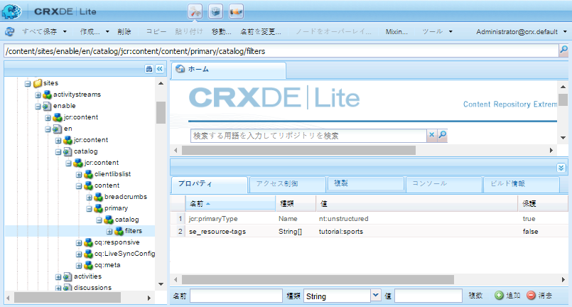
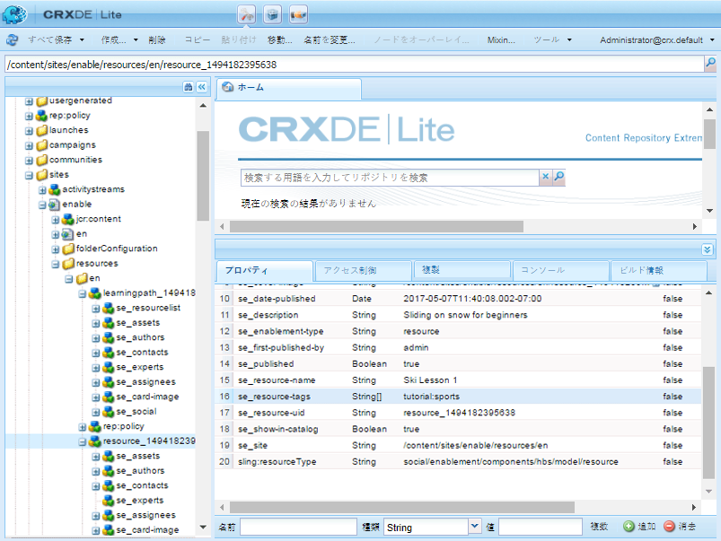

# カタログの基本事項 {#catalog-essentials}

このページでは、イネーブルメントコミュニティサイトのカタログ機能を使用する際に必要な情報を紹介します。

カタログ機能をコミュニティサイトに含めると、コミュニティメンバーはカタログに一覧表示されているイネーブルメントリソースを参照して選択できます。

この [ `enablement catalog` コンポーネント](catalog.md) コミュニティメンバーが [イネーブルメントリソース](resources.md). AEMタグの使用は、カタログ内のイネーブルメントリソースの外観を管理するうえで重要な役割を果たします。

詳しくは、 [イネーブルメントリソースのタグ付け](tag-resources.md).

## クライアント側の基本事項 {#essentials-for-client-side}

<table> 
 <tbody> 
  <tr> 
   <td> <strong>resourceType</strong></td> 
   <td>social/enablement/components/hbs/catalog</td> 
  </tr> 
  <tr> 
   <td> <a href="scf.md#add-or-include-a-communities-component"><strong>包含可能な</strong></a></td> 
   <td>いいえ</td> 
  </tr> 
  <tr> 
   <td> <a href="clientlibs.md"><strong>clientllibs</strong></a></td> 
   <td>cq.social.enablement.hbs.breadcrumbs  cq.social.enablement.hbs.catalog  cq.social.enablement.hbs.resource  cq.social.enablement.hbs.learningpath</td> 
  </tr> 
  <tr> 
   <td> <strong>テンプレート</strong></td> 
   <td> /libs/social/enablement/components/hbs/catalog/catalog.hbs  </td> 
  </tr> 
  <tr> 
   <td> <strong>css</strong></td> 
   <td> /libs/social/enablement/components/hbs/catalog/clientlibs/catalog.css</td> 
  </tr> 
  <tr> 
   <td><strong> properties</strong></td> 
   <td>詳しくは、 <a href="catalog.md">カタログ機能</a></td> 
  </tr> 
 </tbody> 
</table>

## サーバー側の基本事項 {#essentials-for-server-side}

### カタログ機能 {#catalog-function}

を含むコミュニティサイト構造 [カタログ機能](functions.md#catalog-function)（設定済みを含む） `enablement catalog` コンポーネント。

### プリフィルター {#pre-filters}

カタログ機能がコミュニティサイトに追加された場合は、事前フィルターを指定することで、カタログに表示されるイネーブルメントリソースと学習パスを制限できます。 これは、サイトのカタログリソースのインスタンスでプロパティを設定することでおこなわれます。

例 [イネーブルメントチュートリアル](getting-started-enablement.md):

* 作成者
* 使用 [CRXDE](../../help/sites-developing/developing-with-crxde-lite.md)

   * 例： [https://&lt;server>:&lt;port>/crx/de](http://localhost:4502/crx/de)

* カタログページのカタログリソースに移動します。

   * 例：`/content/sites/enable/en/catalog/jcr:content/content/primary/catalog`

* 子フィルターノードを追加

   * を選択します。 `catalog`ノード
   * 選択 **[!UICONTROL ノードを作成]**

      * 名前：`filters`
      * 型：`nt:unstructured`
   * 選択 **[!UICONTROL すべて保存]**

* 追加 `se_resource-tags` プロパティを `filters` ノード

   * を選択します。 `filters` ノード
   * 複数のプロパティを追加する

      * 名前：`se_resource-tags`
      * タイプ：String
      * 値： *&lt;enter a=&quot;&quot; span=&quot;&quot; id=&quot;1&quot; translate=&quot;no&quot; />タグ ID](#pre-filter-tagids)>*[
      * 選択 **[!UICONTROL 複数]**
      * 選択 **[!UICONTROL 追加]**

         * ポップアップダイアログで、「 `+` タグ ID を追加するには、以下を実行します。

* コミュニティサイトを再公開

#### タグ ID の事前フィルター {#pre-filter-tagids}

プリフィルター [タグ ID](../../help/sites-developing/framework.md#tagid) は、イネーブルメントリソースに適用されるタグと完全に一致する必要があります。 これらは、 `resources` プロパティの値としてのサイトのフォルダー `se_resource-tags`.

### リファレンス API {#reference-apis}

* [イネーブルメント API](https://helpx.adobe.com/experience-manager/6-4/sites/developing/using/reference-materials/javadoc/com/adobe/cq/social/enablement/reporting/model/api/package-summary.html)

* [レポート API](https://helpx.adobe.com/experience-manager/6-4/sites/developing/using/reference-materials/javadoc/com/adobe/cq/social/reporting/dv/api/package-summary.html)

* [レポート分析 API](https://helpx.adobe.com/experience-manager/6-4/sites/developing/using/reference-materials/javadoc/com/adobe/cq/social/reporting/dv/model/api/package-summary.html)
