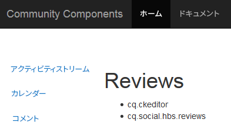
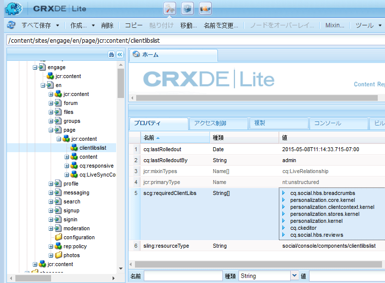

# コミュニティコンポーネントの clientlib {#clientlibs-for-communities-components}

## はじめに {#introduction}

ドキュメントのこの節では、コミュニティコンポーネント用のクライアント側ライブラリ（clientlib）をページに追加する方法について説明します。

基本情報については、以下を参照してください。

* [使用方法の詳細とデバッ](../../help/sites-developing/clientlibs.md) グツールを提供するクライアント側ライブラリの使用
* [SCF用clientlibs :SCFコン](client-customize.md#clientlibs) ポーネントをカスタマイズする際に役立つ情報を提供します。
* [ブログ：AEM Client Libraries explained by example](https://blogs.adobe.com/experiencedelivers/experience-management/clientlibs-explained-example/)

## clientlib が必要になる理由 {#why-clientlibs-are-required}

コンポーネントを正しく機能させ（JavaScript）、スタイル設定する（CSS）には、clientlib が必要です。

1つの機能に[コミュニティ機能](functions.md)が存在する場合、必要なclientlibを含む必要なコンポーネントと設定がすべてコミュニティサイトに表示されます。 作成者が追加のコンポーネントを使用できる場合にのみ、追加のclientlibを追加する必要があります。

必須の clientlib が欠落していると、[ページにコミュニティコンポーネントを追加](author-communities.md)したときに、JavaScript エラーが発生したり、予期しない外観が生じたりする可能性があります。

### 例：clientlib が欠落している場合のレビューの配置 {#example-placed-reviews-without-clientlibs}

### 例：clientlib が存在する場合のレビューの配置 {#example-placed-reviews-with-clientlibs}

## 必須の clientlib の識別 {#identifying-required-clientlibs}

開発者向けの基本機能情報の中で、必須の clientlib が識別されています。

また、AEM インスタンスから[コミュニティコンポーネントガイド](components-guide.md)を参照すると、コンポーネントに必須の clientlib カテゴリのリストにアクセスできます。

例えば、[「レビュー」ページの最上部に](http://localhost:4502/content/community-components/en/reviews.html)リストされている必要なclientlibは次のとおりです。

* cq.ckeditor
* cq.social.hbs.reviews

## 必須の clientlib の追加 {#adding-required-clientlibs}

コミュニティコンポーネントをページに追加する場合、コンポーネントに必須の clientlib がまだ存在しなければ、追加する必要があります。

[CRXDE|Lite](#using-crxde-lite) を使用すると、コミュニティサイトページの既存の clientlibslist を変更できます。

[CRXDE Lite](../../help/sites-developing/developing-with-crxde-lite.md)を使用してコミュニティサイトのclientlibを追加するには：

* [https://&lt;server>:&lt;port>/crx/de](http://localhost:4502/crx/de)を参照します。
* コンポーネントを追加するページの`clientlibslist`ノードを探します。

   * `/content/sites/sample/en/page/jcr:content/clientlibslist`

* `clientlibslist`ノードを選択した状態

   * 文字列[]プロパティ`scg:requiredClientLibs`を探します
   * `Value`を選択して、「文字列配列」ダイアログにアクセスします

      * 必要に応じて下にスクロールします
      * `+`を選択して新しいクライアントライブラリを入力します

         * クライアントライブラリをさらに追加するには、この手順を繰り返します。
      * 「**[!UICONTROL OK]**」を選択します。
   * 「**[!UICONTROL すべて保存]**」を選択します。

>[!NOTE]
>
>コミュニティサイト以外のサイトでは、使用されているクライアントライブラリの有無や場所を調べる必要があります。

ここでは、[AEM Communities 使用の手引き](getting-started.md)の例（`site-name` は *engage*）を引用し、レビューコンポーネントを追加する場合に clientliblist がどのように表示されるかを示しています。

