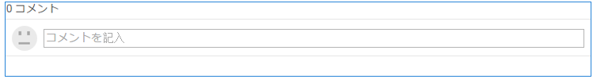
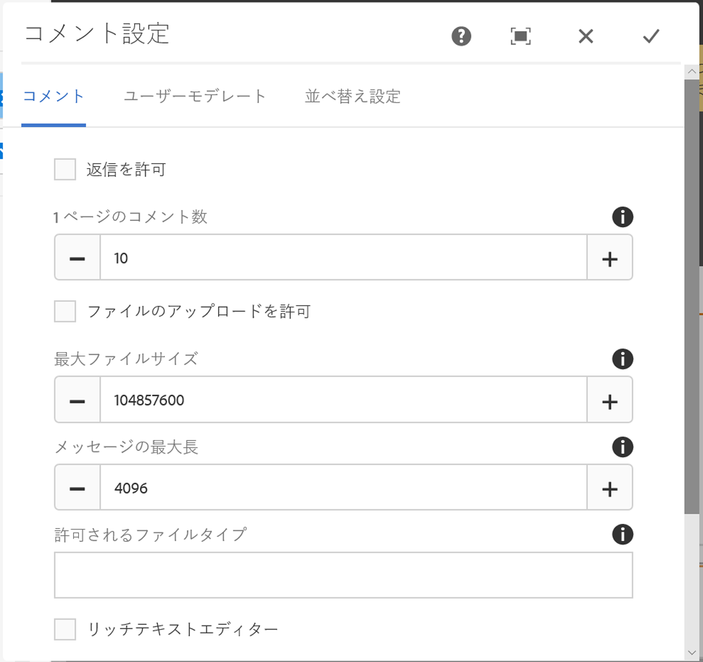
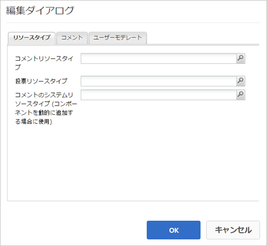

# コメントの使用 {#using-comments}

## はじめに {#introduction}

サインインしているサイト訪問者（メンバー）は、コメント機能を使用して、サイト上のコンテンツに関する意見や知識を共有できます。この機能は、他の機能に既に存在する場合も多いですが、どのWebサイトにも追加できます。

ドキュメントのこのセクションでは、以下の内容について説明します。

* ページへの`Comments`の追加
* `Comments`コンポーネントの設定

>[!NOTE]
>
>匿名でのコメント投稿はサポートされていません。サイト訪問者が参加するには、登録（メンバーになる）し、サインインする必要があります。

## コメントをページに追加 {#adding-comments-to-a-page}

`Comments`コンポーネントをオーサリングモードでページに追加するには、コンポーネントブラウザーを使用して

* `Communities / Comments`

コンポーネントを探し、ページ上の適切な位置（ユーザーにコメントしてもらう機能の近くなど）や、単にページの下部にドラッグします。

必要な情報については、[コミュニティコンポーネントの基本](basics.md)を参照してください。

[必須のクライアント側ライブラリ](essentials-comments.md#essentials-for-client-side)を含めると、`Comments`コンポーネントは次のように表示されます。

>[!NOTE]
>
>1つのページに存在できる`Comments`コンポーネントは1つだけです。 一部のコミュニティ機能には、ブログ、カレンダー、フォーラム、Q&amp;A、レビューなどのコメントが既に含まれています。

## コメントの設定 {#configuring-comments}

配置済みの`Comments`コンポーネントを選択し、`Configure`アイコンを選択すると、編集ダイアログが開きます。

 

### 「コメント」タブ{#comments-tab}

「**[!UICONTROL コメント]**」タブでは、訪問者によるコメントの入力方法を指定します。

* **[!UICONTROL 返信を許可]**

   オンにすると、メンバーは既存のコメントに返信できます。 初期設定はオフです。

* **[!UICONTROL 1 ページのコメント数]**

   1ページに表示するコメントの数と返信の数を制限します。 初期設定は 10 です。

* **[!UICONTROL ファイルのアップロードを許可]**

   オンにすると、ファイルをアップロードするオプションにテキスト入力ボックスが表示されます。 初期設定はオフです。

* **[!UICONTROL 最大ファイルサイズ]**

   「ファイルのアップロードを許可」がオンの場合にのみ関連します。 この値によって、アップロードするファイルサイズが制限されます。デフォルトは 10 MB です。

* **[!UICONTROL メッセージの最大長]**

   テキストボックスに入力できる最大文字数。 初期設定は 4096 文字です。

* **[!UICONTROL 許可されるファイルタイプ]**

   「ファイルのアップロードを許可」がオンの場合にのみ関連します。 区切り文字「ドット」を使用したファイル拡張子のコンマ区切りリスト。 例：.jpg, .jpeg, .png, .doc, .docx, .pdf）。ファイルタイプを指定した場合、指定しなかったファイルは許可されません。 デフォルトでは、すべてのファイルタイプが許可されるように指定されていません。

* **[!UICONTROL リッチテキストエディター]**

   オンにすると、マークアップを使用してコメントを入力できます。 初期設定はオフです。

* **[!UICONTROL 投票を許可]**

   オンにすると、上下に投票するオプションがテキスト入力ボックスに表示されます。 初期設定はオフです。

* **[!UICONTROL フォローを許可]**

   オンにすると、メンバーはコメントをフォローできます。 初期設定はオフです。

* **[!UICONTROL バッジを表示]**

   オンにすると、獲得および授与されたバッジを表示できます。 初期設定はオフです。

### 「ユーザーモデレート」タブ  {#user-moderation-tab}

「**[!UICONTROL ユーザーモデレート]**」タブで、投稿されたコメントの管理方法を指定します。 詳しくは、[ユーザー生成コンテンツのモデレート](moderate-ugc.md)を参照してください。

* **[!UICONTROL 事前モデレート]**

   オンにすると、コメントはパブリッシュサイトに表示される前に承認が必要になります。 初期設定はオフです。

* **[!UICONTROL コメントを削除]**

   オンにすると、コメントを投稿したメンバーはコメントを削除できます。 初期設定はオフです。

* **[!UICONTROL コメントを拒否]**

   オンにすると、モデレーターはコメントを拒否できます。 初期設定はオフです。

* **[!UICONTROL コメントを閉じる / 再度開く]**

   オンにすると、モデレーターはコメントを閉じたり、再度開いたりできます。 初期設定はオフです。

* **[!UICONTROL コメントにフラグを設定]**

   オンにすると、メンバーはコメントに「不適切」のフラグを設定できます。 初期設定はオフです。

* **[!UICONTROL フラグ設定理由リスト]**

   オンにすると、メンバーはコメントに「不適切」のフラグを設定した理由をドロップダウンリストから選択できます。 初期設定はオフです。

* **[!UICONTROL カスタムフラグ設定理由]**

   オンにすると、メンバーはコメントに「不適切」のフラグを設定した独自の理由を入力できます。 初期設定はオフです。

* **[!UICONTROL モデレートのしきい値]**

   メンバーがコメントに何回フラグを設定したらモデレーターに通知するかを入力します。 初期設定は1回です。

* **[!UICONTROL フラグ付けの制限]**

   コメントに何回フラグを設定したら、公開表示から非表示にするかを入力します。 この数値は、**[!UICONTROL モデレートのしきい値]**&#x200B;以上にする必要があります。 初期設定は 5 です。

### 「並べ替え設定」タブ{#sort-settings-tab}

「**[!UICONTROL 並べ替え設定]**」タブで、投稿されたコメントを表示する際の並べ替え方法を指定します。

* **[!UICONTROL 並べ替えフィールド]**

   プルダウンして、`Newest, Oldest, Last Updated, Most Viewed, Most Active, Most Followed`または`Most Liked`のいずれかを選択します。

* **[!UICONTROL 並べ替え順序]**

   プルダウンして、`Ascending`または`Descending`のいずれかを選択します。

### カスタムコメントタイプへの変更 {#changing-to-a-custom-comment-type}

コメントリソースタイプを変更すると、デフォルトを使用するコメントのインスタンスではなく、開発者によってカスタマイズ（拡張）されたコメントのインスタンスが生成されるようになります。

カスタムリソースタイプがわかったら、[デザインモード](../../help/sites-authoring/default-components-designmode.md)に入り、配置された`Comments`コンポーネントをダブルクリックして、追加のタブを含むダイアログを開きます。

「**[!UICONTROL リソースタイプ]**」タブで、`Comments or Voting`コンポーネントの新しいインスタンスのカスタムresourceTypeを指定します。

* **[!UICONTROL コメントリソースタイプ]**

   /apps内の拡張`comment`コンポーネント（単一のコメント）のresourceTypeに移動します。 例：`/apps/social/commons/components/hbs/comments/comment`

   このリソースは、訪問者がコメントを投稿したときに作成されるUGCのresourceTypeを識別します。

* **[!UICONTROL 投票リソースタイプ]**

   /apps内の拡張`voting`コンポーネントのresourceTypeに移動します。 例：`/apps/social/components/hbs/voting`

   このリソースは、訪問者が投票を投稿したときに作成されるUGCのリソースタイプを識別します。

* **[!UICONTROL コメントシステムリソースタイプ]**

   /apps内の拡張`comments`コンポーネント（コメントシステム）のresourceTypeに移動します。 ページテンプレート[で、コメントシステムが基になるスクリプトにリソース（コメントノード）としてページに追加されるのではなく、](scf.md#add-or-include-a-communities-component)が動的に含まれる場合を除き、空のままにします。 詳しくは、[{{include}}ヘルパー](handlebars-helpers.md#include)を参照してください。

## サイト訪問者のエクスペリエンス {#site-visitor-experience}

### モデレーターおよび管理者 {#moderators-and-administrators}

サインインしているユーザーがモデレーター権限または管理者権限を持っている場合は、誰がコメントを作成したかにかかわらず、コンポーネントの設定によって許可されているモデレートタスクを実行できます。

### メンバー {#members}

サイト訪問者がサインインすると、設定に応じて次のことができます。

* 新しいコメントを投稿
* 自分のコメントを編集する
* 自分のコメントを削除する
* 他のユーザーのコメントにフラグを設定する

### 匿名 {#anonymous}

サインインしていないサイト訪問者は、投稿されたコメントを閲覧することしかできず（サポートされている場合は翻訳も可）、コメントを追加したり、他のユーザーのコメントにフラグを設定することはできません。

## 追加情報 {#additional-information}

詳しくは、開発者向けの[コメントの基本事項](essentials-comments.md)ページを参照してください。

投稿されたコメントのモデレートについては、[ユーザー生成コンテンツのモデレート](moderate-ugc.md)を参照してください。

投稿されたコメントの翻訳については、[ユーザー生成コンテンツの翻訳](translate-ugc.md)を参照してください。
