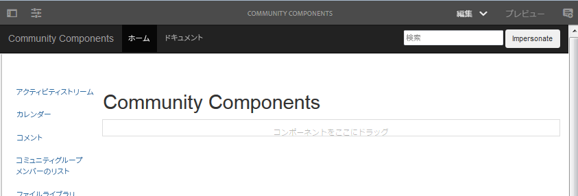
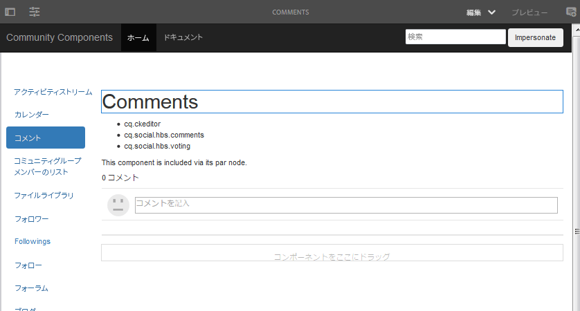
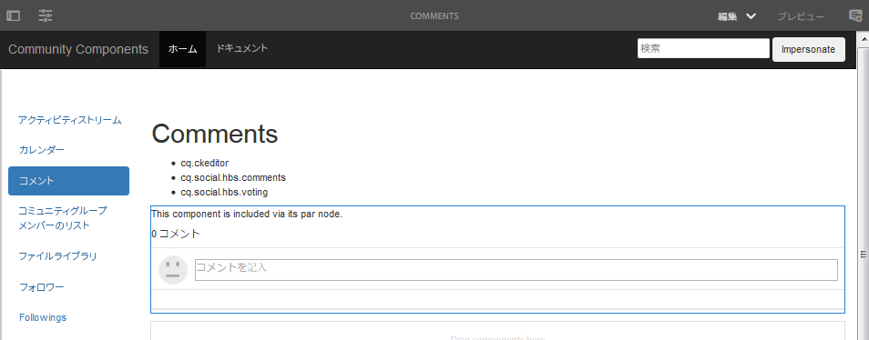
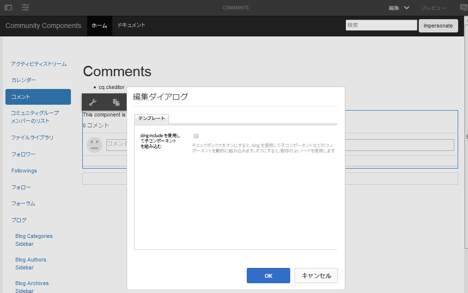
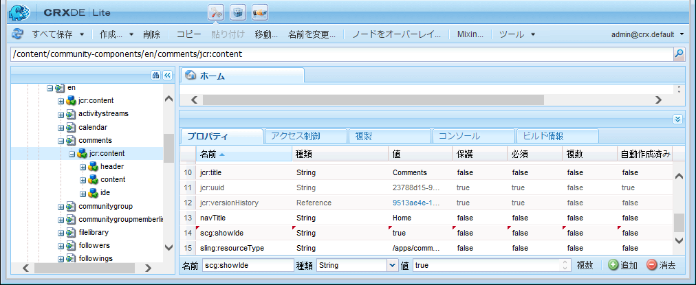
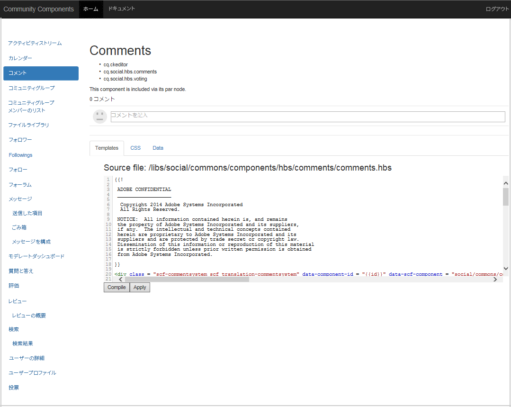

# コミュニティコンポーネントガイド {#community-components-guide}

コミュニティコンポーネントガイドは、 [ソーシャルコンポーネントフレームワーク (SCF)](scf.md). 使用可能なAEM Communitiesコンポーネントや、複数のコンポーネントから構築されたより複雑な機能のリストを提供します。

このガイドでは、各コンポーネントの基本情報に加えて、SCF のコンポーネント/機能の動作と、それらの設定またはカスタマイズ方法を実験できます。

各コンポーネントに関連する開発の基本事項について詳しくは、 [機能とコンポーネントの基本事項](essentials.md).

## はじめに {#getting-started}

このガイドは、オーサーインスタンス (localhost:4502) およびパブリッシュインスタンス (localhost:4503) の開発用インストールでの使用を目的としています。

コミュニティコンポーネントサイトには、

* [https://&lt;server>:&lt;port>/content/community-components/en.html](http://localhost:4502/content/community-components/en.html)

コミュニティコンポーネントとのインタラクションは、次の条件によって異なります。

* サーバー（オーサーまたはパブリッシュ）
* サイト訪問者がサインインしているかどうか
* サインインしている場合は、メンバーに割り当てられた権限
* デフォルトの SRP かどうか [JSRP](jsrp.md)、使用中

作成者が編集モードに入るには、次のいずれかを挿入します。 `editor.html` または `cf#` をサーバー名の後の最初のパスセグメントとして使用します。

* 標準 UI:

   [https://&lt;server>:&lt;port>/editor.html/content/community-components/en.html](http://localhost:4502/editor.html/content/community-components/en.html)

* クラシック UI：

   [https://&lt;server>:&lt;port>/cf#/content/community-components/en.html](http://localhost:4502/cf#/content/community-components/en.html)

>[!NOTE]
>
>作成者が編集モードでは、ページ上のリンクはアクティブになりません。
>
>コンポーネントページに移動するには、まず「プレビューモード」を選択して、リンクをアクティブにします。
>
>コンポーネントページがブラウザーに表示された状態で、コンポーネントの編集ダイアログを開くために編集モードに戻ります。
>
>オーサリングに関する一般的な情報については、 [ページのオーサリングのクイックガイド](../../help/sites-authoring/qg-page-authoring.md).
>
>AEMに詳しくない場合は、 [基本操作](../../help/sites-authoring/basic-handling.md).

### ホームページ {#home-page}

このガイドでは、ページの左側に沿ったプレビューとプロトタイピングに使用できる SCF コンポーネントの一覧を示します。

オーサーインスタンス上で編集モードで表示されたコンポーネントガイド：

## コンポーネントページ {#component-pages}

ページの左側にあるリストからコンポーネントを選択します。

ガイドの本文には、次の情報が表示されます。

1. タイトル：選択したコンポーネントの名前
1. [クライアントサイドライブラリ](#client-side-libraries):1 つ以上の必須カテゴリのリスト
1. [含める](scf.md#add-or-include-a-communities-component):コンポーネントが動的に含まれる場合は、オーサリング編集モードで状態を切り替えることができます。

   * 追加した場合、表示されるテキストは次のようになります。「このコンポーネントは、その par ノードを介して含まれます。」
   * 含まれる場合、表示されるテキストは次のようになります。「このコンポーネントは動的に組み込まれます。」
   * インクルードできない場合、テキストは表示されません

1. サンプルコンポーネントまたは機能：コンポーネントまたはフィーチャーのアクティブなインスタンス。 コンポーネントの場合は、「 」タブセクションで提供されるテンプレート、CSS およびデータに対する変更に応じて、コンポーネントが変更されることがあります。

>[!NOTE]
>
>左側から選択を行うと、ブラウザーウィンドウが狭すぎる場合に、コンポーネントが下に表示され、横ではなく下に表示されます。

### オーサーインタラクション {#author-interactions}

オーサーインスタンスでガイドを使用する場合は、コンポーネントのダイアログを開いて、コンポーネントの設定を体験できます。 開発者向けの情報は、 [コンポーネントと機能の基本事項](essentials.md) の節を参照してください。ダイアログの設定については、 [コミュニティコンポーネント](author-communities.md) 作成者向けの節を参照してください。

コミュニティコンポーネントガイドでは、一部のコンポーネントダイアログ設定が [含める](scf.md#add-or-include-a-communities-component) 切り替え状態。 既存のリソースの使用と動的に含まれるリソースの使用を切り替えるには、編集モードで、コンポーネントとインクルード可能なテキストの両方を選択し、ダブルクリックして編集ダイアログを開きます。

以下 **テンプレート** タブ：

* **sling:include を使用して子コンポーネントを組み込む**

   オフにした場合、コンポーネントガイドはリポジトリ内の既存のリソース（par ノードの子である jcr ノード）を使用します。

   * 表示されるテキスト：「このコンポーネントは、その par ノードを介して含まれます。」

   オンにすると、コンポーネントガイドは sling を使用して、子ノードの resourceType（存在しないリソース）のコンポーネントを動的に含めます。

   * 表示されるテキスト：「このコンポーネントは動的に組み込まれます。」

   初期設定はオフです。

### インタラクションを公開 {#publish-interactions}

パブリッシュインスタンスでガイドを使用する場合、コンポーネントや機能をサイト訪問者（サインインしていない）として、また様々な権限を持つメンバーとしてサインイン時に体験できます。

>[!NOTE]
>
>SRP のデフォルト設定が「 」のままの場合は、 [JSRP](jsrp.md)パブリッシュインスタンスで入力した UGC は、パブリッシュインスタンスでのみ表示され、 [モデレート](moderate-ugc.md) コンソールをオーサーインスタンス上に置きます。

## クライアントサイドライブラリ {#client-side-libraries}

各コンポーネントに一覧表示されるクライアント側ライブラリ (clientlib) は、次のとおりです *必須* コンポーネントをページに配置する際に参照される clientlibs は、ブラウザーでコンポーネントをレンダリングするために使用される JavaScript と CSS のダウンロードを管理および最適化する手段を提供します。

詳しくは、 [コミュニティコンポーネントの clientlib](clientlibs.md).

## 実行 {#impersonation}

作成者インスタンス（管理者または開発者としてサインインすることが多い場合）では、別のユーザーとしてログインしたコンポーネントを体験するために、左側のテキストボックスを使用します。 **[!UICONTROL 偽装]** ボタンをクリックしてユーザー名を入力するか、プルダウンリストから「 」を選択してから、「 」ボタンをクリックします。 「元に戻す」をクリックして、サインアウトし、偽装を終了します。

パブリッシュインスタンスは、別のユーザーとして実行する必要はありません。 ログイン/ログアウトリンクを使用して、 [デモユーザー](tutorials.md#demo-users).

## カスタマイズ {#customization}

有効にすると、各 SCF コンポーネントは、コンポーネントのテンプレート、CSS およびデータを一時的に変更することで、可能なカスタマイズのプロトタイピングに使用できます。

### カスタマイズの有効化 {#enabling-customization}

>[!NOTE]
>
>**このツールは読み取り専用です**. テンプレート、CSS またはデータに対しておこなった編集は、リポジトリに保存されません。

カスタマイズをすばやく試すには、 `scg:showIde`プロパティをコンポーネントページの content JCR ノードに追加し、true に設定する必要があります。

オーサーインスタンスまたはパブリッシュインスタンスで、管理者権限でサインインしたコメントコンポーネントを例として使用します。

1. 参照先 [CRXDE Lite](../../help/sites-developing/developing-with-crxde-lite.md)

   例： [http://localhost:4503/crx/de](http://localhost:4503/crx/de)

1. コンポーネントの `jcr:content` ノード

   例：`/content/community-components/en/comments/jcr:content`

1. プロパティを追加する

   * **名前** `scg:showIde`
   * **型** `String`
   * **値** `true`

1. 選択 **[!UICONTROL すべて保存]**
1. ガイドのコメントページをリロードします。

   [http://localhost:4503/content/community-components/en/comments.html](http://localhost:4503/content/community-components/en/comments.html)

1. 「テンプレート」、「CSS」、「データ」の 3 つのタブが追加されました。

 

### 「テンプレート」タブ {#templates-tab}

「テンプレート」タブを選択して、コンポーネントに関連付けられているテンプレートを表示します。

テンプレートエディターを使用すると、リポジトリ内のコンポーネントに影響を与えることなく、ローカル編集をコンパイルして、ページ上部のサンプルコンポーネントインスタンスに適用できます。

ローカル編集でコンパイルを実行すると、余白に点を置き、テキストを赤にしてエラーをハイライト表示します。

### 「CSS」タブ {#css-tab}

「 CSS 」タブを選択して、コンポーネントに関連付けられている CSS を表示します。

コンポーネントが複数のコンポーネントの複合コンポーネントの場合、一部の CSS が他のコンポーネントのいずれかの下に表示されることがあります。

CSS エディターを使用すると、CSS を変更して、ページ上部のサンプルコンポーネントインスタンスに適用できます。

余白内のルールの横にあるをクリックして、そのルールを使用する DOM の部分をハイライト表示するルールを選択できます。

### 「データ」タブ {#data-tab}

「データ」タブを選択して、.social.json エンドポイントデータを表示します。 このデータは編集可能で、サンプルコンポーネントインスタンスに適用されます。

構文エラーは、エディターでハイライト表示された状態と同様に、余白にマークされる場合があります。
