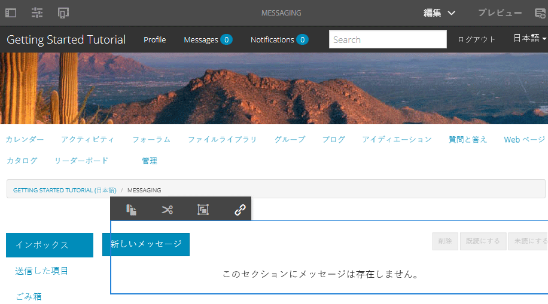
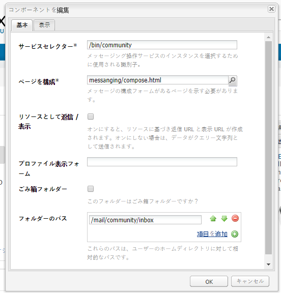
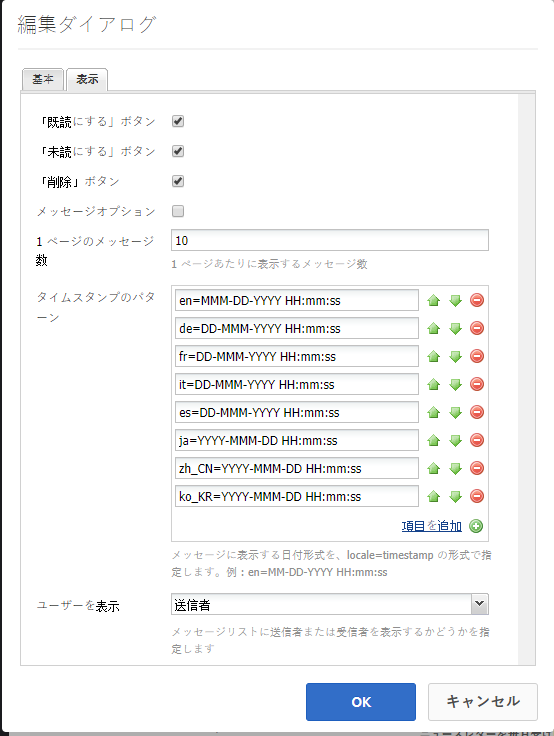
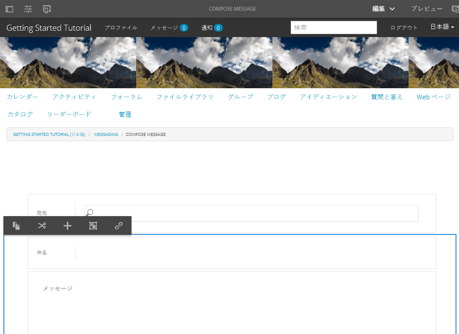
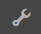
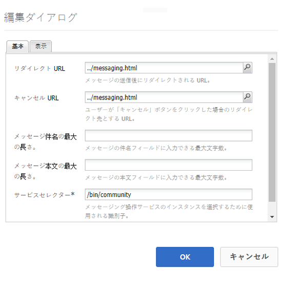
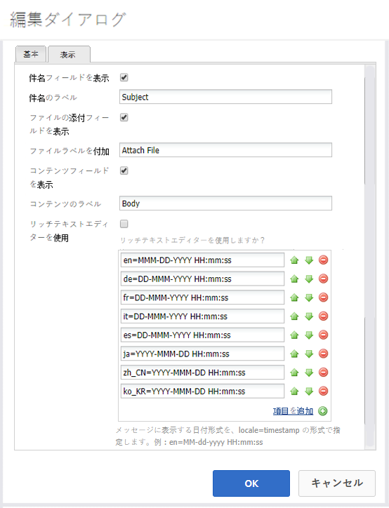

# メッセージング機能 {#messaging-feature}

フォーラムやコメントで公開されるインタラクションに加えて、AEM Communitiesのメッセージ機能を使用すると、コミュニティメンバーは互いに非公開でやり取りできます。

この機能は、[コミュニティサイト](overview.md#communitiessites)を作成するときに組み込むことができます。

メッセージング機能では、以下を実行できます。

* 1 人以上のコミュニティメンバーにメッセージを送信する
* コミュニティメンバーグループにメッセージを送信する
* 添付ファイル付きのメッセージを送信
* メッセージを転送
* メッセージに返信
* メッセージの削除
* 削除したメッセージを復元

メッセージング機能を有効化して変更するには、以下を参照してください。

* [メッセージの設定](messaging.md) 管理者向け
* [メッセージの基本事項](essentials-messaging.md) 開発者向け

>[!NOTE]
>
>追加はサポートされていません `Compose Message, Message, or Message List` コンポーネント ( `Communities`コンポーネントグループ ) をオーサリング編集モードでページに追加する必要があります。

## メッセージングコンポーネントの設定 {#configuring-messaging-components}

コミュニティサイトでメッセージングを有効にしている場合、メッセージングは完全に設定されており、追加の設定は不要です。この情報は、デフォルトの設定を変更する必要がある場合に提供されます。

### メッセージリストの設定（messagebox） {#configuring-message-list-messagebox}

次のメッセージのリストの設定を変更するには： **インボックス**, **送信済みアイテム**、および **ごみ箱** メッセージング機能のページで、 [オーサー編集モード](sites-console.md#authoring-site-content).

In `Preview` モード、 **[!UICONTROL メッセージ]** メインメッセージページを開くためのリンク 次に、 **[!UICONTROL インボックス、送信済みアイテムまたはごみ箱]** を設定して、そのメッセージリストのコンポーネントを設定します。

In `Edit` モード」で、ページ上のコンポーネントを選択します。

設定ダイアログにアクセスするには、継承をキャンセルするために、 `link`アイコン

設定が完了したら、 `broken link` アイコン

継承がキャンセルされると、 `configure` アイコンをクリックして、設定ダイアログを開きます。

#### 「基本」タブ {#basic-tab}

* **[!UICONTROL サービスセレクター]**
(*必須*) これをプロパティの値に設定します。 `serviceSelector.name` から [AEM Communities Messaging Operations Service](messaging.md#messaging-operations-service).

* **[!UICONTROL ページを作成]**
(*必須*) メンバーが `Reply` 」ボタンをクリックします。 ターゲットページには、**[!UICONTROL メッセージを作成]**&#x200B;フォームを含める必要があります。

* **[!UICONTROL リソースとして返信／表示]**&#x200B;オンにすると、返信 URL と表示 URL がリソースを参照します。オフにすると、データは URL 内でクエリパラメーターとして渡されます。

* **[!UICONTROL プロファイルの表示フォーム]**&#x200B;送信者のプロファイルの表示に使用するプロファイルフォームです。

* **[!UICONTROL ごみ箱フォルダー]**&#x200B;オンにすると、このメッセージリストコンポーネントには、「削除済み」（ごみ箱）のフラグが設定されているメッセージのみが表示されます。

* **[!UICONTROL フォルダーパス]**
(*必須*) `inbox.path.name` および `sentitems.path.name` 内 [AEM Communities Messaging Operations Service](messaging.md#messaging-operations-service). を `Inbox`、値を使用して 1 つのエントリを追加 `inbox.path.name`. を `Outbox`、値を使用して 1 つのエントリを追加 `sentitems.path.name`. を設定する際 `Trash`、両方の値を持つ 2 つのエントリを追加します。

#### 「表示」タブ {#display-tab}

* **[!UICONTROL 既読をマークボタン]**
オンにすると、 
`Read`ボタンを使用して、メッセージを既読としてマークすることができます。

* **[!UICONTROL 未読のマークボタン]**
オンにすると、 
`Mark Unread` ボタンを使用して、メッセージを既読としてマークすることができます。

* **[!UICONTROL 削除ボタン]**
オンにすると、 
`Delete`ボタンを使用して、メッセージを既読としてマークすることができます。 次の場合に削除機能が複製されます： **`Message Options`** がオンになっている。

* **[!UICONTROL メッセージオプション]**
オンにすると、が表示されます 
**`Reply`**, **`Reply All`**, **`Forward`** および **`Delete`** ボタンを使用して、メッセージを再送信または削除できます。 次の場合に削除機能が複製されます： **`Delete Button`** がオンになっている。

* **[!UICONTROL 1 ページのメッセージ数]**&#x200B;指定した数字がページネーションスキームで 1 ページに表示されるメッセージの最大数になります。数字を指定しない（空白のまま）場合、すべてのメッセージが表示され、ページネーションはありません。

* **[!UICONTROL タイムスタンプのパターン]** 1 つ以上の言語に対してタイムスタンプのパターンを指定します。初期設定は en、de、fr、it、es、ja、zh_CN、ko_KR です。

* **[!UICONTROL ユーザーを表示]**
次のいずれかを選択 
**`Sender`** または **`Recipients`** をクリックして、「送信者」と「受信者」のどちらを表示するかを決定します。

### 「メッセージを作成」の設定 {#configuring-compose-message}

メッセージを作成ページの設定を変更するには、 [オーサー編集モード](sites-console.md#authoring-site-content).

In `Preview`モード、 **[!UICONTROL メッセージ]** メインメッセージページを開くためのリンク 次に、「新しいメッセージ」ボタンを選択して、 `Compose Message` ページ…

In `Edit` モード：メッセージ本文を含むページ上のメインコンポーネントを選択します。

設定ダイアログにアクセスするには、継承をキャンセルするために、 `link`アイコン

設定が完了したら、 `broken link` アイコン

継承がキャンセルされると、 `configure` アイコンをクリックして、設定ダイアログを開きます。

#### 「基本」タブ {#basic-tab-1}

* **[!UICONTROL リダイレクト URL]**&#x200B;メッセージの送信後に表示されるページの URL を入力します。例： 
`../messaging.html`

* **[!UICONTROL キャンセル URL]**&#x200B;送信者がメッセージをキャンセルした場合に表示されるページの URL を入力します。例： 
`../messaging.html`.

* **[!UICONTROL メッセージ件名の最大の長さ]**「件名」フィールドに許可される最大文字数です。例：500 初期設定は無制限です。

* **[!UICONTROL メッセージ本文の最大の長さ]**「コンテンツ」フィールドに許可される最大文字数です。例：10000。 初期設定は無制限です。

* **[!UICONTROL サービスセレクター]**
(*必須*) これをプロパティの値に設定します。 **`serviceSelector.name`** から [AEM Communities Messaging Operations Service](messaging.md#messaging-operations-service).

#### 「表示」タブ {#display-tab-1}

* **[!UICONTROL 件名フィールドを表示]**
オンにすると、 
`Subject` フィールドに入力し、メッセージへの件名の追加を有効にします。 初期設定はオンになっていません。

* **[!UICONTROL 件名ラベル]**
横に表示するテキストを入力 
`Subject` field. デフォルトは `Subject` です。

* **[!UICONTROL ファイルの添付フィールドを表示]**
オンにすると、 
`Attachment` フィールドに値を入力し、メッセージへの添付ファイルの追加を有効にします。 初期設定はオンになっていません。

* **[!UICONTROL ファイルラベルを添付]**
横に表示するテキストを入力 
`Attachment` フィールドに入力します。 デフォルトは **`Attach File`** です。

* **[!UICONTROL コンテンツフィールドを表示]**
オンにすると、 
`Content` フィールドに値を入力し、メッセージ本文の追加を有効にします。 初期設定はオンになっていません。

* **[!UICONTROL コンテンツラベル]**
横に表示するテキストを入力 
`Content` フィールドに入力します。 デフォルトは **`Body`** です。

* **[!UICONTROL リッチテキストエディターを使用]**&#x200B;オンにすると、独自のリッチテキストエディターを使用するカスタムのコンテンツテキストボックスを使用することを意味します。初期設定はオンになっていません。

* **[!UICONTROL タイムスタンプのパターン]** 1 つ以上の言語に対してタイムスタンプのパターンを指定します。初期設定は en、de、fr、it、es、ja、zh_CN、ko_KR です。
