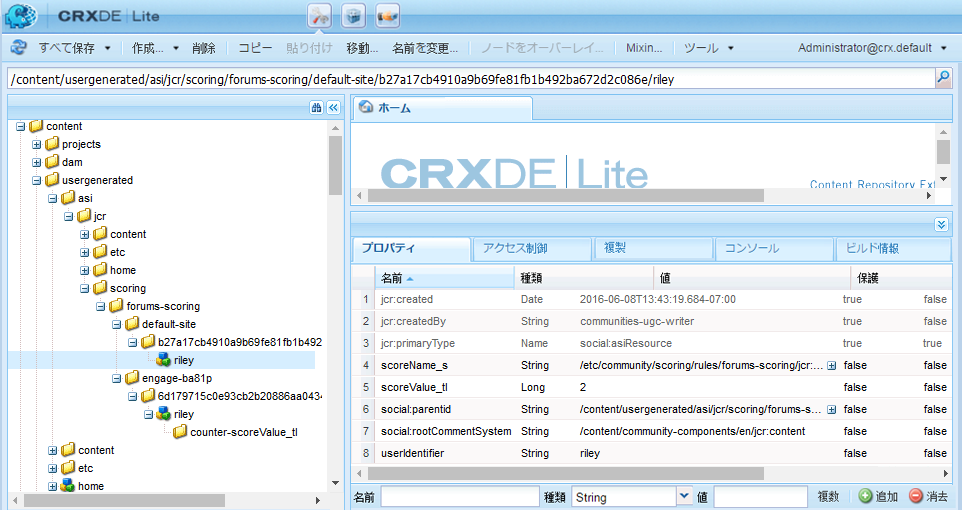
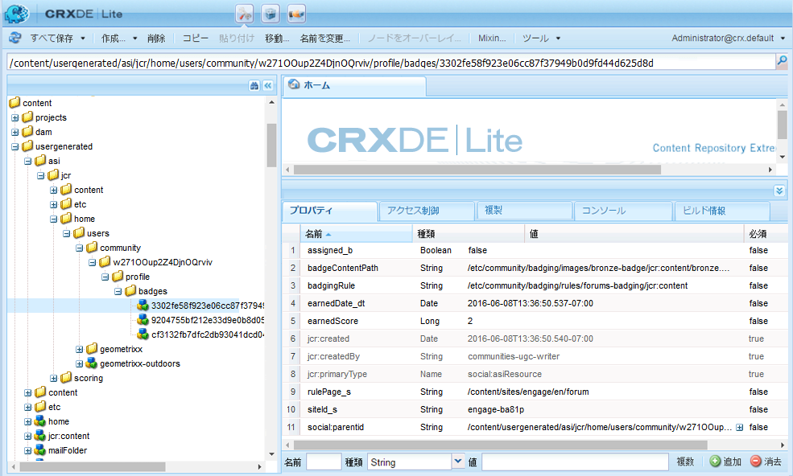
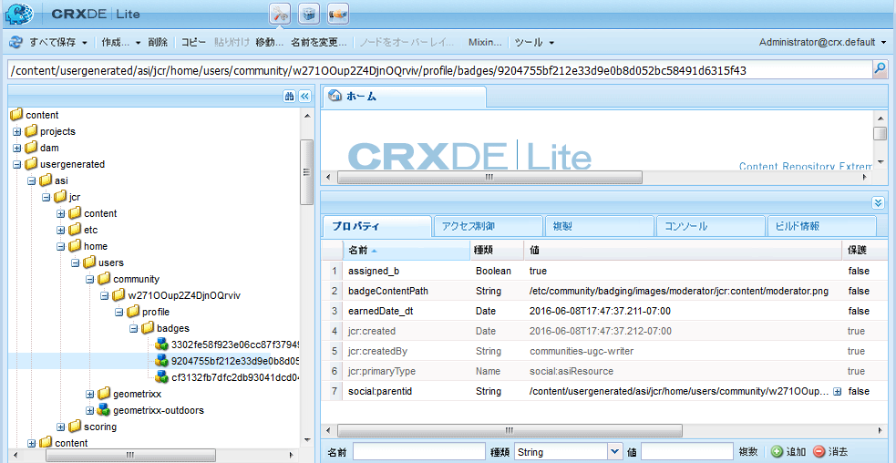

# スコアおよびバッジの基本事項 {#scoring-and-badges-essentials}

AEM Communitiesのスコアとバッジ機能を使用すると、コミュニティメンバーを特定し、報奨を与えることができます。

この機能の設定の詳細については、を参照してください。

* [コミュニティのスコアとバッジ](implementing-scoring.md)

このページには、技術的な詳細が追加されています。

* 方法 [バッジを表示](#displaying-badges) 画像またはテキストのいずれか
* 広範な [デバッグログ](#debug-log-for-scoring-and-badging)
* 方法 [UGC にアクセス](#ugc-for-scoring-and-badging) スコアとバッジに関連する

>[!CAUTION]
>
>実装で表示される実装構造は、CRXDE Liteで変更される場合があります。

## バッジの表示 {#displaying-badges}

バッジをテキストまたは画像として表示するかどうかは、HBS テンプレートのクライアント側で制御します。

例えば、「 `this.isAssigned` in `/libs/social/forum/components/hbs/topic/list-item.hbs`,:

```
{{#each author.badges}}

  {{#if this.isAssigned}}

    <div class="scf-badge-text">

      {{this.title}}

    </div>

  {{/if}}

{{/each}}

{{#each author.badges}}

  {{#unless this.isAssigned}}

    

  {{/unless}}

{{/each}}
```

true の場合、isAssigned はバッジが役割に割り当てられ、バッジがテキストとして表示されることを示します。

false の場合、「割り当て済み」は、獲得スコアに対してバッジが与えられたことを示し、バッジは画像として表示される必要があることを示します。

この動作に対する変更は、カスタマイズしたスクリプト（上書きまたはオーバーレイ）で行う必要があります。 詳しくは、 [クライアント側のカスタマイズ](client-customize.md).

## スコアおよびバッジのデバッグログ {#debug-log-for-scoring-and-badging}

スコアとバッジのデバッグに役立つように、カスタムログファイルを設定できます。 この機能で問題が発生した場合は、このログファイルの内容をカスタマーサポートに提供できます。

詳しい手順については、 [カスタムログファイルの作成](../../help/sites-deploying/monitoring-and-maintaining.md#create-a-custom-log-file).

slinglog ファイルを簡単にセットアップするには：

1. 次にアクセス： **[!UICONTROL Adobe Experience Manager Web コンソールログのサポート]**&#x200B;例：

   * http://localhost:4502/system/console/slinglog

1. 選択 **[!UICONTROL 新しいロガーを追加]**

   1. 選択 `DEBUG` 対象 **[!UICONTROL ログレベル]**
   1. 名前を入力 **[!UICONTROL ログファイル]**&#x200B;例：

      * logs/scoring-debug.log
   1. 2 つを入力 **[!UICONTROL ロガー]** クラスエントリ ( `+` アイコン )

      * `com.adobe.cq.social.scoring`
      * `com.adobe.cq.social.badging`
   1. 選択 **[!UICONTROL 保存]**


ログエントリを表示するには：

* Web コンソールから

   * 以下 **[!UICONTROL ステータス]** メニュー
   * 選択 **[!UICONTROL ログファイル]**
   * ログファイル名を検索します（例： ）。 `scoring-debug`

* サーバのローカルディスク上

   * ログファイルは &lt;*server-install-dir*>/crx-quickstart/logs/&lt;*log-file-name*>.log
   * 例：`.../crx-quickstart/logs/scoring-debug.log`


## スコアおよびバッジの UGC {#ugc-for-scoring-and-badging}

選択した SRP が JSRP または MSRP で、ASRP ではない場合、スコアとバッジに関連する UGC を表示できます。 ( これらの用語に詳しくない場合は、 [コミュニティコンテンツストレージ](working-with-srp.md) および [ストレージリソースプロバイダの概要](srp.md).)

スコアおよびバッジのデータにアクセスするための説明には JSRP が使用されます。JSRP は、 [CRXDE Lite](../../help/sites-developing/developing-with-crxde-lite.md).

**オーサー環境の JSRP**:オーサー環境で実験を行うと、UGC がオーサー環境からのみ表示されるようになります。

**公開時の JSRP**:同様に、パブリッシュ環境でテストする場合は、パブリッシュインスタンス上の管理者権限を持つCRXDE Liteにアクセスする必要があります。 パブリッシュインスタンスがで実行されている場合 [実稼動モード](../../help/sites-administering/production-ready.md) （nosamplecontent 実行モード）の場合、 [有効CRXDE Lite](../../help/sites-administering/enabling-crxde-lite.md).

JSRP 上の UGC の基本的な場所は次のとおりです。 `/content/usergenerated/asi/jcr/`.

### スコアおよびバッジ API {#scoring-and-badging-apis}

次の API を使用できます。

* [com.adobe.cq.social.scoring.api](https://docs.adobe.com/content/docs/en/aem/6-3/develop/ref/javadoc/com/adobe/cq/social/scoring/api/package-summary.html)
* [com.adobe.cq.social.badging.api](https://docs.adobe.com/content/docs/en/aem/6-3/develop/ref/javadoc/com/adobe/cq/social/badging/api/package-summary.html)

インストール済みのの最新の Javadoc [リリース](deploy-communities.md#LatestReleases) 開発者は、デベロッパーリポジトリからAdobeを使用できます。 詳しくは、 [コミュニティでの Maven の使用：Javadocs](maven.md#javadocs).

**リポジトリ内の UGC の場所と形式は、警告なしで変更される場合があります**.

### 設定例 {#example-setup}

リポジトリデータのスクリーンショットは、2 つの異なるAEMサイト上でフォーラムのスコアとバッジを設定することで得られます。

1. 一意の ID を持つAEMサイト（ウィザードを使用して作成されたコミュニティサイト）:

   * 使用の手引きのチュートリアル (engage) サイトを使用し、 [はじめにのチュートリアル](getting-started.md)
   * フォーラムページノードを見つけます。

      * `/content/sites/engage/en/forum/jcr:content`
   * スコアおよびバッジのプロパティの追加

      * `scoringRules = [/etc/community/scoring/rules/comments-scoring,`

         `/etc/community/scoring/rules/forums-scoring]`
      * `badgingRules =[/etc/community/badging/rules/comments-scoring,`

         `/etc/community/badging/rules/forums-scoring]`
   * フォーラムコンポーネントノードを探します。

      * `/content/sites/engage/en/forum/jcr:content/content/primary/forum`

         ( `sling:resourceType = social/forum/components/hbs/forum`)
   * バッジを表示するプロパティを追加します

      * `allowBadges = true`
   * ユーザーがサインインし、フォーラムトピックを作成し、ブロンズバッジを受け取ります。


1. AEMサイト *なし* 一意の id:

   * の使用 [コミュニティコンポーネントガイド](components-guide.md)
   * フォーラムページノードを見つけます。

      * `/content/community-components/en/forum/jcr:content`
   * スコアおよびバッジのプロパティの追加

      ```
      scoringRules = [/etc/community/scoring/rules/comments-scoring,
      /etc/community/scoring/rules/forums-scoring]
      ```

      ```
      badgingRules =[/etc/community/badging/rules/comments-scoring,
      /etc/community/badging/rules/forums-scoring]
      ```

   * フォーラムコンポーネントノードを探します。

      * `/content/community-components/en/forum/jcr:content/content/forum`

         ( `sling:resourceType = social/forum/components/hbs/forum`)
   * バッジを表示するプロパティを追加します

      * `allowBadges = true`
   * ユーザーがサインインし、フォーラムトピックを作成し、ブロンズバッジを受け取ります。


1. ユーザーには、cURL を使用してモデレーターバッジが割り当てられます。

```shell
curl -i -X POST -H "Accept:application/json" -u admin:admin -F ":operation=social:assignBadge" -F "badgeContentPath=/etc/community/badging/images/moderator/jcr:content/moderator.png" http://localhost:4503/home/users/community/w271OOup2Z4DjnOQrviv/profile.social.json
```

ユーザーが 2 つのブロンズバッジを獲得し、モデレーターバッジを授与されたので、ユーザーは次のようにフォーラムエントリと共に表示されます。


>[!NOTE]
>
>この例では、次のベストプラクティスには従っていません。
>
>* スコア付けルール名は、グローバルに一意である必要があります。同じ名前で終わるべきではありません。\
   >  例 *not* 手順：\
   >  /etc/community/scoring/rules/site1/forums-scoring\
   >  /etc/community/scoring/rules/site2/forums-scoring
>
>* 様々なAEMサイト用の一意のバッジ画像の作成
>


### スコアリング UGC にアクセス {#access-scoring-ugc}

の使用 [API](#scoring-and-badging-apis) をお勧めします。

調査のために、例で JSRP を使用すると、スコアを含む基本フォルダーがになります。

* `/content/usergenerated/asi/jcr/scoring`

の子ノード `scoring`は、スコアリングルール名です。 したがって、サーバー上のスコア付けルール名はグローバルに一意になることがベストプラクティスとなります。

Geometrixxエンゲージサイトの場合、ユーザーとそのスコアは、スコア付けルール名、コミュニティサイトのサイト ID( `engage-ba81p`)、一意の id、およびユーザーの id:

* `.../scoring/forums-scoring/engage-ba81p/6d179715c0e93cb2b20886aa0434ca9b5a540401/riley`

コミュニティコンポーネントガイドサイトの場合、ユーザーとそのスコアは、スコア付けルール名（デフォルト ID ）で構成されるパスになります。 `default-site`)、一意の id、およびユーザーの id:

* `.../scoring/forums-scoring/default-site/b27a17cb4910a9b69fe81fb1b492ba672d2c086e/riley`

スコアはプロパティに保存されます `scoreValue_tl` この関数は、値のみを直接含む場合も、atomicCounter を間接的に参照する場合もあります。



### バッジ UGC へのアクセス {#access-badging-ugc}

の使用 [API](#scoring-and-badging-apis) をお勧めします。

例では、JSRP を使用して、割り当てられたバッジや与えられたバッジに関する情報を格納する基本フォルダーを調べます。

* /content/usergenerated/asi/jcr

ユーザーのプロファイルへのパスが続き、その後にバッジフォルダー ( 例：

* /home/users/community/w271Oup2Z4DjnOQrviv/profile/badges

#### 授与されたバッジ {#awarded-badge}



#### 割り当てられたバッジ {#assigned-badge}



## 追加情報 {#additional-information}

ポイントに基づいてメンバーのソート済リストを表示する手順は、次のとおりです。

* [リーダーボード機能](functions.md#leaderboard-function) コミュニティサイトまたはグループテンプレートに含める。
* [リーダーボードコンポーネント](enabling-leaderboard.md)（ページオーサリング用のリーダーボード機能の主なコンポーネント）
