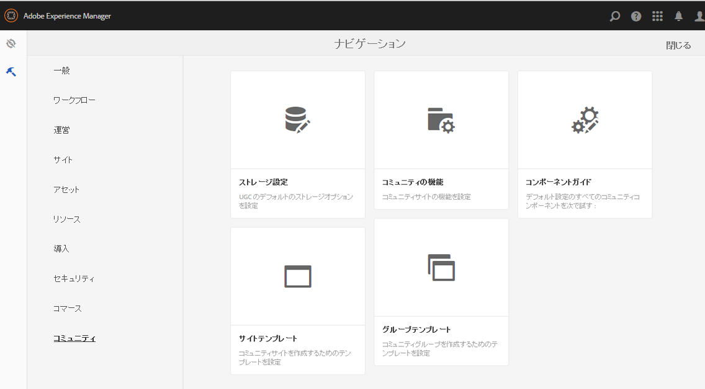
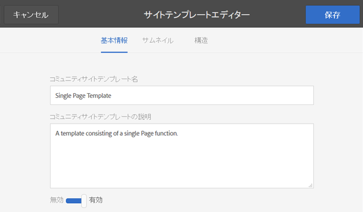
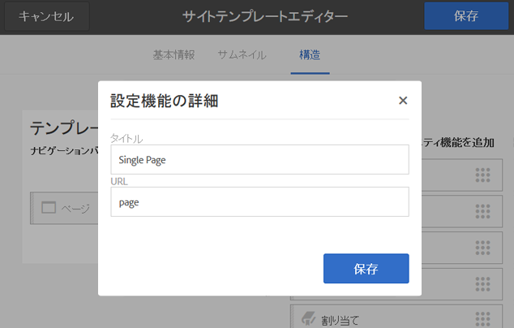
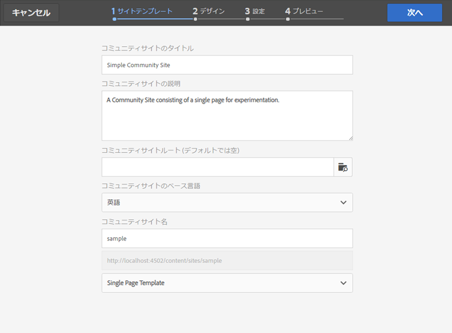
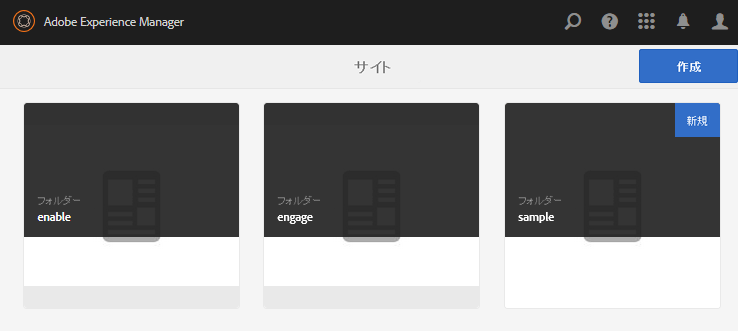
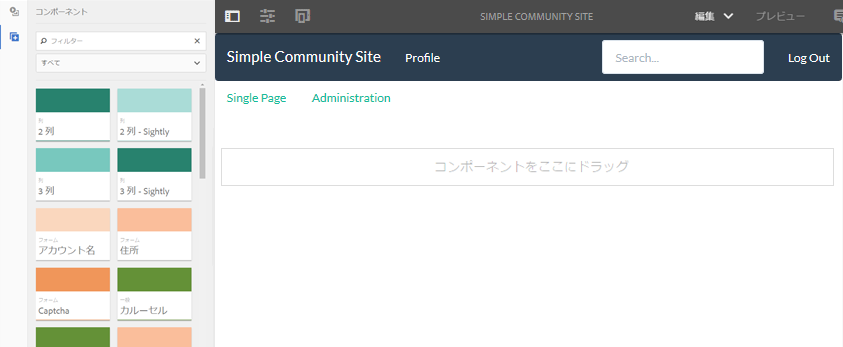

# サンプルページの作成 {#create-a-sample-page}

>[!CAUTION]
>
>AEM 6.4 の拡張サポートは終了し、このドキュメントは更新されなくなりました。 詳細は、 [技術サポート期間](https://helpx.adobe.com/jp/support/programs/eol-matrix.html). サポートされているバージョンを見つける [ここ](https://experienceleague.adobe.com/docs/?lang=ja).

AEM 6.1 Communities 以降、サンプルページを作成する最も簡単な方法は、単に Page 機能で構成されるシンプルなコミュニティサイトを作成することです。

これにより、parsys コンポーネントが含まれ、 [オーサリング用コンポーネントの有効化](basics.md#accessing-communities-components).

サンプルコンポーネントを調査するもう 1 つの方法は、 [コミュニティコンポーネントガイド](components-guide.md).

## コミュニティサイトを作成 {#create-a-community-site}

これは、 [AEM Communitiesの概要](getting-started.md).

主な違いは、このチュートリアルでは、 [ページ関数](functions.md#page-function) 他の機能を使用しないシンプルなコミュニティサイトを作成する場合（すべてのコミュニティサイトに基本的な有線化済み機能以外）。

### 新しいサイトテンプレートの作成 {#create-new-site-template}

作業を開始するには、シンプルな [コミュニティサイトテンプレート](sites.md).

オーサーインスタンスのグローバルナビゲーションから、を選択します。 **[!UICONTROL ツール/コミュニティ/サイトテンプレート]**.

* `Create button` を選択します。
* 基本情報

   * `Name`:単一ページテンプレート
   * `Description`:単一の Page 関数で構成されるテンプレートです。
   * 「`Enabled`」を選択します。

* 構造

   * ドラッグ `Page` 関数からテンプレートビルダーに
   * 「構成関数の詳細」に、次のように入力します。

      * `Title`:単一ページ
      * `URL`: ページ

* 選択 **`Save`** （設定用）
* 選択 **`Save`** サイトテンプレート用

### 新しいコミュニティサイトを作成 {#create-new-community-site}

次に、シンプルなサイトテンプレートに基づいて新しいコミュニティサイトを作成します。

サイトテンプレートの作成後、グローバルナビゲーションからを選択します。 **[!UICONTROL コミュニティ/サイト]**.

* 選択 **`Create`** アイコン

* ステップ `1 - Site Template`

   * `Title`:シンプルなコミュニティサイト
   * `Description`:コミュニティサイトは、実験用の単一のページで構成されます。
   * `Community Site Root: (leave blank)`
   * `Community Site Base Language: English`
   * `Name`:サンプル

      * url = http://localhost:4502/content/sites/sample
   * `Template`:選択 `Single Page Template`

* `Next` を選択します。
* ステップ `2 - Design`

   * 任意のデザインを選択

* `Next` を選択します。
* `Next` を選択します。

   （すべてのデフォルト設定を受け入れる）

* `Create` を選択します。

## サイトの公開 {#publish-the-site}

次の [コミュニティサイトコンソール](sites-console.md)で、サイトを公開する公開アイコンを選択します ( デフォルトではhttp://localhost:4503に設定されています )。

## オーサー環境で編集モードでサイトを開く {#open-the-site-on-author-in-edit-mode}

「サイトを開く」アイコンを選択して、サイトを編集モードで表示します。

URL は次のようになります [http://localhost:4502/editor.html/content/sites/sample/en.html](http://localhost:4502/editor.html/content/sites/sample/en.html)

簡単なホームページでは、コミュニティの機能やテンプレートを通じて事前に接続されている内容を確認し、コミュニティコンポーネントの追加や設定を行うことができます。

## 公開時にサイトを表示 {#view-site-on-publish}

ページを公開したら、 [発行インスタンス](http://localhost:4503/content/sites/sample/en.html) を使用して、匿名のサイト訪問者、サインインしているメンバー、または管理者としての機能を試すことができます。 オーサー環境に表示される「管理」リンクは、管理者がログインしない限り、パブリッシュ環境には表示されません。
