# 新しいコミュニティサイトの作成 {#author-a-new-community-site}

## 新しいコミュニティサイトの作成 {#create-a-new-community-site}

オーサーインスタンスを使用して新しいコミュニティサイトを作成します。

* 管理者権限でログイン
* グローバルナビゲーションから： **[!UICONTROL ナビゲーション/コミュニティ/サイト]**

コミュニティサイトコンソールでは、コミュニティサイトを作成する手順を案内するウィザードが提供されます。を `Next`手順または `Back`を前の手順に戻してから、最後の手順でサイトをコミットします。

新しいコミュニティサイトの作成を開始するには：

* を選択します。 `Create` ボタン

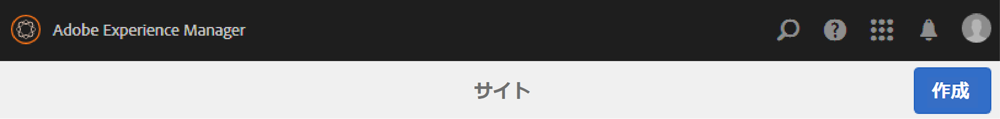

### 手順 1：サイトテンプレート {#step-site-template}

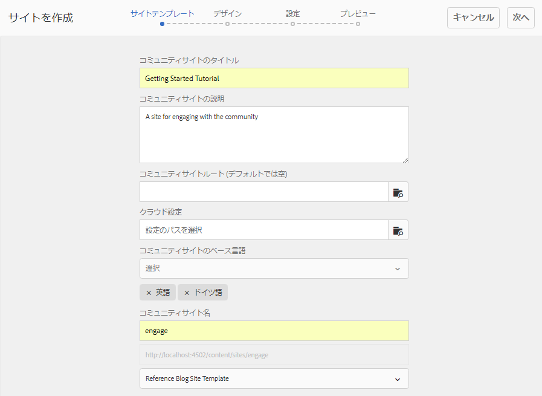

[「サイトテンプレート」の手順](sites-console.md#step2013asitetemplate)では、URL のタイトル、説明、名前を入力し、コミュニティサイトテンプレートを選択します。次に例を示します。

* **[!UICONTROL コミュニティサイトのタイトル]**: `Getting Started Tutorial`

* **[!UICONTROL コミュニティサイトの説明]**: `A site for engaging with the community.`

* **[!UICONTROL コミュニティサイトのルート]**:（デフォルトのルートの場合は空白のままにします） `/content/sites`)

* **[!UICONTROL クラウド設定]**：（クラウド設定が指定されていない場合は空欄のままにする）指定されたクラウド設定へのパスを入力します。
* **[!UICONTROL コミュニティサイトの基本言語]**:（単一言語の場合は、手を付けないでください）。英語 ) プルダウンメニューを使用して 1 つを選択します *以上* 使用可能な言語 ( ドイツ語、イタリア語、フランス語、日本語、スペイン語、ポルトガル語（ブラジル）、中国語（繁体字）、中国語（簡体字）)) のベース言語。 追加された言語ごとに 1 つのコミュニティサイトが作成され、 [多言語サイトのコンテンツの翻訳](../../help/sites-administering/translation.md). 各サイトのルートページには、選択したいずれかの言語の言語コード（例えば、英語では「en」、フランス語では「fr」）で名付けられた子ページが含まれます。

* **[!UICONTROL コミュニティサイト名]**：engage

   * サイトの作成後に名前が簡単に変更されないので、名前を再確認します。
   * 初期 URL がコミュニティサイト名の下に表示されます
   * 有効な URL に、ベース言語コード+ &quot;.html&quot;を追加します。
   * *例：*, http://localhost:4502/content/sites/ `engage/en.html`

* **[!UICONTROL テンプレート]**:引っ張って選ぶ `Reference Site`

「**[!UICONTROL 次へ]**」を選択します。

### 手順 2：デザイン {#step-design}

「デザイン」の手順では、テーマとブランディングバナーを選択する 2 つのセクションが表示されます。

#### コミュニティサイトテーマ {#community-site-theme}

目的のスタイルを選択し、テンプレートに適用します。選択すると、テーマにチェックマークが付きます。

#### コミュニティサイトブランディング {#community-site-branding}

（オプション）サイトのページ全体に表示するバナー画像をアップロードします。 バナーはブラウザーの左端およびコミュニティサイトヘッダーとメニュー（ナビゲーションリンク）の間に固定されます。バナーの高さは 120 ピクセルに切り詰められます。バナーがブラウザーの幅や 120 ピクセルの高さに合わせてリサイズされることはありません。

 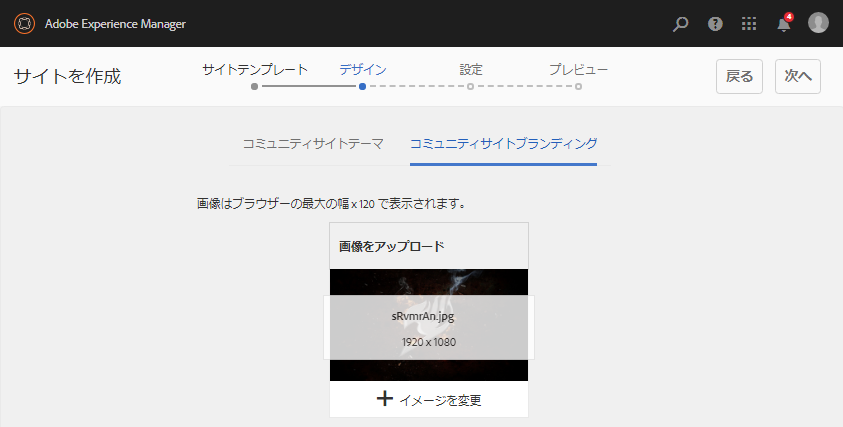

「**[!UICONTROL 次へ]**」を選択します。

### 手順 3：設定 {#step-settings}

設定ステップで、選択する前に `Next`には、ユーザー管理、タグ付け、モデレート、グループ管理、分析、翻訳およびイネーブルメントに関する設定にアクセスできる 7 つのセクションがあります。

次にアクセス： [AEM Communities使用の手引き](getting-started-enablement.md) イネーブルメント機能を使用する方法を学ぶためのチュートリアルです。

#### ユーザー管理 {#user-management}

「[ユーザー管理](sites-console.md#user-management)」タブのチェックボックスをすべてオンにします。

* サイト訪問者に自己登録を許可するには
* サイト訪問者がサインインせずにサイトを表示できるようにするには
* メンバーが他のコミュニティメンバーからメッセージを送受信できるようにするには
* プロファイルの登録と作成の代わりにFacebookでのログインを許可するには
* プロファイルの登録と作成の代わりにTwitterでのログインを許可するには

>[!NOTE]
>
>実稼動環境では、カスタムの Facebook アプリケーションおよび Twitter アプリケーションを作成する必要があります。[Facebook と Twitter を使用したソーシャルログイン](social-login.md)を参照してください。

#### タグ付け {#tagging}

コミュニティコンテンツに適用できるタグを制御するには、以前に [タグ付けコンソール](../../help/sites-administering/tags.md#tagging-console) ( [チュートリアル名前空間](setup.md#create-tutorial-tags)) をクリックします。

名前空間は先行入力検索で簡単に検索できます。例：

* &#39;tut&#39;と入力します
*  `Tutorial`

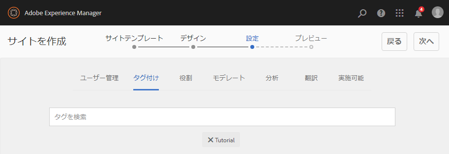

#### 役割 {#roles}

[コミュニティメンバーの役割](users.md) は、「役割」セクションの設定を通じて割り当てられます。

コミュニティメンバー（またはメンバーのグループ）がコミュニティマネージャーとしてサイトを体験するには、先行入力検索を使用して、ドロップダウンのオプションからメンバーまたはグループ名を選択します。

例：

* 「q」と入力します。
* 選択 [クインハーパー](enablement-setup.md#publishcreateenablementmembers)

>[!NOTE]
>
>[トンネルサービス](https://helpx.adobe.com/experience-manager/6-3/communities/using/deploy-communities.html#tunnel-service-on-author) パブリッシュ環境にのみ存在するメンバーとグループを選択できます。

#### モデレート {#moderation}

ユーザー生成コンテンツ（UGC）を[モデレート](sites-console.md#moderation)する場合は、デフォルトのグローバル設定を受け入れます。

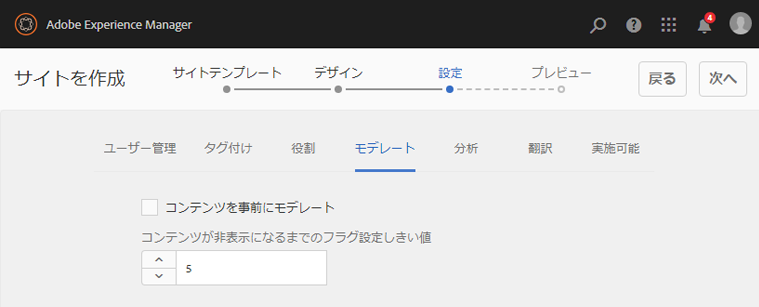

#### ANALYTICS {#analytics}

Adobe Analytics のライセンスを持っていて、Analytics のクラウドサービスおよびフレームワークが設定されている場合は、Analytics を有効にしてフレームワークを選択できます。

[コミュニティ機能のための Analytics の設定](analytics.md)を参照してください。

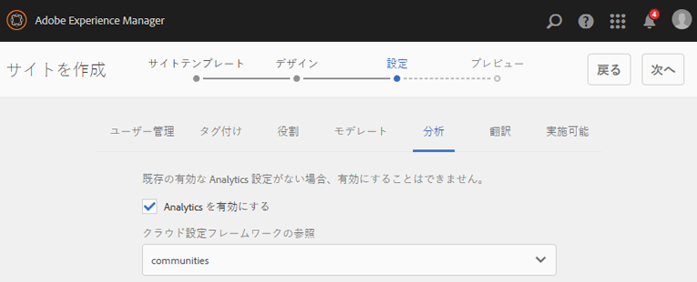

#### 翻訳 {#translation}

[翻訳設定](sites-console.md#translation)では、サイトの基本言語に加えて、UGC の翻訳を許可するかどうかと、どの言語に翻訳するかを指定します。

* チェック **[!UICONTROL 機械翻訳を許可]**
* デフォルトの機械翻訳サービスで翻訳用に選択されたデフォルトの言語をそのまま使用
* デフォルトの翻訳プロバイダーと設定のままにします。
* 言語コピーがないので、グローバルストアは不要です
* 選択 **[!UICONTROL ページ全体を翻訳]**
* デフォルトの永続性オプションをそのままにする

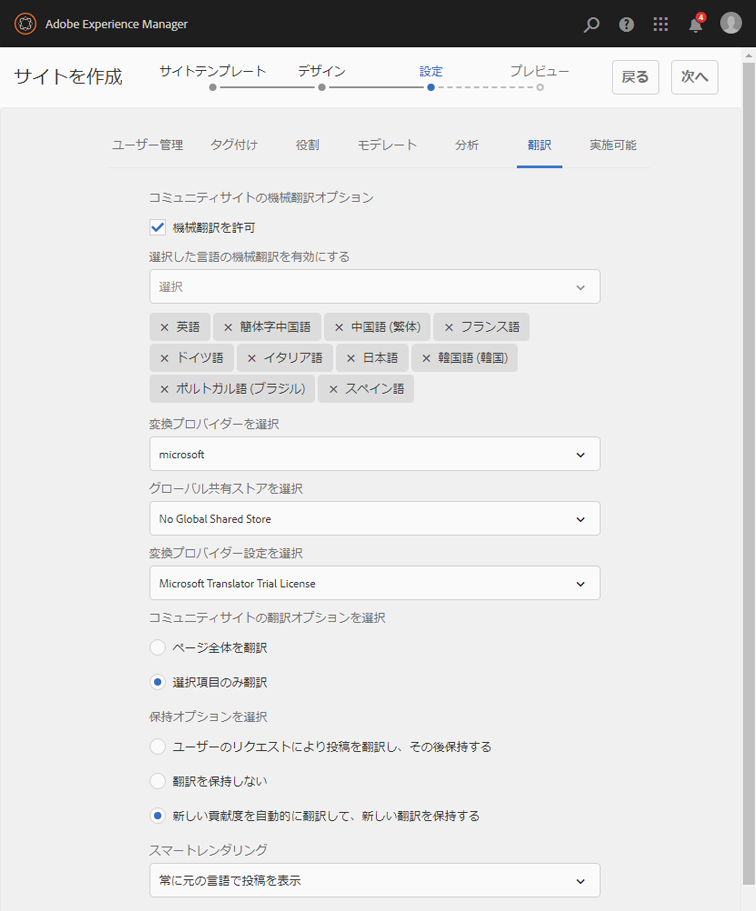

#### イネーブルメント {#enablement}

エンゲージメントコミュニティを作成する場合は空白のままにします。

[イネーブルメントコミュニティ](overview.md#enablement-community)をすばやく作成する方法のチュートリアルについて詳しくは、[イネーブルメントのための AEM Communities 使用の手引き](getting-started-enablement.md)を参照してください。

「**[!UICONTROL 次へ]**」を選択します。

### 手順 4：コミュニティサイトの作成 {#step-create-communities-site}

「**[!UICONTROL 作成]**」を選択します。

プロセスが完了すると、新しいサイトのフォルダーがコミュニティサイトコンソールに表示されます。

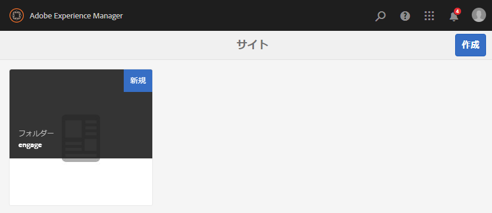

## 新しいコミュニティサイトの公開 {#publish-the-new-community-site}

作成したサイトは、コミュニティ - サイトコンソールで管理する必要があります。このコンソールは、新しいサイトを作成するコンソールと同じものです。

コミュニティサイトのフォルダーを選択して開いた後、サイトアイコンにマウスカーソルを合わせると 4 つのアクションアイコンが表示されます。

4 つ目の省略記号アイコン（その他のアクション）を選択すると、「サイトを書き出し」および「サイトを削除」オプションが表示されます。

各アイコンの機能は次のとおりです（左から右の順に説明）。

* **サイトを開く**
鉛筆アイコンを選択してコミュニティサイトをオーサリング編集モードで開き、ページコンポーネントを追加または設定します。

* **サイトを編集**
プロパティアイコンを選択してコミュニティサイトを開き、タイトルやテーマの変更などのプロパティを変更します。

* **サイトを公開**
コミュニティサイトを公開する場合は、世界アイコンを選択します（例えば、公開サーバーがローカルマシンで実行されている場合は、デフォルトで localhost:4503 に公開します）。

* **サイトを書き出し**
書き出しアイコンを選択して、コミュニティサイトのパッケージを作成し、そのパッケージを次の場所に保存します。 [パッケージマネージャー](../../help/sites-administering/package-manager.md) とダウンロードされました。

   UGC はサイトパッケージに含まれていません。

* **サイトを削除**

   内からコミュニティサイトを削除するには、削除アイコンを選択します。 **[!UICONTROL コミュニティ/サイトコンソール]**. サイトを削除すると、UGC やユーザーグループ、アセット、データベースレコードなど、そのサイトに関連付けられているアイテムがすべて削除されます。

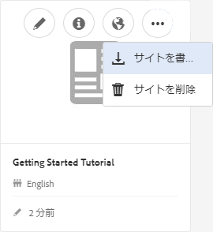

>[!NOTE]
>
>パブリッシュインスタンスにデフォルトポートの 4503 を使用していない場合は、デフォルトのレプリケーションエージェントを編集し、ポート番号を正しい値に設定します。
>
>オーサーインスタンスで、メインメニューから
>
>1. に移動します。 **[!UICONTROL [ ツール ] > [ 操作 ] > [ レプリケーション ]]** メニュー
>1. 選択 **[!UICONTROL 作成者のエージェント]**
>1. 選択 **[!UICONTROL デフォルトエージェント (publish)]**
>1. 次の隣 **[!UICONTROL 設定]** 選択 **[!UICONTROL 編集]**
>1. エージェント設定のポップアップダイアログで、「トランスポート」タブを選択します。
>1. URI で、ポート番号 4503 を目的のポート番号に変更します。

>
>例えば、ポート 6103 を使用するには、次のようにします。 `http://localhost:6103/bin/receive?sling:authRequestLogin=1`
>
>1. 「**[!UICONTROL OK]**」を選択します。
>1. （オプション）「 」を選択します。 `Clear` または `Force Retry` レプリケーションキューをリセットするには

### サイトの公開 {#select-publish}

公開サーバーが実行中であることを確認したら、地球のアイコンを選択して、コミュニティサイトを公開します。

コミュニティサイトが正常に公開されると、次のような短いメッセージが表示されます。

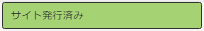

### 新しいコミュニティユーザーグループの確認 {#notice-new-community-user-groups}

新しいコミュニティサイトとともに、新しいユーザーグループが作成されます。各グループには、様々な管理機能に応じて適切な権限が設定されています。詳しくは、 [コミュニティサイトのユーザーグループ](users.md#usergroupsforcommunitysites).

この新しいコミュニティサイトでは、手順 1 で「engage」というサイト名を指定したので、[グループコンソール](members.md)（グローバルナビゲーション：コミュニティ／グループ）で以下に示す 4 つの新しいユーザーグループを確認できます。

* コミュニティ Engage コミュニティマネージャー
* コミュニティ Engage グループ管理者
* コミュニティ Engage メンバー
* コミュニティ Engage モデレーター
* コミュニティ Engage の権限を持つメンバー
* コミュニティ Engage サイトコンテンツマネージャー

[Aaron McDonald](tutorials.md#demo-users) が次のグループのメンバーになっていることに注目してください。

* コミュニティ Engage コミュニティマネージャー
* コミュニティ Engage モデレーター
* コミュニティ Engage メンバー（モデレーターグループのメンバーとして間接的に）

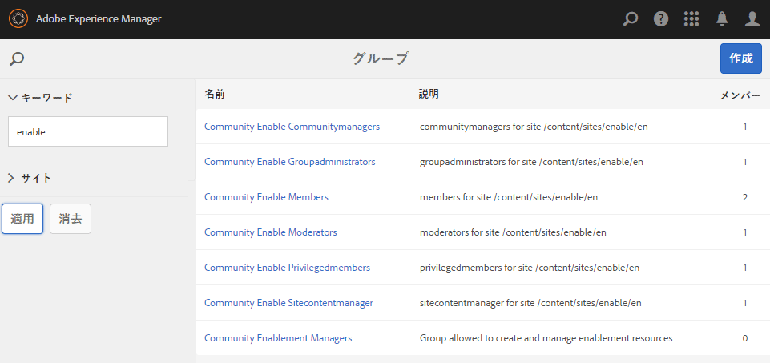

#### http://localhost:4503/content/sites/engage/en.html {#http-localhost-content-sites-engage-en-html}

## 認証エラーの設定 {#configure-for-authentication-error}

サイトが設定され、パブリッシュにプッシュされると、 [ログインマッピングの設定](sites-console.md#configure-for-authentication-error) ( `Adobe Granite Login Selector Authentication Handler`) をパブリッシュインスタンスでクリックします。 ログイン資格情報が正しく入力されていない場合、認証エラーによってコミュニティサイトのログインページが再度表示され、エラーメッセージが表示されるという利点があります。

を追加します。 `Login Page Mapping` as

* /content/sites/engage/en/signin:/content/sites/engage/en

## オプションの手順 {#optional-steps}

### デフォルトのホームページの変更 {#change-the-default-home-page}

公開サイトをデモ目的で操作するときは、デフォルトのホームページを新しいサイトに変更すると便利です。

これをおこなうには、[CRXDE](http://localhost:4503/crx/de) Lite を使用して、パブリッシュ側で[リソースマッピング](../../help/sites-deploying/resource-mapping.md)テーブルを編集します。

作業を開始するには：

1. 公開時に、管理者権限でログインします。
1. 参照先 [http://localhost:4503/crx/de](http://localhost:4503/crx/de)
1. プロジェクトブラウザで、を展開します。 `/etc/map`
1. を選択します。 `http` ノード

   * 選択 **[!UICONTROL ノードを作成]**

      * **名前** localhost.4503

         ( *not* use `:`)

      * **タイプ** [sling:Mapping](https://sling.apache.org/documentation/the-sling-engine/mappings-for-resource-resolution.html)

1. 新しく作成された `localhost.4503` 選択されたノード

   * プロパティの追加

      * **名前**：sling:match
      * **タイプ**：String
      * **値**：localhost.4503/\$

         （「$」文字で終わる必要があります）
   * プロパティの追加

      * **名前**：sling:internalRedirect
      * **タイプ**：String
      * **値**：/content/sites/engage/en.html

1. 「**[!UICONTROL すべて保存]**」を選択します。
1. （オプション）閲覧履歴を削除します
1. http://localhost:4503/を参照します。

   * http://localhost:4503/content/sites/engage/en.htmlに到着します。

>[!NOTE]
>
>無効にするには、 `sling:match` プロパティ値に「x」を付ける — `xlocalhost.4503/$`  — および **[!UICONTROL すべて保存]**.

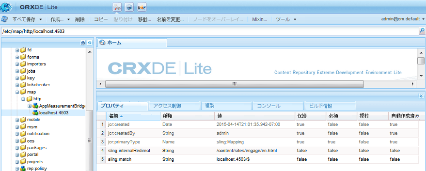

#### トラブルシューティング：マップ保存エラー {#troubleshooting-error-saving-map}

変更を保存できない場合は、ノード名が `localhost.4503`（区切り文字が「ドット」）となっているかを確認してください。`localhost:4503` は有効な名前空間のプレフィックスではないので、`localhost`（区切り文字が「コロン」）という表記は正しくありません。

#### トラブルシューティング：リダイレクト失敗 {#troubleshooting-fail-to-redirect}

&#39;**$**&#39; （正規表現の末尾） `sling:match`文字列が非常に重要なので、正確に `http://localhost:4503/` がマッピングされている場合、リダイレクト値の前に、URL の server:port の後に存在する可能性があるすべてのパスが追加されます。 したがって、AEMがログインページにリダイレクトしようとすると、失敗します。

### サイトの変更 {#modify-the-site}

サイトを最初に作成した後、作成者は[サイトを開くアイコン](sites-console.md#authoring-site-content)を使用して、標準的な AEM のオーサリングアクティビティを実行できます。

また、管理者は[サイトを編集アイコン](sites-console.md#modifying-site-properties)を使用して、タイトルなどのサイトプロパティを変更できます。

変更後は、次の操作をおこなってください。 **保存** および **再公開** サイト。

>[!NOTE]
>
>AEM に馴染みがない場合は、[基本操作](../../help/sites-authoring/basic-handling.md)に関するドキュメントおよび[ページのオーサリングのクイックガイド](../../help/sites-authoring/qg-page-authoring.md)を参照してください。
