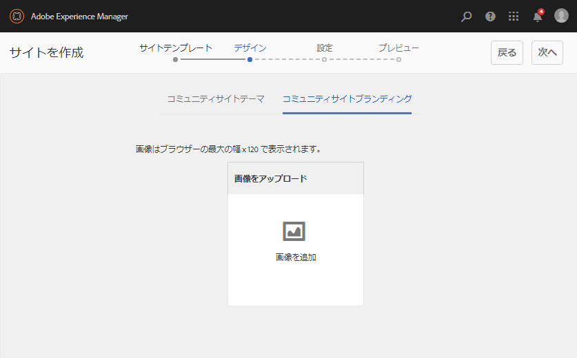
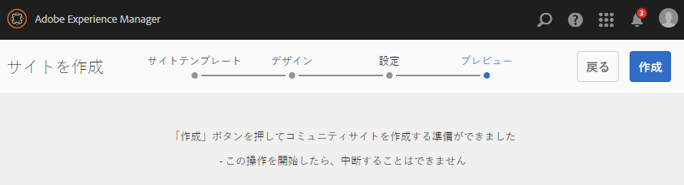

# 新しいコミュニティサイトの作成 {#author-a-new-community-site}

## 新しいコミュニティサイトの作成 {#create-a-new-community-site}

オーサーインスタンスを使用して新しいコミュニティサイトを作成します。

* 管理者権限でサインインする
* グローバルナビゲーションから：**[!UICONTROL ナビゲーション>コミュニティ>サイト]**

コミュニティサイトコンソールでは、コミュニティサイトを作成する手順を案内するウィザードが提供されます。最後の手順でサイトをコミットする前に、`Next`または`Back`を前の手順に進むことができます。

新しいコミュニティサイトの作成を開始するには：

* `Create`ボタンを選択します

### Step 1 : Site Template {#step-site-template}

[「サイトテンプレート」の手順](sites-console.md#step2013asitetemplate)では、URL のタイトル、説明、名前を入力し、コミュニティサイトテンプレートを選択します。次に例を示します。

* **[!UICONTROL コミュニティサイトのタイトル]**: `Getting Started Tutorial`

* **[!UICONTROL コミュニティサイトの説明]**: `A site for engaging with the community.`

* **[!UICONTROL コミュニティサイトルート]**:(デフォルトのルートの場合は空白のまま `/content/sites`)

* **[!UICONTROL クラウド設定]**：（クラウド設定が指定されていない場合は空欄のままにする）指定されたクラウド設定へのパスを入力します。
* **[!UICONTROL コミュニティサイトの基本言語]**:（単一言語の場合は手を付けないでください）。英語)プルダウンメニューを使用して、使用可能な言語(ドイツ語、イタリア語、フランス語、日本語、スペイン語、ポルトガル語（ブラジル）、中国語（繁体字）、中国語（簡体字）)から1つ *または* 複数のベース言語を選択します。追加された言語ごとに1つのコミュニティサイトが作成され、[多言語サイト用のコンテンツの翻訳](../../help/sites-administering/translation.md)で説明されているベストプラクティスに従って、同じサイトフォルダー内に存在します。 各サイトのルートページには、選択したいずれかの言語の言語コード（例えば、英語では「en」、フランス語では「fr」）で名付けられた子ページが含まれます。

* **[!UICONTROL コミュニティサイト名]**：engage

   * サイトの作成後に名前が容易に変更されないので、重複チェックを行います。
   * コミュニティサイト名の下に最初のURLが表示されます
   * 有効なURLの場合は、ベース言語コード+ &quot;.html&quot;を追加します。
   * *例えば*、http://localhost:4502/content/sites/  `engage/en.html`

* **[!UICONTROL テンプレート]**:下に降りて～を選ぶ  `Reference Site`

「**[!UICONTROL 次へ]**」を選択します。

### 手順 2：デザイン {#step-design}

「デザイン」の手順では、テーマとブランディングバナーを選択する 2 つのセクションが表示されます。

#### コミュニティサイトテーマ {#community-site-theme}

目的のスタイルを選択し、テンプレートに適用します。選択すると、テーマはチェックマーク付きでオーバーレイされます。

#### コミュニティサイトブランディング {#community-site-branding}

（オプション）サイトページ全体に表示するバナー画像をアップロードします。 バナーはブラウザーの左端およびコミュニティサイトヘッダーとメニュー（ナビゲーションリンク）の間に固定されます。バナーの高さは 120 ピクセルに切り詰められます。バナーがブラウザーの幅や 120 ピクセルの高さに合わせてリサイズされることはありません。

 

「**[!UICONTROL 次へ]**」を選択します。

### 手順 3：設定 {#step-settings}

`Next`を選択する前に、設定の手順で7つのセクションがあり、ユーザー管理、タグ付け、モデレート、グループ管理、分析、翻訳および有効化に関連する設定にアクセスできます。

[有効化のためのAEM Communitiesの使用の手引き](getting-started-enablement.md)チュートリアルにアクセスして、有効化機能の使用を体験してください。

#### ユーザー管理 {#user-management}

「[ユーザー管理](sites-console.md#user-management)」タブのチェックボックスをすべてオンにします。

* サイト訪問者が自己登録できるようにするには
* サイト訪問者がサインインせずにサイトを表示できるようにするには
* 他のコミュニティメンバーからのメッセージの送受信を許可するには
* プロファイルの登録と作成を行う代わりにFacebookでのログインを許可するには
* プロファイルの登録と作成を行う代わりに、Twitterでのログインを許可するには

>[!NOTE]
>
>実稼動環境では、カスタムの Facebook アプリケーションおよび Twitter アプリケーションを作成する必要があります。[Facebook と Twitter を使用したソーシャルログイン](social-login.md)を参照してください。

#### タグ付け {#tagging}

コミュニティコンテンツに適用できるタグは、[タグ付けコンソール](../../help/sites-administering/tags.md#tagging-console)で事前に定義したAEM名前空間([チュートリアル名前空間](setup.md#create-tutorial-tags)など)を選択することで制御します。

名前空間は先行入力検索で簡単に検索できます。例：

* &#39;tut&#39;と入力します。
*  `Tutorial`

#### 役割 {#roles}

[コミュニティメンバ](users.md) ーロールは、[役割]セクションの設定を通じて割り当てられます。

コミュニティメンバー（またはメンバーのグループ）がコミュニティマネージャーとしてサイトを体験できるようにするには、先頭入力検索を使用し、ドロップダウンのオプションからメンバーまたはグループ名を選択します。

例：

* 「q」と入力します。
* [クインハーパー](enablement-setup.md#publishcreateenablementmembers)を選択

>[!NOTE]
>
>[トンネル](https://helpx.adobe.com/experience-manager/6-3/communities/using/deploy-communities.html#tunnel-service-on-author) サービスでは、パブリッシュ環境のみに存在するメンバーとグループを選択できます。

#### モデレート {#moderation}

ユーザー生成コンテンツ（UGC）を[モデレート](sites-console.md#moderation)する場合は、デフォルトのグローバル設定を受け入れます。

#### Analytics {#analytics}

Adobe Analytics のライセンスを持っていて、Analytics のクラウドサービスおよびフレームワークが設定されている場合は、Analytics を有効にしてフレームワークを選択できます。

[コミュニティ機能のための Analytics の設定](analytics.md)を参照してください。

#### 翻訳{#translation}

[翻訳設定](sites-console.md#translation)では、サイトの基本言語に加えて、UGC の翻訳を許可するかどうかと、どの言語に翻訳するかを指定します。

* **[!UICONTROL 機械翻訳を許可]**&#x200B;を確認
* デフォルトの機械翻訳サービスで、翻訳用にデフォルトの言語を選択したままにする
* デフォルトの翻訳プロバイダーとconfigのままにする
* 言語コピーがないので、グローバルストアは不要です
* **[!UICONTROL ページ全体を翻訳]**&#x200B;を選択
* デフォルトの永続性オプションをそのまま使用

#### イネーブルメント {#enablement}

エンゲージメントコミュニティを作成する場合は空白のままにします。

[イネーブルメントコミュニティ](overview.md#enablement-community)をすばやく作成する方法のチュートリアルについて詳しくは、[イネーブルメントのための AEM Communities 使用の手引き](getting-started-enablement.md)を参照してください。

「**[!UICONTROL 次へ]**」を選択します。

### 手順 4：コミュニティサイトの作成 {#step-create-communities-site}

「**[!UICONTROL 作成]**」を選択します。

プロセスが完了すると、新しいサイトのフォルダーがコミュニティサイトコンソールに表示されます。

## 新しいコミュニティサイトの公開 {#publish-the-new-community-site}

作成したサイトは、コミュニティ - サイトコンソールで管理する必要があります。このコンソールは、新しいサイトを作成するコンソールと同じものです。

コミュニティサイトのフォルダーを選択して開いた後、サイトアイコンにマウスカーソルを合わせると 4 つのアクションアイコンが表示されます。

4つ目の楕円アイコン（その他のアクション）を選択すると、「サイトを書き出し」オプションと「サイトを削除」オプションが表示されます。

各アイコンの機能は次のとおりです（左から右の順に説明）。

* **サイトを開く**
鉛筆アイコンを選択して、作成者編集モードでコミュニティサイトを開き、ページコンポーネントを追加/設定します。

* **サイトの編集プロパティアイコンを**
選択して、タイトルやテーマの変更など、プロパティの変更用にコミュニティサイトを開きます。

* **Publish**
Siteコミュニティサイトを公開するには、世界のアイコンを選択します（例えば、公開サーバーがローカルマシンで実行されている場合は、デフォルトでlocalhost:4503に移動します）。

* **サイトの書き出し**
書き出しアイコンを選択して、コミュニティサイトのパッケージを作成し、そのパッケージを [package ](../../help/sites-administering/package-manager.md) managerに保存してダウンロードします。

   UGC はサイトパッケージに含まれていません。

* **サイトを削除**

   **[!UICONTROL コミュニティ/サイトコンソール]**&#x200B;内からコミュニティサイトを削除するには、削除アイコンを選択します。 サイトを削除すると、UGC やユーザーグループ、アセット、データベースレコードなど、そのサイトに関連付けられているアイテムがすべて削除されます。

>[!NOTE]
>
>パブリッシュインスタンスにデフォルトポートの 4503 を使用していない場合は、デフォルトのレプリケーションエージェントを編集し、ポート番号を正しい値に設定します。
>
>オーサーインスタンスで、メインメニューから
>
>1. **[!UICONTROL ツール/操作/レプリケーション]**&#x200B;メニューに移動します。
>1. **[!UICONTROL 作成者]**&#x200B;のエージェントを選択
>1. **[!UICONTROL デフォルトのエージェント（発行）]**&#x200B;を選択
>1. 「**[!UICONTROL 設定]**」の横にある「**[!UICONTROL 編集]**」を選択します
>1. エージェント設定のポップアップダイアログで、「トランスポート」タブを選択します
>1. URIで、ポート番号4503を目的のポート番号に変更します。

>
>
例えば、ポート6103を使用するには：`http://localhost:6103/bin/receive?sling:authRequestLogin=1`
>
>1. 「**[!UICONTROL OK]**」を選択します。
>1. （オプション）`Clear`または`Force Retry`を選択してレプリケーションキューをリセットします

### サイトの公開 {#select-publish}

公開サーバーが実行中であることを確認したら、地球のアイコンを選択して、コミュニティサイトを公開します。

コミュニティサイトが正常に公開されると、次のような短いメッセージが表示されます。

### 新しいコミュニティユーザーグループの確認 {#notice-new-community-user-groups}

新しいコミュニティサイトとともに、新しいユーザーグループが作成されます。各グループには、様々な管理機能に応じて適切な権限が設定されています。詳しくは、[コミュニティサイトのユーザーグループ](users.md#usergroupsforcommunitysites)を参照してください。

この新しいコミュニティサイトでは、手順 1 で「engage」というサイト名を指定したので、[グループコンソール](members.md)（グローバルナビゲーション：コミュニティ／グループ）で以下に示す 4 つの新しいユーザーグループを確認できます。

* コミュニティ Engage コミュニティマネージャー
* コミュニティ Engage グループ管理者
* コミュニティ Engage メンバー
* コミュニティ Engage モデレーター
* コミュニティ Engage の権限を持つメンバー
* コミュニティ Engage サイトコンテンツマネージャー

[Aaron McDonald](tutorials.md#demo-users) が次のグループのメンバーになっていることに注目してください。

* コミュニティ Engage コミュニティマネージャー
* コミュニティ Engage モデレーター
* コミュニティ Engage メンバー（モデレーターグループのメンバーとして間接的に）

#### http://localhost:4503/content/sites/engage/en.html {#http-localhost-content-sites-engage-en-html}

## 認証エラーの設定 {#configure-for-authentication-error}

サイトが設定され、発行にプッシュされたら、発行インスタンスで[ログインマッピング](sites-console.md#configure-for-authentication-error)(`Adobe Granite Login Selector Authentication Handler`)を設定します。 利点は、ログイン資格情報が正しく入力されないと、認証エラーによってコミュニティサイトのログインページが再表示され、エラーメッセージが表示されることです。

追加`Login Page Mapping`

* /content/sites/engage/en/signin:/content/sites/engage/en

## オプションの手順 {#optional-steps}

### デフォルトのホームページの変更 {#change-the-default-home-page}

公開サイトをデモ目的で操作するときは、デフォルトのホームページを新しいサイトに変更すると便利です。

これをおこなうには、[CRXDE](http://localhost:4503/crx/de) Lite を使用して、パブリッシュ側で[リソースマッピング](../../help/sites-deploying/resource-mapping.md)テーブルを編集します。

開始するには：

1. 公開時に、管理者権限でサインイン
1. [http://localhost:4503/crx/de](http://localhost:4503/crx/de)を参照します。
1. プロジェクトブラウザで`/etc/map`を展開します。
1. `http`ノードを選択

   * **[!UICONTROL ノードを作成]**&#x200B;を選択

      * **** Namelocalhost.4503

         (do *not* use `:`)

      * **** [タイプ：マッピング](https://sling.apache.org/documentation/the-sling-engine/mappings-for-resource-resolution.html)

1. 新しく作成された`localhost.4503`ノードを選択

   * 追加特性

      * **名前**：sling:match
      * **タイプ**：String
      * **値**：localhost.4503/\$

         （「$」文字で終わる必要があります）
   * 追加特性

      * **名前**：sling:internalRedirect
      * **タイプ**：String
      * **値**：/content/sites/engage/en.html

1. 「**[!UICONTROL すべて保存]**」を選択します。
1. （オプション）閲覧履歴の削除
1. http://localhost:4503/を参照します。

   * http://localhost:4503/content/sites/engage/en.htmlにアクセスします。

>[!NOTE]
>
>無効にするには、`sling:match`プロパティの値の前に「x」 — `xlocalhost.4503/$` — と&#x200B;**[!UICONTROL 「すべて保存]**」を付加します。

#### トラブルシューティング：マップ保存エラー {#troubleshooting-error-saving-map}

変更を保存できない場合は、ノード名が `localhost.4503`（区切り文字が「ドット」）となっているかを確認してください。`localhost:4503` は有効な名前空間のプレフィックスではないので、`localhost`（区切り文字が「コロン」）という表記は正しくありません。

#### トラブルシューティング：リダイレクト失敗 {#troubleshooting-fail-to-redirect}

正規式`sling:match`文字列の末尾にある「**$**」は重要なので、正確に`http://localhost:4503/`のみがマッピングされます。そうでない場合、URLのserver:portの後に存在するパスの前にリダイレクト値が付加されます。 したがって、AEMがログインページにリダイレクトしようとすると、失敗します。

### サイトの変更 {#modify-the-site}

サイトを最初に作成した後、作成者は[サイトを開くアイコン](sites-console.md#authoring-site-content)を使用して、標準的な AEM のオーサリングアクティビティを実行できます。

また、管理者は[サイトを編集アイコン](sites-console.md#modifying-site-properties)を使用して、タイトルなどのサイトプロパティを変更できます。

何らかの変更を加えた後は、**保存**&#x200B;と&#x200B;**再公開**&#x200B;を忘れないでください。

>[!NOTE]
>
>AEM に馴染みがない場合は、[基本操作](../../help/sites-authoring/basic-handling.md)に関するドキュメントおよび[ページのオーサリングのクイックガイド](../../help/sites-authoring/qg-page-authoring.md)を参照してください。