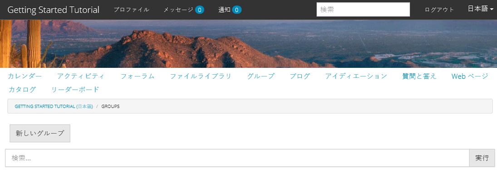
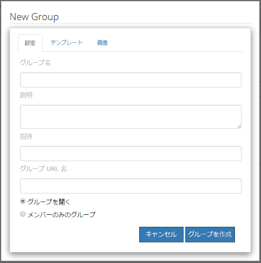
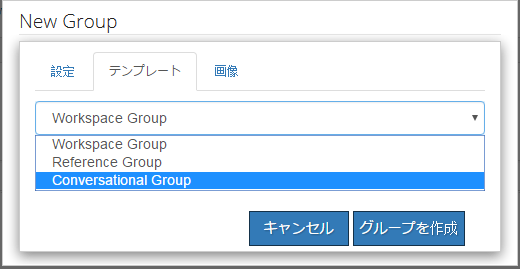
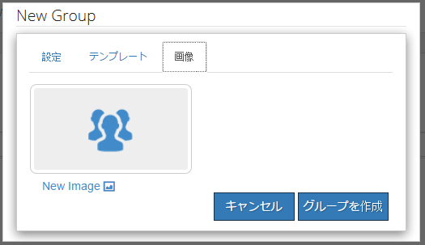
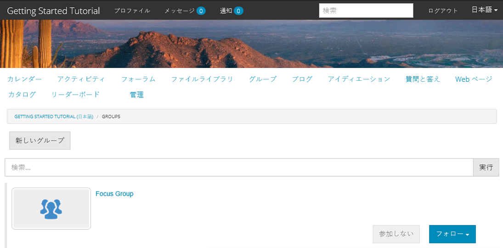
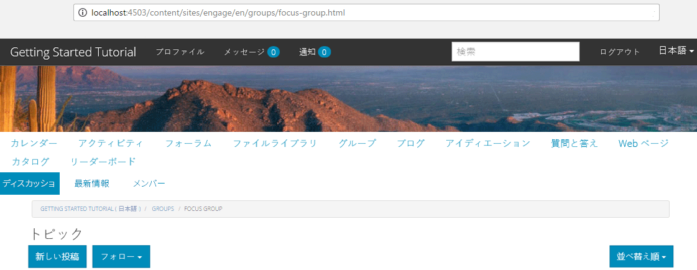

# コミュニティグループ {#community-groups}

コミュニティグループ機能を使用すると、パブリッシュ環境とオーサー環境から、許可されたユーザー（コミュニティメンバーと作成者）がコミュニティサイト内でサブコミュニティを動的に作成できます。

この機能は、 [グループ機能](functions.md#groups-function) が [コミュニティサイト](sites-console.md) 構造。

A [コミュニティグループテンプレート](tools-groups.md) コミュニティグループを動的に作成する際のコミュニティグループページのデザインを提供します。

機能がコミュニティサイトの構造またはコミュニティサイトテンプレートに追加されると、グループ機能に対して 1 つ以上のグループテンプレートが選択されます。 このグループテンプレートのリストは、コミュニティサイト内から新しいグループを動的に作成するメンバーまたは作成者に表示されます。

## 新しいグループの作成 {#creating-a-new-group}

新しいコミュニティグループを作成する機能は、グループ機能を含むコミュニティサイトの存在に依存します。例えば、 ` [Reference Site Template](sites.md)`.

以下の例では、 `Reference Site Template` 例えば、 [AEM Communitiesの概要](getting-started.md) チュートリアル

これは、 **[!UICONTROL グループ]** メニュー項目が選択されている：

を選択し、 **[!UICONTROL 新しいグループ]** アイコンをクリックすると、編集ダイアログが開きます。

以下 **[!UICONTROL 設定]** 「 」タブでは、グループの基本機能を使用できます。

* **[!UICONTROL グループ名]**
コミュニティサイトに表示するグループのタイトル。

* **[!UICONTROL 説明]**
コミュニティサイトに表示するグループの説明。

* **[!UICONTROL 招待]**
グループに参加するよう招待するメンバーのリスト。 先行入力検索では、招待するコミュニティメンバーの提案が表示されます。

* **[!UICONTROL グループ URL 名]**
URL の一部になるグループページの名前。

* **[!UICONTROL グループを開く]**
選択 
`Open Group` 匿名のサイト訪問者がコンテンツを閲覧できることを示し、選択を解除します。 `Member Only Group`.

* **[!UICONTROL メンバーのみのグループ]**
選択 
`Member Only Group` グループのメンバーのみがコンテンツを表示でき、選択を解除できることを示します `Open Group`.

以下 **[!UICONTROL テンプレート]** 「 」タブでは、コミュニティサイトの構造やコミュニティサイトテンプレートにグループ機能が含まれたときに指定されたコミュニティグループテンプレートのリストから選択できます。

以下 **[!UICONTROL 画像]** 「 」タブでは、コミュニティサイトのグループページにグループ用に表示する画像をアップロードできます。 デフォルトのスタイルシートでは、画像のサイズが 170 x 90 ピクセルに設定されます。

次を選択すると、 **[!UICONTROL グループを作成]** ボタンをクリックすると、グループのページは選択したテンプレートに基づいて作成され、ユーザーグループがメンバーシップ用に作成され、グループページが更新されて新しいサブコミュニティが表示されます。

例えば、画像のサムネールがアップロードされた新しいサブコミュニティ「Focus Group」があるグループページは、次のように表示されます（コミュニティグループ管理者としてサインインしたまま）。

の選択 `Focus Group` リンクは、ブラウザーでフォーカスグループページを開きます。このページは、選択したテンプレートに基づいて初期表示され、メインコミュニティサイトのメニューの下にサブメニューが含まれます。

## コミュニティグループメンバーリストコンポーネント {#community-group-member-list-component}

この `Community Group Member List` コンポーネントは、グループテンプレートの開発者が使用することを目的としています。

## 追加情報 {#additional-information}

詳しくは、 [コミュニティグループの基本事項](essentials-groups.md) 開発者向けのページ

コミュニティグループに関するその他の情報については、 [ユーザーとユーザーグループの管理](users.md).
