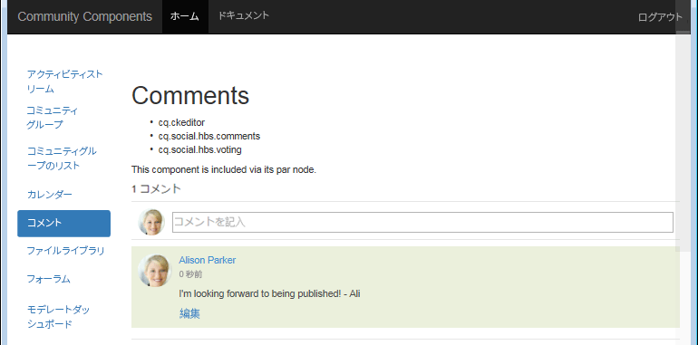
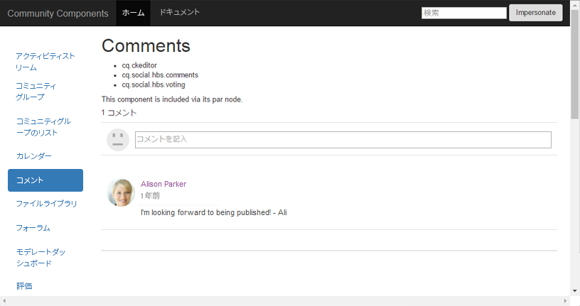

# MongoDB をデモ用に設定する方法 {#how-to-setup-mongodb-for-demo}

## はじめに {#introduction}

このチュートリアルでは、[MSRP](msrp.md)を&#x200B;*1つのオーサー*&#x200B;インスタンスと&#x200B;*1つのパブリッシュ*&#x200B;インスタンス用に設定する方法について説明します。

このセットアップを終えると、ユーザー生成コンテンツ（UGC）のフォワードまたはリバースレプリケーションをおこなわずに、オーサー環境とパブリッシュ環境の両方からコミュニティコンテンツにアクセスできるようになります。

この設定は、開発用やデモ用の環境など、*非実稼動*&#x200B;環境に適しています。

**実稼動環境では、以下のことが必要です。****

* レプリカセットでMongoDBを実行する
* SolrCloudを使用
* 複数のパブリッシャーインスタンスを含む

## MongoDB {#mongodb}

### MongoDB のインストール {#install-mongodb}

* [https://www.mongodb.org/](https://www.mongodb.org/)からMongoDBをダウンロードします

   * OSの選択：

      * Linux
      * Mac 10.8
      * Windows 7
   * バージョンの選択：

      * 少なくともバージョン2.6を使用する

* 基本設定

   * MongoDBのインストール手順に従います。
   * mongod向け設定

      * モンゴや共有を設定する必要がない
   * インストールされたMongoDBフォルダーは、&lt;mongo-install>と呼ばれます。
   * 定義されたデータディレクトリのパスは、&lt;mongo-dbpath>と呼ばれます。

* MongoDB は AEM と同じホストか、リモートで実行できます。

### MongoDB を起動します。{#start-mongodb}

* &lt;mongo-install>/bin/mongod --dbpath &lt;mongo-dbpath>

すると MongoDB サーバーが起動します。使用されるデフォルトポートは 27017 です。

* Mac では、起動引数「ulimit -n 2048」を使用して ulimit を増やします。

>[!NOTE]
>
>AEM *の後にMongoDBが起動された場合、***restart**&#x200B;すべての&#x200B;**AEM**&#x200B;インスタンスがMongoDBに正しく接続されるようにします。

### 実稼動デモのオプション：MongoDB レプリカセットのセットアップ {#demo-production-option-setup-mongodb-replica-set}

以下のコマンドは、ローカルホストに 3 つのノードを持つレプリカセットの設定例です。

* bin/mongod --port 27017 --dbpath data --replSet rs0&amp;
* bin/mongo

   * cfg = {&quot;_id&quot;:&quot;rs0&quot;,&quot;version&quot;:1,&quot;members&quot;:[{&quot;_id&quot;:0,&quot;host&quot;:&quot;127.0.0.1:27017&quot;}]}
   * rs.initiate(cfg)

* bin/mongod --port 27018 --dbpath data1 --replSet rs0&amp;
* bin/mongod --port 27019 --dbpath data2 --replSet rs0&amp;
* bin/mongo

   * rs.add(&quot;127.0.0.1:27018&quot;)
   * rs.add(&quot;127.0.0.1:27019&quot;)
   * rs.status()

## Solr {#solr}

### Solr のインストール {#install-solr}

* [Apache Lucene](https://archive.apache.org/dist/lucene/solr/)からSolrをダウンロードします。

   * 任意のOSに適している
   * バージョン4.10またはバージョン5を使用する
   * Solr には Java 1.7 以降が必要です。

* 基本設定

   * 「例」のSolr設定に従う
   * サービスは不要
   * インストールされたSolrフォルダーは、&lt;solr-install>と呼ばれます。

### AEM Communities のための Solr の設定 {#configure-solr-for-aem-communities}

MSRP のための Solr コレクションをデモ目的で設定するには、以下の 2 点を決定する必要があります（詳しくは、主なドキュメントへのリンクを選択してください）。

1. Solrをスタンドアロンで実行するか、[SolrCloudモード](msrp.md#solrcloudmode)で実行します。
1. [標準の](msrp.md#installingstandardmls)または[高度な](msrp.md#installingadvancedmls)多言語検索(MLS)をインストールします。

### スタンドアロンの Solr {#standalone-solr}

Solr を実行する方法は、バージョンとインストール方法によって異なる場合があります。詳しくは、公式ドキュメントである [Solr リファレンスガイド](https://archive.apache.org/dist/lucene/solr/ref-guide/)を参照してください。

ここでは簡単に、バージョン 4.10 を使用して、Solr をスタンドアロンモードで起動します。

* cd to &lt;solrinstall>/example
* java -jar start.jar

これにより、Solr HTTP サーバーが起動します。使用されるデフォルトポートは 8983 です。Solr コンソールを参照し、Solr コンソールを試しに開くことができます。

* デフォルトの Solr コンソール：[http://localhost:8983/solr/](http://localhost:8983/solr/)

>[!NOTE]
>
>Solr コンソールが使用できない場合は、&lt;solrinstall>/example/logs にあるログを確認します。SOLRが解決できない特定のホスト名にバインドしようとしているかどうかを確認します(例：&quot;user-macbook-pro&quot;)です。
その場合、このホスト名の新しいエントリ（127.0.0.1 user-macbook-pro など）を使用して etc/hosts ファイルを更新します。すると Solr が適切に起動します。

### SolrCloud {#solrcloud}

非常に基本的な（実稼動用ではない）solrCloud のセットアップを実行するには、以下のコマンドで Solr を起動します。

* java -Dbootstrap_confdir=./solr/collection1/conf -Dbootstrap_conf=true -DzkRun -jar start.jar

##  MongoDB を共通ストアとして指定{#identify-mongodb-as-common-store}

AEM オーサーインスタンスとパブリッシュインスタンスを起動します（必要な場合）。

AEM が MongoDB を起動する前に実行されている場合、AEM インスタンスを再起動する必要があります。

詳しくは、[MSRP - MongoDB 共通ストア](msrp.md)の手順に従ってください。

## テスト {#test}

MongoDB 共通ストアをテストおよび検証するために、パブリッシュインスタンスにコメントを投稿して、オーサーインスタンスでそのコメントを表示し、さらに MongoDB と Solr で UGC を表示します。

1. パブリッシュインスタンスで、[コミュニティコンポーネントガイド](http://localhost:4503/content/community-components/en/comments.html)ページを参照し、コメントコンポーネントを選択します。
1. ログインしてコメントを投稿する：
1. コメントテキスト入力ボックスにテキストを入力し、「**[!UICONTROL 投稿]**」をクリックします。

   

1. [オーサーインスタンス](http://localhost:4502/content/community-components/en/comments.html)でコメントを表示するだけです（通常はadmin / adminとしてサインインしています）。

   

   注意：オーサーインスタンスの *asipath* の下には JCR ノードがありますが、これらは SCF フレームワーク用のものです。実際のUGCはJCRには含まれず、MongoDBに含まれます。

1. mongodb **[!UICONTROL コミュニティ/コレクション/コンテンツ]**&#x200B;でUGCを表示します。

   

1. SolrでUGCを表示します。

   * Solrダッシュボードを参照します。[http://localhost:8983/solr/](http://localhost:8983/solr/)
   * ユーザー`core selector`が`collection1`を選択
   *  `Query`
   *  `Execute Query`

   

## トラブルシューティング {#troubleshooting}

### UGC が表示されない  {#no-ugc-appears}

1. MongoDBがインストールされ、正しく動作していることを確認します。

1. MSRPがデフォルトのプロバイダーに設定されていることを確認します。

   * すべてのオーサーインスタンスとパブリッシュAEMインスタンスで、[ストレージ設定コンソール](srp-config.md)に再度アクセスします。

   または、AEMリポジトリを確認します。

   * JCRで、 [/etc/socialconfig](http://localhost:4502/crx/de/index.jsp#/etc/socialconfig/)

      * [srpc](http://localhost:4502/crx/de/index.jsp#/etc/socialconfig/srpc)ノードが含まれない場合は、ストレージプロバイダーがJSRPであることを意味します。
      * srpcノードが存在し、ノード[defaultconfiguration](http://localhost:4502/crx/de/index.jsp#/etc/socialconfig/srpc/defaultconfiguration)が含まれる場合は、defaultconfigurationのプロパティでMSRPをデフォルトのプロバイダーとして定義する必要があります

1. MSRPを選択した後でAEMが再起動されたことを確認します。
