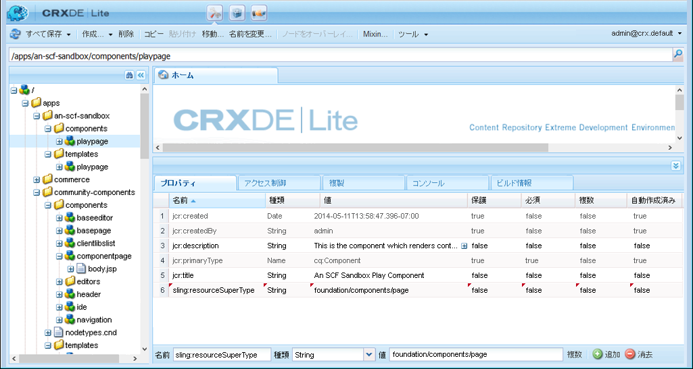
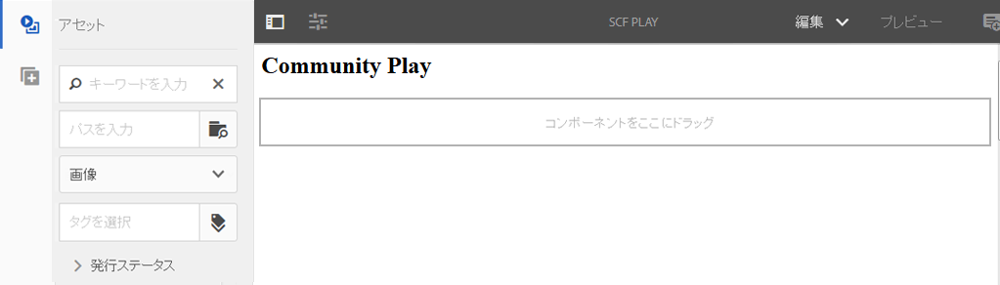
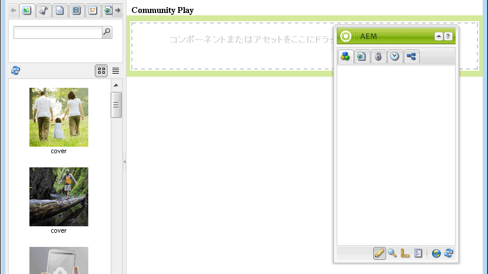

# サンドボックスアプリケーションの開発 {#develop-sandbox-application}

>[!CAUTION]
>
>AEM 6.4 の拡張サポートは終了し、このドキュメントは更新されなくなりました。 詳細は、 [技術サポート期間](https://helpx.adobe.com/jp/support/programs/eol-matrix.html). サポートされているバージョンを見つける [ここ](https://experienceleague.adobe.com/docs/?lang=ja).

この節では、テンプレートが [初期応用](initial-app.md) セクション、および [初期コンテンツ](initial-content.md) 「 」セクションでは、Communities コンポーネントを使用したオーサリングを有効にする機能を含む基盤スクリプトを使用して、アプリケーションを開発できます。 この節の最後に、Web サイトが機能するようになります。

## Foundation ページスクリプトの使用 {#using-foundation-page-scripts}

playpage テンプレートをレンダリングするコンポーネントが追加された際に作成されたデフォルトのスクリプトは、基盤ページの head.jsp とローカルの body.jsp を含むように変更されます。

### スーパーリソースタイプ {#super-resource-type}

最初の手順は、リソースのスーパータイププロパティを `/apps/an-scf-sandbox/components/playpage` ノードを継承し、スーパータイプのスクリプトとプロパティを継承します。

CRXDE Lite の使用:

<!--Resolve steps below-->

* 名前：`sling:resourceSuperType`
* タイプ：`String`
* 値：`foundation/components/page`

1. 緑をクリック **[!UICONTROL [+] 追加]**
1. クリック **[!UICONTROL すべて保存]**



### head および body スクリプト {#head-and-body-scripts}

1. In **CRXDE Lite** エクスプローラペイン：に移動します。 `/apps/an-scf-sandbox/components/playpage` をクリックし、ファイルをダブルクリックします。 `playpage.jsp` をクリックして、編集ウィンドウで開きます。

#### /apps/an-scf-sandbox/components/playpage/playpage.jsp {#apps-an-scf-sandbox-components-playpage-playpage-jsp}

```xml
<%--

  An SCF Sandbox Play Component component.

  This is the component which renders content for An SCF Sandbox page.

--%><%
%><%@include file="/libs/foundation/global.jsp"%><%
%><%@page session="false" %><%
%><%
 // TODO add your code here
%>
```

1. 開く/閉じるスクリプトタグに注意して、「 // TODO ...」を置き換えます。 頭部と体部のスクリプトを含む &lt;html>.

   スーパータイプが `foundation/components/page`を指定した場合、この同じフォルダーに定義されていないスクリプトは、 `/apps/foundation/components/page` フォルダー（存在する場合）、それ以外の場合は `/libs/foundation/components/page` フォルダー。

#### /apps/an-scf-sandbox/components/playpage/playpage.jsp {#apps-an-scf-sandbox-components-playpage-playpage-jsp-1}

```xml
<%--

    An SCF Sandbox Play Component component: playpage.jsp

  This is the component which renders content for An SCF Sandbox page.

--%><%
%><%@include file="/libs/foundation/global.jsp"%><%
%><%@page session="false" %>
<html>
  <cq:include script="head.jsp"/>
  <cq:include script="body.jsp"/>
</html>
```

1. 基盤スクリプト `head.jsp` オーバーレイする必要はなく、基盤スクリプトを使用する必要があります `body.jsp` が空である。

   オーサリング用に設定するには、オーバーレイ `body.jsp` ローカルスクリプトを使用し、本文に段落システム (parsys) を含めます。

   1. に移動します。 `/apps/an-scf-sandbox/components`
   1. を選択します。 `playpage`ノード
   1. 右クリックして選択 `Create > Create File...`

      * 名前： **body.jsp**
   1. クリック **[!UICONTROL すべて保存]**

   開く `/apps/an-scf-sandbox/components/playpage/body.jsp` 次のテキストに貼り付けます。

   ```xml
   <%--
   
       An SCF Sandbox Play Component component: body.jsp
   
     This is the component which renders content for An SCF Sandbox page.
   
   --%><%
   %><%@include file="/libs/foundation/global.jsp"%><%
   %><%@page session="false" %>
   <body>
       <h2>Community Play</h2>
       <cq:include path="par" resourceType="foundation/components/parsys" />
   </body>
   ```

1. クリック **[!UICONTROL すべて保存]**

**ページを編集モードでブラウザーに表示します。**

* 標準 UI: `http://localhost:4502/editor.html/content/an-scf-sandbox/en/play.html`

見出しだけが表示されるわけではありません **コミュニティプレイ**&#x200B;をクリックします。また、ページコンテンツを編集するための UI も使用します。

アセット/コンポーネントのサイドパネルは、サイドパネルを開くように切り替えたときに表示され、ウィンドウの幅がサイドコンテンツとページコンテンツの両方に十分に広い場合に表示されます。



* クラシック UI：`http://localhost:4502/cf#/content/an-scf-sandbox/en/play.html`

クラシック UI での再生ページの表示方法を次に示します ( コンテンツファインダー (cf) を含む )。



## コミュニティコンポーネント {#communities-components}

コミュニティコンポーネントのオーサリングを有効にするには、次の手順に従って開始します。

* [コミュニティコンポーネントへのアクセス](basics.md#accessing-communities-components)

このサンドボックスの目的では、次のものから始めます。 **コミュニティ** コンポーネント（チェックボックスをオンにして有効にします）:

* コメント
* フォーラム
* レーティング
* レビュー
* レビューの概要 (表示)
* 投票

さらに、 **[!UICONTROL 一般]** コンポーネント（例： ）

* 画像
* テーブル
* テキスト
* タイトル (基盤)

>[!NOTE]
>
>ページパーツに対して有効なコンポーネントは、 `components` プロパティ\
>`/etc/designs/an-scf-sandbox/jcr:content/playpage/par` ノード。

## ランディングページ {#landing-page}

多言語環境では、ルートページには、クライアントからの要求を解析して優先言語を決定するスクリプトが含まれます。

この簡単な例では、ルートページは英語のページにリダイレクトするように静的に設定されています。将来、英語は再生ページへのリンクを持つメインランディングページとして開発される可能性があります。

ブラウザー URL をルートページに変更します。 `http://localhost:4502/editor.html/content/an-scf-sandbox.html`

* ページ情報アイコンを選択します。
* 選択 **[!UICONTROL プロパティを開く]**
* 「詳細」タブで、

   * リダイレクトエントリの場合は、 **[!UICONTROL Web サイト/SCF Sandbox Site/SCF Sandbox]**
   * クリック **[!UICONTROL OK]**

* クリック **[!UICONTROL OK]**

サイトが公開されると、パブリッシュインスタンスでルートページを参照すると、英語ページにリダイレクトされます。

コミュニティの SCF コンポーネントを使用する前の最後の手順は、クライアントライブラリフォルダー (clientlibs) を追加することです。. **[⇒](add-clientlibs.md)**
