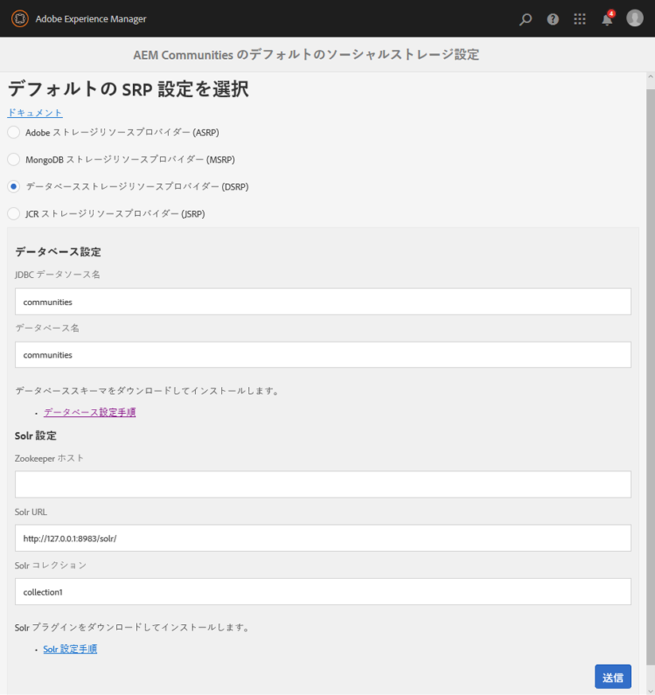

# DSRP - リレーショナルデータベースストレージリソースプロバイダー {#dsrp-relational-database-storage-resource-provider}

>[!CAUTION]
>
>AEM 6.4 の拡張サポートは終了し、このドキュメントは更新されなくなりました。 詳細は、 [技術サポート期間](https://helpx.adobe.com/jp/support/programs/eol-matrix.html). サポートされているバージョンを見つける [ここ](https://experienceleague.adobe.com/docs/?lang=ja).

## DSRP について {#about-dsrp}

リレーショナルデータベースを共通ストアとして使用するようにAEM Communitiesを設定すると、同期やレプリケーションを必要とせずに、すべてのオーサーインスタンスとパブリッシュインスタンスからユーザー生成コンテンツ (UGC) にアクセスできます。

関連トピック [SRP オプションの特性](working-with-srp.md#characteristics-of-srp-options) および [推奨されるトポロジ](topologies.md).

## 要件 {#requirements}

* [MySQL](#mysql-configuration)，リレーショナルデータベース
* [Apache Solr](#solr-configuration)、検索プラットフォーム

>[!NOTE]
>
>デフォルトのストレージ設定が conf path(`/conf/global/settings/community/srpc/defaultconfiguration`) の代わりに etc パス (`/etc/socialconfig/srpc/defaultconfiguration`) をクリックします。 以下をフォローするようお勧めします。 [移行手順](#migration-steps-0dt) defaultsrp を期待どおりに動作させる。

## リレーショナル・データベース構成 {#relational-database-configuration}

### MySQL 設定 {#mysql-configuration}

異なるデータベース（スキーマ）名と異なる接続（サーバー：ポート）を使用することで、1 つの MySQL インストールを同じ接続プール内のイネーブルメント機能と共通ストア (DSRP) の間で共有できます。

インストールと設定の詳細については、 [DSRP 用の MySQL 設定](dsrp-mysql.md).

### Solr 設定 {#solr-configuration}

異なるコレクションを使用することで、1 つの Solr インストールをノードストア (Oak) と共通ストア (SRP) の間で共有できます。

Oak コレクションと SRP コレクションの両方を集中的に使用する場合は、パフォーマンス上の理由から 2 つ目の Solr をインストールすることができます。

実稼動環境では、SolrCloud モードを使用すると、スタンドアロンモード（単一のローカル Solr セットアップ）よりもパフォーマンスが向上します。

インストールと設定の詳細については、 [SRP 用の Solr 設定](solr.md).

### DSRP を選択 {#select-dsrp}

この [ストレージ設定コンソール](srp-config.md) では、使用する SRP の実装を指定するデフォルトのストレージ設定を選択できます。

オーサー環境で、ストレージ設定コンソールにアクセスします。

* 管理者権限でログイン
* 次の **メインメニュー**

   * 選択 **[!UICONTROL ツール]** （左側のウィンドウから）
   * 選択 **[!UICONTROL コミュニティ]**
   * 選択 **[!UICONTROL ストレージ設定]**

      * 例えば、結果として得られる場所は次のようになります。 [http://localhost:4502/communities/admin/defaultsrp](http://localhost:4502/communities/admin/defaultsrp)
      >[!NOTE]
      >
      >デフォルトのストレージ設定が conf path(`/conf/global/settings/community/srpc/defaultconfiguration`) の代わりに etc パス (`/etc/socialconfig/srpc/defaultconfiguration`) をクリックします。 以下をフォローするようお勧めします。 [移行手順](#migration-steps-0dt) defaultsrp を期待どおりに動作させる。

      

* 選択 **[!UICONTROL データベースストレージリソースプロバイダー (DSRP)]**
* **データベース設定**

   * **[!UICONTROL JDBC データソース名]**

      MySQL 接続に指定する名前は、 [JDBC OSGi 設定](dsrp-mysql.md#configurejdbcconnections)

      *デフォルト*:コミュニティ

   * **[!UICONTROL データベース名]**

      でスキーマに指定された名前 [init_schema.sql](dsrp-mysql.md#obtain-the-sql-script) スクリプト

      *デフォルト*:コミュニティ

* **SolrConfiguration**

   * **[](https://cwiki.apache.org/confluence/display/solr/Using+ZooKeeper+to+Manage+Configuration+Files)Zookeeper ホスト**

      内部 ZooKeeper を使用して Solr を実行する場合は、この値を空白のままにします。 それ以外の場合は、で実行します [SolrCloud モード](solr.md#solrcloud-mode) 外部の ZooKeeper を使用して、この値を ZooKeeper の URI に設定します。例： *my.server.com:80*

      *デフォルト*: *&lt;blank>*

   * **[!UICONTROL Solr URL]**

      *デフォルト*:https://127.0.0.1:8983/solr/

      * **[!UICONTROL Solr コレクション]**

         *デフォルト*:collection1

* 「**[!UICONTROL 送信]**」を選択します。

### defaultsrp のダウンタイムなしの移行手順 {#migration-steps-0dt}

次の手順に従って、デフォルトの SRP ページが [http://localhost:4502/communities/admin/defaultsrp](http://localhost:4502/communities/admin/defaultsrp) は期待どおりに動作します。

1. パスの名前をに変更します。 `/etc/socialconfig` から `/etc/socialconfig_old`を使用する場合、システム設定は jsrp（デフォルト）にフォールバックされます。
1. defaultsrp ページに移動 [http://localhost:4502/communities/admin/defaultsrp](http://localhost:4502/communities/admin/defaultsrp)（jsrp が設定されている場所） 次をクリック： **[!UICONTROL 送信]** ボタンを使用して、新しいデフォルト設定ノードを `/conf/global/settings/community/srpc`.
1. 作成したデフォルト設定を削除 `/conf/global/settings/community/srpc/defaultconfiguration`.
1. 古い設定をコピーします。 `/etc/socialconfig_old/srpc/defaultconfiguration` 削除されたノード (`/conf/global/settings/community/srpc/defaultconfiguration`) をクリックします。
1. 古い etc ノードを削除します。 `/etc/socialconfig_old`.

## 設定の公開 {#publishing-the-configuration}

DSRP は、すべてのオーサーインスタンスとパブリッシュインスタンスで共通ストアとして指定する必要があります。

パブリッシュ環境で同じ設定を使用できるようにするには、次の手順を実行します。

作成者：

* メインメニューからに移動します。 **[!UICONTROL [ ツール ] > [ 操作 ] > [ レプリケーション ]]**
* ダブルクリック **[!UICONTROL ツリーをアクティベート]**
* **開始パス:**

   * 参照先 `/conf/global/settings/community/srpc/`

* 確認 `Only Modified` が選択されていません。
* 選択 **[!UICONTROL 有効化]**

## ユーザーデータの管理 {#managing-user-data}

以下に関する情報： *ユーザー*, *ユーザープロファイル* および *ユーザーグループ*&#x200B;パブリッシュ環境に入力されることが多い場合は、次にアクセスします。

* [ユーザー同期](sync.md)
* [ユーザーとユーザーグループの管理](users.md)

## DSRP 用 Solr のインデックス再作成 {#reindexing-solr-for-dsrp}

DSRP Solr のインデックスを再作成するには、 [MSRP のインデックス再作成](msrp.md#msrp-reindex-tool)ただし、DSRP のインデックスを再作成する場合は、代わりに次の URL を使用してください。 **/services/social/datastore/rdb/reindex**

例えば、DSRP のインデックスを再作成する curl コマンドは次のようになります。

```shell
curl -u admin:password -X POST -F path=/ https://host:port/services/social/datastore/rdb/reindex
```
