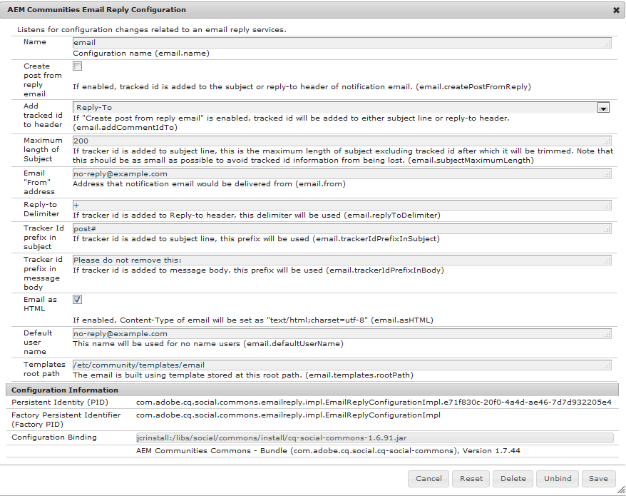

# 電子メールの設定  {#configuring-email}

AEM Communities では次の用途のために電子メールを使用します。

* [コミュニティの通知](notifications.md)
* [コミュニティの購読](subscriptions.md)

電子メール機能には SMTP サーバーと SMTP ユーザーの指定が必要なので、この機能はデフォルトでは使用できません。

>[!CAUTION]
>
>通知および購読用の電子メールは、[プライマリパブリッシャー](deploy-communities.md#primary-publisher)にのみ設定する必要があります。

## デフォルトの電子メールサービス設定 {#default-mail-service-configuration}

デフォルトの電子メールサービスは、通知と購読の両方に必要です。

* プライマリパブリッシャー
* 管理者権限でサインインしています
* [Webコンソール](../../help/sites-deploying/configuring-osgi.md)にアクセスします。

   * 例： [http://localhost:4503/system/console/configMgr](http://localhost:4503/system/console/configMgr)

* `Day CQ Mail Service`
* 編集アイコンを選択します。

これは、[電子メール通知の設定](../../help/sites-administering/notification.md)のドキュメントに基づいていますが、フィールド`"From" address`は必須ではなく&#x200B;**&#x200B;のままにしておく必要がある点が異なります。

例（入力されている値は例としてのみ使用されています）：

* **[!UICONTROL SMTPサーバーのホスト名]**: *（必須）* 使用するSMTPサーバー。

* **[!UICONTROL SMTPサーバーポート]** *（必須）* :SMTPサーバーポートは25以上にする必要があります。

* **[!UICONTROL SMTPユーザー]**: *（必須）* SMTPユーザー。

* **[!UICONTROL SMTPパスワード]**: *（必須）* SMTPユーザーのパスワード。

* **[!UICONTROL 「差出人」のアドレス]**:空のままにする
* **[!UICONTROL SMTP use SSL]**:オンにすると、はセキュリティで保護されたEメールを送信します。ポートが465に設定されているか、SMTPサーバーの必要に応じて設定されていることを確認します。
* **[!UICONTROL デバッグ電子メール]**:オンにすると、SMTPサーバー操作のログが有効になります。

## AEM Communities の電子メール設定 {#aem-communities-email-configuration}

[デフォルトのメールサービス](#default-mail-service-configuration)を設定すると、リリースに含まれる`AEM Communities Email Reply Configuration` OSGi設定の2つの既存のインスタンスが機能します。

電子メールによる返信を許可する際、購読用のインスタンスはさらに設定をおこなう必要があります。

1. ` [email](#configuration-for-notifications)` インスタンス

   （返信eメールをサポートしない通知用）

1. ` [subscriptions-email](#configuration-for-subscriptions)` インスタンス

   返信メールからの投稿の作成を完全に有効にする設定が必要です

Communities の電子メール設定インスタンスに接続するには：

* プライマリパブリッシャー
* 管理者権限でサインインしています
* [Webコンソール](../../help/sites-deploying/configuring-osgi.md)にアクセスします。

   * 例： [http://localhost:4503/system/console/configMgr](http://localhost:4503/system/console/configMgr)

* `AEM Communities Email Reply Configuration`を探します

### 通知用の設定 {#configuration-for-notifications}

名前電子メールを含む`AEM Communities Email Reply Configuration` OSGi設定のインスタンスは、通知機能用です。 この機能には、電子メールの返信は含まれません。

この設定は変更しないでください。

* `AEM Communities Email Reply Configuration`
* 編集アイコンを選択します。
* **名前**&#x200B;が`email`であることを確認します。

* **返信メールからの投稿を作成**&#x200B;が`unchecked`であることを確認します

### 購読用の設定 {#configuration-for-subscriptions}

コミュニティ購読の場合、メンバーが電子メールに返信することによりコンテンツを投稿する機能を有効にしたり無効にしたりできます。

* `AEM Communities Email Reply Configuration`
* 編集アイコンを選択します。
* **名前**&#x200B;が`subscriptions-email`であることを確認します。

* **[!UICONTROL 名前]** : *（必須）* `subscriptions-email`を参照してください。編集しない。

* **[!UICONTROL Create post from reply email]**：オンにすると、購読電子メールの受信者は応答を送信することによりコンテンツを投稿できます。初期設定はオンです。
* **[!UICONTROL Add tracked id to header]**：デフォルトは `Reply-To` です。

* **[!UICONTROL 件名の最大長]**:トラッカーIDが件名行に追加される場合、これは件名の最大長です（トラッキングされるIDを除く）。この長さを超えると、件名はトリミングされます。トラッカー ID 情報が失われないように、可能な限り小さい値を設定する必要があります。初期設定は 200 です。
* **[!UICONTROL 電子メール「差出人」のアドレス]**: *（必須）* 通知電子メールの配信元アドレス。[デフォルトのメールサービス](#configuredefaultmailservice)に対して指定されたのと同じ&#x200B;**SMTPユーザー**&#x200B;である可能性があります。 デフォルトは `no-reply@example.com` です。

* **[!UICONTROL Reply-to-Delimiter]**:トラッカーIDが返信先ヘッダーに追加された場合は、この区切り文字が使用されます。初期設定は`+`（プラス記号）です。

* **[!UICONTROL 件名のトラッカーIDプレフィックス]**:トラッカーIDが件名行に追加される場合は、このプレフィックスが使用されます。デフォルトは `post#` です。

* **[!UICONTROL メッセージ本文のトラッカーIDプレフィックス]**:トラッカーIDがメッセージ本文に追加される場合は、このプレフィックスが使用されます。デフォルトは `Please do not remove this:` です。

* **[!UICONTROL HTMLで電子メールを送信]**:オンにすると、Eメールのコンテンツタイプがに設定されま `"text/html;charset=utf-8"`す。初期設定はオンです。

* **[!UICONTROL デフォルトのユーザー名]**:この名前は、名前を持つユーザーには使用されません。デフォルトは `no-reply@example.com` です。

* **[!UICONTROL テンプレートのルートパス]**:電子メールは、このルートパスに保存されたテンプレートを使用して作成されます。デフォルトは `/etc/community/templates/subscriptions-email` です。

## ポーリングインポーターの設定 {#configure-polling-importer}

電子メールがリポジトリに取り込まれるように、ポーリングインポーターを設定し、そのプロパティをリポジトリで手動で設定する必要があります。

### 新しいポーリングインポーターの追加  {#add-new-polling-importer}

* プライマリパブリッシャー
* 管理者権限でサインインしています
* ポーリングインポーターコンソールを参照します。
例： [http://localhost:4503/etc/importers/polling.html](http://localhost:4503/etc/importers/polling.html)
* **[!UICONTROL 追加]**&#x200B;を選択します。

* **[!UICONTROL 型]**: *（必須）* プルダウンして選択します。  `POP3 (over SSL).`

* **[!UICONTROL URL]**：*（必須）*&#x200B;アウトバウンド電子メールサーバー。例：`pop.gmail.com:995/INBOX?username=community-emailgmail.com&password=****`

* **[!UICONTROL パスに読み込み]**(&amp;A): *（必須）* を `/content/usergenerated/mailFolder/postEmails`
選択し、 
`postEmails`フォルダーに移動し、「 **OK」を選択します。**

* **[!UICONTROL 更新間隔（秒）]**: *（オプション）* デフォルトのメールサービス用に設定されたメールサーバーには、更新間隔の値に関する要件がある場合があります。例えば、Gmail では間隔を `300` にする必要がある場合があります。

* **[!UICONTROL ログイン]**: *（オプション）*

* **[!UICONTROL パスワード]**：*（オプション）*

* 「**[!UICONTROL OK]**」を選択します。

### 新しいポーリングインポーターのプロトコルの調整  {#adjust-protocol-for-new-polling-importer}

新しいポーリング設定が保存されたら、購読電子メールインポーターのプロパティをさらに変更し、プロトコルを `POP3` から `emailreply` に変更する必要があります

[CRXDE Lite](../../help/sites-developing/developing-with-crxde-lite.md) を使用して、次の手順を実行します。

* プライマリパブリッシャー
* 管理者権限でサインインしています
* [https://&lt;server>:&lt;port>/crx/de/index.jsp#/etc/importers/polling](http://localhost:4503/crx/de/index.jsp#/etc/importers/polling)を参照します。
* 新しく作成した設定を選択します。
* 次のプロパティを変更します

   * **feedType**:置き換 `pop3s` える  **`emailreply`**
   * **ソース**:ソースのプロトコルをに置き換 `pop3s://` える  **`emailreply://`**

赤い三角は、変更したプロパティを示します。変更内容を保存してください。

* 「**[!UICONTROL すべて保存]**」を選択します。
