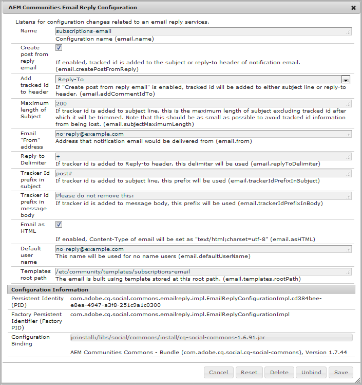

# メールの設定 {#configuring-email}

AEM Communitiesは e メールを

* [コミュニティの通知](notifications.md)
* [コミュニティの購読](subscriptions.md)

デフォルトでは、電子メール機能は SMTP サーバーと SMTP ユーザーの指定が必要なので、機能しません。

>[!CAUTION]
>
>通知および購読用の電子メールは、 [主発行者](deploy-communities.md#primary-publisher).

## デフォルトのメールサービス設定 {#default-mail-service-configuration}

デフォルトのメールサービスは、通知と購読の両方に必要です。

* プライマリパブリッシャー
* 管理者権限でサインインしています
* 次にアクセス： [Web コンソール](../../help/sites-deploying/configuring-osgi.md)

   * 例： [http://localhost:4503/system/console/configMgr](http://localhost:4503/system/console/configMgr)

* を `Day CQ Mail Service`
* 編集アイコンを選択します。

これは、 [電子メール通知の設定](../../help/sites-administering/notification.md)が、フィールドに違いがある場合は `"From" address` が *not* 必須およびは空のままにする必要があります。

次に例を示します（例として値を入力）。

* **[!UICONTROL SMTP サーバーのホスト名]**: *（必須）* 使用する SMTP サーバーです。

* **[!UICONTROL SMTP サーバーポート]** *（必須）* SMTP サーバーポートは 25 以上にする必要があります。

* **[!UICONTROL SMTP ユーザー]**: *（必須）* SMTP ユーザーです。

* **[!UICONTROL SMTP パスワード]**: *（必須）* SMTP ユーザーのパスワードです。

* **[!UICONTROL 「送信元」アドレス]**:空のままにする
* **[!UICONTROL SMTP use SSL]**:オンにすると、セキュアな E メールが送信されます。 ポートが 465 または SMTP サーバーの必要に応じて設定されていることを確認します。
* **[!UICONTROL E メールをデバッグ]**:オンにすると、SMTP サーバーの操作のログが有効になります。

## AEM Communities E メール設定 {#aem-communities-email-configuration}

一度 [デフォルトのメールサービス](#default-mail-service-configuration) が設定されている場合、 `AEM Communities Email Reply Configuration` リリースに含まれる OSGi 設定が機能します。

E メールによる返信を許可する場合は、さらに設定する必要があるのは、購読用のインスタンスだけです。

1. ` [email](#configuration-for-notifications)` インスタンス

   （返信メールをサポートしない通知用）

1. ` [subscriptions-email](#configuration-for-subscriptions)` インスタンス

   返信メールからの投稿の作成を完全に有効にする設定が必要です

コミュニティの電子メール設定インスタンスにアクセスするには：

* プライマリパブリッシャー
* 管理者権限でサインインしています
* 次にアクセス： [Web コンソール](../../help/sites-deploying/configuring-osgi.md)

   * 例： [http://localhost:4503/system/console/configMgr](http://localhost:4503/system/console/configMgr)

* 場所 `AEM Communities Email Reply Configuration`

### 通知の設定 {#configuration-for-notifications}

のインスタンス `AEM Communities Email Reply Configuration` 名前電子メールを使用する OSGi 設定は、通知機能用です。 この機能には、電子メールの返信は含まれません。

この設定は変更しないでください。

* を `AEM Communities Email Reply Configuration`
* 編集アイコンを選択します。
* を確認します。 **名前** が `email`

* 検証 **返信メールから投稿を作成** が `unchecked`

### 購読の設定 {#configuration-for-subscriptions}

コミュニティの購読の場合は、メンバーが E メールに返信してコンテンツを投稿する機能を有効または無効にできます。

* を `AEM Communities Email Reply Configuration`
* 編集アイコンを選択します。
* を確認します。 **名前** が `subscriptions-email`

* **[!UICONTROL 名前]** : *（必須）* `subscriptions-email`. 編集しないでください。

* **[!UICONTROL 返信メールから投稿を作成]**:オンにすると、購読 E メールの受信者は返信を送信してコンテンツを投稿できます。 初期設定はオンです。
* **[!UICONTROL ヘッダーにトラッキング ID を追加]**:デフォルトはです。 `Reply-To`.

* **[!UICONTROL 件名の最大長]**:トラッカー ID が件名行に追加される場合、これは件名の最大長です（トラッキングされる ID を除く）。この長さを超えると、件名はトリミングされます。 追跡対象の ID 情報が失われるのを防ぐために、この値はできる限り小さくする必要があります。 初期設定は 200 です。
* **[!UICONTROL メール「送信者」アドレス]**: *（必須）* 通知 E メールの配信元のアドレス。 おそらく同じ **SMTP ユーザー** 次に対して指定： [デフォルトのメールサービス](#configuredefaultmailservice). デフォルトは `no-reply@example.com` です。

* **[!UICONTROL Reply-to-Delimiter]**:トラッカー ID が返信先ヘッダーに追加される場合は、この区切り文字が使用されます。 デフォルトはです。 `+` （プラス記号）

* **[!UICONTROL 件名のトラッカー ID プレフィックス]**:トラッカー ID が件名行に追加される場合は、このプレフィックスが使用されます。 デフォルトは `post#` です。

* **[!UICONTROL メッセージ本文のトラッカー ID プレフィックス]**:トラッカー ID がメッセージ本文に追加される場合は、このプレフィックスが使用されます。 デフォルトは `Please do not remove this:` です。

* **[!UICONTROL メールをHTML]**:オンにすると、Content-Type の E メールが `"text/html;charset=utf-8"`. 初期設定はオンです。

* **[!UICONTROL デフォルトのユーザー名]**:この名前は、名前を持たないユーザーに対して使用されます。 デフォルトは `no-reply@example.com` です。

* **[!UICONTROL テンプレートのルートパス]**:電子メールは、このルートパスに保存されたテンプレートを使用して作成されます。 デフォルトは `/etc/community/templates/subscriptions-email` です。

## Polling Importer の設定 {#configure-polling-importer}

電子メールをリポジトリに取り込むには、ポーリングインポーターを設定し、そのプロパティを手動でリポジトリに設定する必要があります。

### 新しいポーリングインポーターを追加 {#add-new-polling-importer}

* プライマリパブリッシャー
* 管理者権限でサインインしています
* ポーリングインポーターコンソールを参照します。例： [http://localhost:4503/etc/importers/polling.html](http://localhost:4503/etc/importers/polling.html)
* 選択 **[!UICONTROL 追加]**

* **[!UICONTROL タイプ]**: *（必須）* プルダウンして選択 `POP3 (over SSL).`

* **[!UICONTROL URL]**: *（必須）* 送信メールサーバー。 例：`pop.gmail.com:995/INBOX?username=community-emailgmail.com&password=****`

* **[!UICONTROL 読み込み先パス]**&amp;ast;: *（必須）* に設定 `/content/usergenerated/mailFolder/postEmails`
参照して 
`postEmails`フォルダーと選択 **OK**

* **[!UICONTROL 更新間隔（秒）]**: *（オプション）* デフォルトのメールサービス用に設定されたメールサーバーには、更新間隔の値に関する要件がある場合があります。 例えば、Gmail では `300`.

* **[!UICONTROL ログイン]**: *（オプション）*

* **[!UICONTROL パスワード]**: *（オプション）*

* 選択 **[!UICONTROL OK]**

### 新しいポーリングインポーターのプロトコルを調整 {#adjust-protocol-for-new-polling-importer}

新しいポーリング設定を保存したら、プロトコルを `POP3` から `emailreply`

使用 [CRXDE Lite](../../help/sites-developing/developing-with-crxde-lite.md):

* プライマリパブリッシャー
* 管理者権限でサインインしています
* 参照先 [https://&lt;server>:&lt;port>/crx/de/index.jsp](http://localhost:4503/crx/de/index.jsp#/etc/importers/polling)
* 新しく作成した設定を選択
* 次のプロパティを変更します。

   * **feedType**:置換 `pop3s` と **`emailreply`**
   * **ソース**:ソースのプロトコルを置き換える `pop3s://` と **`emailreply://`**

赤い三角形は、修正されたプロパティを示します。 必ず次の変更を保存してください。

* 選択 **[!UICONTROL すべて保存]**
