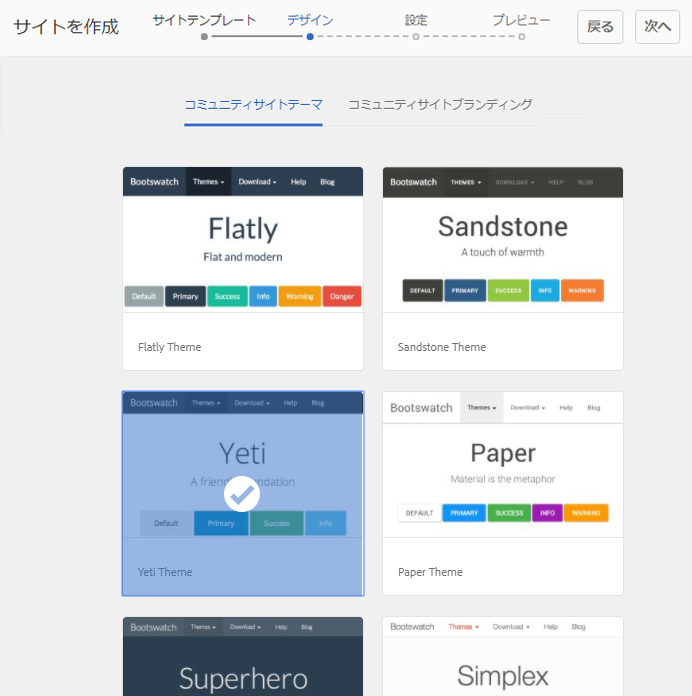

# イネーブルメントのための新しいコミュニティサイトの作成 {#author-a-new-community-site-for-enablement}

## コミュニティサイトを作成 {#create-community-site}

[コミュニティサイトの作成](sites-console.md) は、コミュニティサイトの作成手順をガイドするウィザードを使用します。 を `Next`手順または `Back`を前の手順に戻してから、最後の手順でサイトをコミットします。

新しいコミュニティサイトの作成を開始するには：

[オーサーインスタンス](http://localhost:4502/)を使用します。

* 管理者権限でログイン
* に移動します。 **[!UICONTROL コミュニティ/サイト]**

* 「**[!UICONTROL 作成]**」を選択します。

### 手順 1：サイトテンプレート {#step-site-template}

「**サイトテンプレート**」の手順では、URL のタイトル、説明、名前を入力し、コミュニティサイトテンプレートを選択します。次に例を示します。

* **コミュニティサイトのタイトル**: `Enablement Tutorial`

* **コミュニティサイトの説明**: `A site for enabling the community to learn.`

* **コミュニティサイトのルート**:（デフォルトのルートの場合は空白のままにします） `/content/sites`)

* **クラウド設定**：（クラウド設定が指定されていない場合は空欄のままにする）指定されたクラウド設定へのパスを入力します。
* **コミュニティサイトの基本言語**:（単一言語の場合は、手を付けないでください）。英語 ) プルダウンメニューを使用して 1 つを選択します *以上* 使用可能な言語 ( ドイツ語、イタリア語、フランス語、日本語、スペイン語、ポルトガル語（ブラジル）、中国語（繁体字）、中国語（簡体字）)) のベース言語。 追加された言語ごとに 1 つのコミュニティサイトが作成され、 [多言語サイトのコンテンツの翻訳](../../help/sites-administering/translation.md). 各サイトのルートページには、選択したいずれかの言語の言語コード（例えば、英語では「en」、フランス語では「fr」）で名付けられた子ページが含まれます。

* **[!UICONTROL コミュニティサイト名]**: `enable`

   * 初期 URL は、コミュニティサイト名の下に表示されます。
   * 有効な URL に、ベース言語コード + 「.html」を追加します。

      *例：*, http://localhost:4502/content/sites/ `enable/en.html`

* **[!UICONTROL 参照サイトテンプレート]**:引っ張って選ぶ `Reference Structured Learning Site Template`

「**[!UICONTROL 次へ]**」を選択します。

### 手順 2：デザイン {#step-design}

「デザイン」の手順では、テーマとブランディングバナーを選択する 2 つのセクションが表示されます。

#### コミュニティサイトテーマ {#community-site-theme}

目的のスタイルを選択し、テンプレートに適用します。選択すると、テーマにチェックマークが付きます。

#### コミュニティサイトブランディング {#community-site-branding}

（オプション）サイトページに表示するバナー画像をアップロードします。バナーはブラウザーの左端およびコミュニティサイトヘッダーとメニュー（ナビゲーションリンク）の間に固定されます。バナーの高さは 120 ピクセルに切り詰められます。バナーがブラウザーの幅や 120 ピクセルの高さに合わせてリサイズされることはありません。

 

「**[!UICONTROL 次へ]**」を選択します。

### 手順 3：設定 {#step-settings}

設定ステップで、選択する前に `Next`には、ユーザー管理、タグ付け、役割、モデレート、分析、翻訳およびイネーブルメントに関する設定にアクセスできる 7 つの節があることに注意してください。

#### ユーザー管理 {#user-management}

を推奨します。 [実施可能コミュニティ](overview.md#enablement-community) プライベートにして。

コミュニティサイトを非公開にするとは、匿名のサイト訪問者に対してアクセスを拒否し、自己登録やソーシャルログインを使用禁止にすることです。

ほとんどのチェックボックスがオフになっていることを確認します。 [ユーザー管理](sites-console.md#user-management):

* サイト訪問者の自己登録を許可しない
* 匿名のサイト訪問者に対し、サイトの閲覧を許可しない
* コミュニティメンバー間でのメッセージングを許可するかどうか（オプション）
* facebookでのログインを許可しない
* twitterでのログインを許可しない

#### タグ付け {#tagging}

コミュニティコンテンツに適用できるタグを制御するには、以前に [タグ付けコンソール](../../help/sites-administering/tags.md#tagging-console) ( [チュートリアル名前空間](enablement-setup.md#create-tutorial-tags)) をクリックします。

また、コミュニティサイトに対してタグ名前空間を選択すると、カタログとイネーブルメントリソースを定義するときに表示される選択肢が制限されます。詳しくは、 [イネーブルメントリソースのタグ付け](tag-resources.md) 重要な情報を参照してください。

名前空間は先行入力検索で簡単に検索できます。例：

* &#39;tut&#39;と入力します
*  `Tutorial`

### 役割 {#roles}

[コミュニティメンバーの役割](users.md) は、「役割」セクションの設定を通じて割り当てられます。

コミュニティメンバー（またはメンバーのグループ）がコミュニティマネージャーとしてサイトを体験するには、先行入力検索を使用して、ドロップダウンのオプションからメンバーまたはグループ名を選択します。

例：

* 「q」と入力します。
* 選択 [クインハーパー](enablement-setup.md#publishcreateenablementmembers)

>[!NOTE]
>
>[トンネルサービス](deploy-communities.md#tunnel-service-on-author) パブリッシュ環境にのみ存在するメンバーとグループを選択できます。

#### モデレート {#moderation}

ユーザー生成コンテンツ（UGC）を[モデレート](sites-console.md#moderation)する場合は、デフォルトのグローバル設定を受け入れます。

#### ANALYTICS {#analytics}

プルダウンメニューから、このコミュニティサイト用に設定した Analytics クラウドサービスフレームワークを選択します。

スクリーンショットに表示されている選択肢「`Communities`」は、[設定ドキュメント](analytics.md#aem-analytics-framework-configuration)のフレームワークの例です。

#### 翻訳 {#translation}

[翻訳設定](sites-console.md#translation)では、UGC の翻訳を許可するかどうかと、どの言語に翻訳するかを指定します。

* チェック **[!UICONTROL 機械翻訳を許可]**
* デフォルト設定を使用

#### イネーブルメント {#enablement}

1 つのイネーブルメントコミュニティに対し、1 人以上のコミュニティ実施可能マネージャーを指定する必要があります。

* **[!UICONTROL 実施可能マネージャー]**
（必須） 
`Community Enablement Managers` このコミュニティサイトを管理するために、グループを選択できます。

   * 「s」と入力します。
   *  `Sirius Nilson`

* **[!UICONTROL Marketing Cloud組織 ID]**
（オプション） Adobe Analyticsアカウントの ID で、 [ビデオハートビート分析](analytics.md#video-heartbeat-analytics) （イネーブルメントレポート内）

「**[!UICONTROL 次へ]**」を選択します。

### 手順 4：コミュニティサイトの作成 {#step-create-community-site}

「**[!UICONTROL 作成]**」を選択します。

プロセスが完了すると、新しいサイトのフォルダーがコミュニティサイトコンソールに表示されます。

### 新しいコミュニティサイトの公開 {#publish-the-new-community-site}

作成したサイトは、コミュニティ - サイトコンソールで管理する必要があります。このコンソールは、新しいサイトを作成するコンソールと同じものです。

コミュニティサイトのフォルダーを選択した後、サイトアイコンにマウスカーソルを合わせると、4 つのアクションアイコンが表示されます。

省略記号アイコン（その他のアクションアイコン）を選択すると、「サイトを書き出し」および「サイトを削除」オプションが表示されます。

各アイコンの機能は次のとおりです（左から右の順に説明）。

* **サイトを開く**
鉛筆アイコンを選択してコミュニティサイトをオーサリング編集モードで開き、ページコンポーネントを追加または設定します。

* **サイトを編集**
プロパティアイコンを選択してコミュニティサイトを開き、タイトルやテーマの変更などのプロパティを変更します。

* **サイトを公開**
コミュニティサイトを公開する場合は、世界アイコンを選択します（デフォルトでは localhost:4503 に公開）。

* **サイトを書き出し**
書き出しアイコンを選択して、コミュニティサイトのパッケージを作成し、そのパッケージを次の場所に保存します。 [パッケージマネージャー](../../help/sites-administering/package-manager.md) とダウンロードされました。

   UGC はサイトパッケージに含まれていません。

* **サイトを削除**&#x200B;コミュニティサイトを削除するには、サイトを削除アイコンを選択します。このアイコンは、コミュニティサイトコンソール内でサイトにマウスポインターを置くと表示されます。サイトを削除すると、UGC やユーザーグループ、アセット、データベースレコードなど、そのサイトに関連付けられているアイテムがすべて削除されます。

#### サイトの公開 {#select-publish}

地球のアイコンを選択して、コミュニティサイトを公開します。

サイトが公開されると、次のようなメッセージが表示されます。

## コミュニティのユーザーとユーザーグループ {#community-users-user-groups}

### 新しいコミュニティユーザーグループの確認 {#notice-new-community-user-groups}

新しいコミュニティサイトとともに、新しいユーザーグループが作成されます。各グループには、様々な管理機能に応じて適切な権限が設定されています。詳しくは、 [コミュニティサイトのユーザーグループ](users.md#usergroupsforcommunitysites).

この新しいコミュニティサイトでは、手順 1 でサイト名「enable」を指定すると、パブリッシュ環境に存在する新しいユーザーグループが [コミュニティメンバーとグループコンソール](members.md#groups-console):

### 「Community Enable Members」グループへのメンバー割り当て {#assign-members-to-community-enable-members-group}

オーサー環境では、トンネルサービスを有効にして、 [初期設定時に作成されたユーザー](enablement-setup.md#publishcreateenablementmembers) 新しく作成したコミュニティサイトのコミュニティメンバーグループに追加します。

コミュニティグループコンソールでは、メンバーを個別に追加したり、グループのメンバーシップを使用して追加したりできます。

この例では、グループ `Community Ski Class` はグループのメンバーとして追加されます `Community Enable Members` 同様に、メンバー `Quinn Harper`.

* に移動します。 **[!UICONTROL コミュニティ/グループ]** コンソール
* 選択 **[!UICONTROL コミュニティを有効にするメンバー]** グループ
* 入力 `ski` に **[!UICONTROL メンバーをグループに追加]** 検索ボックス
* 選択 **[!UICONTROL コミュニティスキークラス]** （学習者のグループ）
* 入力 `quinn` 検索ボックスに
* 選択 **[!UICONTROL クインハーパー]** （イネーブルメントリソースの連絡先）

* 選択 **[!UICONTROL 保存]**

## パブリッシュ側の設定 {#configurations-on-publish}

### http://localhost:4503/content/sites/enable/en.html {#http-localhost-content-sites-enable-en-html}

### 認証エラーの設定 {#configure-for-authentication-error}

サイトが設定され、パブリッシュにプッシュされると、 [ログインマッピングの設定](sites-console.md#configure-for-authentication-error) ( `Adobe Granite Login Selector Authentication Handler`) をパブリッシュインスタンスでクリックします。 ログイン資格情報が正しく入力されていない場合、認証エラーによってコミュニティサイトのログインページが再度表示され、エラーメッセージが表示されるという利点があります。

を追加します。 `Login Page Mapping` as

* /content/sites/enable/en/signin:/content/sites/enable/en

### （オプション）デフォルトのホームページの変更 {#optional-change-the-default-home-page}

公開サイトをデモ目的で操作するときは、デフォルトのホームページを新しいサイトに変更すると便利です。

これをおこなうには、[CRX|DE](http://localhost:4503/crx/de) Lite を使用して、パブリッシュ側で[リソースマッピング](../../help/sites-deploying/resource-mapping.md)テーブルを編集します。

開始するには、次のようにします。

1. 公開時に、CRXDE にアクセスし、管理者権限でログインします。

   * 例えば、 [http://localhost:4503/crx/de](http://localhost:4503/crx/de) にログインし、 `admin/admin`

1. プロジェクトブラウザで、を展開します。 `/etc/map`
1. を選択します。 `http` ノード

   * 選択 **[!UICONTROL ノードを作成]**

      * **名前** localhost.4503

         ( 実行 *not* use `:`)

      * **タイプ** [sling:Mapping](https://sling.apache.org/documentation/the-sling-engine/mappings-for-resource-resolution.html)

1. 新しく作成された `localhost.4503` 選択されたノード

   * プロパティの追加

      * **名前**：sling:match
      * **タイプ**：String
      * **値**：localhost.4503/\$

         （「$」文字で終わる必要があります）
   * プロパティの追加

      * **名前**：sling:internalRedirect
      * **タイプ**：String
      * **値**：/content/sites/enable/en.html

1. 「**[!UICONTROL すべて保存]**」を選択します。
1. （オプション）閲覧履歴を削除します
1. http://localhost:4503/を参照します。

   * http://localhost:4503/content/sites/enable/en.htmlに到着します。

>[!NOTE]
>
>無効にするには、 `sling:match` プロパティ値に「x」を付ける — `xlocalhost.4503/$`  — および **[!UICONTROL すべて保存]**.

#### トラブルシューティング：マップ保存エラー {#troubleshooting-error-saving-map}

変更を保存できない場合は、ノード名が `localhost.4503`（区切り文字が「ドット」）となっているかを確認してください。`localhost:4503` は有効な名前空間のプレフィックスではないので、`localhost`（区切り文字が「コロン」）という表記は正しくありません。

#### トラブルシューティング：リダイレクト失敗 {#troubleshooting-fail-to-redirect}

&#39;**$**&#39; （正規表現の末尾） `sling:match`文字列が非常に重要なので、正確に `http://localhost:4503/` がマッピングされている場合、リダイレクト値の前に、URL の server:port の後に存在する可能性があるすべてのパスが追加されます。 したがって、AEMがログインページにリダイレクトしようとすると、失敗します。

## コミュニティサイトの変更 {#modifying-the-community-site}

サイトを最初に作成した後、作成者は[サイトを開くアイコン](sites-console.md#authoring-site-content)を使用して、標準的な AEM のオーサリングアクティビティを実行できます。

また、管理者は[サイトを編集アイコン](sites-console.md#modifying-site-properties)を使用して、タイトルなどのサイトプロパティを変更できます。

変更後は、必ず&#x200B;**保存**&#x200B;して再&#x200B;**公開**&#x200B;してください。

>[!NOTE]
>
>AEM に馴染みがない場合は、[基本操作](../../help/sites-authoring/basic-handling.md)に関するドキュメントおよび[ページのオーサリングのクイックガイド](../../help/sites-authoring/qg-page-authoring.md)を参照してください。

### カタログの追加 {#add-a-catalog}

このコミュニティサイトに選択されたコミュニティサイトテンプレートには、カタログ機能が含まれています。

含まれていない場合は、カタログ機能を簡単に追加できます。これにより、イネーブルメントリソースや学習パスに割り当てられていないコミュニティの他のメンバーが、カタログからイネーブルメントリソースを選択できるようになります。

サイト構造にカタログ機能が既に含まれている場合、タイトルが変わることがあります。

サイトの構造を変更するには、 **[!UICONTROL コミュニティ、サイト]** コンソールで、 `enable` フォルダを選択し、 **サイトを編集** アイコンをクリックして、 `Enablement Tutorial`.

構造パネルを選択し、カタログを追加するか、既存のカタログを変更します。

* **タイトル**: `Ski Catalog`

* **URL**: `catalog`

* **すべての名前空間を選択**：デフォルトのままにします。
* 選択 **[!UICONTROL 保存]**

位置アイコンを使用し、カタログ機能を Assignments の後の 2 番目の位置に移動します。

右上隅の「**[!UICONTROL 保存]**」を選択してコミュニティサイトに対する変更を保存します。

その後、サイトを再び&#x200B;**公開**&#x200B;します。
