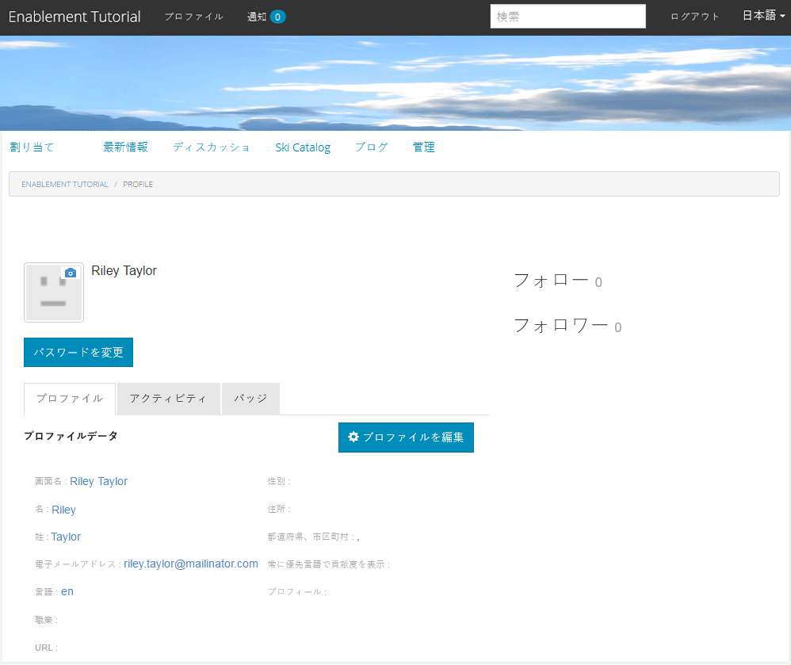
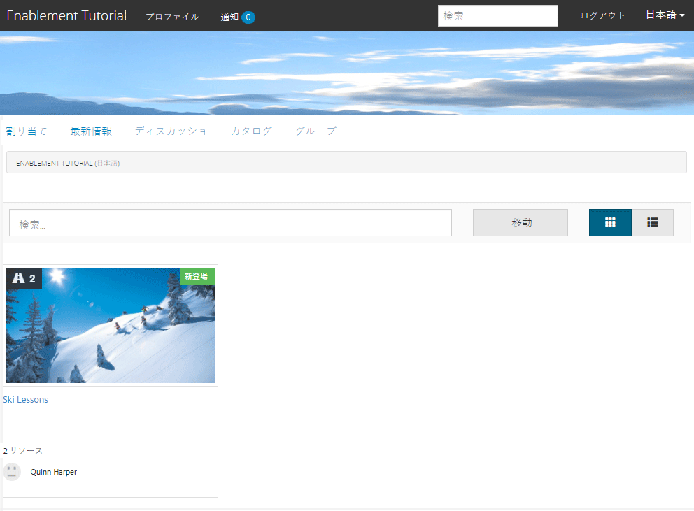
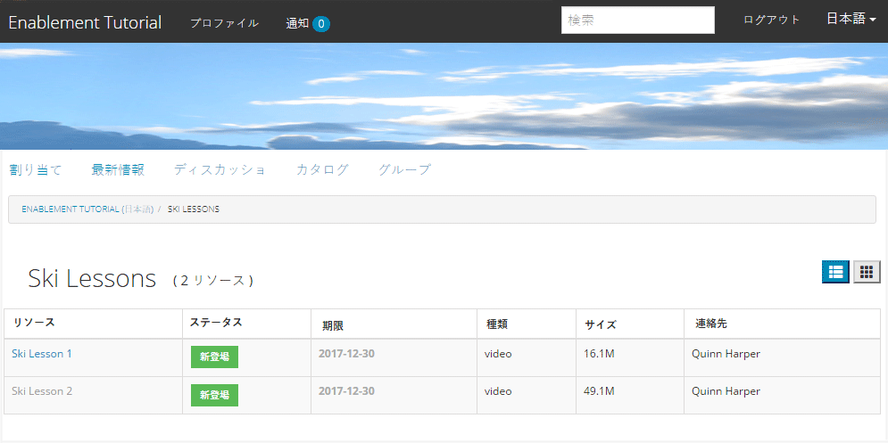
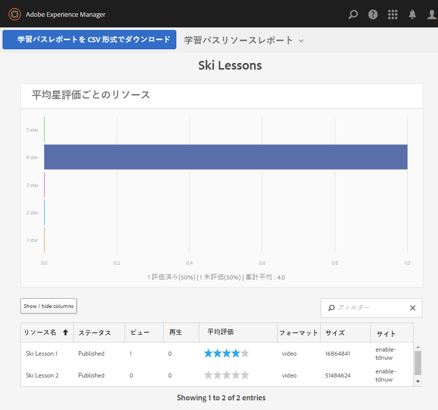

# 公開したサイトを使ってみる {#experience-the-published-site}

**[⇐ イネーブルメントリソースの作成と割り当て](resource.md)**

## パブリッシュサーバー上の新しいサイトの参照 {#browse-to-new-site-on-publish}

新しく作成したコミュニティサイトとそのイネーブルメントリソースおよび学習パスを公開したら、イネーブルメントチュートリアルサイトを実際に使ってみることができます。

まず、サイト作成時に表示された URL を参照します。ただし、このとき参照するのはパブリッシュサーバー上の URL です。次に例を示します。

* author URL = [http://localhost:4502/content/sites/enable/en.html](http://localhost:4502/content/sites/enable/en.html)
* パブリッシュ URL = [http://localhost:4503/content/sites/enable/en.html](http://localhost:4503/content/sites/enable/en.html)

[デフォルトホームページを設定](enablement-create-site.md#changethedefaulthomepage)した場合は、[http://localhost:4503/](http://localhost:4503/) を参照するだけでサイトが開きます。

公開済みサイトに初めてアクセスするときは、通常、そのサイト訪問者はまだサインインしておらず、匿名です。

**http://localhost:4503/content/sites/enable/en.html**

## 匿名のサイト訪問者 {#anonymous-site-visitor}

匿名のサイト訪問者には、この非公開のイネーブルメントコミュニティサイトのログインページがすぐに表示されます。facebookまたはTwitterに自己登録したり、ログインしたりするオプションはありません。

このホームページには、次の 4 つのメニュー項目が表示されます。 `Assignments, Ski Catalog, What's New` および `Discussions`にログインしない限り、到達できないものはありません。

>[!NOTE]
>
>サイト訪問者に自己登録を許可することなく、イネーブルメントサイトへの匿名アクセスを許可できます。\
>イネーブルメントリソースが `show in catalog` および `allow anonymous access`を使用すると、匿名のサイト訪問者がカタログ内のリソースを表示できるようになります。

### JCR での匿名アクセスの防止 {#prevent-anonymous-access-on-jcr}

ただし、既知の制限により、コミュニティサイトコンテンツは jcr コンテンツと json を通じて匿名の訪問者に公開されます。 **[!UICONTROL 匿名アクセスを許可]** はサイトのコンテンツに対して無効です。 ただし、この動作は、Sling の制限を回避策として使用して制御できます。

jcr コンテンツと json を介した匿名ユーザーによるアクセスからコミュニティサイトのコンテンツを保護するには、次の手順に従います。

1. AEM オーサーインスタンスで、 https://に移動します。&lt;host>:&lt;port>/editor.html/content/site/&lt;sitename>.html

   >[!NOTE]
   >
   >ローカライズされたサイトに移動しないでください。

1. に移動します。 **[!UICONTROL ページプロパティ]**.

   

1. 「**[!UICONTROL 詳細]**」タブに移動します。
1. 有効にする **[!UICONTROL 認証要件]**.

   

1. ログインページのパスを追加します。 （例：`/content/......./GetStarted`）。
1. ページを公開します。

## 登録済みメンバー {#enrolled-member}

このエクスペリエンスはユーザーに依存しています `Riley Taylor` および `Sidney Croft` 中 [作成済み](enablement-setup.md#publishcreateenablementmembers) および [割り当て済み](resource.md#settings) から *Ski Lessons* のメンバーシップを通じて学ぶ道 *コミュニティスキークラス* グループ化します。

ログイン方法

* `Username: riley`
* `Password: password`

ユーザープロファイルが自己登録によって作成されなかった場合は、メンバーが初めてサインインしたときにプロファイルページが表示され、必要に応じてプロファイルを確認および変更することができます。

次にメンバーがサインインしたときは、1 番目のメニュー項目のページがホームページとして表示されます。

### 割り当て {#assignments}

割り当てページでは、各メンバーに割り当てられたすべての学習パスとイネーブルメントリソースが表示されます。

それぞれの割り当てについて、次の基本情報が表示されます。

* 割り当てのタイプ
* 新しい割り当てかどうか
* 名前
* 割り当てのタイプに関連する詳細
* 割り当ての連絡先、エキスパートおよび作成者（指定されている場合）

カード左上隅のアイコンは、割り当ての種類を示しています。道路のイメージは、含まれるイネーブルメントリソースの数を含む学習パス用です。

「Ski Lessons」を選択すると、その学習パスで参照される 2 つのイネーブルメントリソースが表示されます。**

「Ski Lesson 1」を選択すると、イネーブルメントリソースの詳細ページが表示されます。**

メンバーは詳細ページから学習できます。 [評価](rating.md) レッスンと追加 [コメント](comments.md). メンバーのアクティビティは、サイトの新着情報セクションに反映されます。

イネーブルメントリソースとのインタラクションは、オーサー環境からアクセスできるレポートセクションに表示されます。

### Ski Catalog {#ski-catalog}

Ski Catalog のページは、`Tutorial` 名前空間のタグが付けられたイネーブルメントリソースのカタログです。2 人は *Ski Lesson* リソースは `Skiing` タグを使用し、 `All` または `Tutorial: Sports / Skiing` が選択されている場合、何も表示されません。

メンバーにイネーブルメントリソースが（直接または学習パスを通じて）割り当てられていないときも、カタログ内にあるイネーブルメントリソースを使用したり、コメントや評価を付けてフィードバックを与えることができます。

### Discussions {#discussions}

イネーブルメントリソース ([有効化時](enablement-create-site.md#step33asettings))、コミュニティサイトテンプレートの基になる `Enablement Tutorial` が作成されました： [フォーラム機能](functions.md#forum-function) ( タイトルは `Discussions)`.

「`Discussions`」のリンクを選択し、トピックを投稿します。

Sidney Croft（sidney／password）としてログインおよびログインし、質問に回答してトピックをフォローします。

インラインでのモデレートに加え、トピックをソーシャルメディアで共有したり電子メールで送信するオプションがあります。

### 新機能 {#what-s-new}

この `What's New` メニュー項目は、 [アクティビティストリーム機能](functions.md#activity-stream-function) このコミュニティサイトの構造内で使用できます。

Sidney としてサインインしたまま、 `What's New` リンクをクリックしてアクティビティを表示します。

## 信頼されているコミュニティメンバー {#trusted-community-member}

この操作は、次を前提としています。 ` [Quinn Harper](enablement-setup.md#publishcreateenablementmembers)` は次の役割を割り当てられました： [モデレーター](enablement-create-site.md#moderation) および [リソース連絡先](resource.md#settings).

ログイン方法

* `Username: quinn`
* `Password: password`

サインインすると、新しいメニュー項目が表示されます。 `Administration`（メンバーにモデレーターの役割が与えられたために表示されます）

ホームページは、1 番目のメニュー項目として定義されている割り当てページです。Quinn はモデレーターおよびイネーブルメントリソースの連絡先で、イネーブルメントリソースまたは学習パスに登録されていなかったので、表示するものはありません。

### 管理 {#administration}

そこにあるのは、2 人の学習者が行動を起こしていることだ。 `Riley Taylor` および `Sidney Croft. By s`選択 `Administration`モデレートコンソールにアクセスするためのリンクをクインすると、 [一括モデレートコンソール](moderation.md) モデレートする

サイドパネルのアイコンを選択すると、コミュニティコンテンツの検索に使用するフィルターの展開／折りたたみが切り替わります。

コメントカードにカーソルを合わせると、モデレートアクションが表示されます。

## オーサー環境でのレポート {#reports-on-author}

学習者とイネーブルメントリソースに関するレポートにアクセスには、2 つの方法があります。

作成者が、 **コミュニティ [リソースコンソール](resources.md)**（イネーブルメントリソースを管理する場所）。コミュニティサイトを選択すると、

* すべてのイネーブルメントリソースと学習パス
* 1 つの特定のイネーブルメントリソースまたは学習パス

次に移動： **コミュニティ [レポートコンソール](reports.md)**&#x200B;を使用し、

* イネーブルメントリソースと学習パスへの割り当て
* 特定の期間におけるコミュニティサイトへの投稿
* 特定の期間におけるコミュニティサイトの表示回数（サイト訪問回数）

* 投稿と閲覧は、すべてのコンテンツに対して、または特定のコンテンツに対して、次のように設定できます。

   * フォーラム
   * フォーラムトピック
   * Q&amp;A
   * Q&amp;A 質問
   * ブログ
   * ブログ記事
   * Calendar
   * カレンダーイベント

### リソースコンソール {#resources-console}

パブリッシュ環境でリソースに対しておこなわれるアクティビティやインタラクションが少ない場合は、オーサー環境でレポートを表示すると有益です。

* 作成者
* 管理者権限でログイン
* メインメニューからに移動します。 **[!UICONTROL コミュニティ/リソース]**
* を選択します。 `Enablement Tutorial` サイト
* を選択します。 `Report`すべてのリソースの概要を表示するアイコン
* リソースを選択し、 `Report`そのリソースに関するレポートのアイコン

Adobe Analytics のデータを表示するには時期尚早のようです。データが表示されるには 1 時間から 12 時間かかります。ただし、基本的な SCORM レポートは既に使用可能です。

#### Ski Lessons のリソースレポート {#ski-lessons-resource-report}

#### Ski Lessons のユーザーレポート {#ski-lessons-user-report}

* 選択 **[!UICONTROL コミュニティ/リソース]**

* カードを開く `Enablement Tutorial`
* カードを開く `Ski Lessons`
* `select Report, User Report`

### レポートコンソール {#reports-console}

レポートコンソールでは、以下のものに関するレポートを生成できます。

* イネーブルメントコミュニティサイトの&#x200B;**割り当て**
* コミュニティサイトの&#x200B;**表示**
* コミュニティサイトの&#x200B;**投稿**

割り当てに関するレポートの場合：

* 作成者
* 管理者権限でログイン
* に移動します。 **[!UICONTROL コミュニティ/レポート/割り当てレポート]**
* を選択します。 **[!UICONTROL サイト]** プルダウンメニューから ( `Enablement Tutorial`)

* 選択 **[!UICONTROL グループ]** ( `Community Ski Class`)

* を選択します。 **[!UICONTROL 割り当て]** ( `Ski Lessons`)

* 選択 **[!UICONTROL 生成]**

ビューに関するレポートの場合：

* 作成者
* 管理者権限でログイン
* に移動します。 **[!UICONTROL コミュニティ/レポート/表示レポート]**
* を選択します。 **[!UICONTROL サイト]** プルダウンメニューから ( `Enablement Tutorial`)

* 選択 **[!UICONTROL コンテンツタイプ]** ( `all`)

* を選択します。 **[!UICONTROL 日付範囲]** ( `Last 7 days`)

* 選択 **[!UICONTROL 生成]**

**[⇐ イネーブルメントリソースの作成と割り当て](resource.md)**
