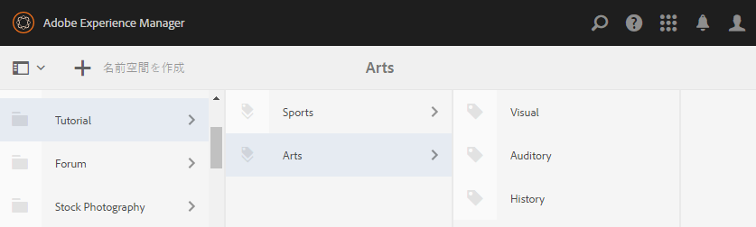
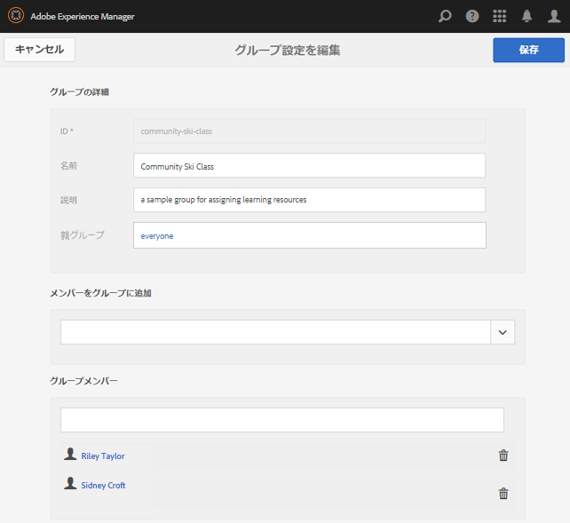
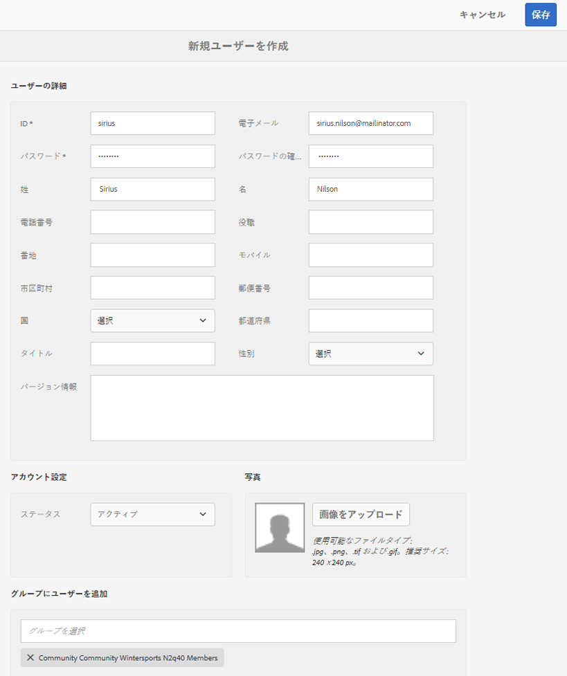

# イネーブルメントのための初期設定 {#initial-setup-for-enablement}

## オーサーインスタンスとパブリッシュインスタンスを開始 {#start-author-and-publish-instances}

開発およびデモの目的で、1 つのオーサーインスタンスと 1 つのパブリッシュインスタンスを実行する必要があります。

基本のAEM [はじめに](../../help/sites-deploying/deploy.md#getting-started) 結果として生じる指示

* オーサー環境 [localhost:4502](http://localhost:4502/)
* パブリッシュ環境を [localhost:4503](http://localhost:4503/)

AEM Communities、

* オーサー環境は

   * サイト、テンプレート、コンポーネント、イネーブルメントリソース、学習パスの開発
   * イネーブルメントリソースと学習パスへのメンバーとメンバーのグループの割り当て
   * 割り当て、表示および投稿に関するレポートの生成
   * 管理タスクと設定タスク

* パブリッシュ環境は、

   * イネーブルメントマネージャが管理するトピックに基づく学習/トレーニング
   * イネーブルメントリソースと学習パスのコメント化と評価
   * リソースの連絡先との連絡

>[!NOTE]
>
>AEMに詳しくない場合は、 [基本操作](../../help/sites-authoring/basic-handling.md) および [ページのオーサリングのクイックガイド](../../help/sites-authoring/qg-page-authoring.md).

## 最新の Communities リリースをインストール {#install-latest-communities-release}

このチュートリアルでは、 [実施可能コミュニティサイト](overview.md#enablement-community). 最新の機能パックがインストールされていることを確認するには、次のページにアクセスします。

* [最新リリース](deploy-communities.md#latest-releases)

を作成するチュートリアルの場合、 [エンゲージメントコミュニティサイト](overview.md#engagement-community)，訪問 [AEM Communitiesの概要](getting-started.md).

## イネーブルメント機能の設定 {#configure-enablement-features}

このチュートリアルに従うには、とを正しくインストールする必要があります。 [有効化の設定](enablement.md):MySQL や FFmpeg などのサードパーティ製品が必要です。

## Analytics の設定 {#configure-analytics}

条件 [Adobe Analyticsはコミュニティサイト用に設定されています](analytics.md)を使用する場合、詳しくは [レポート](reports.md) コミュニティメンバー（学習者）に割り当てられたイネーブルメントリソースと学習パスに基づいて生成されます。

## 電子メールで通知を設定する {#configure-email-for-notifications}

通知機能。デフォルトでは、 `Communities Sites` コンソール。通知用の e メールチャネルを提供します。

必要なのは、電子メールがサイトに対して適切に設定されるためです。

詳しくは、 [電子メールの設定](email.md).

## トンネルサービスの有効化 {#enable-the-tunnel-service}

オーサー環境でコミュニティサイトを作成する場合、トンネルサービスを使用して、パブリッシュ環境（メンバー）に登録されたユーザーとユーザーグループの作成と管理、信頼できるコミュニティメンバーへの役割の割り当て、学習者へのコンテンツの割り当てをおこなえます。

詳しくは、 [ユーザーとユーザーグループの管理](users.md).

トンネルサービスを有効にする簡単な手順については、 [トンネルサービス](deploy-communities.md#tunnel-service-on-author).

## チュートリアルタグを作成 {#create-tutorial-tags}

のタグ名前空間を使用して、エンゲージメントチュートリアルとイネーブルメントチュートリアルに使用するタグを作成します。 `Tutorial`.

以下を使用： [タグ付けコンソール](../../help/sites-administering/tags.md#tagging-console) 次のタグを作成するには：

* `Tutorial: Sports / Baseball`
* `Tutorial: Sports / Gymnastics`
* `Tutorial: Sports / Skiing`
* `Tutorial: Arts / Visual`
* `Tutorial: Arts / Auditory`
* `Tutorial: Arts / History`

その後、

1. [タグ権限の設定](../../help/sites-administering/tags.md#setting-tag-permissions)
1. [タグを公開](../../help/sites-administering/tags.md#publishing-tags)

AEM CommunitiesはじめにのTutorials用に作成されたタグのサンプルパッケージ

[ファイルを入手](assets/communities_tutorialtags-10.zip)

## イネーブルメントメンバーとグループの作成 {#create-enablement-members-and-groups}

イネーブルメントコミュニティサイトでは、サイト訪問者が [自己登録またはソーシャルログインを使用](sites-console.md#user-management).

代わりに、 [トンネルサービス](#enable-the-tunnel-service) 有効、 [メンバーコンソール](members.md) は、パブリッシュ環境で新しいメンバーを登録するために使用されます。

このチュートリアルでは、パブリッシュ環境で 3 つのメンバーを作成します。 2 人のメンバーが学習パスに割り当てられるユーザーグループのメンバーになり、3 人目のメンバーがイネーブルメントリソースの連絡先になります。

オーサー環境で 4 人目のユーザーが作成され、Communities Administrator と Community Enablement Manager の役割が割り当てられます。

>[!NOTE]
>
>これらのメンバーは、 *イネーブルメントチュートリアル* コミュニティサイト。
>
>後で作成した場合は、 *イネーブルメントチュートリアルメンバーグループ* メンバーの作成中に
>
>代わりに、後で、 [メンバーグループに割り当て済み](enablement-create-site.md#assignuserstocommunityenablemembersgroup).

### Riley Taylor — 登録者 {#riley-taylor-enrollee}

[メンバーを作成](members.md#create-new-member) 学習者のグループ（Community Ski Class グループ）に追加される

* **ID**:ライリー
* **電子メール**:riley.taylor@mailinator.com
* **パスワード**：password
* **パスワードを確認**:パスワード
* **名**:ライリー
* **姓**:テイラー

### Sidney Croft — 登録者 {#sidney-croft-enrollee}

[2 つ目のメンバーを作成](members.md#create-new-member) Community Ski Class グループに追加される

* **ID**:シドニー
* **電子メール**:sidney.croft@mailinator.com
* **パスワード**：password
* **パスワードを確認**:パスワード
* **名**:シドニー
* **姓**:切り抜き

### Quinn Harper — イネーブルメントリソース連絡先とモデレーター {#quinn-harper-enablement-resource-contact-and-moderator}

[メンバーを作成](members.md#create-new-member) サイトの作成後にコミュニティサイトのメンバーグループに追加されるユーザー。 このメンバーシップにより、メンバーをイネーブルメントとして割り当てることができます [リソース連絡先](resources.md#settings) サイトのイネーブルメントリソースが作成されたとき。

* **ID**:クイン
* **電子メール**:quinn.harper@mailinator.com
* **パスワード**：password
* **パスワードを確認**:パスワード
* **名**:クイン
* **姓**:ハーパー

### ユーザーグループの追加 — Community Ski Class {#add-a-user-group-community-ski-class}

[新しいグループを追加](members.md#create-new-group) Community Ski Class という名前を付けました。

* **ID**:community-ski-class
* **名前**:コミュニティスキークラス
* **説明**:イネーブルメントリソースを割り当てるためのサンプルグループ
* **メンバーをグループに追加** &#39;追加&#39;:

   * ライリー
   * シドニー

* 選択 **[!UICONTROL 保存]**

### コミュニティ Ski クラスのプロパティ {#community-ski-class-properties}

>[!NOTE]
>
>コミュニティサイトの作成中に、既存のメンバーとグループをコミュニティサイトのメンバーグループに追加できます。

## コミュニティ管理者の役割 {#community-administrator-role}

コミュニティ管理者グループのメンバーは、コミュニティサイトの作成、サイトの管理、メンバーの管理（コミュニティからのメンバーの禁止が可能）、コンテンツのモデレートをおこなうことができます。

### ユーザーを作成 {#create-user}

でのユーザーの作成 *作成者*&#x200B;コミュニティ管理者の役割が割り当てられているユーザー：

* オーサーインスタンス上

   * 例： [http://localhost:4502/](http://localhost:4503/)

* 管理者権限でログイン

   * 例えば、ユーザー名「admin」/パスワード「admin」です。

* メインコンソールから、に移動します。 **[!UICONTROL ツール/運営/セキュリティ/ユーザー]**
* 次の **[!UICONTROL 編集]** メニュー、選択 **[!UICONTROL ユーザーを追加]**

* 内 `Create New User` ダイアログ入力

   * **ID&amp;ast;**:シリウス
   * **電子メールアドレス**:sirius.nilson@mailinator.com
   * **パスワード (&amp;A);**:パスワード
   * **パスワードの確認 (&amp;A);**:パスワード
   * **名**:シリウス
   * **姓 (&amp;A);**:ニルソン

### コミュニティ管理者グループに Sirius を割り当て {#assign-sirius-to-community-administrators-group}

下にスクロールして `Add User to Groups`:

* 「C」と入力して検索

   * 選択 `Community Administrators`
   * 選択 `Community Enablement Managers`

* 選択 **[!UICONTROL 保存]**

