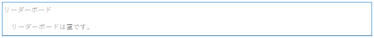
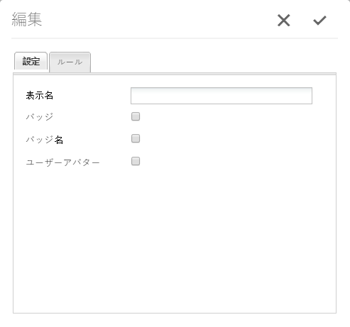

# リーダーボード機能 {#leaderboard-feature}

>[!CAUTION]
>
>AEM 6.4 の拡張サポートは終了し、このドキュメントは更新されなくなりました。 詳細は、 [技術サポート期間](https://helpx.adobe.com/jp/support/programs/eol-matrix.html). サポートされているバージョンを見つける [ここ](https://experienceleague.adobe.com/docs/?lang=ja).

## はじめに {#introduction}

この `Leaderboard` コンポーネントを使用すると、獲得したポイント（基本スコア）や専門知識（高度なスコア）に従ってメンバーをランク付けすることで、コミュニティ内でのメンバーの関わり方を把握できます。

ページにリーダーボードコンポーネントを含める前に、 [コミュニティのスコアとバッジ](implementing-scoring.md).

ドキュメントのこの節では、

* の追加 `Leaderboard` コンポーネントを [コミュニティサイト](overview.md#community-sites)

* の設定 `Leaderboard` コンポーネント

## ページへのリーダーボードの追加 {#adding-a-leaderboard-to-a-page}

を追加するには、以下を実行します。 `Leaderboard` コンポーネントをオーサリングモードでページに追加する場合は、

* `Communities / Leaderboard`

をクリックし、ページ上の適切な場所にドラッグします。

必要な情報については、 [コミュニティコンポーネントの基本](basics.md).

コミュニティサイトのページに最初に配置したとき、コンポーネントは次のように表示されます。

## リーダーボードの設定 {#configuring-leaderboard}

配置された `Leaderboard` アクセスして選択するコンポーネント `Configure` 編集ダイアログを開くアイコン。

 

### 「設定」タブ {#settings-tab}

以下 **[!UICONTROL 設定]** 「 」タブで、メンバーに関する表示情報を指定します。

* **[!UICONTROL 表示名]**
ボードに表示するわかりやすい名前。バッジとスコアの表示に選択したルールが反映されます。

   デフォルトはです。 `Leaderboard`（何も入力されていない場合）

* **[!UICONTROL バッジ]**
オンにすると、リーダーボードにバッジアイコンの列が表示されます。

   初期設定はオフです。

* **[!UICONTROL バッジ名]**
オンにすると、リーダーボードにバッジ名の列が表示されます。

   初期設定はオフです。

* **[!UICONTROL アバターを使用]**
オンにすると、メンバーのアバター画像がリーダーボードに含まれ、メンバーのプロファイルへの名前リンクの横に表示されます。

   初期設定はオフです。

### 「ルール」タブ {#rules-tab}

以下 **[!UICONTROL ルール]** タブ、コミュニティサイト、およびそのスコアとバッジのルール

* **[!UICONTROL ルールの場所]**
（必須）スコア/バッジルールを設定する場所。

* **[!UICONTROL スコアルール]**
（必須）表示するスコアを生成する特定のルール。

* **[!UICONTROL バッジルール]**
（必須）表示するバッジを生成する特定のルール。

* **[!UICONTROL 表示の制限]**
1 ページに表示するメンバーの数。

   初期設定は 10 です。

## 例：参加者リーダーボード {#example-participants-leaderboard}

このリーダーボードは、基本的なスコアルールの適用結果を報告します。

リーダーボードコンポーネントの設定：

* **[!UICONTROL 設定]** タブ：

   * 表示名 = `Participation Board`
   *  `checked`：

      * バッジ
      * バッジ名
      * アバターを使用

* **[!UICONTROL ルール]** タブ：

   * ルールの場所 = `/content/sites/communities/jcr:content`
   * スコアルール = `/etc/community/scoring/rules/forums-scoring`
   * バッジルール = `/etc/community/badging/rules/reference-badging`
   * 最大表示数 = `10`

## 例：エキスパートリーダーボード {#example-experts-leaderboard}

このリーダーボードは、高度なスコアルールの適用結果を報告します。

リーダーボードコンポーネントの設定：

* **[!UICONTROL 設定]** タブ：

   * 表示名 = `Expertise Board`
   *  `checked`：

      * バッジ
      * アバターを使用

* **[!UICONTROL ルール]** タブ：

   * ルールの場所 = `/content/sites/communities/jcr:content`
   * スコアルール = `/etc/community/scoring/rules/adv-forums-scoring`
   * バッジルール = `/etc/community/badging/rules/adv-forums-badging`
   * 最大表示数 = `10`

## 追加情報 {#additional-information}

詳しくは、 [リーダーボードの基本事項](leaderboard.md) 開発者向けのページ

ルールを作成する手順は、 [コミュニティのスコアとバッジ](implementing-scoring.md) 管理者向けのページ
