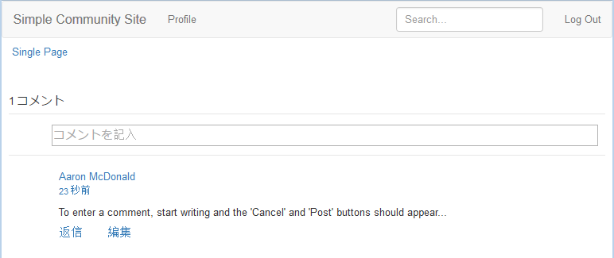

# 外観の変更 (HBS) {#alter-the-appearance-hbs}

カスタムコメントシステムのコンポーネントがアプリケーションディレクトリ（/apps）に配置され、デフォルトのコメントシステムおよびカスタムモデル／ビューを参照する resourceSuperType が登録されたので、実装を変更できるようになりました。

簡単なデモのために、ビジュアル機能（コメントを投稿するサインインユーザーについて表示されるアバター）を削除します。

>[!NOTE]
>
>拡張を使用するには、影響を受ける Web サイト内のコメントシステムのインスタンス（/content）によって、その resourceType がカスタムコメントシステムであるように設定される必要があります。

## HBS スクリプトの変更 {#modify-the-hbs-scripts}

[CRXDE Lite](../../help/sites-developing/developing-with-crxde-lite.md) を使用して、次の手順を実行します。

* 開く [/apps/custom/components/comments/comment/comment.hbs](http://localhost:4502/crx/de/index.jsp#/apps/custom/components/comments/comment/comment.hbs)

   * コメント投稿のアバターを含むタグをコメントアウトします（21 行目前後）。

      ```
      <!--
       <</img>
       -->
      ```

* 開く [/apps/custom/components/comments/comments.hbs](http://localhost:4502/crx/de/index.jsp#/apps/custom/components/comments/comments.hbs)

   * 次のコメントエントリのアバターを含むタグをコメントアウトします（44 行目前後）。

      ```
      <!--
       </img>
       -->
      ```

* 「**すべて保存**」を選択します。

## カスタムアプリのレプリケート {#replicate-custom-app}

アプリケーションを変更した後で、カスタムコンポーネントを再レプリケートする必要があります。

その方法の 1 つは、

* メインメニューから

   * 選択 **[!UICONTROL [ ツール ] > [ 操作 ] > [ レプリケーション ]]**
   *  `Activate Tree`
   * 設定 `Start Path`:から `/apps/custom`
   * オフ `Only Modified`
   * 選択 `Activate` ボタン

## 公開済みサンプルページでの変更されたコメントの表示 {#view-modified-comment-on-published-sample-page}

パブリッシュインスタンスで[エクスペリエンスを続行](extend-sample-page.md#publish-sample-page)すると、同じユーザーとしてサインインしたまま、パブリッシュ環境でページを更新してアバターを削除する変更を表示できます。



## サンプルコメント拡張パッケージ {#sample-comment-extension-package}

このチュートリアルで作成したカスタムコメントアプリケーションのパッケージが添付されています。

[ファイルを入手](assets/sample-comment-extension-6-1-fp3.zip)
