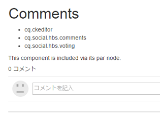
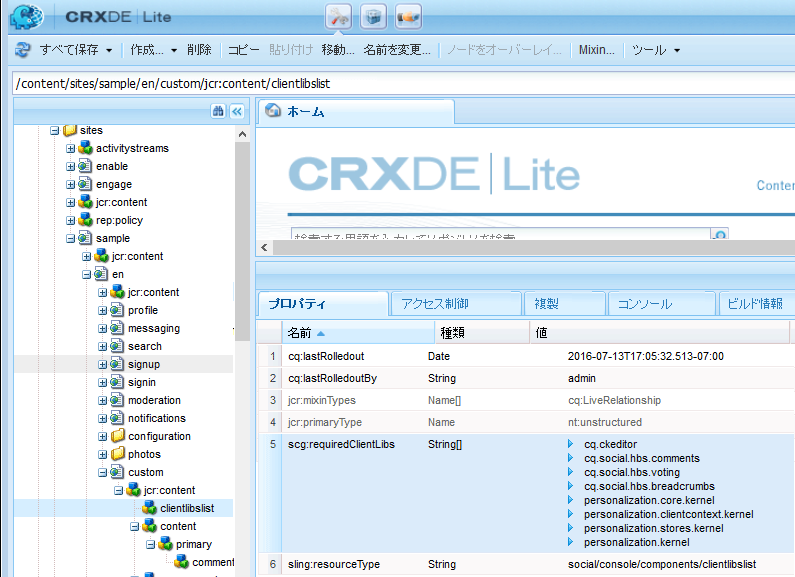
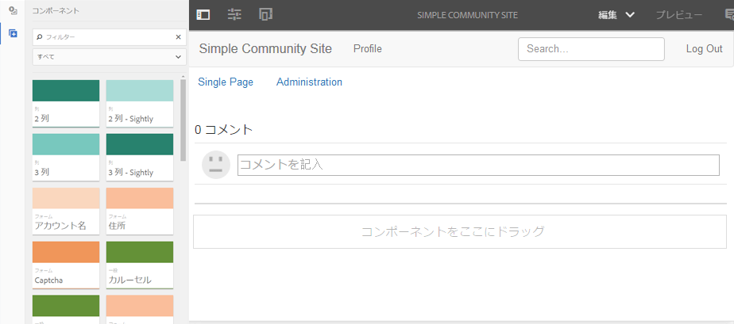
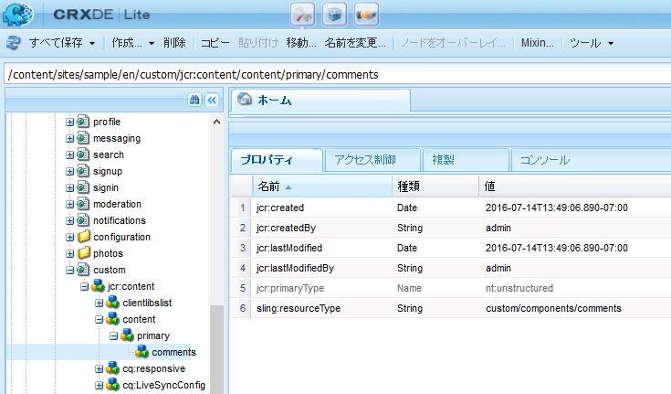
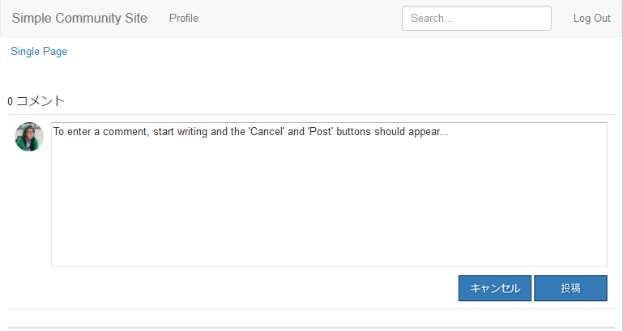
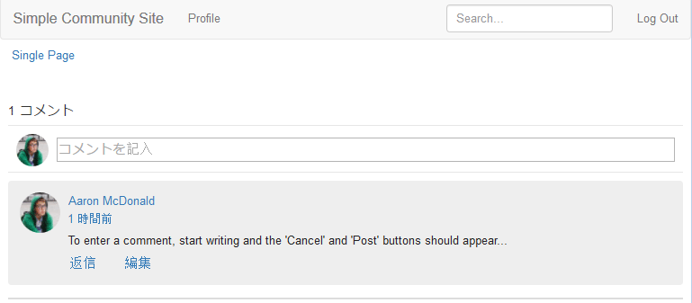

# サンプルページへのコメントの追加 {#add-comment-to-sample-page}

>[!CAUTION]
>
>AEM 6.4 の拡張サポートは終了し、このドキュメントは更新されなくなりました。 詳細は、 [技術サポート期間](https://helpx.adobe.com/jp/support/programs/eol-matrix.html). サポートされているバージョンを見つける [ここ](https://experienceleague.adobe.com/docs/?lang=ja).

カスタムコメントシステムのコンポーネントがアプリケーションディレクトリ (/apps) に配置されたので、拡張コンポーネントを使用できます。 影響を受ける Web サイト内のコメントシステムのインスタンスでは、resourceType をカスタムコメントシステムに設定し、必要なクライアントライブラリをすべて含める必要があります。

## 必要な clientlib の特定 {#identify-required-clientlibs}

デフォルトのコメントのスタイルと機能に必要なクライアントライブラリも、拡張コメントに必要です。

この [コミュニティコンポーネントガイド](components-guide.md) 必要なクライアントライブラリを識別します。 コンポーネントガイドを参照し、次に例を示します。

[http://localhost:4502/content/community-components/en/comments.html](http://localhost:4502/content/community-components/en/comments.html)

コメントが正しくレンダリングおよび機能するために必要な 3 つのクライアントライブラリに注意してください。 これらは、拡張されたコメントの参照先と共に、 [拡張コメントのクライアントライブラリ](extend-create-components.md#create-a-client-library-folder) ( `apps.custom.comments`) をクリックします。

## ページにカスタムコメントを追加する {#add-custom-comments-to-a-page}

1 ページにつき 1 つのコメントシステムしか存在しないので、短い説明に従って、サンプルページを作成する方が簡単です。 [サンプルページの作成](create-sample-page.md) チュートリアル

作成したら、デザインモードに入り、カスタムコンポーネントグループを使用可能にして、 `Alt Comments` ページに追加するコンポーネント。

コメントが正しく表示され、機能するには、コメントのクライアントライブラリをページの clientlibslist に追加する必要があります ( [コミュニティコンポーネントの clientlib](clientlibs.md)) をクリックします。

### サンプルページのコメント clientlibs {#comments-clientlibs-on-sample-page}

### 作成者：サンプルページでの Alt コメント {#author-alt-comment-on-sample-page}

### 作成者：サンプルページコメントノード {#author-sample-page-comments-node}

CRXDE で resourceType を確認するには、サンプルページ ( ) の comments ノードのプロパティを表示します。 `/content/sites/sample/en/jcr:content/content/primary/comments`.

### サンプルページを公開 {#publish-sample-page}

カスタムコンポーネントをページに追加した後は、次の操作もおこなう必要があります（再度追加する）。 [ページを公開](sites-console.md#publishing-the-site).

### 公開：サンプルページでの Alt コメント {#publish-alt-comment-on-sample-page}

カスタムアプリケーションとサンプルページの両方を公開したら、コメントを入力できるようになります。 サインイン時に、 [デモユーザー](tutorials.md#demo-users) または管理者は、コメントを投稿できるはずです。

aaron.mcdonald@mailinator.comはコメントを投稿しています：

 

拡張コンポーネントがデフォルトの外観で正しく動作しているように見えたので、外観を変更する時です。
