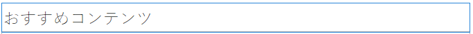
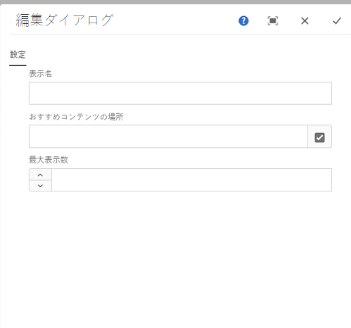
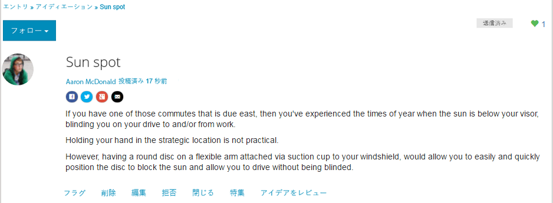
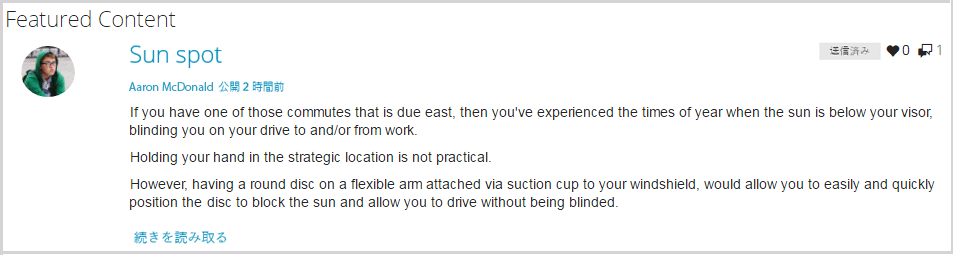

# おすすめコンテンツ機能 {#featured-content-feature}

>[!CAUTION]
>
>AEM 6.4 の拡張サポートは終了し、このドキュメントは更新されなくなりました。 詳細は、 [技術サポート期間](https://helpx.adobe.com/jp/support/programs/eol-matrix.html). サポートされているバージョンを見つける [ここ](https://experienceleague.adobe.com/docs/?lang=ja).

## はじめに {#introduction}

おすすめコンテンツ機能を使用すると、パブリッシュ環境でサインインしたサイト訪問者（コミュニティメンバー）がコンテンツをハイライト表示できる領域が提供されます。

* [ブログ](blog-feature.md)
* [カレンダー](calendar.md)
* [フォーラム](forum.md)
* [アイデア](ideation-feature.md)
* [Q&amp;A](working-with-qna.md)

コンテンツにおすすめとしてフラグが設定されると、このコンポーネント内に一覧表示されます。このコンポーネントは、コミュニティメンバーの注目を集めやすい特定のランディングページや領域に配置できます。

コンテンツを特集する機能は、コンポーネントごとに許可または禁止できます。

ドキュメントのこの節では、

* コミュニティサイトにおすすめコンテンツを追加する
* の設定 `Featured Content`コンポーネント

## ページへのおすすめコンテンツの追加 {#adding-featured-content-to-a-page}

を追加するには、以下を実行します。 `Featured Content` コンポーネントをオーサリングモードでページに追加する場合は、コンポーネントブラウザーを使用して

* `Communities / Featured Content`

をドラッグし、ページ上の特集コンテンツが表示される場所に配置します。

必要な情報については、 [コミュニティコンポーネントの基本](basics.md).

次の場合に [必要なクライアント側ライブラリ](essentials-featured.md#essentials-for-client-side) が含まれる場合、この方法で `Featured Content`コンポーネントが表示されます。

## おすすめコンテンツの設定 {#configuring-featured-content}

配置された `Featured Content` アクセスして選択するコンポーネント `Configure` 編集ダイアログを開くアイコン。

 

### 「設定」タブ {#settings-tab}

以下 **[!UICONTROL 設定]** 「 」タブで、機能するコンテンツを指定します。

* **[!UICONTROL 表示名]**
おすすめコンテンツのリストのタイトル。 例： 
`Featured Questions`または `Featured Ideas`。デフォルトはです。 `Featured Content` 空のままの場合は。

* **[!UICONTROL おすすめコンテンツの場所]**

   *（必須）* 機能するコンテンツを含むページを参照します（そのページのコンポーネントは、「おすすめコンテンツを許可」に設定する必要があります）。 例：`/content/sites/engage/en/forum`

* **[!UICONTROL 表示の制限]**
表示するおすすめコンテンツの最大数。 デフォルトは 5 です。

## サイト訪問者エクスペリエンス {#site-visitor-experience}

コンテンツにおすすめコンテンツのフラグを設定する機能には、モデレーター権限が必要です。

モデレーターが投稿されたコンテンツを表示すると、コンテキスト内のモデレートフラグにアクセスできます。このフラグには、新しい `Feature` フラグ。

機能としてフラグを設定すると、モデレーションフラグが `Unfeature`.

次を含むページ： `Featured Content` コンポーネントにこの投稿が含まれます。

`Read More` は、実際の投稿へのリンクです。

## 追加情報 {#additional-information}

詳しくは、 [おすすめコンテンツ](essentials-featured.md) 開発者向けのページ

コンテンツをおすすめとしてフラグ設定する方法については、 [ユーザー生成コンテンツのモデレート](moderate-ugc.md).
