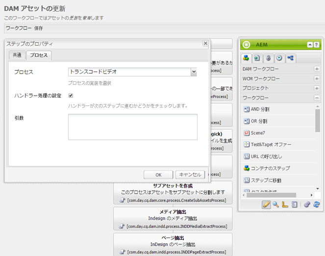

# コミュニティのための FFmpeg {#ffmpeg-for-communities}

## 概要 {#overview}

FFmpeg は、オーディオとビデオの変換およびストリーミングのためのソリューションです。インストールすると、[ビデオアセット](../../help/sites-authoring/default-components-foundation.md#video)の適切なトランスコーディングと AEM Communities のイネーブルメント 能に使用できます。

FFmpeg は、オーサー環境で、アップロードしたイネーブルメントリソースのメタデータを取得したり、イネーブルメントリソースの一覧に表示するサムネイルを生成するときに使用します。

## FFmpeg のインストール {#installing-ffmpeg}

FFmpeg は AEM *オーサー*&#x200B;インスタンスをホストしているサーバーにインストールする必要があります。

1. に移動します。 [https://www.ffmpeg.org](https://www.ffmpeg.org/)
1. 特定の環境用（Macintosh、Windows または Linux）の FFmpeg の最新バージョンをダウンロードします。

   * 古いバージョンにはセキュリティ脆弱性があるので、FFmpeg を最新の状態に保つことが重要です。

1. OS の手順に従って FFmpeg をインストールします。

1. FFmpeg 実行可能ファイルがシステムパスに設定されていることを確認します。

   システム内の任意のディレクトリから FFmpeg を実行できるはずです。

   * 例： `ffmpeg -version`

## FFmpeg トランスコーディングサービスの設定 {#configure-ffmpeg-transcoding-service}

デフォルトでは、FFmpeg をインストールすると、DAM アセットの更新のワークフロー定義どおりに複数のレンディションが設定されます（トランスコーディング）。

トランスコーディングは CPU を集中的に使用するので、対象レンディションのリストを変更することを推奨します。ほとんどの場合、トランスコードは必要ありません。

DAM アセットの更新のワークフローを変更するには（この例ではトランスコーディングをオフにするには）、次のようにします。

* 管理者権限でオーサーインスタンスにサインイン
* グローバルナビゲーションから： **[!UICONTROL ツール/ワークフロー/モデル]**
* 場所 **[!UICONTROL DAM アセットの更新]**
* ダブルクリックして、編集用のワークフローをクラシック UI で開きます

   結果の場所： [http://localhost:4502/cf#/etc/workflow/models/dam/update_asset.html](http://localhost:4502/cf#/etc/workflow/models/dam/update_asset.html)

* 次をダブルクリックします。 **[!UICONTROL FFmpeg トランスコード]** ステップのプロパティダイアログにアクセスする手順
* 以下 **[!UICONTROL プロセス]** タブ：

   * **[!UICONTROL アルグメント]**:すべてのエントリをクリアしてトランスコードを無効にします。デフォルト値： `profile:firefoxhq,profile:hq,profile:flv,profile:iehq`

* 選択 **[!UICONTROL OK]** 閉じる `Step Properties` ダイアログ

* 選択 **[!UICONTROL 保存]** 保存する `DAM Update Asset` ワークフロー

   （左上隅）
