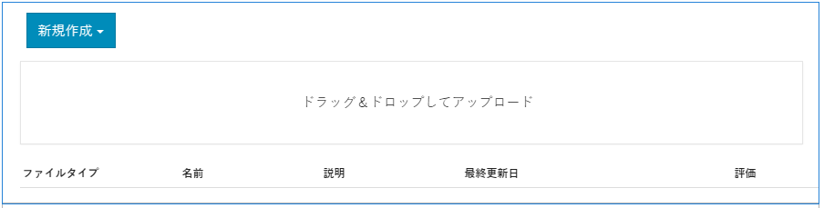
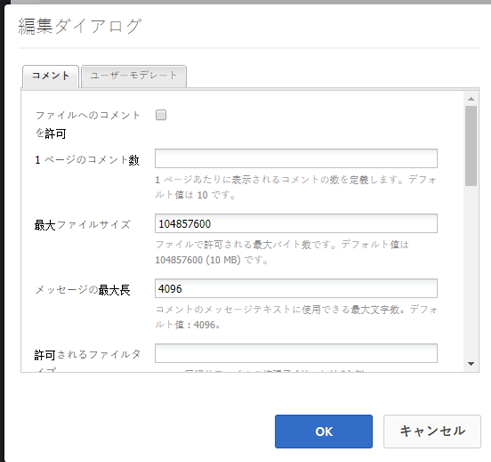

# ファイルライブラリ機能 {#file-library-feature}

>[!CAUTION]
>
>AEM 6.4 の拡張サポートは終了し、このドキュメントは更新されなくなりました。 詳細は、 [技術サポート期間](https://helpx.adobe.com/jp/support/programs/eol-matrix.html). サポートされているバージョンを見つける [ここ](https://experienceleague.adobe.com/docs/?lang=ja).

## はじめに {#introduction}

ファイルライブラリ機能を使用すると、サインインしているサイト訪問者（コミュニティメンバー）がコミュニティサイト内のファイルをアップロード、管理、ダウンロードできる場所を提供できます。

ドキュメントのこの節では、

* ファイルライブラリ機能をAEMサイトに追加する
* の設定 `File Library` コンポーネント

## ページへのファイルライブラリの追加 {#adding-a-file-library-to-a-page}

を追加するには、以下を実行します。 `File Library` コンポーネントをオーサリングモードでページに追加する場合は、

* `Communities / File Library`

をクリックし、ページ上の適切な場所にドラッグします。

必要な情報については、 [コミュニティコンポーネントの基本](basics.md).

次の場合に [必要なクライアント側ライブラリ](essentials-file-library.md#essentials-for-client-side) が含まれる場合、この方法で `File Library` コンポーネントが表示されます。

## ファイルライブラリの設定 {#configuring-file-library}

配置された `File Library` アクセスして選択するコンポーネント `Configure` 編集ダイアログを開くアイコン。

 

### 「コメント」タブ {#comments-tab}

以下 **[!UICONTROL コメント]** タブで、アップロードされたファイルのコメントを表示するかどうかと表示方法を指定します。

* **[!UICONTROL ファイルに対するコメントを許可]**
オンにすると、アップロードされたファイルに対するコメントを許可します。 初期設定はオフです。

* **[!UICONTROL 1 ページのコメント数]**
1 ページに表示するコメントの数と、表示する返信の数を制限します。 初期設定は です。 
**10**.

* **[!UICONTROL 最大ファイルサイズ]**
この値は、アップロードするファイルのサイズを制限します。 デフォルトの制限は104857600(10 MB) です。

* **[!UICONTROL メッセージの最大長]**
テキストボックスに入力できる最大文字数。 デフォルトは 4096 文字です。

* **[!UICONTROL 許可されているファイルタイプ]**
「ドット」区切り文字を使用したファイル拡張子のコンマ区切りリスト。 例：.jpg、.jpeg、.png、.doc、.docx、.pdf ファイルタイプが指定されている場合、指定されていないファイルは許可されません。 初期設定では何も指定されず、すべてのファイルタイプが許可されます。

* **[!UICONTROL リッチテキストエディター]**
オンにすると、マークアップを使用してコメントを入力できます。 初期設定はオフです。

* **[!UICONTROL コメントを削除]**
オンにすると、ユーザーは自分のコメントを削除できます。 初期設定はオンです。

* **[!UICONTROL タグ付けを許可]**
オンにすると、ファイルにタグを追加する機能が有効になります。 初期設定はオフです。

* **[!UICONTROL 許可された名前空間]**
「タグ付けを許可」がオンの場合、使用可能なタグは、チェックした名前空間に限定されます。 何も選択しない場合は、すべてが許可されます。 初期設定は、すべての名前空間です。

* **[!UICONTROL 提案の制限]**
「タグ付けを許可」がオンの場合、この設定によって表示する推奨タグの数が制限されます。 -1 に設定した場合、制限はありません。 初期設定は —1 です。

* **[!UICONTROL 投票を許可]**
オンにすると、ファイルの投票機能が有効になります。 初期設定はオフです。

* **[!UICONTROL フォローを許可]**
オンにすると、次の機能がブログ記事に含まれ、メンバーは [通知済み](notifications.md) 新しい投稿の数。 初期設定はオフです。

* **[!UICONTROL スレッド化された返信を許可]**
オンにすると、投稿されたコメントに対する返信を許可します。 初期設定はオフです。

### 「ユーザーモデレート」タブ {#user-moderation-tab}

以下 **[!UICONTROL ユーザーモデレート]** コメントが許可されている場合は、「 」タブでコメントのモデレートを設定します。

* **[!UICONTROL モデレート前]**
オンにすると、コメントは、公開サイトに表示される前に承認が必要になります。 初期設定はオフです。

* **[!UICONTROL コメントを削除]**
オンにすると、コメントを投稿した訪問者はコメントを削除できます。 初期設定はオンです。

* **[!UICONTROL コメントを拒否]**
オンにすると、信頼されているメンバーのモデレーターがコメントを拒否できます。 初期設定はオフです。

* **[!UICONTROL コメントを閉じる/再度開く]**
オンにすると、信頼されているメンバーのモデレーターがコメントを閉じて再度開くことを許可します。 初期設定はオフです。

* **[!UICONTROL コメントにフラグを設定]**
オンにすると、訪問者はコメントに「不適切」のフラグを設定できます。 初期設定はオフです。

* **[!UICONTROL フラグ設定理由リスト]**
オンにすると、訪問者はコメントに「不適切」のフラグを設定した理由をドロップダウンリストから選択できます。 初期設定はオフです。

* **[!UICONTROL カスタムフラグ設定理由]**
オンにすると、訪問者はコメントに「不適切」のフラグを設定した独自の理由を入力できます。 初期設定はオフです。

* **[!UICONTROL モデレートのしきい値]**
訪問者がコメントに何回フラグを設定したらモデレーターに通知するかを指定します。 デフォルトは 1 回 (
**1**).

* **[!UICONTROL フラグ付け制限]**
コメントに何回フラグを設定したら、公開ビューで非表示にするかを指定します。 この数は 
**モデレートのしきい値**. デフォルトは 5 です。

## 追加情報 {#additional-information}

詳しくは、 [ファイルライブラリの基本事項](essentials-file-library.md) 開発者向けのページ

投稿されたトピックおよびコメントのモデレートについては、 [ユーザー生成コンテンツのモデレート](moderate-ugc.md).

投稿されたトピックおよびコメントのタグ付けについては、 [ユーザー生成コンテンツのタグ付け](tag-ugc.md).
