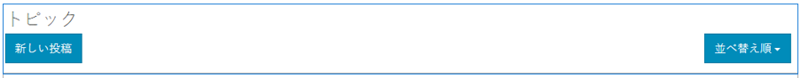
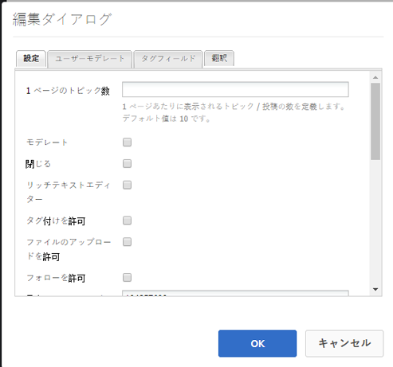

# フォーラム機能 {#forum-feature}

## はじめに {#introduction}

フォーラム機能は、パブリッシュ環境にサインインしているサイト訪問者（コミュニティメンバー）が以下を実行できる領域を提供します。

* 新規トピックを作成
* トピックを表示して返信
* トピックのフォロー
* フォーラムの検索
* フォーラムコンテンツのモデレートに役立ちます
* フォーラムトピックを別のページに移動する

ドキュメントのこのセクションでは、以下の内容について説明します。

* AEMサイトへのフォーラム機能の追加
* の設定 `Forum`コンポーネント

## フォーラムをページに追加 {#adding-a-forum-to-a-page}

を追加するには、以下を実行します。 `Forum` コンポーネントをオーサリングモードでページに追加する場合は、コンポーネントブラウザーを使用して

* `Communities / Forum`

フォーラムが表示されるページ上の場所にドラッグします。

必要な情報については、 [コミュニティコンポーネントの基本](basics.md).

次の場合に [必要なクライアント側ライブラリ](essentials-forum.md#essentials-for-client-side) が含まれる場合、この方法で `Forum`コンポーネントが表示されます。

## フォーラムの設定 {#configuring-a-forum}

配置された `Forum` アクセスして選択するコンポーネント `Configure` 編集ダイアログを開くアイコン。

 

### 「設定」タブ {#settings-tab}

「**[!UICONTROL 設定]**」タブでは、トピックと返信の基本機能を設定します。

* **[!UICONTROL 1 ページのトピック数]** 1 ページに表示するトピック数または投稿数を定義します。初期設定は 10 です。

* **[!UICONTROL モデレート]**&#x200B;オンにすると、トピックおよびコメントの投稿を公開サイトに表示する前に承認が必要になります。初期設定はオフです。

* **[!UICONTROL 閉じる]**&#x200B;オンにすると、フォーラムは新しいトピックやコメントを受け付けなくなります。初期設定はオフです。

* **[!UICONTROL リッチテキストエディター]**&#x200B;オンにすると、マークアップを使用してトピックおよびコメントを入力できます。初期設定はオフです。

* **[!UICONTROL タグ付けを許可]**&#x200B;オンにすると、メンバーは自分の投稿にタグラベルを付加できます（「**[!UICONTROL タグフィールド]**」タブを参照）。初期設定はオフです。

* **[!UICONTROL ファイルのアップロードを許可]**&#x200B;オンにすると、トピックまたはコメントに添付ファイルを付加できます。初期設定はオフです。

* **[!UICONTROL フォローを許可]**&#x200B;オンにすると、フォーラム投稿のフォロー機能が追加され、新しい投稿をメンバーに[通知](notifications.md)できます。初期設定はオフです。

* **[!UICONTROL ピン留めを許可]**&#x200B;オンにすると、フォーラムトピックをトピックリストの上部にピン留めできます。初期設定はオフです。

* **[!UICONTROL おすすめコンテンツを許可]**&#x200B;オンにすると、アイデアを[おすすめコンテンツ](featured.md)として指定できます。初期設定はオフです。

* **[!UICONTROL 電子メール購読を許可]**&#x200B;オンにすると、新しい投稿があった場合にメンバーに電子メールで通知できるようになります（[購読](subscriptions.md)）。必要 `Allow Following` チェックされ [電子メール設定済み](email.md). 初期設定はオフです。

* **[!UICONTROL 最大ファイルサイズ]**
次の場合にのみ関連します。 
`Allow File Uploads` がオンになっている。 このフィールドは、アップロードするファイルのサイズ（バイト単位）を制限します。 初期設定は104857600(10 MB) です。

* **[!UICONTROL 許可されているファイルタイプ]**
次の場合にのみ関連します。 
`Allow File Uploads` がオンになっている。 ドット付きのファイル拡張子をコンマ区切りで指定します（例：.jpg, .jpeg, .png, .doc, .docx, .pdf）。ファイルタイプが指定されている場合、指定されていないファイルのアップロードは許可されません。 初期設定では何も指定されず、すべてのファイルタイプが許可されます。

* **[!UICONTROL 添付する画像ファイルの最大サイズ]**
「ファイルのアップロードを許可」がオンの場合にのみ関連します。 アップロードされた画像ファイルの最大バイト数。 初期設定は2097152 (2 MB) です。

* **[!UICONTROL スレッド化された返信を許可]**&#x200B;オンにすると、トピックに投稿されたコメントへの返信を許可します。初期設定はオフです。

* **[!UICONTROL ユーザーによるコメントおよびトピックの削除を許可]**&#x200B;オンにすると、メンバーは自分が投稿したコメントおよびトピックを削除できます。初期設定はオフです。

* **[!UICONTROL 投票を許可]**&#x200B;オンにすると、トピックに投票機能が組み込まれます。初期設定はオフです。

* **[!UICONTROL パンくずリストを表示]**&#x200B;オンにすると、トピックページにナビゲーション用のパンくずリストが表示されます。初期設定はオンです。

* **[!UICONTROL バッジを表示]**&#x200B;オンにすると、獲得した[バッジ](implementing-scoring.md)と割り当てられたバッジがメンバーのブログエントリに表示されます。初期設定はオフです。

>[!NOTE]
>
>場合によっては、 `AllowThreaded Replies` および `Allow users to Delete Comments and Topics` トピックに対するコメントを有効にします。

### 「ユーザーモデレート」タブ {#user-moderation-tab}

以下 **[!UICONTROL ユーザーモデレート]** タブで、投稿されたトピックと返信（ユーザー生成コンテンツ）の管理方法を指定します。 詳しくは、 [ユーザー生成コンテンツのモデレート](moderate-ugc.md).

* **[!UICONTROL 投稿を拒否]**&#x200B;オンにすると、信頼されているメンバーモデレーターが投稿を拒否して、公開フォーラムへの表示を止めることができます。初期設定はオフです。

* **[!UICONTROL トピックを閉じる／再度開く]**&#x200B;オンにすると、信頼されているメンバーモデレーターが、トピックをそれ以上編集およびコメントできないように閉じたり、再度開いたりすることができます。初期設定はオフです。

* **[!UICONTROL トピックを移動]**&#x200B;オンにすると、公開側のモデレーターはトピックを移動できます。 初期設定はオンです。

* **[!UICONTROL 投稿にフラグを設定]**&#x200B;オンにすると、メンバーは他のメンバーのトピックまたはコメントに「不適切」のフラグを設定できます。初期設定はオフです。

* **[!UICONTROL フラグ設定理由リスト]**&#x200B;オンにすると、メンバーはトピックまたはコメントに「不適切」のフラグを設定した理由をドロップダウンリストから選択できます。初期設定はオフです。

* **[!UICONTROL カスタムフラグ設定理由]**&#x200B;オンにすると、メンバーはトピックまたはコメントに「不適切」のフラグを設定した独自の理由を入力できます。初期設定はオフです。

* **[!UICONTROL モデレートのしきい値]**&#x200B;メンバーがトピックまたはコメントに何回フラグを設定したらモデレーターに通知するかを指定します。初期設定は 1 （1 回）です。

* **[!UICONTROL フラグ付けの制限]**&#x200B;トピックまたはコメントに何回フラグが設定されたら、公開表示から非表示にするかを指定します。-1 に設定した場合、フラグ付きのトピックまたはコメントが公開ビューで非表示になることはありません。 それ以外の場合は、この数はモデレートのしきい値以上にする必要があります。 初期設定は 5 です。

### 「タグフィールド」タブ {#tag-field-tab}

「**[!UICONTROL タグフィールド]**」タブでは、「**[!UICONTROL 設定]**」タブでタグ付けが許可されている場合に、適用できるタグを名前空間に従って制限します。

* **[!UICONTROL 許可された名前空間]**
次の場合に関連 `Allow Tagging` が **[!UICONTROL 設定]** タブをクリックします。 適用できるタグは、チェックされた名前空間カテゴリ内のタグに限定されます。 名前空間のリストには、「標準タグ」（デフォルトの名前空間）と「すべてのタグを含める」が含まれます。 初期設定はオフです。これは、すべての名前空間が許可されていることを意味します。

* **[!UICONTROL 推奨の制限]**&#x200B;フォーラムに投稿するメンバーに表示する推奨タグの数を入力します。初期設定は です。 
**-** 1（制限なし）。

### 「翻訳」タブ {#translation-tab}

「**[!UICONTROL 翻訳]**」タブでは、コミュニティサイトの翻訳が有効になっている場合に、選択された投稿だけでなくトピック全体を翻訳するかどうかを設定できます。

* **[!UICONTROL すべてを翻訳]**&#x200B;オンにすると、フォーラムスレッドはユーザーの選択した言語に翻訳されます。初期設定はオフです。

### 「並べ替え設定」タブ {#sort-settings-tab}

以下 **[!UICONTROL 並べ替え設定]** タブで、投稿されたコメントを表示する際の並べ替え方法を指定します。

* **[!UICONTROL 並べ替え基準]**
許可されている並べ替えの選択項目をすべてオンにします。 
`Newest, Oldest, Last Updated, Most Viewed, Most Active, Most Followed and Most Liked`」を選択します。デフォルトは `Newest, Oldest, Last Updated` です。

* **[!UICONTROL デフォルトとして設定]**&#x200B;プルダウンして、オンになっている並べ替えオプションのいずれかを選択し、デフォルトとして表示されるようにします。初期設定は です。 
`Newest`

* **[!UICONTROL Analytics 並べ替えの時間オプションの選択]**
プルダウンして次のいずれかを選択 
`All, Last 24 Hours, Last 7 Days, Last 30 Days`」を選択します。デフォルトは `All` です。

## 追加情報 {#additional-information}

詳しくは、開発者向けの[フォーラムの基本事項](essentials-forum.md)ページを参照してください。

投稿されたトピックとコメントのモデレートについては、[ユーザー生成コンテンツのモデレート](moderate-ugc.md)を参照してください。

投稿されたトピックとコメントのタグ付けについては、[ユーザー生成コンテンツのタグ付け](tag-ugc.md)を参照してください。

投稿されたトピックとコメントの翻訳については、[ユーザー生成コンテンツの翻訳](translate-ugc.md)を参照してください。
