# コミュニティ機能 {#community-functions}

コミュニティエクスペリエンスで期待される機能のタイプは、よく知られています。 コミュニティ機能は、コミュニティ機能として使用できます。 基本的に、コミュニティ機能を実装するために事前に配線された 1 つ以上のページです。この場合、オーサリングモードでページにコンポーネントを追加するだけでは済みません。 これらは、 [コミュニティサイトテンプレート](sites.md) どのコミュニティサイトから [作成済み](sites-console.md).

コミュニティサイトを作成した後、標準の [AEMオーサリングモード](../../help/sites-authoring/editing-content.md).

コミュニティ機能コンソールで確認できるように、多数のコミュニティ機能をすぐに使用できます。 今後のリリースでは、コミュニティ機能がさらに提供される予定です。カスタム機能も作成される可能性があります。

>[!NOTE]
>
>作成用のコンソール [コミュニティサイト](sites-console.md), [コミュニティサイトテンプレート](sites.md), [コミュニティグループテンプレート](tools-groups.md) および [コミュニティ機能](functions.md) は、オーサー環境でのみ使用されます。

## コミュニティ機能コンソール {#community-functions-console}

オーサー環境でコミュニティ機能コンソールにアクセスするには、次の手順を実行します。

* グローバルナビゲーションから： **[!UICONTROL ツール/コミュニティ/コミュニティ機能]**

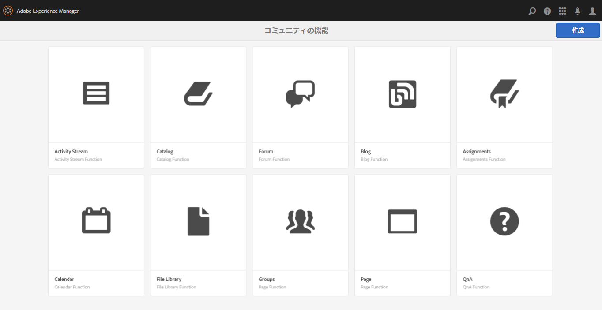

## 事前定義済み関数 {#pre-built-functions}

以下に、AEM Communitiesで提供される機能について簡単に説明します。 各機能は、コミュニティコンポーネントを含む 1 つ以上のAEMページで構成され、1 つの機能に簡単に組み込めるように、1 つの機能に結び付けられます。 [コミュニティサイトテンプレート](sites.md).

コミュニティサイトテンプレートは、ログイン、ユーザープロファイル、通知、メッセージング、サイトメニュー、検索、テーマ設定、ブランディング機能など、コミュニティサイトの構造を提供します。

### タイトルと URL の設定 {#title-and-url-settings}

**タイトル** および **URL** は、すべてのコミュニティ機能に共通のプロパティです。

コミュニティ機能がコミュニティサイトテンプレートに追加されたとき、または追加されたとき [修正](sites-console.md#modifying-site-properties) コミュニティサイトの構造では、機能のダイアログが開き、タイトルと URL を設定できます。

#### 設定機能の詳細 {#configuration-function-details}

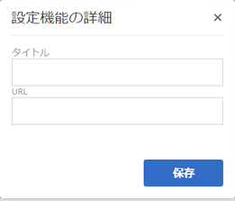

* **[!UICONTROL タイトル]**

*必須*) サイトの機能のメニューに表示されるテキスト

* **[!UICONTROL URL]**
(*必須*) URI の生成に使用される名前。 名前は [命名規則](../../help/sites-developing/naming-conventions.md) AEMと JCR によって課せられます。

例えば、 [はじめに](getting-started.md) チュートリアル、場合は

* タイトル= Web ページ
* URL = page

次に、ページの URL がhttp://local_host:4503/content/sites/engage/en/page.htmlになり、そのページのメニューリンクが次のように表示されます。

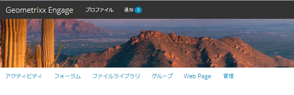

### アクティビティストリーム機能 {#activity-stream-function}

アクティビティストリーム機能は、 [アクティビティストリームコンポーネント](activities.md) すべてのビューを選択した状態（すべてのアクティビティ、ユーザーアクティビティ、フォロー） 関連トピック [Activity Stream Essentials](essentials-activities.md) 開発者向け

テンプレートに追加すると、次のダイアログが開きます。

#### 設定機能の詳細 {#configuration-function-details-1}

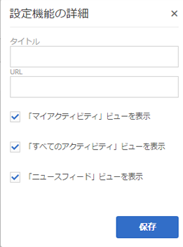

* 詳しくは、 [タイトルと URL の設定](#title-and-url-settings)
* **[!UICONTROL 「マイアクティビティ」ビューを表示]**
オンにすると、アクティビティページに、現在のメンバーがコミュニティ内で生成したアクティビティに基づいてアクティビティをフィルタリングするタブが表示されます。 初期設定はオンです。

* **[!UICONTROL 「すべてのアクティビティ」ビューを表示]**
オンにすると、アクティビティページにタブが表示され、現在のメンバーがアクセスできるコミュニティ内で生成されたすべてのアクティビティが含まれます。 初期設定はオンです。

* **[!UICONTROL 「ニュースフィード」ビューを表示]**
オンにすると、アクティビティページに、現在のメンバーがフォローしているアクティビティに基づいてアクティビティをフィルタリングするタブが含まれます。 初期設定はオンです。

### 割り当て機能 {#assignments-function}

割り当て機能は、 [イネーブルメントのためのコミュニティサイト](overview.md#enablement-community). コミュニティメンバーにイネーブルメントリソースを割り当てることができます。 関連トピック [割り当ての基本事項](essentials-assignments.md) 開発者向け

この関数は、 [イネーブルメントアドオン](enablement.md). イネーブルメントアドオンを実稼動環境で使用するには、追加のライセンスが必要です。

テンプレートに追加した場合、設定は [タイトルと URL の設定](#title-and-url-settings).

### ブログ機能 {#blog-function}

ブログ機能は、 [ブログコンポーネント](blog-feature.md) タグ付け、ファイルのアップロード、フォロー、メンバーが自己編集、投票、モデレートをおこなえるように設定されます。 関連トピック [ブログの基本事項](blog-developer-basics.md) 開発者向け

テンプレートに追加すると、次のダイアログが開きます。

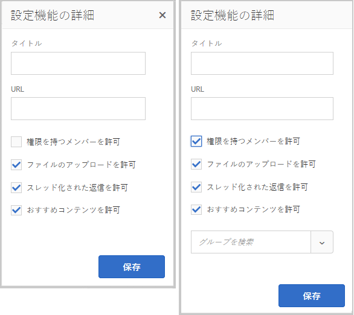

* 詳しくは、 [タイトルと URL の設定](#title-and-url-settings)
* **[!UICONTROL 権限を持つメンバーを許可]**
オンにすると、ブログでは権限を持つメンバーだけが記事を作成できるようになります。 [権限を持つメンバーグループ](users.md#privileged-members-group). オンにしないと、すべてのコミュニティメンバーが作成できます。 初期設定はオフです。

* **[!UICONTROL ファイルのアップロードを許可]**
オンにすると、メンバーがファイルをアップロードする機能がブログに含まれます。 初期設定はオンです。

* **[!UICONTROL スレッド化された返信を許可]**
オンにしないと、ブログは記事への返信（コメント）を許可しますが、コメントへの返信は許可されません。 初期設定はオンです。

* **[!UICONTROL おすすめコンテンツを許可]**
オンにすると、アイデアは次のように識別されます。 [おすすめコンテンツ](featured.md). 初期設定はオンです。

### カレンダー機能 {#calendar-function}

カレンダー関数は、 [カレンダーコンポーネント](calendar.md) タグ付けを許可するように設定されています。 関連トピック [カレンダーの基本事項](calendar-basics-for-developers.md) 開発者向け

テンプレートに追加すると、次のダイアログが開きます。

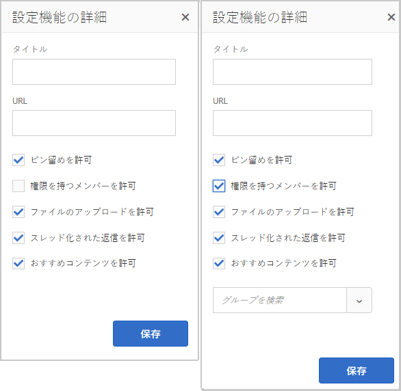

* 詳しくは、 [タイトルと URL の設定](#title-and-url-settings)
* **[!UICONTROL ピン留めを許可]**
オンにすると、フォーラムでトピックの返信をコメントのリストの先頭にピン留めできます。 初期設定はオンです。

* **[!UICONTROL 権限を持つメンバーを許可]**
オンにすると、ブログでは権限を持つメンバーだけが記事を作成できるようになります。 [権限を持つメンバーグループ](users.md#privileged-members-group). オンにしないと、すべてのコミュニティメンバーが作成できます。 初期設定はオフです。

* **[!UICONTROL ファイルのアップロードを許可]**
オンにすると、メンバーがファイルをアップロードする機能がブログに含まれます。 初期設定はオンです。

* **[!UICONTROL スレッド化された返信を許可]**
オンにしないと、ブログは記事への返信（コメント）を許可しますが、コメントへの返信は許可されません。 初期設定はオンです。

* **[!UICONTROL おすすめコンテンツを許可]**
オンにすると、アイデアは次のように識別されます。 [おすすめコンテンツ](featured.md). 初期設定はオンです。

### カタログ機能 {#catalog-function}

カタログ機能を使用すると、 [実施可能コミュニティ](overview.md#enablement-community) メンバー：割り当てられていないイネーブルメントリソースを参照します。 詳しくは、 [イネーブルメントリソースのタグ付け](tag-resources.md) および [カタログの基本事項](catalog-developer-essentials.md) 開発者向け

コミュニティサイトのすべてのイネーブルメントリソースと学習パスは、プロパティの場合はすべてのカタログに表示されます。 ` [Show in Catalog](resources.md)`が true に設定されている場合、エラーは発生しません。 リソースと学習パスを明示的に含めるには、 [プリフィルター](catalog-developer-essentials.md#pre-filters) をカタログに追加します。

この設定をテンプレートに追加すると、サイト訪問者に提供されるタグフィルターの設定に使用するタグ名前空間を指定できます。

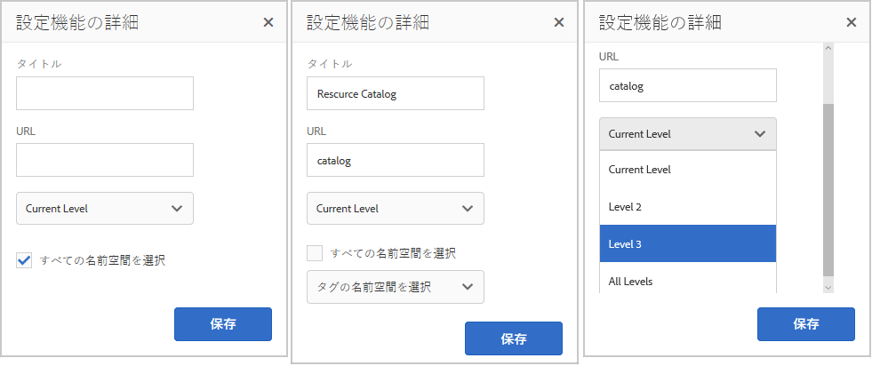

* 詳しくは、 [タイトルと URL の設定](#title-and-url-settings)
* **[!UICONTROL すべての名前空間を選択]**

   * 選択したタグ名前空間は、カタログに一覧表示されているイネーブルメントリソースのリストをフィルタリングするために、訪問者が選択できるタグを定義します。
   * オンにすると、コミュニティサイトで許可されているすべてのタグ名前空間を使用できます。
   * オフにした場合、コミュニティサイトに許可されている 1 つ以上の名前空間を選択できます。
   * 初期設定はオンです。

### おすすめコンテンツ機能 {#featured-content-function}

おすすめコンテンツ機能は、 [おすすめコンテンツコンポーネント](featured.md) コメントの追加や削除を許可するように設定されました。

コンテンツを特集する機能は、コンポーネントごとに許可または禁止できます ( [ブログ機能](#blog-function), [カレンダー機能](#calendar-function), [フォーラム機能](#forum-function), [アイディエーション関数](#ideation-function)、および [Q&amp;A 機能](#qna-function)) をクリックします。

テンプレートに追加した場合、設定は [タイトルと URL の設定](#title-and-url-settings).

### ファイルライブラリ機能 {#file-library-function}

ファイルライブラリ関数は、 [ファイルライブラリコンポーネント](file-library.md) コメントの追加や削除を許可するように設定されました。

テンプレートに追加した場合、設定は [タイトルと URL の設定](#title-and-url-settings).

### フォーラム機能 {#forum-function}

フォーラム機能は、 [フォーラムコンポーネント](forum.md) タグ付け、ファイルのアップロード、フォロー、メンバーが自己編集、投票、モデレートをおこなえるように設定されます。

テンプレートに追加すると、次のダイアログが開きます。

#### 設定機能の詳細 {#configuration-function-details-2}

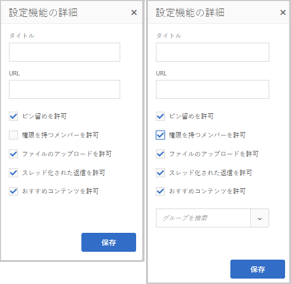

* 詳しくは、 [タイトルと URL の設定](#title-and-url-settings)
* **[!UICONTROL ピン留めを許可]**
オンにすると、フォーラムでトピックの返信をコメントのリストの先頭にピン留めできます。 初期設定はオンです。

* **[!UICONTROL 権限を持つメンバーを許可]**
オンにすると、フォーラムでは権限を持つメンバーのみがトピックを投稿できるようになり、 [権限を持つメンバーグループ](users.md#privileged-members-group). オンにしないと、すべてのコミュニティメンバーが投稿できます。 初期設定はオフです。

* **[!UICONTROL ファイルのアップロードを許可]**
オンにすると、メンバーがファイルをアップロードする機能がフォーラムに含まれます。 初期設定はオンです。

* **[!UICONTROL スレッド化された返信を許可]**
オンにしないと、フォーラムはトピックに対するコメントを許可しますが、それらのコメントに対する返信は許可されません。 初期設定はオンです。

* **[!UICONTROL おすすめコンテンツを許可]**
オンにすると、アイデアは次のように識別されます。 [おすすめコンテンツ](featured.md). 初期設定はオンです。

### グループ機能 {#groups-function}

>[!CAUTION]
>
>グループ機能は、 *not* は *最初でも唯一でも* 機能をサイトの構造内、またはコミュニティサイトテンプレート内に組み込むことができます。
>
>その他の関数 ( [ページ関数](#page-function)、を含め、最初にリストする必要があります。

グループ機能を使用すると、コミュニティメンバーは、パブリッシュ環境のコミュニティサイト内にサブコミュニティを作成できます。

基準 [設定](sites-console.md#groupmanagement) (Groups 関数が [コミュニティサイトテンプレート](sites.md)の場合、グループはパブリックまたはプライベートに設定でき、1 つ以上のコミュニティグループテンプレートを設定して、コミュニティグループが実際に作成される際に（パブリッシュ環境からなど）テンプレートを選択できます。 A [コミュニティグループテンプレート](tools-groups.md) フォーラムやカレンダーなど、グループページ用に作成するコミュニティ機能を指定します。

コミュニティグループを作成すると、新しいグループに対してメンバーグループが動的に作成され、メンバーの割り当てや参加が可能になります。 詳しくは、 [ユーザーとユーザーグループの管理](users.md).

コミュニティの時点 [機能パック 1](deploy-communities.md#latestfeaturepack)の場合、コミュニティグループは、 [コミュニティサイトのグループコンソール](groups.md)を有効にすると、パブリッシュ環境で作成される場合があります。

テンプレートに追加すると、次のダイアログが開きます。

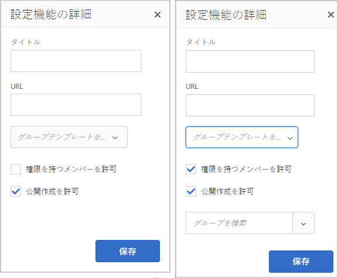

* 詳しくは、 [タイトルと URL の設定](#title-and-url-settings)
* **[!UICONTROL グループテンプレートを選択]**
（パブリッシュ環境で）新しいコミュニティグループの作成者が選択できる、1 つ以上の有効なグループテンプレートを選択できるプルダウンメニュー。

* **[!UICONTROL 権限を持つメンバーを許可]**
オンにすると、フォーラムでは権限を持つメンバーのみがトピックを投稿できるようになり、 [権限を持つメンバーのセキュリティグループ](users.md#privileged-members-group). オンにしないと、すべてのコミュニティメンバーが投稿できます。 初期設定はオフです。

* **[!UICONTROL 公開の作成を許可]**
オンにすると、許可されたコミュニティメンバーはパブリッシュ環境でグループを作成できます。 オフにした場合、新しいグループ（サブコミュニティ）は、コミュニティサイトのグループコンソールからオーサー環境でのみ作成できます。

   デフォルトは `checked` です。

### アイディエーション機能 {#ideation-function}

アイディエーション関数は、 [アイディエーションコンポーネント](ideation-feature.md).

テンプレートに追加すると、次のダイアログが開き、デフォルトのタイトルと URL 名、およびテンプレートのデフォルトの表示設定が指定されます。

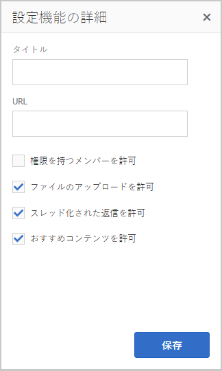

* 詳しくは、 [タイトルと URL の設定](#title-and-url-settings)
* **[!UICONTROL 権限を持つメンバーを許可]**
オンにすると、フォーラムでは権限を持つメンバーのみがトピックを投稿できるようになり、 [権限を持つメンバーのセキュリティグループ](users.md#privileged-members-group). オンにしないと、すべてのコミュニティメンバーが投稿できます。 初期設定はオフです。

* **[!UICONTROL ファイルのアップロードを許可]**
オンにすると、メンバーがファイルをアップロードする機能がアイデアに含まれます。 初期設定はオンです。

* **[!UICONTROL スレッド化された返信を許可]**
オンにしない場合、アイデアはトピックへの返信（コメント）を許可しますが、コメントへの返信は許可されません。 初期設定はオンです。

* **[!UICONTROL おすすめコンテンツを許可]**
オンにすると、アイデアは次のように識別されます。 [おすすめコンテンツ](featured.md). 初期設定はオンです。

### リーダーボード機能 {#leaderboard-function}

リーダーボード機能は、 [リーダーボードコンポーネント](enabling-leaderboard.md).

**注意**:リーダーボードコンポーネントには、さらなる設定が必要です *後* コミュニティサイトは、リーダーボード機能を含むコミュニティテンプレートから作成されます。 リーダーボードコンポーネントの [ルール](enabling-leaderboard.md#rules-tab) を指定する必要があります。これは、 [スコアとバッジ](implementing-scoring.md) コミュニティサイト用。

テンプレートに追加すると、次のダイアログが開き、デフォルトのタイトルと URL 名、およびテンプレートのデフォルトの表示設定が指定されます。

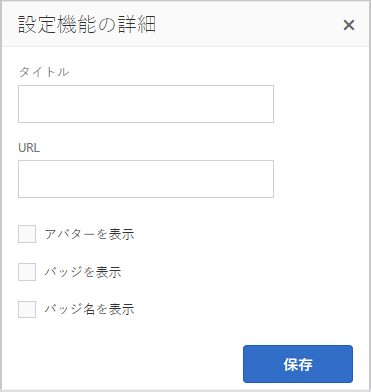

* 詳しくは、 [タイトルと URL の設定](#title-and-url-settings)
* **[!UICONTROL バッジを表示]**
オンにすると、リーダーボードにバッジアイコンの列が表示されます。

   初期設定はオフです。

* **[!UICONTROL バッジ名を表示]**
オンにすると、リーダーボードにバッジ名の列が表示されます。

   初期設定はオフです。

* **[!UICONTROL アバターを表示]**
オンにすると、メンバーのアバター画像がリーダーボードに含まれ、メンバーのプロファイルへの名前リンクの横に表示されます。

   初期設定はオフです。

### ページ機能 {#page-function}

ページ機能により、コミュニティサイトの機能に接続された空白のページがコミュニティサイトに追加されます。ログイン、メニュー、通知、メッセージング、テーマ設定、ブランディング。 コンテンツは、 [標準AEMオーサリングモード](../../help/sites-authoring/editing-content.md).

テンプレートに追加した場合、設定は [タイトルと URL の設定](#title-and-url-settings).

### Q&amp;A 機能 {#qna-function}

Q&amp;A 機能は、 [Q&amp;A コンポーネント](working-with-qna.md) タグ付け、ファイルのアップロード、フォロー、メンバーが自己編集、投票、モデレートをおこなえるように設定されます。

テンプレートに追加すると、権限を持つメンバーに対する制限が許可されます。

* 詳しくは、 [タイトルと URL の設定](#title-and-url-settings)
* **[!UICONTROL ピン留めを許可]**
オンにすると、フォーラムでトピックの返信をコメントのリストの先頭にピン留めできます。 初期設定はオンです。

* **[!UICONTROL 権限を持つメンバーを許可]**
オンにすると、Q&amp;A フォーラムでは、権限を持つメンバーに対してのみ、 [権限を持つメンバーグループ](users.md#privileged-members-group). オンにしないと、すべてのコミュニティメンバーが投稿できます。 初期設定はオフです。

* **[!UICONTROL ファイルのアップロードを許可]**
オンにすると、Q&amp;A フォーラムにメンバーがファイルをアップロードする機能が含まれます。 初期設定はオンです。

* **[!UICONTROL スレッド化された返信を許可]**
オンにしないと、Q&amp;A フォーラムでは投稿された質問に対するコメント（回答）が許可されますが、回答に対する返信は許可されません。 初期設定はオンです。

* **[!UICONTROL おすすめコンテンツを許可]**
オンにすると、アイデアは次のように識別されます。 [おすすめコンテンツ](featured.md). 初期設定はオンです。

## コミュニティ機能を作成 {#create-community-function}

コミュニティ機能を作成する機能には、 `Create Community Function` コミュニティ機能コンソールの上部にあるアイコン 同じAEMブループリントに基づく複数の関数を作成し、オーサー編集モードで開いて一意にカスタマイズできます。

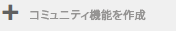

### コミュニティ機能名 {#community-function-name}

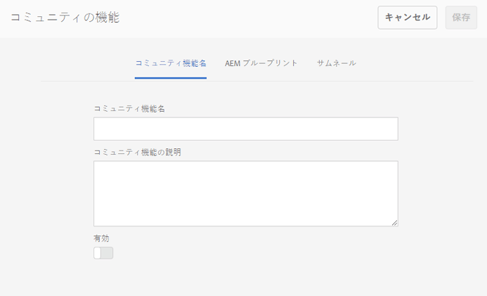

コミュニティ機能名パネルで、名前と説明、および機能を有効にするか無効にするかを設定します。

* **[!UICONTROL コミュニティ機能名]**
表示と保存に使用する関数名

* **[!UICONTROL コミュニティ機能の説明]**
表示する関数の説明

* **[!UICONTROL 無効/有効]**
関数が参照可能かどうかを制御する切り替えスイッチ

### AEM ブループリント {#aem-blueprint}

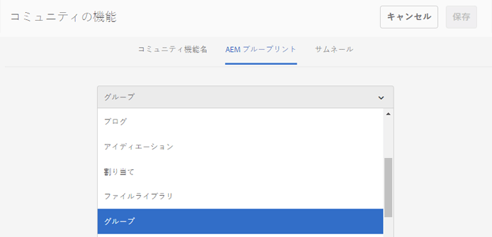

の `AEM Blueprint` パネルの場合は、コミュニティ機能の基盤となるブループリントを選択できます。

コミュニティ機能は、1 つ以上のページで構成されるミニサイトで、ログイン、ユーザープロファイル、通知、メッセージング、サイトメニュー、検索、テーマ設定、ブランディング機能など、コミュニティサイトに組み込むために事前に設定されています。 関数を作成した後は、次の操作を実行できます。 [関数を開く](#open-community-function) オーサー編集モードで、ページやコンポーネントの設定をカスタマイズします。

コミュニティ機能は [ライブコピー](../../help/sites-administering/msm.md#live-copies) の [ブループリント](../../help/sites-administering/msm-livecopy.md#creatingablueprint)を使用すると、関数に対して行われた変更をロールアウトできます。この変更は、 [コミュニティサイトテンプレート](sites.md) または [コミュニティグループテンプレート](tools-groups.md) 関数を含む ページレベルで変更を加えるために、ページを親ブループリントから関連付け解除することもできます。

関連トピック [マルチサイトマネージャ](../../help/sites-administering/msm.md).

### サムネール {#thumbnail}

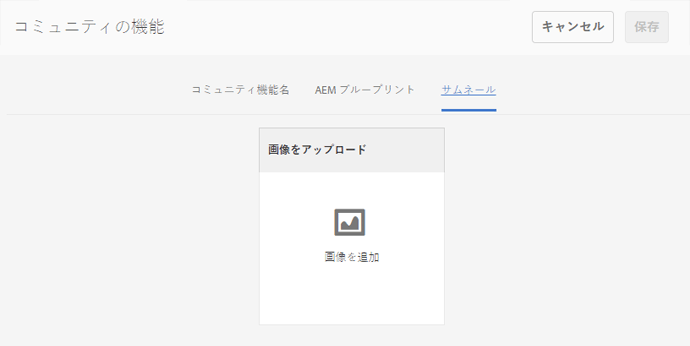

サムネールパネルでは、画像をアップロードして [コミュニティ機能コンソール](#community-functions-console).

## コミュニティ機能を開く {#open-community-function}

を選択します。 `Open Community Function` ページコンテンツをオーサリングし、機能コンポーネントの設定を変更するためのオーサー編集モードに入るアイコン。

### コンポーネントの設定 {#configuring-components}

コミュニティ機能は、AEMブループリントのライブコピーとして実装されます。詳しくは、以下に記載されています。 [マルチサイトマネージャ](../../help/sites-administering/msm.md).

ページコンテンツの作成だけでなく、コンポーネントの設定も可能です。

作成したコミュニティサイトのページでコンポーネントを設定する場合は、キャンセルが必要になる場合があります [継承](../../help/sites-administering/msm-livecopy.md#changing-live-copy-content) を設定します。 設定が完了したら、継承を再確立する必要があります。

設定の詳細については、 [コミュニティコンポーネント](author-communities.md) 作成者向け

## コミュニティ機能を編集 {#edit-community-function}

を選択します。 `Edit Community Function` アイコンをクリックし、 [コミュニティ機能の作成](#create-community-function)（関数の有効化または無効化を含む）
