# コミュニティグループコンソール {#community-groups-console}

グループコンソールを使用すると、コミュニティサイトの [テンプレート構造](sites-console.md#step1) 次を含む [グループ機能](functions.md#groups-function).

* グループは、他のグループ内にネストすることができます。これは、 [新しいグループの構造](tools-groups.md) には groups 関数が含まれます。
* オーサー環境の場合のみ、サイト作成ウィザードと同様のグループ作成ウィザードがあります。
* メンバーがパブリッシュ環境からグループを作成できるかどうかは、コミュニティサイト構造またはコミュニティグループ構造へのグループ機能の追加時に設定できます。

3 つのグループテンプレートのうち、 `Reference Group` テンプレートの構造には、グループ機能が含まれます。

コミュニティグループのいくつかのファセットを次に示します。

* 作成：新しいグループはオーサー環境でもオプションでパブリッシュ環境でも作成できます
* コントロール：グループは、開いているか、秘密の可能性があります
* ネスト：グループは、0 個以上のグループを含むことができます

>[!NOTE]
>
>[コミュニティグループコンソールが追加される](https://helpx.adobe.com/in/experience-manager/6-3/communities/using/version-history.html#FeaturePack1FP1)前にパブリッシュ環境で作成されたコミュニティグループは、コミュニティグループコンソールに一覧表示されないため、コンソールを使用して変更することはできません。

>[!NOTE]
>
>このグループコンソールはコミュニティサイトコンソールからのみアクセス可能で、メンバーと混同しないでください [グループコンソール](members.md) （メンバーグループの管理用）
>
>メンバーグループは、パブリッシュ環境に登録されたユーザーグループであり、[トンネルサービス](deploy-communities.md#tunnel-service-on-author)を使用してオーサー環境からアクセスします。

## グループ作成 {#group-creation}

グループコンソールにアクセスするには：

* オーサー環境で、管理者権限でログインします。
* グローバルナビゲーションから： **[!UICONTROL コミュニティ/サイト]**
* 既存のコミュニティサイトフォルダを選択して開きます。
* フォルダー内のコミュニティサイトのインスタンスを選択

   * コミュニティサイトの構造には、グループ機能を含める必要があります
   * これらのスクリーンショットは、次の手順の後のはじめにのチュートリアルからのものです。 [パブリッシュ環境でのグループの作成](published-site.md)

**[!UICONTROL グループフォルダー]**&#x200B;を選択して、開きます。

開いたら、オーサーまたはパブリッシュで作成されたすべての既存のグループが表示されます。

このグループコンソールから、新しいグループを作成できます。

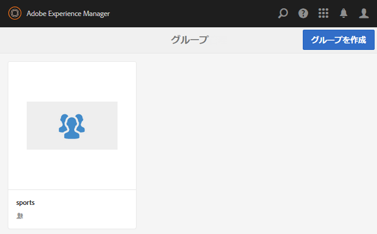

* 選択 **[!UICONTROL グループを作成]** ボタン

### 手順 1：コミュニティグループテンプレート {#step-community-group-template}

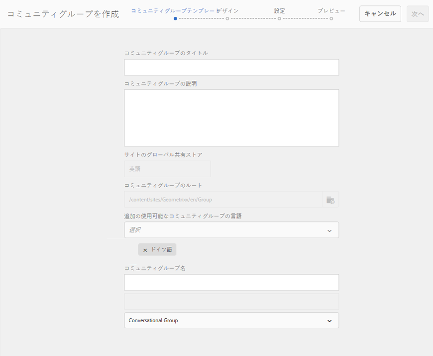

* **[!UICONTROL コミュニティグループのタイトル]**:グループの表示タイトル。

   タイトルは、グループのパブリッシュされたサイトに表示されます。

* **[!UICONTROL コミュニティグループの説明]**:グループの説明。
* **[!UICONTROL コミュニティグループのルート]**:グループのルートパス。

   デフォルトのルートは親サイトですが、ルートは Web サイト内の任意の場所に移動できます。変更することはお勧めしません。

* **[!UICONTROL 追加の利用可能なコミュニティグループの言語]** メニュー：プルダウンメニューを使用して、使用可能なコミュニティグループの言語を選択します。 このメニューには、親コミュニティサイトを作成できる言語がすべて表示されます。この中から言語を選択することで、1 回の手順で複数のロケールにグループを作成できます。指定した複数の言語で、それぞれのコミュニティサイトのグループコンソールに同じグループが作成されます。

* **[!UICONTROL コミュニティグループ名]**:URL に表示されるグループのルートページの名前

   * グループの作成後に名前を簡単に変更できないので、名前を再確認します。
   * ベース URL が `Community Group Name`
   * 有効な URL に「.html」を追加します。

      *例：*, `http://localhost:4502/content/sites/mysight/en/mygroup.html`

* **[!UICONTROL コミュニティグループテンプレート]** メニュー：プルダウンメニューを使用して、使用可能な [コミュニティグループテンプレート](tools.md).

### 手順 2：デザイン {#step-design}

#### コミュニティグループのテーマ {#community-group-theme}

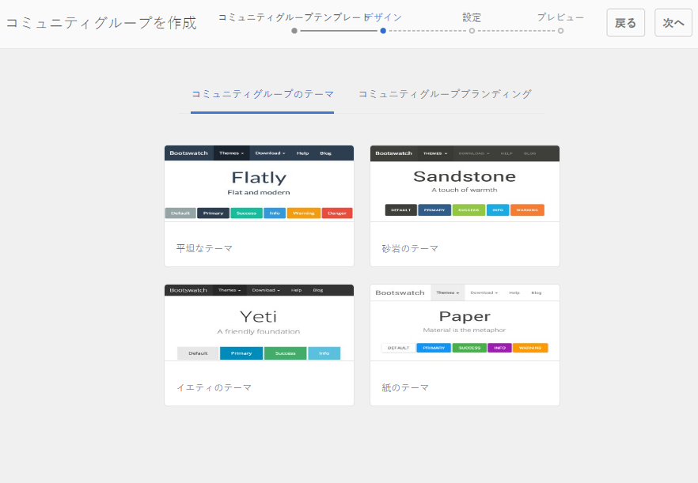

このフレームワークでは、レスポンシブで柔軟なサイトデザインを実現できるよう、`Twitter Bootstrap` を使用しています。プリロードされた多数のBootstrapテーマの 1 つを選択して、選択したコミュニティグループテンプレートのスタイルを設定したり、Bootstrapテーマをアップロードしたりできます。

選択すると、テーマの上に不透明な青色のチェックマークのオーバーレイが表示されます。

親サイトのテーマとは異なるテーマを選択することもできます。

コミュニティサイトがパブリッシュされた後、[プロパティを編集](#modifying-group-properties)して、別のテーマを選択できます。

#### コミュニティグループブランディング {#community-group-branding}

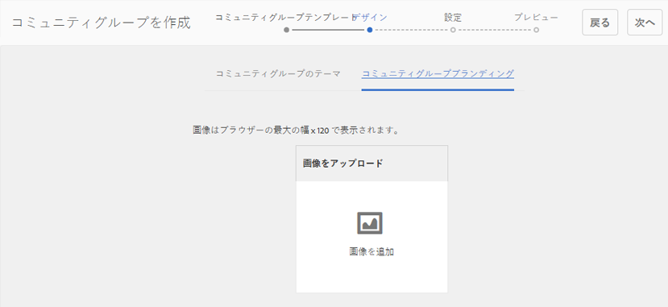

コミュニティサイトブランディングとは、各ページ上部にヘッダーとして表示される画像のことです。他のサイトページとは異なるグループのバナーを表示できます。

画像の幅は、予想されるブラウザー内でのページの表示に合わせます。画像の高さは 120 ピクセルにします。

画像を選択するときは、次の点に注意してください。

* 画像の高さは、画像の上端から 120 ピクセルの範囲で切り抜かれます
* 画像はブラウザーウィンドウの左端に固定されます
* 画像のサイズは変更されず、画像の幅が次のようになる。

   * ブラウザーの幅より小さい場合、画像は水平方向に繰り返されます
   * ブラウザーの幅より大きい場合、画像は切り抜かれたように見えます

### 手順 3：設定 {#step-settings}

#### モデレート {#moderation}

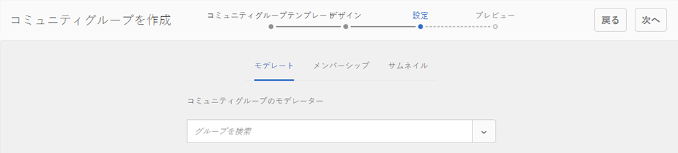

デフォルトで、親コミュニティサイトのモデレーターリストが継承されます。

グループに固有のモデレーターを追加できます。

* （パブリッシュ環境から）メンバーを検索して、モデレーターとして追加する

#### メンバーシップ {#membership}

メンバーシップ設定によって、コミュニティグループをセキュリティ保護する 3 つの方法のうち 1 つを選択できます。

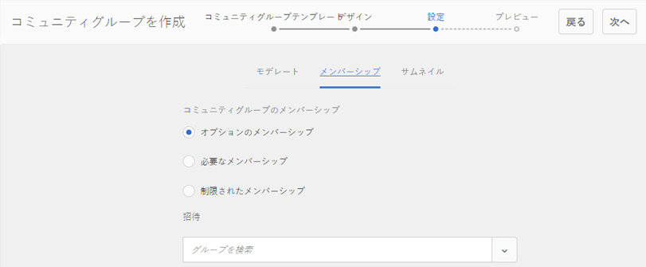

* オプションのメンバーシップ

   選択した場合、コミュニティグループはパブリックグループになります。 サイトメンバーは、グループに明示的に参加せずに、グループに参加し、投稿することができます。 デフォルトで選択されています。
* 必要なメンバーシップ

   選択した場合、コミュニティグループはオープングループになります。 コミュニティサイトのメンバーは、グループのコンテンツを表示できますが、コンテンツを投稿するには、グループに参加する必要があります。 メンバーは、 `Join` 」ボタンをクリックします。 初期設定では選択されていません。

* 制限されたメンバーシップ

   選択した場合、コミュニティグループは秘密グループになります。 コミュニティメンバーは明示的に招待される必要があります。 招待されたメンバーが検索ボックスに入力されます。 メンバーは後で [メンバーコンソールとグループコンソール](members.md) オーサー環境。 初期設定では選択されていません。

#### サムネイル {#thumbnail}

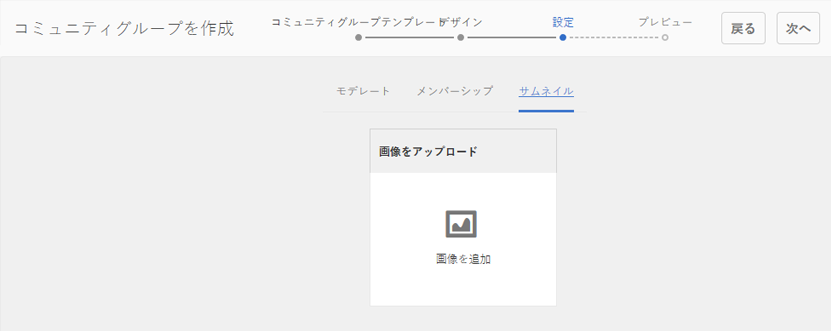

サムネイルは、オーサーおよびパブリッシュのグループに対して表示される画像です。

グループ画像の最適なサイズは、サポートされている画像形式（JPG や PNG など）の 170 x 90 ピクセルです。

画像を追加しない場合は、デフォルトの画像が表示されます。

### 手順 4：グループの作成 {#step-create-group}

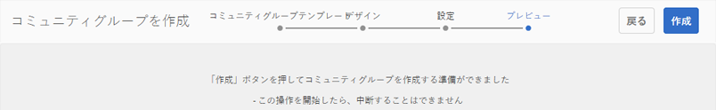

調整が必要な場合は、 **戻る** ボタンを使用して作成します。

1 回 **作成** が選択されて開始された場合、グループの作成プロセスは中断できません。

処理が完了すると、新しいサブコミュニティサイト（グループ）のカードがコミュニティサイトグループコンソールに表示されます。このコンソールから、作成者はページの内容を追加したり、サイトのプロパティを変更したりできます。

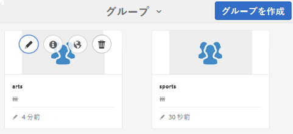

>[!NOTE]
>
>それぞれのコミュニティサイトのコミュニティグループコンソールに、[手順 1：コミュニティグループテンプレート](groups.md#step1communitygrouptemplate)の「追加の使用可能なコミュニティグループの言語」で指定したすべての言語でグループが作成されます。

## グループコンテンツのオーサリング {#authoring-group-content}

グループのページコンテンツは、他の AEM ページと同じツールでオーサリングできます。オーサリング用にグループを開くには、グループカードの上にマウスポインターを置くと表示される「サイトを開く」アイコンを選択します。

## グループのプロパティの変更 {#modifying-group-properties}

コミュニティグループの作成プロセス中に指定された既存のサブコミュニティサイトのプロパティは、グループカードにカーソルを合わせると表示される「サイトを編集」アイコンを選択して変更できます。

以下のプロパティの詳細は、[グループ作成](#group-creation)で説明した内容と同じです。ネストされたグループは、パブリッシュ環境で作成された場合でも、オーサー環境で作成された場合でも、変更できます。

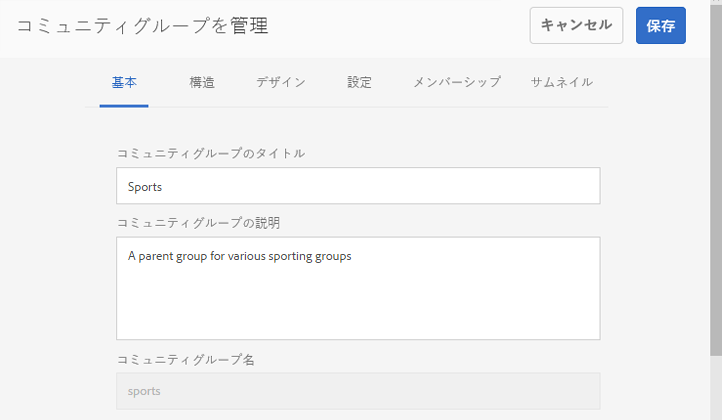

### 基本事項の変更 {#modify-basic}

基本パネルでは、次のものを変更できます。

* コミュニティグループのタイトル
* コミュニティグループの説明

コミュニティグループ名は変更できません。

別のコミュニティグループテンプレートを選択しても、テンプレートとサイトの間に関係は残っていないので、既存のコミュニティグループサイトに影響が及ぶことはありません。

その一方で、サブコミュニティの[構造](#modify-structure)は変更できます。

### 構造の変更 {#modify-structure}

構造パネルでは、オーサー環境またはパブリッシュ環境でサブコミュニティを作成するときに選択したコミュニティグループテンプレートから最初に作成した構造を変更できます。パネルから、次の操作を実行できます。

* 追加の [コミュニティ機能](functions.md) サイト構造内に
* サイト構造内のコミュニティ機能のインスタンスで、次の操作を実行します。

   * **`gear icon`**

      表示タイトルや URL 名、 [権限を持つメンバーグループ](users.md#privilegedmembersgroups)

   * **`trashcan icon`**

      サイト構造から関数を削除（削除）します

   * **`grid icon`**

      サイトのトップレベルナビゲーションバーに表示される機能の順序を変更する

>[!CAUTION]
>
>表示タイトルは副作用なしに変更できますが、コミュニティサイトに属するコミュニティ機能の URL 名を編集することはお勧めしません。
>
>例えば、URL の名前を変更しても、既存の UGC は移動されません。そのため、UGC が「失われる」ことになります。

>[!CAUTION]
>
>グループ機能は、 *not* は *最初でも唯一でも* 関数を使用して、サイト構造内で使用できます。
>
>他の機能（[ページ機能](functions.md#page-function)など）を含め、その機能を 1 番目にリストする必要があります。

#### 例：サブコミュニティ（グループ）構造へのカレンダー機能の追加 {#example-adding-a-calendar-function-to-a-sub-community-group-structure}

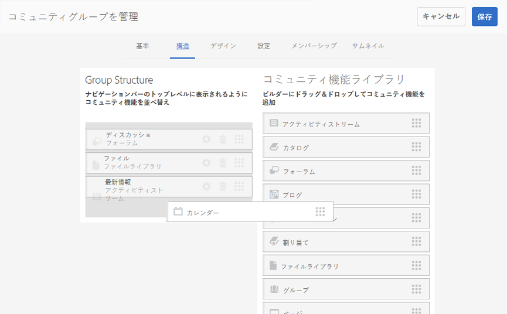

### デザインの変更 {#modify-design}

デザインパネルでは、次のものを変更できます。

* [コミュニティグループのテーマ](#community-group-theme)
* [コミュニティグループブランディング](#community-group-branding)

   * パネルの下部までスクロールして、ブランド画像を変更します。

### 設定の変更 {#modify-settings}

設定パネルでは、コミュニティの[モデレーター](#moderation)を追加できます。

### メンバーシップの変更 {#modify-membership}

[メンバーシップ](#membership)パネルは情報提供のみを目的としています。設定されたグループメンバーシップのタイプを、オプション、必須、制限のどれであっても変更できません。

### サムネイルの変更 {#modify-thumbnail}

[サムネイル](#thumbnail)パネルでは、コミュニティグループを表す画像をアップロードできます。この画像は、パブリッシュ環境でサイト訪問者に表示され、オーサー環境のコミュニティサイトのグループコンソールにも表示されます。

## グループの公開 {#publishing-the-group}

コミュニティグループを新しく作成または変更した後、 `Publish Site` アイコン

グループが正常に公開されると、メッセージが表示されます。

>[!CAUTION]
>
>親コミュニティサイトおよび親グループが既に公開されている必要があります。
>
>コミュニティサイトおよびネストされたグループは、階層の上から下の順に公開される必要があります。

## グループの削除 {#deleting-the-group}

コミュニティグループコンソール内のグループを削除するには、グループを削除アイコンを選択します。このアイコンは、グループにマウスポインターを置くと表示されます。

グループを削除すると、グループに関連付けられているアイテムはすべて削除されます。例えば、グループのコンテンツはすべて永久に削除され、ユーザーメンバーシップはシステムから削除されます。
