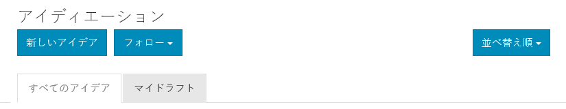
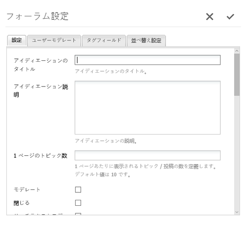
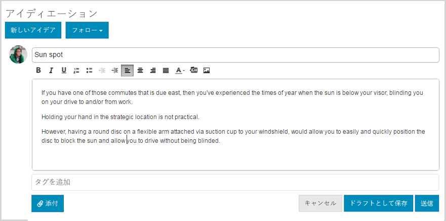
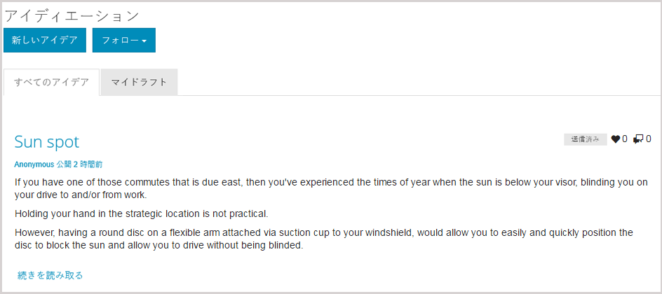
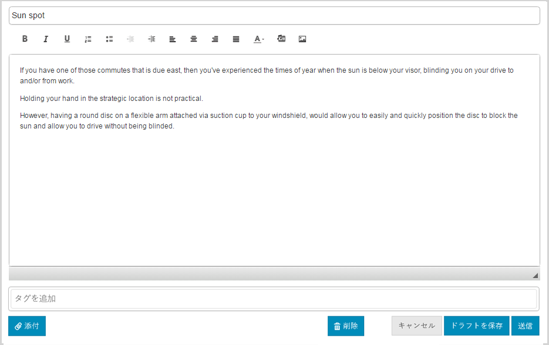
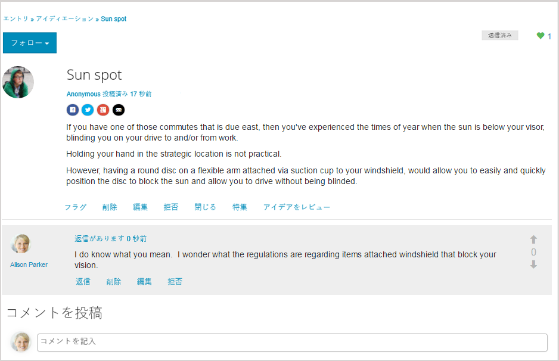

# アイディエーション機能 {#ideation-feature}

## はじめに {#introduction}

アイディエーション機能は、パブリッシュ環境でサインインしたサイト訪問者（コミュニティメンバー）が以下を実行できる領域を提供します。

* アイデアを作成してコミュニティと共有する
* アイデアの表示とコメント
* アイデアに従う
* アイデアに投票

ドキュメントのこの節では、

* AEMサイトへのアイディエーション機能の追加
* アイディエーションコンポーネントの設定

## ページへのアイディエーションの追加 {#adding-a-ideation-to-a-page}

を追加するには、以下を実行します。 `Ideation` コンポーネントをオーサリングモードでページに追加する場合は、コンポーネントブラウザーを使用して `Communities / Ideation` をドラッグし、ページ上のアイデアが表示される場所に配置します。

必要な情報については、 [コミュニティコンポーネントの基本](basics.md).

次の場合に [必要なクライアント側ライブラリ](ideation.md#essentials-for-client-side) が含まれる場合、この方法で `Ideation`コンポーネントが表示されます。

## アイディエーションの設定 {#configuring-an-ideation}

配置された `Ideation` アクセスして選択するコンポーネント `Configure` 編集ダイアログを開くアイコン。

 

### 「設定」タブ {#settings-tab}

以下 **[!UICONTROL 設定]** タブで、アイデアとコメントの設定を指定します。

* **[!UICONTROL アイディエーションのタイトル]**
アイデアの表示タイトル。 初期設定は です。 
`Ideation`

* **[!UICONTROL アイディエーションの説明]**
アイデアのサブタイトルとして表示する説明。 デフォルトでは説明はありません。

* **[!UICONTROL 1 ページのトピック数]**
1 ページに表示されるアイデア/投稿の数を定義します。 初期設定は 10 です。

* **[!UICONTROL モデレート]**
オンにすると、アイデアやコメントの投稿を公開サイトに表示する前に承認が必要になります。 初期設定はオフです。

* **[!UICONTROL クローズ]**
オンにすると、アイディエーションフォーラムは新しいアイデアやコメントを受け付けなくなります。 初期設定はオフです。

* **[!UICONTROL リッチテキストエディター]**
オンにすると、マークアップを使用してアイデアとコメントを入力できます。 初期設定はオフです。

* **[!UICONTROL タグ付けを許可]**
オンにすると、メンバーは投稿にタグラベルを追加できます ( **[!UICONTROL タグフィールド]** 」タブ ) をクリックします。 初期設定はオフです。

* **[!UICONTROL ファイルのアップロードを許可]**
オンにすると、アイデアまたはコメントに添付ファイルを追加できます。 初期設定はオフです。

* **[!UICONTROL 最大ファイルサイズ]**
次の場合にのみ関連します。 
`Allow File Uploads` がオンになっている。 このフィールドは、アップロードするファイルのサイズ（バイト単位）を制限します。 初期設定は104857600(10 MB) です。

* **[!UICONTROL 許可されているファイルタイプ]**
次の場合にのみ関連します。 
`Allow File Uploads` がオンになっている。 「ドット」区切り文字を使用したファイル拡張子のコンマ区切りリスト。 例：.jpg、.jpeg、.png、.doc、.docx、.pdf ファイルタイプが指定されている場合、指定されていないファイルのアップロードは許可されません。 初期設定では何も指定されず、すべてのファイルタイプが許可されます。

* **[!UICONTROL 添付する画像ファイルの最大サイズ]**
「ファイルのアップロードを許可」がオンの場合にのみ関連します。 アップロードされた画像ファイルの最大バイト数。 初期設定は2097152 (2 MB) です。

* **[!UICONTROL 返信を許可]**
オンにすると、アイデアに投稿されたコメントに対する返信を許可します。 初期設定はオフです。

* **[!UICONTROL ユーザーによるコメントおよびトピックの削除を許可]**
オンにすると、メンバーは自分が投稿したコメントやアイデアを削除できます。 初期設定はオフです。

* **[!UICONTROL フォローを許可]**
オンにすると、アイデアの投稿に次の機能が含まれ、メンバーは [通知済み](notifications.md) 新しい投稿の数。 初期設定はオフです。

* **[!UICONTROL メール購読を許可]**
オンにすると、新しい投稿をメールでメンバーに通知することを許可します ([購読](subscriptions.md)) をクリックします。 必要 `Allow Following` チェックされ [電子メール設定済み](email.md). 初期設定はオフです。

* **[!UICONTROL 投票を許可]**
オンにすると、アイデアのコメントに対する投票を許可します。 初期設定はオフです。

* **[!UICONTROL バッジを表示]**
オンにすると、獲得および割り当て済みを表示します [バッジ](implementing-scoring.md) 会員の考えで 初期設定はオフです。

* **[!UICONTROL おすすめコンテンツを許可]**
オンにすると、アイデアを [おすすめコンテンツ](featured.md). 初期設定はオフです。

### 「ユーザーモデレート」タブ {#user-moderation-tab}

以下 **[!UICONTROL ユーザーモデレート]** タブで、投稿されたアイデアやコメント（ユーザー生成コンテンツ）の管理方法を指定します。 詳しくは、 [ユーザー生成コンテンツのモデレート](moderate-ugc.md).

* **[!UICONTROL 投稿を拒否]**
オンにすると、信頼できるメンバーのモデレーターは、投稿を拒否し、公開フォーラムに投稿が表示されなくなります。 初期設定はオフです。

* **[!UICONTROL トピックを閉じる/再度開く]**
オンにすると、信頼されているメンバーモデレーターは、トピックを閉じてさらに編集やコメントを行ったり、トピックを再度開いたりできます。 初期設定はオフです。

* **[!UICONTROL 投稿にフラグを設定]**
オンにすると、メンバーは他のユーザーのトピックまたはコメントに「不適切」のフラグを設定できます。 初期設定はオフです。

* **[!UICONTROL フラグ設定理由リスト]**
オンにすると、メンバーはトピックまたはコメントに「不適切」のフラグを設定した理由をドロップダウンリストから選択できます。 初期設定はオフです。

* **[!UICONTROL カスタムフラグ設定理由]**
オンにすると、メンバーはトピックまたはコメントに「不適切」のフラグを設定した独自の理由を入力できます。 初期設定はオフです。

* **[!UICONTROL モデレートのしきい値]**
メンバーがトピックまたはコメントに何回フラグを設定したらモデレーターに通知するかを指定します。 初期設定は 1 （1 回）です。

* **[!UICONTROL フラグ付け制限]**
トピックまたはコメントに何回フラグを設定したら、公開ビューで非表示にするかを指定します。 -1 に設定した場合、フラグ付きのトピックまたはコメントが公開ビューで非表示になることはありません。 それ以外の場合は、この数はモデレートのしきい値以上にする必要があります。 デフォルトは 5 です。

### 「タグフィールド」タブ {#tag-field-tab}

以下 **[!UICONTROL タグフィールド]** 」タブに追加します。タグが適用される場合は、 **[!UICONTROL 設定]** タブは、選択した名前空間に応じて制限されます。

* **[!UICONTROL 許可された名前空間]**
次の場合に関連 
`Allow Tagging` が **設定** タブをクリックします。 適用できるタグは、チェックされた名前空間カテゴリ内のタグに限定されます。 名前空間のリストには、「標準タグ」（デフォルトの名前空間）と「すべてのタグを含める」が含まれます。 初期設定はオフです。これは、すべての名前空間が許可されていることを意味します。

* **[!UICONTROL 提案の制限]**
フォーラムに投稿するメンバーに提案として表示するタグの数を入力します。 値： 
**-** 1 は制限なしを意味します。 初期設定は 0 です。

### 「並べ替え設定」タブ {#sort-settings-tab}

以下 **[!UICONTROL 並べ替え設定]** タブで、投稿されたコメントを表示する際の並べ替え方法を指定します。

* **[!UICONTROL 並べ替え基準]**
許可されている並べ替えの選択項目をすべてオンにします。 
`Newest, Oldest, Last Updated, Most Viewed, Most Active, Most Followed and Most Liked` を使用して作成します。デフォルトは `Newest, Oldest, Last Updated` です。

* **[!UICONTROL デフォルトとして設定]**
プルダウンして、オンにした並べ替えオプションの 1 つを選択し、デフォルトとして表示します。 初期設定は です。 
`Newest`

* **[!UICONTROL Analytics 並べ替えの時間オプションの選択]**
プルダウンして次のいずれかを選択 
`All, Last 24 Hours, Last 7 Days, Last 30 Days` を使用して作成します。デフォルトは `All` です。

## サイト訪問者エクスペリエンス {#site-visitor-experience}

### アイデアの作成 {#creating-idea}

すべてのコミュニティ機能と同様に、サインインしていない場合、サイトの訪問者はアイデアを読み、他の人の意見を（コメントや投票/いいね！を通じて）閲覧するだけで済みます。

サインインすると、メンバーは新しいアイデアを作成できます。

アイデアを送信する前に、メンバーは下書きを保存できます。

次を選択すると、 `Save as Draft` 」ボタンをクリックすると、ドラフトが保存されます。

保存された下書きを `My Drafts` タブ、選択 `Read More` 編集モードに戻すには：

#### フィードバックの提供 {#providing-feedback}

アイデアが公開されると、他のメンバーがサインインしてアイデアを開く ( `Read More`) やアイデアに似て、投票数に追加し、コメントを作成します。

### 追加情報 {#additional-information}

詳しくは、 [アイディエーションの基本事項](ideation.md) 開発者向けのページ

投稿されたトピックおよびコメントのモデレートについては、 [ユーザー生成コンテンツのモデレート](moderate-ugc.md).

投稿されたトピックおよびコメントのタグ付けについては、 [ユーザー生成コンテンツのタグ付け](tag-ugc.md).
