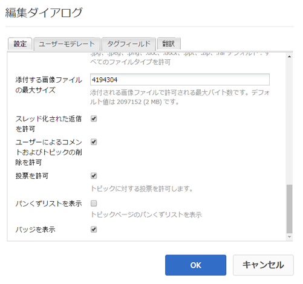
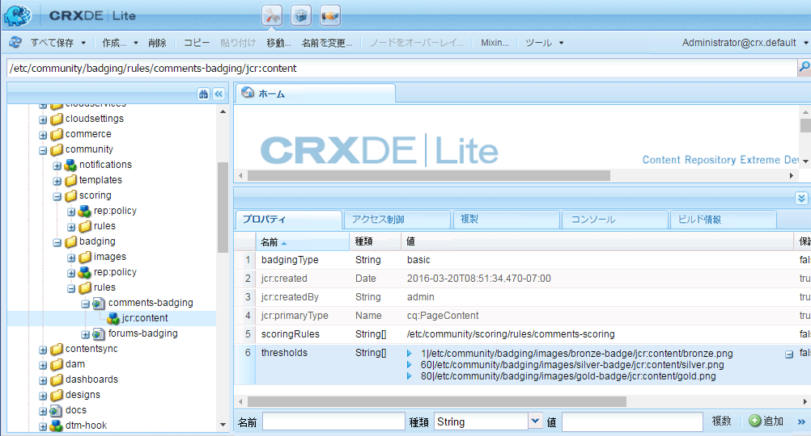
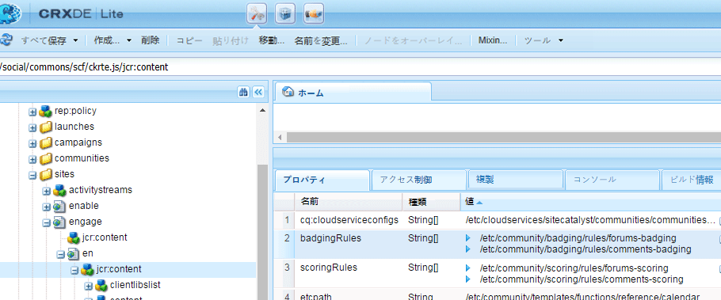
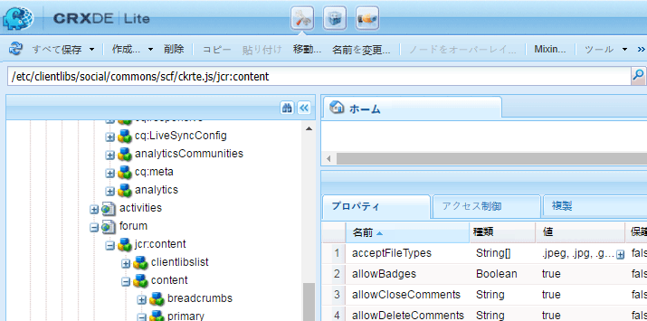

# コミュニティのスコアとバッジ {#communities-scoring-and-badges}

>[!CAUTION]
>
>AEM 6.4 の拡張サポートは終了し、このドキュメントは更新されなくなりました。 詳細は、 [技術サポート期間](https://helpx.adobe.com/jp/support/programs/eol-matrix.html). サポートされているバージョンを見つける [ここ](https://experienceleague.adobe.com/docs/?lang=ja).

## 概要 {#overview}

AEM Communitiesのスコアとバッジ機能を使用すると、コミュニティメンバーを特定し、報奨を与えることができます。

スコアとバッジの主な側面は次のとおりです。

* [バッジを割り当て](#assign-and-revoke-badges) コミュニティ内のメンバーの役割を特定するには

* [バッジの基本的な授与](#enable-scoring) メンバーの参加を奨励するために（作成されたコンテンツの数量）
* [バッジの高度な授与](advanced.md) メンバーをエキスパートとして識別する（作成されたコンテンツの質）

**注意** バッジの授与は [デフォルトでは有効になっていません](implementing-scoring.md#main-pars-text-237875536).

>[!CAUTION]
>
>CRXDE Liteに表示される実装構造は、UI が使用可能になった後で変更される場合があります。

## バッジ {#badges}

バッジは、コミュニティ内での役割または地位を示すために、メンバーの名前の下に配置されます。 バッジは、画像として、または名前として表示できます。 画像として表示される場合、この名前はアクセシビリティのための代替テキストとして含まれます。

デフォルトでは、バッジは次の場所のリポジトリに配置されます。

* /etc/community/badging/images

別の場所に保存されている場合は、すべてのユーザーが読み取りアクセス可能である必要があります。

UGC では、バッジをルールに従って割り当てたか、獲得したかを区別します。 現在は、割り当てられたバッジがテキストとして表示され、獲得したバッジが画像として表示されます。

### バッジ管理 UI {#badge-management-ui}

コミュニティ [バッジコンソール](badges.md) は、獲得（与えられる）時やコミュニティで特定の役割を担う（割り当てられる）時に、メンバーに対して表示できるカスタムバッジを追加する機能を提供します。

### 割り当てられたバッジ {#assigned-badges}

ロールベースのバッジは、コミュニティ内での役割に基づいて、管理者がコミュニティメンバーに割り当てます。

割り当てられた（および待ち受けの）バッジは、選択した [SRP](srp.md) およびは直接アクセスできません。 GUI が使用できるようになるまで、ロールベースのバッジを割り当てる唯一の方法は、コードまたは cURL を使用して割り当てることです。 cURL の手順については、「 [バッジの割り当てと取り消し](#assign-and-revoke-badges).

このリリースには、次の 3 つの役割ベースのバッジが含まれています。

* モデレーター

   `/etc/community/badging/images/moderator/jcr:content/moderator.png`

* グループマネージャー

   `/etc/community/badging/images/group-manager/jcr:content/group-manager.png`

* 権限を持つメンバー

   `/etc/community/badging/images/privileged-member/jcr:content/privileged-member.png`


### 授与されたバッジ {#awarded-badges}

報酬ベースのバッジは、コミュニティ内のアクティビティに適用されるルールに基づいて、スコア付けサービスによってコミュニティメンバーに付与されます。

アクティビティに対する報酬としてバッジを表示するには、次の 2 つの処理が必要です。

* バッジは必ず設定します [有効](#enable-badges-for-component) フィーチャコンポーネント用
* スコアルールとバッジルールは次の条件を満たす必要があります [適用](#apply-rules-to-content) を、コンポーネントが配置されているページ（または上位ページ）に追加します。

このリリースには、次の 3 つの報酬ベースのバッジが含まれています。

* ゴールド

   `/etc/community/badging/images/gold-badge/jcr:content/gold.png`

* シルバー

   `/etc/community/badging/images/silver-badge/jcr:content/silver.png`

* ブロンズ

   `/etc/community/badging/images/bronze-badge/jcr:content/bronze.png`


>[!NOTE]
>
>「不適切」とフラグ付けされた投稿に対して負のポイントを割り当て、スコアの値に影響を与えるようにスコアルールを設定できます。 ただし、バッジを獲得すると、スコアリングポイントの削減やスコアリングルールの変更により、バッジは自動的に削除されません。
>
>授与されたバッジは、割り当てられたバッジと同じ方法で取り消すことができます。 詳しくは、 [バッジの割り当てと取り消し](#assign-and-revoke-badges) 」セクションに入力します。 今後の改善には、メンバーのバッジを管理する UI が含まれます。

### カスタムバッジ {#custom-badges}

カスタムバッジは、 [バッジコンソール](badges.md) バッジルールで割り当てるか指定します。

バッジコンソールからインストールすると、カスタムバッジはパブリッシュ環境に自動的にレプリケートされます。

## スコアリングを有効にする {#enable-scoring}

スコアリングは、デフォルトでは有効になっていません。 スコア付けとバッジの授与を設定して有効にする基本的な手順は次のとおりです。

* ポイント獲得のルールを指定する ([スコア付けルール](#scoring-rules))
* スコア付けルールごとに累積されたポイントに対して、 [バッジ](#badges) ([バッジルール](#badging-rules))

* [スコアルールとバッジルールをコミュニティサイトに適用する](#apply-rules-to-content)
* [コミュニティ機能のバッジを有効にする](#enable-badges-for-component)

詳しくは、 [クイックテスト](#quick-test) セクションを開き、フォーラムとコメントのデフォルトのスコアルールとバッジルールを使用して、コミュニティサイトのスコアを有効にします。

### コンテンツへのルールの適用 {#apply-rules-to-content}

スコアとバッジを有効にするには、プロパティを追加します `scoringRules` および `badgingRules`を、サイトのコンテンツツリー内の任意のノードに追加します。

サイトが既に公開されている場合は、すべてのルールを適用してコンポーネントを有効にした後、サイトを再公開します。

バッジが有効なコンポーネントに適用されるルールは、現在のノードまたはその上位ノード用のものです。

ノードのタイプがの場合 `cq:Page` （推奨）次に、CRXDE|Lite を使用して、プロパティをそのに追加します。 `jcr:content`ノード。

| **プロパティ** | **タイプ** | **説明** |
|---|---|---|
| badgingRules | 文字列[] | 配列のリスト [バッジルール](#badging-rules) |
| scoringRules | 文字列[] | 配列のリスト [スコア付けルール](#scoring-rules) |

>[!NOTE]
>
>スコアルールがバッジの授与に影響を与えないように見える場合は、バッジルールの scoringRules プロパティでスコアルールがブロックされていないことを確認します。 「 [バッジルール](#badging-rules).

### コンポーネントのバッジを有効にする {#enable-badges-for-component}

スコアルールとバッディングルールは、 [オーサリングモード](author-communities.md).

boolean プロパティ `allowBadges`コンポーネントインスタンスのバッジの表示を有効または無効にします。 これは、 [コンポーネント編集ダイアログ](author-communities.md) フォーラム、Q&amp;A、コメントコンポーネントの場合は、「 」というラベルの付いたチェックボックスを使用します。 **バッジを表示**.

#### 例：フォーラムコンポーネントインスタンスの allowBadges {#example-allowbadges-for-forum-component-instance}



>[!NOTE]
>
>フォーラム、Q&amp;A およびコメントで見つかった HBS コードを例として使用して、任意のコンポーネントをオーバーレイしてバッジを表示できます。

## スコアルール {#scoring-rules}

スコア付けルールは、バッジを授与するためのスコア付けの基礎です。

非常に簡単に、各スコアルールは 1 つ以上のサブルールのリストです。 バッジが有効な場合に適用するルールを識別するために、スコアルールがコミュニティサイトのコンテンツに適用されます。

スコア付けルールは継承されますが、加算的ではありません。 次に例を示します。

* page2 にスコアルール 2 が含まれ、その上位ページ 1 にスコアルール 1 が含まれる場合
* page2 コンポーネントのアクションは、rule1 と rule2 の両方を呼び出します。
* 両方のルールに同じに適用可能なサブルールが含まれる場合 `topic/verb`:

   * ルール 2 のサブルールのみがスコアに影響を与えます
   * 両方のサブルールのスコアは、一緒には追加されません

複数のスコアルールがある場合、スコアは各ルールごとに個別に維持されます。

スコア付けルールは、 `cq:Page` プロパティを含む `jcr:content`定義するサブルールのリストを指定するノード。

スコアは SRP に保存されます。

>[!NOTE]
>
>ベストプラクティス：各スコアルールに一意の名前を付けます。
>
>スコア付けルール名は、グローバルに一意である必要があります。同じ名前で終わるべきではありません。
>
>例 *not* 手順：\
>/etc/community/scoring/rules/site1/forums-scoring\
>/etc/community/scoring/rules/site2/forums-scoring

### スコアサブルール {#scoring-sub-rules}

スコア付けサブルールには、コミュニティに参加するための値の詳細を示すプロパティが含まれます。

各スコアサブルールは、

* 追跡されているアクティビティ
* 関連する特定のコミュニティ機能
* 与えられるポイント数

デフォルトでは、サブルールでコンテンツの所有者がポイント ( `forOwner`) をクリックします。

各サブルールは、1 つ以上のスコアルールに含めることができます。

通常、サブルールの名前は、 *件名、オブジェクト* および *動詞*. 次に例を示します。

* member-comment-create
* member-receive-vote

サブルールは、タイプのノードです `cq:Page` プロパティを含む `jcr:content`ノード [動詞とトピック](#topics-and-verbs) .

<table> 
 <tbody> 
  <tr> 
   <th>プロパティ</th> 
   <th>タイプ</th> 
   <th> 値 説明</th> 
  </tr> 
  <tr> 
   <td><i><code>VERB</code></i></td> 
   <td>Long</td> 
   <td> 
    <ul> 
     <li>必須動詞はイベントアクションに対応する</li> 
     <li>動詞プロパティは少なくとも 1 つ必要です</li> 
     <li>動詞はすべて大文字で入力する必要があります</li> 
     <li>複数の動詞プロパティを使用できますが、重複はありません</li> 
     <li>値は、このイベントに適用するスコアです</li> 
     <li>値は正または負です</li> 
     <li>このリリースでサポートされている動詞のリストは、 <a href="#topics-and-verbs">トピックと動詞</a> セクション</li> 
    </ul> </td> 
  </tr> 
  <tr> 
   <td><code>topics</code></td> 
   <td>String[]</td> 
   <td> 
    <ul> 
     <li>オプション；サブルールを、イベントトピックで識別されるコミュニティコンポーネントに制限します。</li> 
     <li>指定した場合：値は、イベントトピックの複数値文字列です</li> 
     <li>このリリースのトピックのリストは、 <a href="#topics-and-verbs">トピックと動詞</a> セクション</li> 
     <li>デフォルトでは、動詞に関連付けられたすべてのトピックに適用されます</li> 
    </ul> </td> 
  </tr> 
  <tr> 
   <td><code>forOwner</code></td> 
   <td>ブーリアン</td> 
   <td> 
    <ul> 
     <li>オプション；メンバーが自分のコンテンツに対して行動を起こす場合は関係ありません</li> 
     <li>true の場合は、アクションを実行するコンテンツの所有者にスコアを適用します</li> 
     <li>false の場合は、アクションを実行するメンバーにスコアを適用します</li> 
     <li>デフォルトは false です。</li> 
    </ul> </td> 
  </tr> 
  <tr> 
   <td><code>scoringType</code></td> 
   <td>文字列</td> 
   <td> 
    <ul> 
     <li>オプション；スコアエンジンを識別します。</li> 
     <li>「basic」の場合は、数量に基づいてスコアエンジンを指定します。 
      <ul> 
       <li>リリースに含まれる</li> 
      </ul> </li> 
     <li>「詳細」の場合は、品質と数量に基づいてスコアエンジンを指定します 
      <ul> 
       <li>にはが必要です <a href="advanced.md">追加パッケージ</a></li> 
      </ul> </li> 
     <li>デフォルトは「basic」です。</li> 
    </ul> </td> 
  </tr> 
 </tbody> 
</table>

### 含まれるスコアルールとサブルール {#included-scoring-rules-and-sub-rules}

このリリースには、 [フォーラム機能](functions.md#forum-function) （フォーラム機能の「フォーラム」および「コメント」コンポーネントごとに 1 つずつ）:

1. /etc/community/scoring/rules/comments-scoring

   * subRules[] =

      /etc/community/scoring/rules/subrules/member-comment-create

      /etc/community/scoring/rules/subrules/member-receive-vote

      /etc/community/scoring/rules/subrules/member-give-vote

      /etc/community/scoring/rules/subrules/member-is-moderated

1. /etc/community/scoring/rules/forums-scoring

   * subRules[] =

      /etc/community/scoring/rules/subrules/member-forum-create

      /etc/community/scoring/rules/subrules/member-receive-vote

      /etc/community/scoring/rules/subrules/member-give-vote

      /etc/community/scoring/rules/subrules/member-is-moderated

**メモ：**

* 両方 `rules`および `sub-rules` ノードのタイプは cq:Page です。

* `subRules`は String 型の属性です[] 規則の `jcr:content` ノード

* `sub-rules` は、様々なスコアルールで共有できます
* `rules`はリポジトリの場所に配置し、全員に対して読み取り権限を付与する必要があります

   * ルール名は、場所に関係なく一意である必要があります

### カスタムスコアルールのアクティブ化 {#activating-custom-scoring-rules}

オーサー環境でスコアルールやサブルールに対して行った変更や追加は、パブリッシュ環境にインストールする必要があります。

## バッジルール {#badging-rules}

バッジルールは、次の項目を指定することで、スコアルールをバッジにリンクします。

* どのスコアルールか
* 特定のバッジを待機するために必要なスコア。

バッジルールはタイプのノードです `cq:Page` プロパティを含む `jcr:content`スコアルールをスコアおよびバッジに関連付けるノード。

バッジのルールは必須の `thresholds`バッジにマッピングされたスコアの順序付きリストであるプロパティ。 スコアは、値を増やすために並べ替える必要があります。 次に例を示します。

* `1|/etc/community/badging/images/bronze-badge/jcr:content/bronze.png`

   * 1 ポイントの獲得に対してブロンズバッジが待機されています

* `60|/etc/community/badging/images/silver-badge/jcr:content/silver.png`

   * シルバーバッジは 60 ポイントの累積時に授与されます

* `80|/etc/community/badging/images/gold-badge/jcr:content/gold.png`

   * 80 ポイントが累積すると、ゴールドバッジが表示されます

バッジルールは、ポイントの累積方法を決定するスコアルールと対になります。 「 [コンテンツへのルールの適用](#apply-rules-to-content).

この `scoringRules`プロパティは、特定のバッジルールと対にできるスコアルールを制限するだけです。

>[!NOTE]
>
>ベストプラクティス：各AEMサイトに固有のバッジ画像を作成します。



<table> 
 <tbody> 
  <tr> 
   <th>プロパティ</th> 
   <th>タイプ</th> 
   <th>値 説明</th> 
  </tr> 
  <tr> 
   <td>しきい値</td> 
   <td>String[]</td> 
   <td><em>（必須）</em> 「number|path」の形式の複数値文字列 
    <ul> 
     <li>数値=スコア</li> 
     <li>| =縦線の文字 (U+007C)</li> 
     <li>path =バッジ画像リソースの完全パス</li> 
    </ul> 文字列は、値が増加し、数値とパスの間に空白のスペースが現れないように、並べ替える必要があります。<br /> エントリの例：<br /> <code>80|/etc/community/badging/images/gold-badge/jcr:content/gold.png</code></td> 
  </tr> 
  <tr> 
   <td>badgingType</td> 
   <td>文字列</td> 
   <td><em>（オプション）</em> スコアリングエンジンを「基本」または「詳細」として識別します。 高度なスコアエンジンが必要な場合は、 <a href="advanced.md">高度なスコアとバッジ</a>. デフォルトは「basic」です。</td> 
  </tr> 
  <tr> 
   <td> 
    <code>scoringRules </code></td> 
   <td>String[]</td> 
   <td>(<em>オプション</em>) バッジルールを、スコアルールで識別されるスコアイベントに制限する複数値の文字列</td> 
  </tr> 
 </tbody> 
</table>

### 含まれるバッジルール {#included-badging-rules}

このリリースには、 [フォーラムおよびコメントのスコアリングルール](#includedscoringrules).

* /etc/community/badging/rules/comments-badging
* /etc/community/badging/rules/forums-badging

**メモ：**

* `rules` ノードのタイプは cq:Page です。
* `rules`はリポジトリの場所に配置し、全員に対して読み取り権限を付与する必要があります

   * ルール名は、場所に関係なく一意である必要があります

### カスタムバッジルールの有効化 {#activating-custom-badging-rules}

オーサー環境でバッジルールや画像に加えた変更や追加は、すべてパブリッシュ環境にインストールする必要があります。

## バッジの割り当てと取り消し {#assign-and-revoke-badges}

バッジは、 [メンバーコンソール](members.md#badges-tab) または cURL コマンドをプログラムで使用する。

次の cURL コマンドは、バッジの割り当てと取り消しに HTTP リクエストで必要な処理を示します。 基本的な形式は次のとおりです。

cURL -i -XPOST-H *ヘッダー* -u *signin * -F *operation * -F *badge * *member-profile-url*

*ヘッダー* = &quot;Accept:application/json&quot;\
サーバーに渡すカスタムヘッダー（必須）

*サインイン* = administrator-id:password\
例：admin:admin

*操作* = &quot;:operation=social:assignBadge&quot; OR &quot;:operation=social:deleteBadge&quot;

*バッジ* = &quot;badgeContentPath=*badge-image-file*&quot;

*badge-image-file* =リポジトリ内のバッジ画像ファイルの場所\
例：/etc/community/badging/images/moderator/jcr:content/moderator.png

*member-profile-url* =公開時のメンバーのプロファイルのエンドポイント\
例：https://&lt;server>:&lt;port>/home/users/community/riley/profile.social.json

>[!NOTE]
>
>この *member-profile-url*
>
>* オーサーインスタンスを参照する場合、 [トンネルサービス](users.md#tunnel-service) 有効
>* わかりにくく、ランダムな名前である可能性があります。詳しくは、 [セキュリティチェックリスト](../../help/sites-administering/security-checklist.md#verify-that-you-are-not-disclosing-personally-identifiable-information-in-the-users-home-path) 許可可能 ID に関して
>


### 例： {#examples}

#### モデレーターバッジを割り当て {#assign-a-moderator-badge}

```shell
curl -i -X POST -H "Accept:application/json" -u admin:admin -F ":operation=social:assignBadge" -F "badgeContentPath=/etc/community/badging/images/moderator/jcr:content/moderator.png" /home/users/community/updcs9DndLEI74DB9zsB/profile.social.json
```

#### 割り当てられたシルバーバッジを取り消す {#revoke-an-assigned-silver-badge}

```shell
curl -i -X POST -H "Accept:application/json" -u admin:admin -F ":operation=social:deleteBadge" -F "badgeContentPath=/etc/community/badging/images/silver/jcr:content/silver.png" /home/users/community/updcs9DndLEI74DB9zsB/profile.social.json
```

>[!NOTE]
>
>cURL を使用したバッジの割り当てと取り消しは、どのバッジ画像でも機能しますが、獲得の代わりに割り当てられたバッジは、割り当てられたバッジとしてマークされ、それに応じて処理されます。

## カスタムコンポーネントのスコアとバッジ {#scoring-and-badges-for-custom-components}

カスタムコンポーネントに対してスコアルールとバッジルールを作成するには、コンポーネント用に作成されたイベントトピックを動詞に関連付けます。

## トピックと動詞 {#topics-and-verbs}

メンバーがコミュニティ機能とやり取りすると、通知やスコアリングなどの非同期リスナーをトリガーにできるイベントが送信されます。

コンポーネントの SocialEvent インスタンスは、イベントを `actions`それは `topic`. SocialEvent には、 `verb`アクションに関連付けられている。 ここに *n-1* ～間の関係 `actions`および `verbs`.

配信されるコミュニティコンポーネントについて、次の表で次の内容を説明します `verbs`それぞれに定義 `topic`～で使用できる [スコアサブルール](#scoring-sub-rules).

>[!NOTE]
>
>新しいブール型プロパティ `allowBadges`コンポーネントインスタンスのバッジの表示を有効または無効にします。 更新時に設定可能になります [コンポーネント編集ダイアログ](author-communities.md) ラベル付きのチェックボックスを通じて **バッジを表示**.

**[カレンダーコンポーネント](calendar.md)**
SocialEvent `topic`= com/adobe/cq/social/calendar

| **動詞** | **説明** |
|---|---|
| POST | メンバーがカレンダーイベントを作成する |
| 追加 | カレンダーイベントに対するメンバーのコメント |
| 更新 | メンバーのカレンダーイベントまたはコメントが編集されました |
| 削除 | メンバーのカレンダーイベントまたはコメントが削除されました |

**[コメントコンポーネント](comments.md)**
SocialEvent `topic`= com/adobe/cq/social/comment

| **動詞** | **説明** |
|---|---|
| POST | メンバーがコメントを作成 |
| 追加 | メンバーがコメントに返信しました |
| 更新 | メンバーのコメントが編集されます |
| 削除 | メンバーのコメントが削除されます |

**[ファイルライブラリコンポーネント](file-library.md)**
SocialEvent `topic`= com/adobe/cq/social/fileLibrary

| **動詞** | **説明** |
|---|---|
| POST | メンバーがフォルダーを作成 |
| 添付 | メンバーはファイルをアップロードします |
| 更新 | メンバーがフォルダーまたはファイルを更新 |
| 削除 | メンバーがフォルダまたはファイルを削除 |

**[フォーラムコンポーネント](forum.md)**
SocialEvent `topic`= com/adobe/cq/social/forum

| **動詞** | **説明** |
|---|---|
| POST | メンバーがフォーラムトピックを作成します |
| 追加 | フォーラムトピックに返信するメンバー |
| 更新 | メンバーのフォーラムのトピックまたは返信が編集されます |
| 削除 | メンバーのフォーラムトピックまたは返信が削除されました |

**[ジャーナルコンポーネント](blog-feature.md)**
SocialEvent `topic`= com/adobe/cq/social/journal

| **動詞** | **説明** |
|---|---|
| POST | メンバーがブログ記事を作成します |
| 追加 | メンバーがブログ記事にコメントを投稿 |
| 更新 | メンバーのブログ記事またはコメントが編集されます |
| 削除 | メンバーのブログ記事またはコメントが削除されました |

**[Q&amp;A コンポーネント](working-with-qna.md)**
SocialEvent `topic` = com/adobe/cq/social/qna

| **動詞** | **説明** |
|---|---|
| POST | メンバーが Q&amp;A 質問を作成 |
| 追加 | メンバーが Q&amp;A 回答を作成 |
| 更新 | メンバーの Q&amp;A の質問または回答が編集されます |
| 選択 | メンバーの回答が選択されています |
| 選択解除 | メンバーの回答が選択解除されました |
| 削除 | メンバーの Q&amp;A の質問または回答が削除されます |

**[レビューコンポーネント](reviews.md)**
SocialEvent `topic`= com/adobe/cq/social/review

| **動詞** | **説明** |
|---|---|
| POST | メンバーがレビューを作成 |
| 更新 | メンバーのレビューが編集されます |
| 削除 | メンバーのレビューが削除されます |

**[評価コンポーネント](rating.md)**
SocialEvent `topic`= com/adobe/cq/social/tally/rating

| **動詞** | **説明** |
|---|---|
| 評価を追加 | メンバーのコンテンツが評価されました |
| 評価を削除 | メンバーのコンテンツが評価を下げました |

**[投票コンポーネント](voting.md)**
SocialEvent `topic`= com/adobe/cq/social/tally/voting

| **動詞** | **説明** |
|---|---|
| 投票を追加 | メンバーのコンテンツが投票に参加しました |
| 投票を削除 | メンバーのコンテンツが投票で否決されました |

**モデレートが有効なコンポーネント**
SocialEvent `topic`= com/adobe/cq/social/moderation

| **動詞** | **説明** |
|---|---|
| 拒否 | メンバーのコンテンツが拒否されました |
| 「不適切」のフラグ | メンバーのコンテンツにフラグが設定されています |
| 不適切としてフラグ解除 | メンバーの内容にフラグが設定解除されました |
| ACCEPT | メンバーのコンテンツがモデレーターによって承認されました |
| 閉じる | メンバーが編集と返信に対するコメントを閉じる |
| 開く | メンバーがコメントを再度開く |

### カスタムコンポーネントイベント {#custom-component-events}

カスタムコンポーネントの場合、 SocialEvent がインスタンス化され、コンポーネントのイベントが `actions`それは `topic`.

スコアリングをサポートするには、 SocialEvent でメソッドを上書きする必要があります `getVerb()` 適切な `verb`が返される `action`. この `verb` アクションに対して返されるのは、一般的に使用される ( `POST`) またはコンポーネント専用の ( 例えば `ADD RATING`) をクリックします。 ここに *n-1* ～間の関係 `actions`および `verbs`.

## トラブルシューティング {#troubleshooting}

### バッジが表示されません {#badges-are-not-appearing}

スコアルールとバッジルールが Web サイトのコンテンツに適用されていて、どのアクティビティに対してもバッジが表示されない場合は、そのコンポーネントのインスタンスに対してバッジが有効になっていることを確認します。

詳しくは、 [コンポーネントのバッジを有効にする](#enable-badges-for-component).

### スコア付けルールは無効です {#scoring-rule-has-no-effect}

スコアルールとバッジルールが Web サイトのコンテンツに適用され、一部のアクションにバッジが与えられ、他のアクションにはバッジが与えられない場合は、適用されるスコアルールがバッジルールによって制限されていないことを確認します。

詳しくは、 `scoringRules`プロパティ [バッジルール](#badging-rules).

### 大文字と小文字の区別 {#case-sensitive-typo}

プロパティや値のほとんど、特に動詞は、大文字と小文字が区別されます。 スコアサブルールで使用する場合、動詞はすべて大文字にする必要があります。

機能が期待どおりに動作しない場合は、データが正しく入力されていることを確認します。

## クイックテスト {#quick-test}

スコアとバッジを、 [入門チュートリアル](getting-started.md) （エンゲージメント）サイト：

* 作成者のCRXDE Liteにアクセス
* ベースページを参照します。

   * /content/sites/engage/en/jcr:content

* badgingRules プロパティを追加します。

   * **名前**：`badgingRules`
   * **型**：`String`
   * 選択 **[!UICONTROL 複数]**
   * 選択 **[!UICONTROL 追加]**
   * `/etc/community/badging/rules/forums-badging` と入力します。
   * `+` を選択します。
   * `/etc/community/badging/rules/comments-badging` と入力します。
   * 選択 **[!UICONTROL OK]**

* scoringRules プロパティを追加します。

   * **名前**：`scoringRules`
   * **型**：`String`
   * 選択 **[!UICONTROL 複数]**
   * 選択 **[!UICONTROL 追加]**
   * `/etc/community/scoring/rules/forums-scoring` と入力します。
   * `+` を選択します。
   * `/etc/community/scoring/rules/comments-scoring` と入力します。
   * 選択 **[!UICONTROL OK]**

* 選択 **[!UICONTROL すべて保存]**



次に、フォーラムとコメントのコンポーネントでバッジを表示できるようにします。

* CRXDE Lite
* フォーラムコンポーネントを参照

   * `/content/sites/engage/en/forum/jcr:content/content/primary/forum`

* 必要に応じて、allowBadges ブール型プロパティを追加し、true に設定する

   * **名前**：`allowBadges`
   * **型**：`Boolean`
   * **値**：`true`



次に、 [再公開](sites-console.md#publishing-the-site) コミュニティサイトです。

最後に

* パブリッシュインスタンス上のコンポーネントを参照します。
* コミュニティメンバーとしてサインイン ( 例：weston.mccall@dodgit.com / password)
* 新しいフォーラムトピックを投稿します
* バッジを表示するには、ページを更新する必要があります

   * ログアウトし、別のコミュニティメンバーとしてログインします ( 例：aaron.mcdonald@mailinator.com / password)

* フォーラムを選択

これにより、コミュニティメンバーは、最初のフォーラムバッジルールの最初のしきい値がスコア 1 なので、フォーラム投稿でブロンズバッジを表示できます。


## 追加情報 {#additional-information}

詳しくは、 [スコアとバッジの基本事項](configure-scoring.md) 開発者向けのページ

高度なスコアエンジンについて詳しくは、 [高度なスコアとバッジ](advanced.md).

設定可能なリーダーボード [コンポーネント](enabling-leaderboard.md) および [関数](functions.md#leaderboard-function) は、コミュニティサイトでのメンバーとそのスコアの表示を簡素化します。
