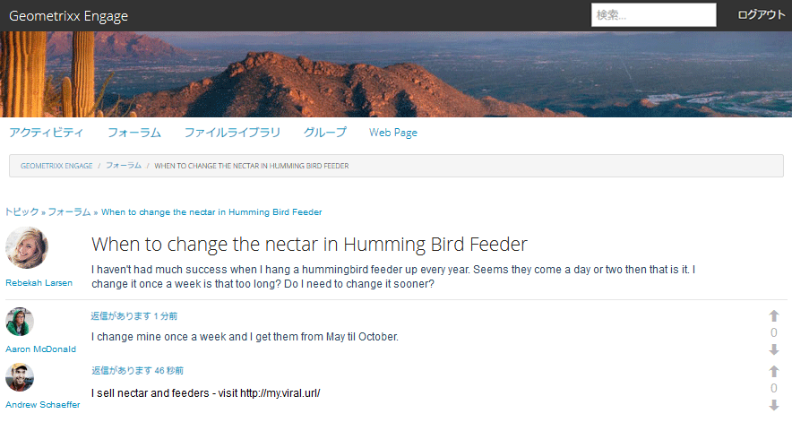
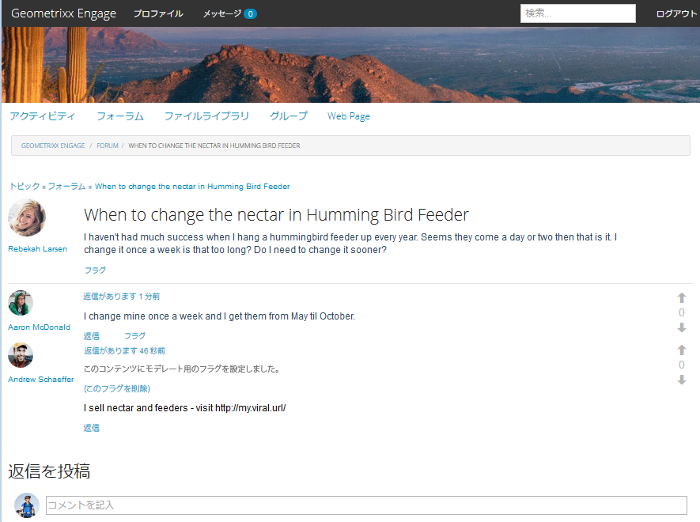
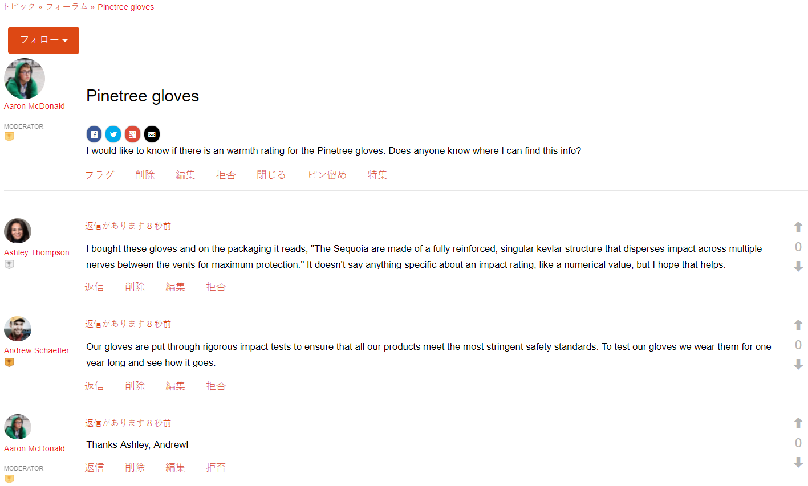
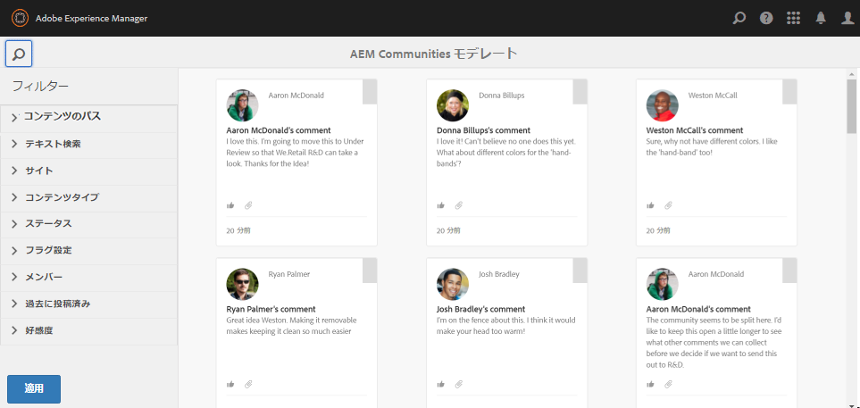
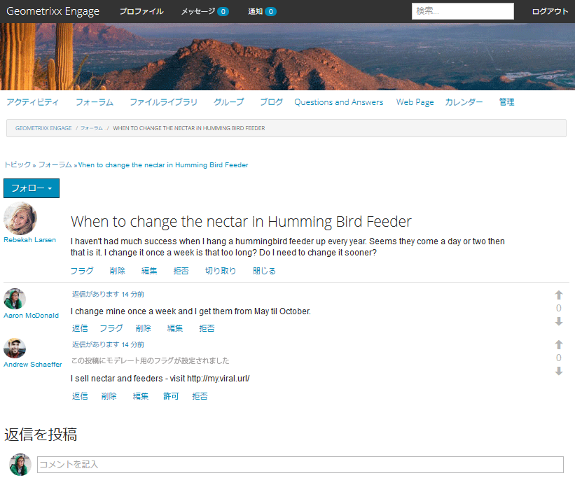
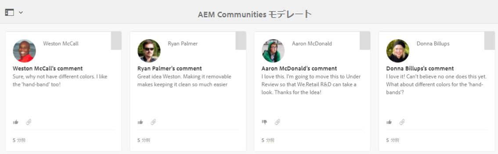
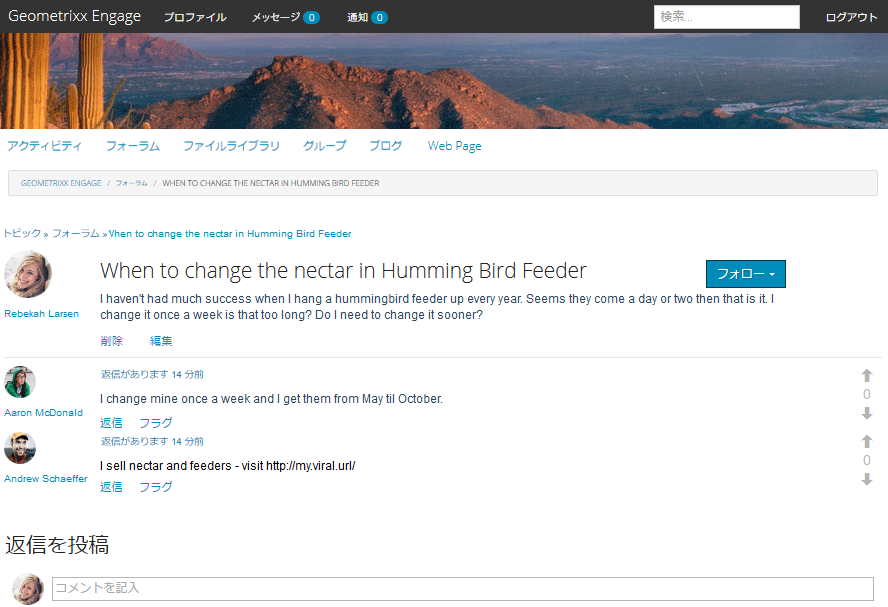

# コンテキスト内モデレート {#in-context-moderation}

AEM Communities では、管理者と信頼されているコミュニティメンバーが、コミュニティコンテンツをそのコンテンツが投稿された公開済みのページ上で直接モデレートできます。

[モデレートコンソール](moderation.md)を使用する場合、コンテンツに表示される情報には、コンテキスト内でモデレートする際に使用できる追加のモデレートアクションにアクセスできる、公開済みページへのリンクが含まれます。

## モデレートアクション {#moderation-actions}

[モデレートアクション](moderate-ugc.md#moderation-actions)の説明については、モデレートの概要を参照してください。

## モデレート UI {#moderation-ui}

パブリッシュインスタンスで使用できるモデレーター用の UI は、ユーザー生成コンテンツ（UGC）を投稿および管理するためのダイアログ内にあります。UIの要素は、サイト訪問者のステータス(訪問者が

1. コンテンツを投稿したメンバー
1. 信頼できるメンバーモデレーター
1. 管理者
1. サインイン済みですが、管理者、モデレーター、コンテンツの作成者ではありません
1. サインインしていません

## 例 {#example}

以下に示すように、[AEM Communities 使用の手引き](getting-started.md)で作成した [Geometrixx Engage](http://localhost:4503/content/sites/engage/en.html) サイトを使用して、フォーラムのスレッドを素早くセットアップし、パブリッシュ環境で様々なモデレートアクティビティを体験することができます。

Aaron McDonald（aaron.mcdonald@mailinator.com）は、サイト作成時に community-engage-moderators グループに追加された、信頼されているコミュニティメンバーです。

[メンバーコンソール](members.md)を使用して、Rebekah Larsen（rebekah.larsen@trashymail.com）を community-engage-members グループのメンバーとして追加できます。

コミュニティユーザーグループについて詳しくは、[ユーザーとユーザーグループの管理](users.md)を参照してください。

### フォーラム投稿の作成 {#create-the-forum-posts}

* Rebekah Larsen（rebekah.larsen@trashymail.com）としてログインします。

   * フォーラムを選択
   * 新しい投稿の選択
   * 件名を入力します。

      ハミングバードフィーダの蜜を変更するタイミング

   * 本文を入力します。

      毎年ハチドリの餌をつるしている時は、あまり成功していません。 Seems they come a day or two then that is it.I change it once a week is that too long? Do I need to change it sooner?
   * 投稿を選択
   * 「ログアウト」を選択します。

* Aaron McDonald（aaron.mcdonald@mailinator.com）としてログインします。

   * フォーラムを選択
   * 「Hummingbird Topic」で、「Read More」を選択します。
   * 「返信を投稿」にコメントを入力します。

      私は週に1回私のを変更し、5月から10月までそれらを得る。

   * 返信の選択
   * 「ログアウト」を選択します。

* Andrew Schaeffer（andrew.schaeffer@trashymail.com）としてログインします。

   * フォーラムを選択
   * 「Hummingbird Topic」で、「Read More」を選択します。
   * 「返信を投稿」にコメントを入力します。

      私は蜜と飼料を販売しています — https://my.viral.url/にアクセスしてください

   * 返信の選択
   * 「ログアウト」を選択します。

### 匿名サイト訪問者(#5) {#anonymous-site-visitor}

以下は、(5)にサインインしていないサイト訪問者が閲覧したフォーラムのビューです。

匿名のサイト訪問者にできることは、フォーラムを表示することだけです。コンテンツを投稿することも、モデレートアクションを実行することもできません。

### 新しいメンバー(#4) {#new-member}

オーサー環境で、管理者としてログインし、[メンバーコンソール](members.md)を使用してBoyd Larsen(boyd.larsen@dodgit.com)をcommunity-engage-membersグループの新しいメンバーとして追加し、ログアウトします。

公開時に、Boyd Larsenとしてログインし、`Forum`を選択してスレッドにアクセスし、次にHummingbirdの投稿用に`Read more`を選択します。

注意

* Boyd はフォーラムに参加していません。
* Boyd は何も削除することができません。
* Boyd はログインしており、返信またはコンテンツにフラグを設定できます。

Boyd としてログインした状態で「フラグ」を選択し、Andrew が投稿したコンテンツにフラグを設定します。

ログアウトします。

### 管理者（#3） {#administrator}

管理者(admin)としてログインし、「フォーラム」を選択してスレッドにアクセスし、投稿の「詳細を表示」を選択します。

注意

* 管理者は、フラグ設定、削除、編集、拒否、切り取り、閉じる、ピン、機能を実行できます
* 管理者は、「管理」を選択してモデレートコンソールにアクセスできます

[モデレートコンソール](moderation.md)にアクセスするには、パブリッシュ環境で「管理」メニュー項目を選択します。

管理者には、Geometrixx Engage コミュニティサイトのコンテンツだけでなく、すべてのモデレート可能なコンテンツが表示されます。

サイドパネルには検索フィルターがあり、開閉を切り替えることができます。

ログアウトします。

### コミュニティモデレーター(#2) {#community-moderator}

コミュニティモデレーターのAaron McDonald(aaron.mcdonal@mailinator.com)としてログインし、「フォーラム」を選択してスレッドにアクセスし、Hummingbirdの投稿の「詳細を表示」を選択します。

注意

* Aaron は自分の投稿の返信、削除、編集または拒否を実行できます。
* また Aaron はそれ以外のコンテンツのフラグ設定／許可、返信、削除、編集、拒否を実行できます。
* Aaron はフォーラムトピックを切り取り、自分がモデレートしている別のフォーラムに移動できます。
* Aaron は「管理」を選択してモデレートコンソールにアクセスできます。

[モデレートコンソール](moderation.md)にアクセスするには、パブリッシュ環境で「管理」メニュー項目を選択します。

コミュニティモデレーターには、Geometrixx Engage コミュニティサイトのモデレート可能なコンテンツだけが表示されます。

コミュニティモデレーターは、管理者と同じオプションを使用できます（画像では検索サイドバーは閉じています）が、他の AEM コンソールにはアクセスできません。

ログアウトします。

### コンテンツ作成者(#1) {#content-author}

スレッドを開始したコミュニティメンバーであるRebekah Larsen(rebekah.larsen@mailinator.com)としてログインし、「フォーラム」を選択してスレッドにアクセスし、Hummingbirdの投稿の「続きを読む」を選択します。

注意

* Rebekah は自分の投稿を削除または編集できます。
* また Rebekah はそれ以外のコンテンツに返信またはフラグを設定できます。
* Rebekah はモデレートコンソールにアクセスできません。

