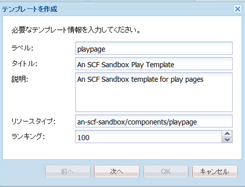
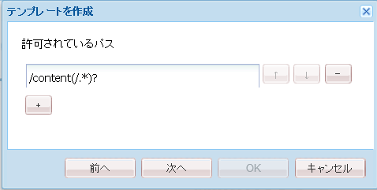
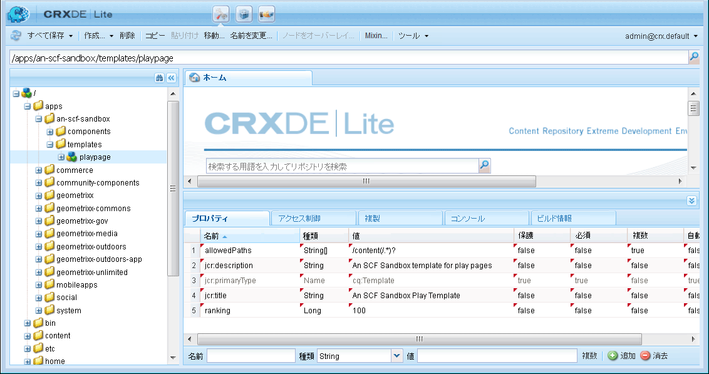
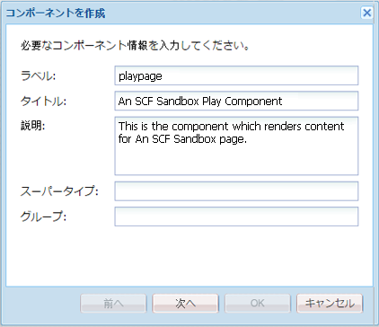
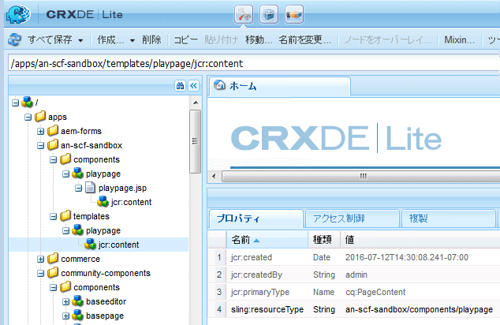

# 初期サンドボックスアプリケーション {#initial-sandbox-application}

>[!CAUTION]
>
>AEM 6.4 の拡張サポートは終了し、このドキュメントは更新されなくなりました。 詳細は、 [技術サポート期間](https://helpx.adobe.com/jp/support/programs/eol-matrix.html). サポートされているバージョンを見つける [ここ](https://experienceleague.adobe.com/docs/?lang=ja).

このセクションでは、次のものを作成します。

* この **[テンプレート](#createthepagetemplate)** を使用して、サンプル Web サイトのコンテンツページを作成します。
* この **[コンポーネントとスクリプト](#create-the-template-s-rendering-component)** Web サイトページのレンダリングに使用される

## コンテンツテンプレートの作成 {#create-the-content-template}

テンプレートは、新しいページのデフォルトコンテンツを定義します。 複雑な Web サイトでは、サイト内の様々なタイプのページを作成するために、複数のテンプレートを使用する場合があります。 さらに、一連のテンプレートは、サーバーのクラスターに対する変更のロールアウトに使用されるブループリントになる場合があります。

この演習では、すべてのページを 1 つのシンプルなテンプレートに基づいて作成します。

1. CRXDE Liteのエクスプローラペイン

   * 「`/apps/an-scf-sandbox/templates`」を選択します。
   * **[!UICONTROL 作成/テンプレートを作成]**

1. テンプレートを作成ダイアログで、次の値を入力し、 **[!UICONTROL 次へ]**:

   * ラベル：`playpage`
   * タイトル：`An SCF Sandbox Play Template`
   * 説明: `An SCF Sandbox template for play pages`
   * リソースタイプ: `an-scf-sandbox/components/playpage`
   * ランキング： &lt;leave as=&quot;&quot; default=&quot;&quot;>

   ラベルは、ノード名に使用されます。

   リソースタイプが `playpage`プロパティとしての s jcr:content ノード `sling:resourceType`. ブラウザーから要求された場合に、コンテンツをレンダリングするコンポーネント（リソース）を識別します。

   この場合、 `playpage`テンプレートは `an-scf-sandbox/components/playpage` コンポーネント。 慣例により、コンポーネントのパスは相対パスなので、Sling は、 `/apps` フォルダーおよび（見つからない場合） `/libs` フォルダー。

   

1. コピー/貼り付けを使用する場合は、「リソースタイプ」の値の先頭または末尾にスペースがないことを確認します。

   「**[!UICONTROL 次へ]**」をクリックします。

1. 「許可されたパス」は、このテンプレートを使用するページのパスを指し、そのテンプレートが **[!UICONTROL 新しいページ]** ダイアログ。

   パスを追加するには、プラスボタン `+` と入力します。 `/content(/.&ast;)?` をクリックします。 コピー/貼り付けを使用する場合は、先頭または末尾にスペースがないことを確認します。

   注意：許可されているパスプロパティの値は、 *正規表現。* 式と一致するパスを持つコンテンツページは、このテンプレートを使用できます。 この場合、正規表現は **/content** フォルダーおよびそのすべてのサブページ。

   作成者が以下のページを作成したとき `/content`、 `playpage`使用可能なテンプレートのリストに、「SCF サンドボックスページテンプレート」というタイトルのテンプレートが表示されます。

   テンプレートからルートページを作成した後は、プロパティを変更して正規表現にルートパスを含めることで、このテンプレートへのアクセスをこの Web サイトに制限できます。つまり、

   `/content/an-scf-sandbox(/.&ast;)?`

   

1. 「**[!UICONTROL 次へ]**」をクリックします。

   クリック **[!UICONTROL 次へ]** 内 **[!UICONTROL 許可された親]** パネル。

   クリック **[!UICONTROL 次へ]** 内 **[!UICONTROL 許可されている子]** パネル。

   「**[!UICONTROL OK]**」をクリックします。

1. [OK] をクリックしてテンプレートの作成を終了すると、新しいプロパティの [ プロパティ ] タブの値の隅に赤い三角形が表示されます `playpage`テンプレート。 これらの赤い三角形は、編集内容が保存されていないことを示します。

   クリック **[!UICONTROL すべて保存]** をクリックして、新しいテンプレートをリポジトリに保存します。

   

### テンプレートのレンダリングコンポーネントの作成 {#create-the-template-s-rendering-component}

を作成します。 *コンポーネント* コンテンツを定義し、 [playpage テンプレート](#createthepagetemplate).

1. CRXDE Lite で、**`/apps/an-scf-sandbox/components`** を右クリックして、**[!UICONTROL 作成／コンポーネント]**&#x200B;をクリックします。
1. ノード名（ラベル）を *playpage*&#x200B;の場合、コンポーネントへのパスは

   `/apps/an-scf-sandbox/components/playpage`

   再生ページテンプレートのリソースタイプに対応する ( オプションで、最初の **`/apps/`** パスの一部 )。

   **[!UICONTROL コンポーネントを作成]**&#x200B;ダイアログで、以下のプロパティ値を入力します。

   * ラベル： **playpage**
   * タイトル： **SCF Sandbox Play コンポーネント**
   * 説明： **これは、SCF サンドボックスページのコンテンツをレンダリングするコンポーネントです。**
   * スーパータイプ： *&lt;leave blank=&quot;&quot;>*
   * グループ：

   

1. クリック **[!UICONTROL 次へ]** まで **[!UICONTROL 許可されている子]** ダイアログのパネルが表示されます

   * クリック **[!UICONTROL OK]**
   * クリック **[!UICONTROL すべて保存]**

1. テンプレートのコンポーネントへのパスと resourceType が一致していることを確認します。

   >[!CAUTION]
   >
   >Web サイトを正しく機能させるには、playpage コンポーネントのパスと playpage テンプレートの sling:resourceType プロパティとの対応が重要です。

   
