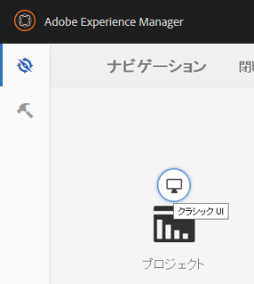
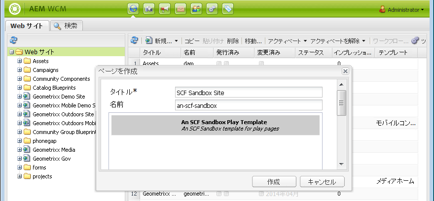
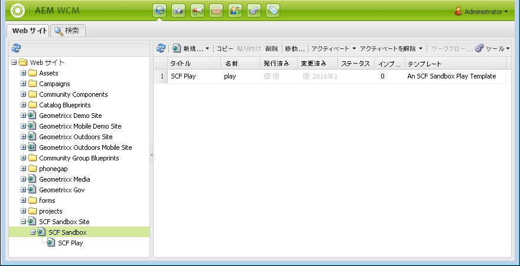
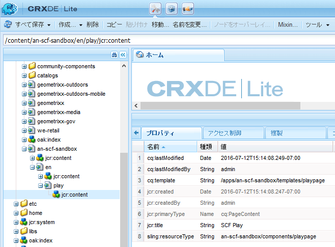
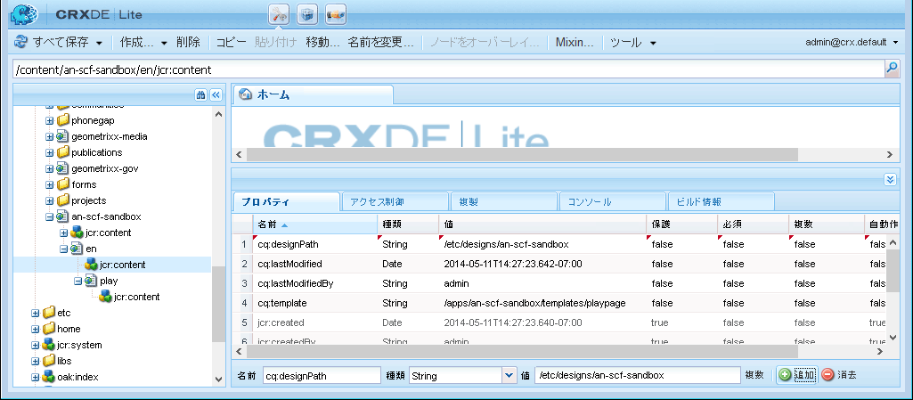

# 初期サンドボックスコンテンツ {#initial-sandbox-content}

>[!CAUTION]
>
>AEM 6.4 の拡張サポートは終了し、このドキュメントは更新されなくなりました。 詳細は、 [技術サポート期間](https://helpx.adobe.com/jp/support/programs/eol-matrix.html). サポートされているバージョンを見つける [ここ](https://experienceleague.adobe.com/docs/?lang=ja).

このセクションでは、次のページを作成します。これらはすべて [ページテンプレート](initial-app.md#createthepagetemplate):

* SCF Sandbox Site：メインページの英語バージョンにリダイレクトします。

   * SCF Sandbox — サイトの英語バージョンのメインページ

      * SCF 再生 — 再生するメインページの子

このチュートリアルでは詳しく説明しませんが、 [言語コピー](../../help/sites-administering/tc-prep.md)の場合、ルートページでHTMLヘッダーを使用してユーザーの優先言語の検出を実装し、その言語に適したメインページにリダイレクトできるように設計されています。 ページのノード名に 2 文字の国コードを使用する規則です。例えば、英語の場合は「en」、フランス語の場合は「fr」などです。

## 最初のページを作成 {#create-first-pages}

これで、 [ページテンプレート](initial-app.md#createthepagetemplate)を使用する場合、Web サイトのルートページを/content ディレクトリに確立できます。

1. 標準 UI には、現在、サイトを作成するためのブループリントが用意されています。 このチュートリアルでは簡単なサイトを作成するので、クラシック UI が便利です。

   クラシック UI に切り替えるには、グローバルナビゲーションを選択し、プロジェクトアイコンの右側にマウスポインターを置きます。 を選択します。 *クラシック UI に切り替え* 表示されるアイコン：

   

   クラシック UI に切り替える機能は、次の条件を満たす必要があります。 [管理者が有効にした](../../help/sites-administering/enable-classic-ui.md).

1. 次の [クラシック UI のようこそページ](http://localhost:4502/welcome.html)を選択します。 **[!UICONTROL Web サイト]**.

   

   または、Web サイトのクラシック UI に直接アクセスするには、 [/siteadmin.](http://localhost:4502/siteadmin)

1. エクスプローラウィンドウで、「 」を選択します。 **[!UICONTROL Web サイト]** 次に、ツールバーで **[!UICONTROL 新規/新しいページ]**.

   内 **[!UICONTROL ページを作成]** ダイアログで、次の情報を入力します。

   * タイトル: `SCF Sandbox Site`
   * 名前：`an-scf-sandbox`
   * 選択 **[!UICONTROL SCF Sandbox Play テンプレート]**
   * クリック **[!UICONTROL 作成]**

   

1. エクスプローラーウィンドウで、作成したページを選択します。 `/Websites/SCF Sandbox Site`をクリックし、 **[!UICONTROL 新規/新しいページ]**:

   * タイトル: `SCF Sandbox`
   * 名前：`en`
   * 選択 **SCF Sandbox Play テンプレート**
   * クリック **作成**

1. エクスプローラーウィンドウで、作成したページを選択します。 `/Websites/SCF Sandbox Site/SCF Sandbox`をクリックし、 **[!UICONTROL 新規/新しいページ]**

   * タイトル: `SCF Play`
   * 名前：`play`
   * 選択 **[!UICONTROL SCF Sandbox Play テンプレート]**
   * クリック **[!UICONTROL 作成]**

1. Web サイトが Web サイトコンソールに表示されます。 エクスプローラペインで選択した項目の子ページが、管理可能な右側のペインに表示されます。

   

   これは、Web サイトツールとテンプレートを使用して作成された内容のリポジトリ表示です。

   

## デザインパスを追加 {#add-the-design-path}

条件 ` [/etc/designs/an-scf-sandbox](setup-website.md#setupthedesigntreeetcdesigns)` は、ツールコンソールの designs セクション ( プロパティ「

* `cq:template="/libs/wcm/core/templates/designpage"`

が定義され、を使用してスクリプト内のデザインアセットを参照するオプションの機能が提供されます。 `currentDesign.getPath()`. 例：

* &lt;% String favIcon = currentDesign.getPath() + &quot;/favicon.ico&quot;;%>

   * 名前：`cq:designPath`
   * タイプ：`String`
   * 値：`/etc/designs/an-scf-sandbox`

* 緑をクリック `[+] Add`

リポジトリは次のように表示されます。

* クリック **[!UICONTROL すべて保存]**

[ 問題が発生した場合 再ログイン ]

>[!NOTE]
>
>cq:designPath の使用はオプションで、 [clientlib の使用](develop-app.md#includeclientlibsintemplate)（SCF コンポーネントが使用する際に基本的に必要） [clientlibs](client-customize.md#clientlibs-for-scf) を使用して、JS および CSS を管理できます。
