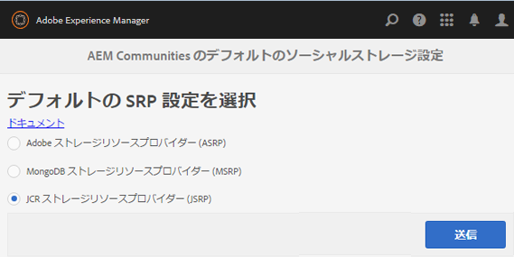

# JSRP - JCR ストレージリソースプロバイダー {#jsrp-jcr-storage-resource-provider}

## JSRP について {#about-jsrp}

AEM Communitiesが JSRP をストレージオプションとして使用する場合（デフォルト）、コミュニティコンテンツは JCR に保存され、ユーザー生成コンテンツ (UGC) は、JSRP の投稿先のオーサーインスタンスまたはパブリッシュインスタンスからのみアクセスできます。

JSRP はデプロイメントが容易なので、一般的に、1 つのパブリッシュインスタンスと 1 つのオーサーインスタンスがあるデモ環境または開発環境に適しています。

[SRP オプションの特性](working-with-srp.md#characteristics-of-srp-options)と[推奨されるトポロジ](topologies.md)も参照してください。

## 設定 {#configuration}

### JSRP の選択 {#select-jsrp}

デフォルトでは、JSRP が UGC 用のストレージオプションとして選択されています。

この [ストレージ設定コンソール](srp-config.md) では、使用する SRP の実装を指定するデフォルトのストレージ設定を選択できます。

オーサー環境でストレージ設定コンソールに移動するには、

* グローバルナビゲーションから： **[!UICONTROL ツール/コミュニティ/ストレージ設定]**

* 選択 **[!UICONTROL JCR ストレージリソースプロバイダー (JSRP)]**
* 選択 **[!UICONTROL 送信]**

### 設定の公開 {#publishing-the-configuration}

JSRP はデフォルト設定ですが、パブリッシュ環境で同じ設定が使用されていることを確認するには、以下の手順をおこないます。

* 作成者：

   * グローバルナビゲーションから： **[!UICONTROL ツール/導入/レプリケーション]**
   * 選択 **[!UICONTROL ツリーをアクティベート]**
   * **[!UICONTROL 開始パス]**:

      * 参照先 `/conf/global/settings/community/srpc/`
   * 選択 **[!UICONTROL 有効化]**

## ユーザーデータの管理 {#managing-user-data}

パブリッシュ環境で頻繁に入力されるユーザー、ユーザープロファイルおよびユーザーグループについては、以下を参照してください。******

* [ユーザー同期](sync.md)
* [ユーザーとユーザーグループの管理](users.md)

## トラブルシューティング {#troubleshooting}

### UGC が JCR で表示されない {#ugc-not-visible-in-jcr}

ストレージオプションの設定を確認し、JSRP がデフォルトのプロバイダーに設定されているかを確認してください。デフォルトでは、ストレージリソースプロバイダーは JSRP です。

すべてのオーサーインスタンスとパブリッシュAEMインスタンスで、ストレージ設定コンソールに再度アクセスするか、AEMリポジトリを確認します。

* JCR で、 [/conf/global/settings/community](http://localhost:4502/crx/de/index.jsp#/conf/global/settings/community)

   * 次を含まない [srpc](http://localhost:4502/crx/de/index.jsp#/conf/global/settings/community/srpc) ノードの場合、ストレージプロバイダーが JSRP であることを意味します。
   * srpc ノードが存在し、ノードが含まれる場合 [defaultconfiguration](http://localhost:4502/crx/de/index.jsp#/conf/global/settings/community/srpc/defaultconfiguration)の場合、デフォルト設定のプロパティでは JSRP をデフォルトのプロバイダーとして定義する必要があります

### UGC がオーサーインスタンスで表示されない {#ugc-not-visible-on-author-instance}

これはバグではありません。JSRP の特徴は、パブリッシュ環境に入力されたコミュニティコンテンツがパブリッシュ環境でのみ表示されることです。

### UGC がパブリッシュインスタンスで表示されない {#ugc-not-visible-on-publish-instance}

1 つのパブリッシュインスタンスまたはパブリッシュクラスターをデプロイした場合は、[UGC が JCR で表示されない](#ugc-not-visible-in-jcr)の手順に従ってください。

パブリッシュファームをデプロイした場合、JSRP の特性上、コミュニティコンテンツは、コンテンツが投稿されたパブリッシュインスタンス上でしか表示できません。

UGC をどのパブリッシュインスタンス上でも表示するには、パブリッシュクラスターが必要です。
