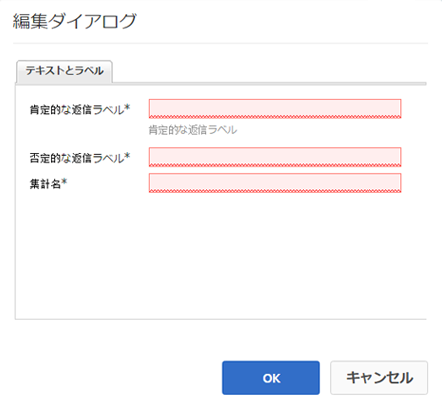

# 「いいね!」設定の使用 {#using-liking}

>[!CAUTION]
>
>AEM 6.4 の拡張サポートは終了し、このドキュメントは更新されなくなりました。 詳細は、 [技術サポート期間](https://helpx.adobe.com/jp/support/programs/eol-matrix.html). サポートされているバージョンを見つける [ここ](https://experienceleague.adobe.com/docs/?lang=ja).

この `Liking`コンポーネントは、フォーラム内のコメントなど、コンテンツの特定の部分に関する意見をユーザーが表現できる便利なツールです。 を使用 `Liking`コンポーネント、メンバーは、肯定的な意見を示す心アイコンを選択します。

## 「いいね！」の追加 {#adding-liking-to-a-page}

を追加するには、以下を実行します。 `Liking` コンポーネントをオーサリングモードでページに追加する場合は、コンポーネントブラウザーを使用して

* `Communities / Liking`

をクリックし、ページ上の適切な位置（ユーザーが好む機能に対する相対位置など）にドラッグします。

必要な情報については、 [コミュニティコンポーネントの基本](basics.md).

次の場合に [必要なクライアント側ライブラリ](essentials-liking.md#essentials-for-client-side) が含まれる場合、この方法で `Liking` コンポーネントが表示されます。

## 「いいね！」の設定 {#configuring-liking}

配置された `Liking` アクセスして選択するコンポーネント `Configure` 編集ダイアログを開くアイコン。

以下 **[!UICONTROL テキストとラベル]** 「 」タブで、「いいね！」の記録に使用するプロパティを指定します。

* **[!UICONTROL 肯定的な返信ラベル]**
(
*必須*) 肯定的な応答のプロパティ名。

* **[!UICONTROL 否定的な返信ラベル]**
(
*必須*) 否定的な応答のプロパティ名。

* **[!UICONTROL 集計名]**
(
*必須*) 投票コンポーネントのこのインスタンスの内部で識別可能なプロパティ名。

## サイト訪問者エクスペリエンス {#site-visitor-experience}

### メンバー {#members}

メンバーは、いつでも同じように変更できます。

### 匿名 {#anonymous}

匿名の「いいね！」の設定はサポートされていません。 サイト訪問者が「いいね！」に参加するには、登録（メンバーになる）してサインインする必要があります。

## 追加情報 {#additional-information}

詳しくは、 [「いいね！」の設定の基本事項](essentials-liking.md) 開発者向けのページ
