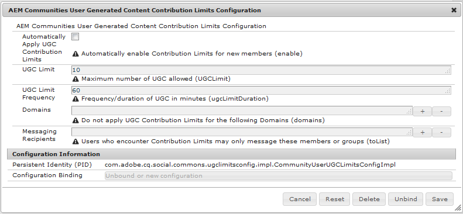

# メンバーの貢献度の制限 {#member-contribution-limits}

>[!CAUTION]
>
>AEM 6.4 の拡張サポートは終了し、このドキュメントは更新されなくなりました。 詳細は、 [技術サポート期間](https://helpx.adobe.com/jp/support/programs/eol-matrix.html). サポートされているバージョンを見つける [ここ](https://experienceleague.adobe.com/docs/?lang=ja).

## 概要 {#overview}

貢献度の制限機能を使用すると、スパムから保護する手段として、コミュニティメンバーの貢献度を制限できます。

メンバーが制限されている場合、投稿の投稿が許可されている投稿数を超えると、制限を超えて投稿が拒否されたというアラートが表示されます。 コミュニティメンバーは、コミュニティメッセージセンターに移動し、必要に応じて制限を解除できるコミュニティマネージャーに問い合わせることができます。

貢献度の制限は、 [メンバーコンソール](members.md) サイト訪問者が新規メンバーになったときに自動的に有効にするように、および/またはを設定します。

メンバーコンソールを使用すると、コミュニティマネージャーがメンバーに対して貢献度の制限を事前に削除したり、メンバーがその要求を行うコミュニティマネージャーにメッセージを送信した場合に事後的に削除したりできます。

## AEM Communities User Generated Content Contribution Limits Configuration {#aem-communities-user-generated-content-contribution-limits-configuration}

この OSGi 設定

* 貢献度の制限（期間内の投稿数）の特性を定義します
* 制限に達した場合にメッセージを送信できるメンバーを識別します
* 制約を受ける必要のないドメインを識別します

この OSGi 設定に到達するには：

* プライマリパブリッシャー
* 管理者権限でログイン
* 次にアクセス： [Web コンソール](../../help/sites-deploying/configuring-osgi.md)

   * 例： [http://localhost:4503/system/console/configMgr](http://localhost:4503/system/console/configMgr)

* 場所 `AEM Communities User Generated Content Contribution Limits Configuration`
* 編集アイコンを選択します。

* **[!UICONTROL UGC 貢献度の制限を自動的に適用]**

   オンにすると、ユーザーがコミュニティメンバーとして登録する際に、ユーザーに対する貢献度の制限が自動的に設定されます。 これはコミュニティメンバーのプロファイルに反映され、 [メンバーコンソール](members.md). ドメインのから E メールアドレスを持つ新許可リストしいメンバーは、制限されません。

   初期設定はオフです。

* **[!UICONTROL UGC 制限]**

   貢献の最大数。

   デフォルトは 10 件の投稿です。

* **[!UICONTROL UGC 制限頻度]**

   UGC の制限を制限する期間。

   デフォルトは 60 分です。

* **[!UICONTROL ドメイン]**

   1 つ以上の E メールドメインのリスト許可リスト。 「+」アイコンを選択して、追加のエントリを作成します。

   ドメインのに E メールアド許可リストレスを持つユーザーは、UGC 貢献度の制限が自動的に適用されても影響を受けません。 例：ドメインの場合 `mycompany.com` がドメインのリストに追加され、次に電子メールアドレスを持つメンバーが追加されます `me@mycompany.com` は投稿を制限されません。

   初期設定は空の許可リストです。

* **[!UICONTROL メッセージ受信者]**

   メンバーの貢献度の制限を変更できるメンバーの、1 つ以上の許可可能な ID のリスト。 「+」アイコンを選択して、追加のエントリを作成します。

   メンバーは、制限に達した場合にのみ、指定したメンバーに連絡できます。

   初期設定では、メッセージング受信者はありません。

注意：デフォルトの設定では、1 時間以内に 10 件の投稿に制限されます。
