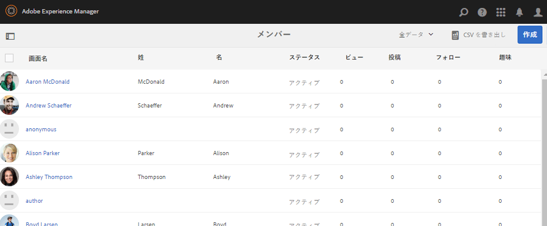
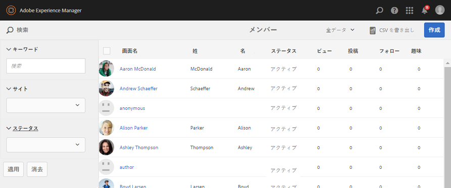
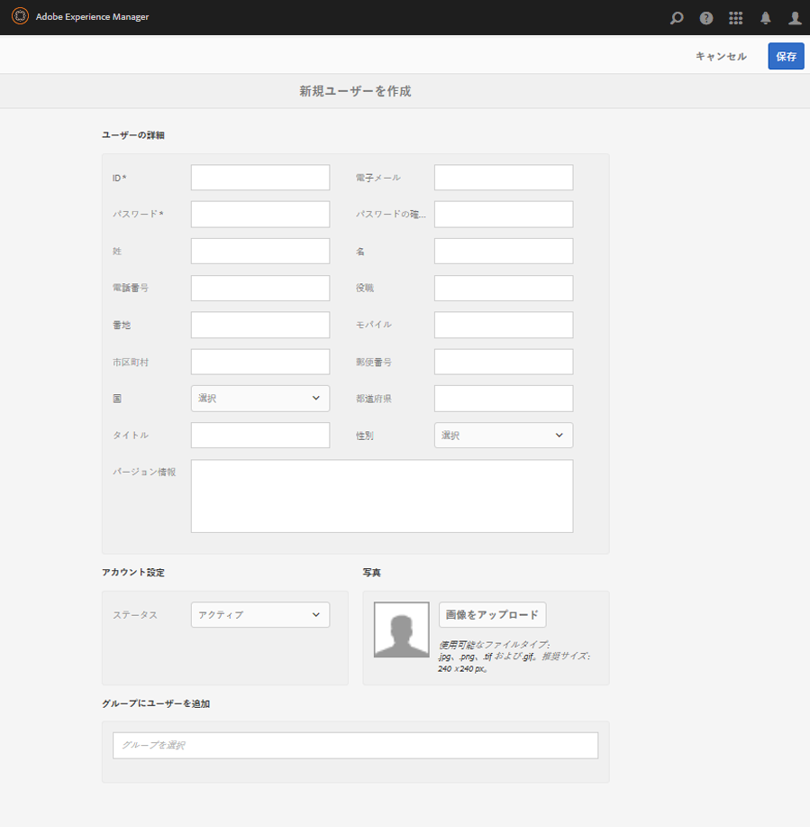
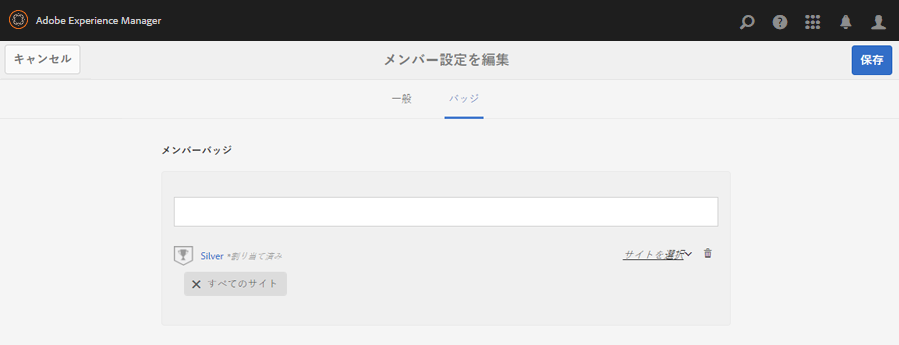
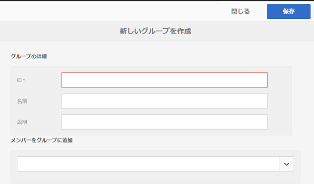

# メンバーコンソールとグループ管理コンソール {#members-groups-management-consoles}

## 概要 {#overview}

AEM Communitiesの機能を使用する場合は、サイト訪問者を登録してサインインしてから、パブリッシュ環境でコミュニティに参加する必要が生じます。 ユーザー登録が必要なのはパブリッシュ環境に限られ、一般に *メンバー* 区別する *ユーザー* がオーサー環境に登録されている。

### 公開時のメンバー（ユーザー） {#members-users-on-publish}

コミュニティメンバーコンソールとグループコンソールを使用して、 *公開* 環境は、 *作成者* 環境。 これは、 [トンネルサービス](deploy-communities.md#tunnel-service-on-author) が有効になっている。

### 作成者のユーザー {#users-on-author}

に登録されているユーザーとグループを管理するための *作成者* 環境のセキュリティコンソールを使用するには、が必要です。

* グローバルナビゲーションから、 `Tools, Security, Users`
* グローバルナビゲーションから、 `Tools, Security, Groups`

>[!NOTE]
>
>サンプルコンテンツがデプロイされ有効になっている場合、多くのサンプルユーザーがオーサー環境とパブリッシュ環境の両方に存在します。 を使用してを実行する場合、これらのユーザーは表示されません [nosamplecontent 実行モード](../../help/sites-administering/production-ready.md).

## メンバーコンソール {#members-console}

オーサー環境で、パブリッシュ環境で登録されたメンバーを管理するためのメンバーコンソールを開くには、次の手順を実行します。

* グローバルナビゲーションから： **[!UICONTROL ナビゲーション/コミュニティ/メンバー]**

>[!CAUTION]
>
>メンバーコンソールを使用できない場合、 [トンネルサービス](deploy-communities.md#tunnel-service-on-author) が有効になっていません。

### 検索 {#search-features}

の左側にあるサイドパネルアイコンを選択します。 `Members` ヘッダーを使用して、検索サイドパネルを開くかどうかを切り替えます。

 

「 `Members` ヘッダーを使用して、検索サイドパネルを閉じます。

### メンバー統計 {#member-statistics}

表示されている列 `Views`, `Posts`, `Follows`および `Likes` ユーザーがAdobe Analyticsを使用して 1 つ以上のコミュニティサイトのメンバーになっている場合に更新されます [有効](sites-console.md#analytics).

### CSV を書き出し {#export-csv}

の選択 `Export CSV` リンクを使用すると、すべてのメンバーがコンマ区切り値のリストとしてダウンロードされ、スプレッドシートに読み込むのに適しています。

列ヘッダーは次のとおりです

`| Screen Name |Last Name |First Name |Status |Views |Posts |Follows |Likes |`

## 新しいメンバーを作成 {#create-new-member}

選択 `Create Member` パブリッシュ環境でユーザーを作成する場合。

### 一般 — メンバーの詳細 {#general-member-details}

ほとんどのフィールドはオプションのフィールドで、メンバーは後でプロファイルに入力できます。

* **[!UICONTROL ID]**
(
*必須*) 許可可能 ID は、メンバーのログイン ID です。
デフォルトでは、ID は必要な電子メールアドレスの値に設定されています。
   *作成後は、ID を変更できません。*

* **[!UICONTROL メールアドレス]**
(
*必須*) メンバーの電子メールアドレス。
メンバーは、プロファイルの更新時に電子メールアドレスを変更できます。i ID が電子メールアドレスにデフォルト設定されている場合、ID は *not* 電子メールアドレスが変更されたときに変更します。

* **[!UICONTROL パスワード]**
(
*必須*) ログインパスワード。

* **[!UICONTROL パスワードの確認入力]**
(
*必須*) 確認用のパスワードを再入力します。

* **[!UICONTROL メンバーをサイトに追加]**
(
*オプション*) メンバーをコミュニティサイトのメンバーグループに追加するには、既存のコミュニティサイトから選択します。

* **[!UICONTROL メンバーをグループに追加]**
(
*オプション*) 既存のメンバーグループから選択して、そのグループにメンバーを追加します。

* 選択 **[!UICONTROL 保存]**

### 一般 — アカウント設定 {#general-account-settings}

アカウント設定では、コミュニティ管理者が

* **[!UICONTROL ステータス]**
   * 禁止されている\
      メンバーがサインインできず、メンバーがページを表示したり、ログインが必要なアクティビティに参加したりできません。 彼らは未だにオープンなコミュニティサイトを匿名で訪問する可能性があります。

   * 禁止されていないメンバーはコミュニティサイトに完全にアクセスできます。

   デフォルトは `Not Banned` です。

* **[!UICONTROL 貢献度の制限]**
オンにすると、メンバーによるコンテンツの投稿機能は制限されます。
デフォルトは、貢献度の制限の設定によって異なります。
詳しくは、 [メンバー貢献度の制限](limits.md).

* **[!UICONTROL パスワードを変更]**
既存のメンバーを変更する際に存在するリンク。 コミュニティ管理者がメンバーのパスワードをリセットする機能を提供します。

### 一般 — 写真 {#general-photo}

メンバーのアバターを提供するには、まず、 **[!UICONTROL 画像をアップロード]** .jpg、.png、.tif または.gif 形式の画像を選択します。 画像の推奨サイズは、72 dpi での 240 x 240 ピクセルです。

### 一般 — サイトにメンバーを追加 {#general-add-member-to-sites}

メンバーは、1 つ以上のコミュニティサイトのメンバーグループに追加できます。 まず、テキストボックスにテキストを入力します。

### 一般 — グループにメンバーを追加 {#general-add-member-to-groups}

メンバーは、1 つ以上のメンバーグループに追加できます。 まず、テキストボックスにテキストを入力します。

### 「バッジ」タブ {#badges-tab}

この `BADGES` panel では、バッジを手動で割り当てたり、取り消したりすることができます。 バッジは、割り当てられた役割に対して使用することも、通常は獲得されたバッジに対して使用することもできます。

関連トピック [スコアとバッジ](implementing-scoring.md).

* **[!UICONTROL バッジを追加]**
   * 次の中から選択するための入力を開始 [使用可能なバッジ](badges.md). バッジを選択したら、各サイトまたはすべてのサイトを選択します。このサイトで、メンバーのアバターと共にバッジが表示されます。
   * 複数のバッジとサイトを選択できます。
* **[!UICONTROL バッジを削除]**
   * バッジの横にあるごみ箱アイコンを選択して、削除します

## グループコンソール {#groups-console}

オーサー環境から使用できるグループコンソールを使用すると、パブリッシュ環境で登録されたメンバーグループを作成および管理できます。 これは、次の場合に特に便利です。
* [権限を持つメンバーグループ](users.md#privilegedmembersgroups)
* のグループベースの割り当て [イネーブルメントリソース](resources.md)

グループコンソールにアクセスするには：
* グローバルナビゲーションから： **[!UICONTROL ナビゲーション/コミュニティ/グループ]**

>[!CAUTION]
>
>グループコンソールは、 [トンネルサービス](deploy-communities.md#tunnel-service-on-author) が有効になっていません。

### 新しいグループを作成 {#create-new-group}

選択 `Add Group` パブリッシュ環境でグループを作成する場合。

新しい公開側メンバーグループを作成するための必須フィールドは次のとおりです。

* **[!UICONTROL ID]**
(
*必須*) グループの一意の ID。
   *作成後は、ID を変更できません。*

* **[!UICONTROL 名前]**

*オプション*) グループの表示名。

   デフォルト値は ID です。

* **[!UICONTROL 説明]**

*オプション*) グループの目的と権限の説明。

* **[!UICONTROL メンバーをグループに追加]**
(
*オプション*) グループの最初のメンバーとして含めるパブリッシュ側のメンバーを選択します。

* 選択 **[!UICONTROL 保存]**

## 認証済み管理者 {#authorized-administrators}

コミュニティメンバーコンソールでメンバーを操作する場合は、適切な権限を持つユーザーとして、および [トンネルサービス](deploy-communities.md#tunnel-service-on-author) が正しく設定されている必要があります。

次の名前でサインインしていない場合 `admin`の場合、サインインしたユーザーは `administrators` ユーザーグループ。

関連トピック [オーサー環境のレプリケーションエージェント](deploy-communities.md#replication-agents-on-author).
