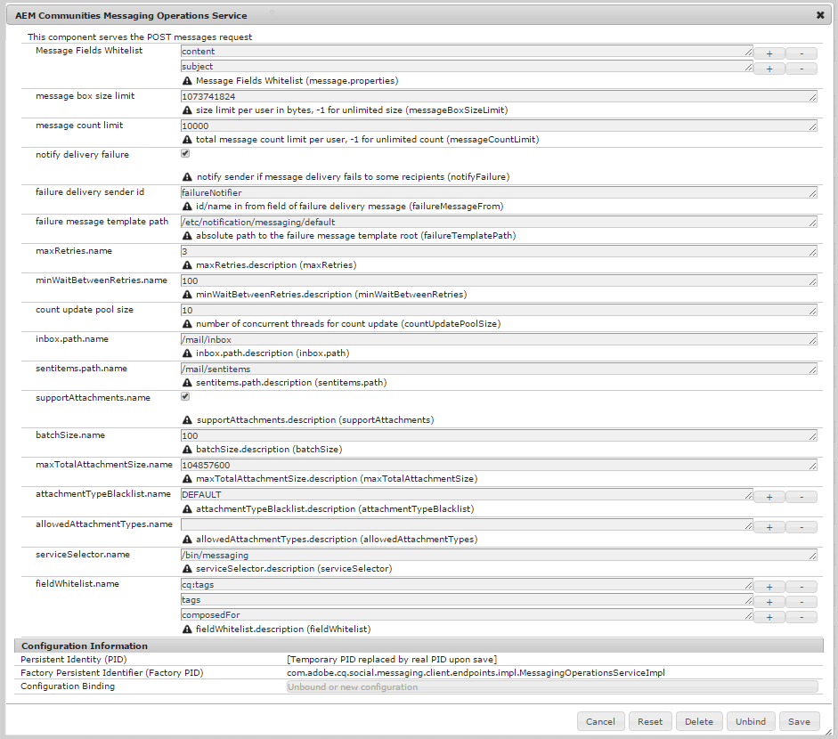

# メッセージングの設定 {#configuring-messaging}

>[!CAUTION]
>
>AEM 6.4 の拡張サポートは終了し、このドキュメントは更新されなくなりました。 詳細は、 [技術サポート期間](https://helpx.adobe.com/jp/support/programs/eol-matrix.html). サポートされているバージョンを見つける [ここ](https://experienceleague.adobe.com/docs/?lang=ja).

## 概要 {#overview}

AEM Communitiesのメッセージ機能を使用すると、サインインしているサイト訪問者（メンバー）が、サイトにサインインしたときにアクセス可能なメッセージを相互に送信できます。

コミュニティサイトのメッセージは、 [コミュニティサイトの作成](sites-console.md).

このページには、デフォルト設定と可能な調整に関する情報が表示されます。

開発者向けの追加情報については、 [メッセージの基本事項](essentials-messaging.md).

## メッセージング操作サービス {#messaging-operations-service}

この [AEM Communities Messaging Operations Service](http://localhost:4502/system/console/configMgr/com.adobe.cq.social.messaging.client.endpoints.impl.MessagingOperationsServiceImpl) は、メッセージング関連の要求を処理するエンドポイント、メッセージの保存に使用するフォルダー、添付ファイルが含まれる場合はどのファイルタイプを使用できるかを指定します。

を使用して作成されたコミュニティサイトの場合 [コミュニティサイトコンソール](sites-console.md)、サービスのインスタンスは既に存在し、インボックスはに設定されています `/mail/community/inbox`.

### コミュニティメッセージング操作サービス {#community-messaging-operations-service}

以下に示すように、 [サイト作成ウィザード](sites-console.md). 設定の横にある鉛筆アイコンを選択すると、設定を表示または編集できます。

### 新しい設定 {#new-configuration}

新しい設定を追加するには、プラス記号「**+**&#39;サービス名の横のアイコン：

* **[!UICONTROL メッセージフィールド許可リスト]**
ユーザーが編集および保持できるメッセージを作成コンポーネントのプロパティを指定します。 新しいフォーム要素を追加する場合、SRP に格納するには、要素 ID を追加する必要があります。 デフォルトでは、次の 2 つのエントリです。 
*件名* および *コンテンツ*.

* **[!UICONTROL メッセージボックスのサイズ制限]**
各ユーザーのメッセージボックスの最大バイト数です。 初期設定は です。 
*1073741824* (1 GB)。

* **[!UICONTROL メッセージ数の制限]**
ユーザーごとに許可されるメッセージの合計数です。 -1 の値は、許可されるメッセージ数に制限がないことを示し、メッセージボックスのサイズ制限に従います。 初期設定は です。 
*10000* (10k)。

* **[!UICONTROL 配信エラーを通知]**
オンにすると、メッセージの配信が一部の受信者に失敗した場合に送信者に通知します。 初期設定は です。 
*チェック済み*.

* **[!UICONTROL 配信送信者 ID の失敗]**
配信に失敗したメッセージに表示される送信者の名前。 初期設定は です。 
*failureNotifier*.

* **[!UICONTROL 失敗メッセージテンプレートのパス]**
配信に失敗したメッセージテンプレートのルートへの絶対パス。 初期設定は です。 
*/etc/notification/messaging/default*.

* **[!UICONTROL maxRetries.name]**
配信に失敗したメッセージの再送を試みる回数。 初期設定は です。 
*3*.

* **[!UICONTROL minWaitBetweenRetries.name]**
送信に失敗した場合にメッセージを再送信しようとするまでの待機秒数。 デフォルトは「*100 *（秒）」です。

* **[!UICONTROL 更新プールのサイズをカウント]**
カウントの更新に使用する同時スレッドの数。 初期設定は です。 
*10*.

* **[!UICONTROL inbox.path.name]**
(
*必須*) ユーザーのノードを基準としたパス (/home/users/*ユーザー名*)、 **`inbox`** フォルダー。 パスの末尾にスラッシュ「/」を付けることはできません。 デフォルトはです。 */mail/inbox* .

* **[!UICONTROL sentitems.path.name]**
(
*必須*) ユーザーのノードを基準としたパス (/home/users/*ユーザー名*)、 **`senditems`** フォルダー。 パスの末尾にスラッシュ「/」を付けることはできません。 デフォルトはです。 */mail/sentitems* .

* **[!UICONTROL supportAttachments.name]**
オンにすると、ユーザーはメッセージに添付ファイルを追加できます。 初期設定は です。 
*チェック済み*.

* **[!UICONTROL batchSize.name]**
多数の受信者グループに送信する際に、1 回の送信でまとめるメッセージの数。 初期設定は です。 
*100*.

* **[!UICONTROL maxTotalAttachmentSize.name]**
supportAttachments がオンになっている場合、この値はすべての添付ファイルの最大許容合計サイズ（バイト単位）を指定します。 初期設定は です。 
*104857600* (100 MB)。

* **[!UICONTROL attachmentTypeBlocklist.name]**
ファイルブロックリスト拡張子の。先頭に「 」が付く
**。**「 」（システムによって却下されます） 選択しなブロックリストに加えるい場合、拡張機能は許可されます。 拡張機能は、「 」を使用して追加または削除できます&#x200B;**+**&#39;および&#39;**-**&#39;アイコン。 デフォルトはです。 *デフォルト*.

* **[!UICONTROL allowedAttachmentTypes.name]**

   **(*アクションが必要です*)** ファ許可リストイル拡張子の ( 拡張子の逆ブロックリスト)。 すべてのファイル拡張子を許可するには、「 」を使用しまブロックリストに加えるす（拡張子は許可されません）。**-**「 」アイコンを使用して、1 つの空のエントリを削除します。

* **[!UICONTROL serviceSelector.name]**
(*必須*) サービスが呼び出される絶対パス（エンドポイント）（仮想リソース）です。 選択したパスのルートは、 *実行パス* OSGi 設定の設定 [ `Apache Sling Servlet/Script Resolver and Error Handler`](http://localhost:4502/system/console/configMgr/org.apache.sling.servlets.resolver.SlingServletResolver)例： `/bin/`, `/apps/`、および `/services/`. サイトのメッセージング機能でこの設定を選択するには、このエンドポイントが **`Service selector`** の値 `Message List and Compose Message components` ( [メッセージ機能](configure-messaging.md)) をクリックします。 デフォルトはです。 */bin/messaging* .

* **[!UICONTROL fieldAllowlist.name]**
用途 
**メッセージフィールド許可リスト**.

>[!CAUTION]
>
>毎回 a `Messaging Operations Service` 設定を開いて編集する ( `allowedAttachmentTypes.name` が削除された場合、空のエントリが再度追加され、プロパティを設定できるようになりました。 1 つの空のエントリを指定すると、添付ファイルが無効になります。
>
>すべてのファイル拡張子を許可するには、「 」を使用しまブロックリストに加えるす（拡張子は許可されません）。**-**「 」アイコンをクリックする前に空のエントリを（再度）1 つ削除します。 **[!UICONTROL 保存]**.

## トラブルシューティング {#troubleshooting}

問題をトラブルシューティングする 1 つの方法は、 [ログにメッセージをデバッグする。](../../help/sites-administering/troubleshooting.md)

関連トピック [個々のサービス用のロガーとライター](../../help/sites-deploying/configure-logging.md#loggers-and-writers-for-individual-services).

監視するパッケージは次のとおりです。 `com.adobe.cq.social.messaging`.
