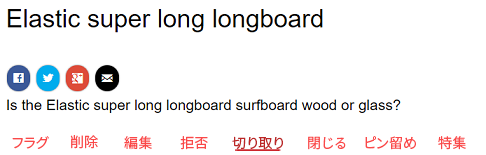
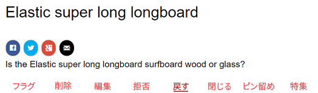
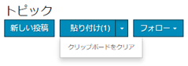
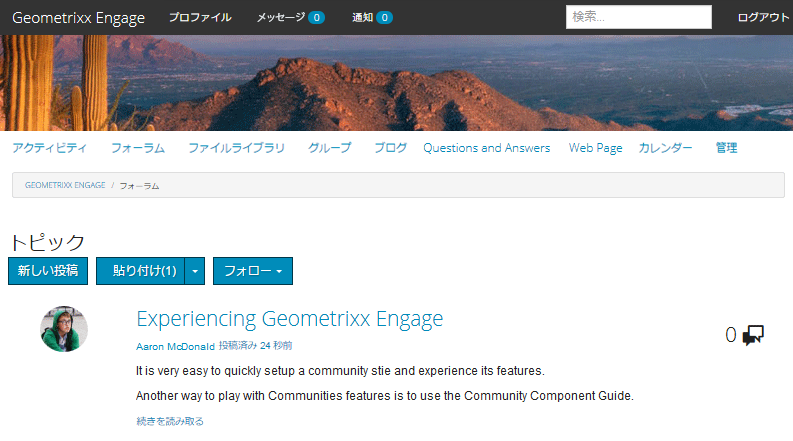
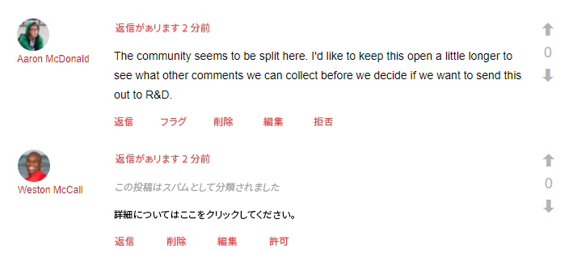
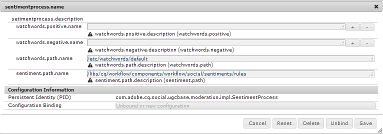
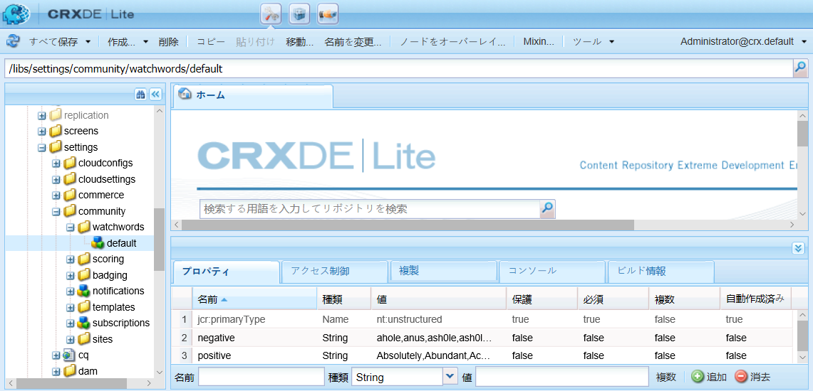

# コミュニティコンテンツのモデレート {#moderating-community-content}

>[!CAUTION]
>
>AEM 6.4 の拡張サポートは終了し、このドキュメントは更新されなくなりました。 詳細は、 [技術サポート期間](https://helpx.adobe.com/jp/support/programs/eol-matrix.html). サポートされているバージョンを見つける [ここ](https://experienceleague.adobe.com/docs/?lang=ja).

## 概要 {#overview}

コミュニティコンテンツ ( ユーザー生成コンテンツ (UGC) とも呼ばれます ) は、メンバー（サインインしたサイト訪問者）が公開済みのコミュニティサイトから次のコミュニティコンポーネントとやり取りしてコンテンツを投稿すると作成されます。

* [ブログ](blog-feature.md):メンバーがブログ記事またはコメントを投稿する
* [カレンダー](calendar.md):メンバーがカレンダーイベントまたはコメントを投稿しました
* [コメント](comments.md):メンバーはコメントを投稿するか、コメントに返信します
* [フォーラム](forum.md):メンバーは新しいトピックを投稿するか、トピックに返信します
* [アイディエーション](ideation-feature.md):メンバーがアイデアやコメントを投稿する
* [Q&amp;A](working-with-qna.md):メンバーが質問を作成するか、質問に回答します
* [レビュー](reviews.md):メンバーが項目を評価する際にコメントを投稿する

UGC のモデレートは、肯定的な貢献を認識し、否定的な貢献（スパムや虐待的な言語など）を制限するのに役立ちます。 UGC は、次の複数の環境からモデレートできます。

* [一括モデレートコンソール](moderation.md)

   モデレートコンソールには、管理者がアクセスでき、 [コミュニティモデレーター](users.md) パブリック環境の場合と、オーサー環境の管理者の場合が考えられます。 これは、コミュニティコンテンツが [共通店](working-with-srp.md).

* [コンテキスト内モデレート](in-context.md)

   パブリッシュ環境でのモデレートは、管理者およびコミュニティモデレーターが、コンテンツが投稿されたページで直接実行できます。

## モデレートアクション {#moderation-actions}

投稿されたコンテンツ (UGC) で実行できるアクションは、ユーザー ID と環境によって異なります。 次の表では、次の用語を使用して、ユーザー ID に応じた様々な役割を説明します。

* `Admin`\
   次のメンバーに属するユーザー [community-administrators](users.md) グループ
* `Moderator`
のメンバー [コミュニティモデレーター](users.md#publishenvironmentusersandgroups) グループ（次を含む） [モデレーター権限](in-context.md#moderatorpermissions))
* `Creator`\
   コンテンツを投稿したユーザー
* `Member`\
   特別な権限を持たないサインイン済みユーザー
* `Visitor`
匿名ユーザー

<table> 
 <tbody>
  <tr>
   <td> </td> 
   <td><strong>管理者</strong></td> 
   <td><strong>モデレーター</strong></td> 
   <td><strong>作成者</strong></td> 
   <td><strong>メンバー</strong></td> 
   <td><strong>訪問者</strong></td> 
   <td><strong>イベント  トリガー済み</strong></td> 
   <td><strong>事前モデレート</strong></td> 
  </tr>
  <tr>
   <td><strong>編集/  削除</strong></td> 
   <td>X</td> 
   <td>X</td> 
   <td>X</td> 
   <td> </td> 
   <td> </td> 
   <td> </td> 
   <td> </td> 
  </tr>
  <tr>
   <td><strong>切り取り</strong></td> 
   <td>X</td> 
   <td>X</td> 
   <td> </td> 
   <td> </td> 
   <td> </td> 
   <td> </td> 
   <td> </td> 
  </tr>
  <tr>
   <td><strong>拒否</strong></td> 
   <td>X</td> 
   <td>X</td> 
   <td> </td> 
   <td> </td> 
   <td> </td> 
   <td>X</td> 
   <td> </td> 
  </tr>
  <tr>
   <td><strong>閉じる/  再度開く</strong></td> 
   <td>X</td> 
   <td>X</td> 
   <td> </td> 
   <td> </td> 
   <td> </td> 
   <td>X</td> 
   <td>X  </td> 
  </tr>
  <tr>
   <td><strong>フラグ/  フラグ解除</strong></td> 
   <td>X</td> 
   <td>X</td> 
   <td> </td> 
   <td>X</td> 
   <td> </td> 
   <td>X</td> 
   <td> </td> 
  </tr>
  <tr>
   <td><strong>許可</strong></td> 
   <td>X</td> 
   <td>X</td> 
   <td> </td> 
   <td> </td> 
   <td> </td> 
   <td>X</td> 
   <td>X</td> 
  </tr>
 </tbody>
</table>

### 編集/削除 {#edit-delete}

投稿が完了した後は、作成者、管理者またはコミュニティモデレーターが編集または削除できます。

UGC を削除すると、リポジトリから削除され、復元できなくなります。

### 切り取り {#cut}

管理者またはコミュニティモデレーターは、1 つ以上のフォーラムトピックまたは Q&amp;A の質問を別の場所に移動できます。 同じメンバーが両方のサイトでモデレート権限を持っている場合、1 つのコミュニティサイトから別のコミュニティサイトに移動することも含まれます。

「切り取り」アクションを選択すると、内容がクリップボードにコピーされます。 複数の投稿をコピーし、グループとして新しい場所に移動できます。

 

もう 1 つの場所では、コンテンツがクリップボードに存在する場合、「新しい投稿」の横に貼り付けボタンが表示され、貼り付ける投稿の数が示されます。 「貼り付け」ボタンには、貼り付けの代わりにクリップボードをクリアするオプションが含まれています。

 

### 拒否 {#deny}

モデレーターは、UGC を公開済みサイトに表示し続けることを許可しない場合があります。 管理者およびコミュニティモデレーターは、投稿を引き続き利用でき、スパムとして注釈が付けられます。

### 閉じる/再度開く {#close-reopen}

「閉じる」アクションは、会話のスレッド全体（フォーラムトピックまたは最初のコメント）に対して動作し、それ以降のすべての投稿または返信が含まれます。

閉じた場合、それ以上の返信はできないだけでなく、モデレート操作もできません。

任意の操作を実行するには、トピックまたはコメントを再開する必要があります。

閉じる/再度開くアクションは、管理者またはコミュニティモデレーターが実行できます。

### フラグ/フラグ解除 {#flag-unflag}

フラグ付けは、サインインしたメンバー（コンテンツの作成者を除く）が投稿のコンテンツに問題があることを示す手段です。 フラグが設定されると、フラグ解除アイコンが表示され、同じメンバーがコンテンツのフラグを解除できます。

コンテキスト内モデレートを設定して、メンバーが投稿をフラグ付けする際に理由を選択できるようにすることができます。 選択可能なフラグの理由のリストは、カスタム理由を入力できるかどうかなどを設定できます。 フラグの理由は UGC と共に保存されますが、理由によって特定のアクションがトリガーされるわけではありません。 通知のフラグ数だけをトリガーします。 フラグ付きのコンテンツには注釈が付けられ、モデレーターが操作できるようになります。

システムは、フラグを設定したすべてのフラグとフラグの理由を追跡し、しきい値に達するとイベントを送信します。 UGC がコミュニティモデレーターによって許可されている場合、これらのフラグはアーカイブされます。 許可およびアーカイブ後に後続のフラグがある場合、それらは以前のフラグがない場合と同じようにアーカイブされます。

### 許可 {#allow}

許可アクションは、フラグ付き、拒否済み、または事前にモデレートされたシステムで承認されていない UGC のオプションです。 許可アクションは、存在するフラグ付きまたは拒否/スパムのステータスをクリアし、フラグ付きのデータをアーカイブします。

## 一般的なモデレートの概念 {#common-moderation-concepts}

### Premoderation {#premoderation}

UGC を事前にモデレートすると、モデレートアクションによって承認されるまで、投稿は公開済みのサイトに表示されません。 の作成時 [コミュニティサイト](sites-console.md)、 ` [Content is Premoderated](sites-console.md#moderation)` サイト全体の事前モデレートを有効にします。 コンポーネントをページに配置すると、モデレートをサポートするコンポーネントは、編集ダイアログの設定を使用して、事前モデレート用に設定できます。

* [コメント](comments.md) および [レビュー](reviews.md)

   オン **[!UICONTROL ユーザーモデレート]** タブ、チェック **[!UICONTROL モデレート前]**

* [フォーラム](forum.md), [理想化](ideation-feature.md), [Q&amp;A](working-with-qna.md)、および [カレンダー](calendar.md) オン **[!UICONTROL 設定]** タブ、チェック **[!UICONTROL モデレート]**

### スパム検出 {#spam-detection}

スパム検出は、自動モデレート機能で、送信されたユーザー生成コンテンツの不要な部分をスパムとしてマークして除外します。 有効にすると、事前に設定されたスパムワードの集まりに基づいて、ユーザーが生成したコンテンツがスパムかどうかを識別します。 デフォルトのスパムワードは次の場所に提供されています：

`/libs/settings/community/sites/moderation/spamdetector-conf/profiles/spam_words.txt`。

ただし、デフォルトのスパムワードをカスタマイズまたは拡張するには、 /apps ディレクトリに、 [オーバーレイ](overlay-comments.md).

（ブログ、フォーラム、コメントなど、あらゆるコンテンツタイプの）ユーザー生成投稿で、スパムの単語を含む投稿は、投稿の上に「この投稿はスパムとして分類されました」というテキストでマークされます。

モデレーターは、そのような投稿を表示し、同じようにマークして、サイトへの表示を許可または拒否できます。 これらの投稿に対するモデレート操作は、コンテキスト内または一括モデレート UI を使用して実行できます。

スパム検出エンジンを有効にするには、次の手順に従います。

1. 開く [Web コンソール](http://localhost:4502/system/console/configMgr)に移動して、 `/system/console/configMgr`.

1. 場所 **[!UICONTROL AEM Communities Auto Moderation]** 設定を編集します。
1. を `SpamProcess` エントリ。

>[!NOTE]
>
>スパム検出は、英語のロケールに対してのみ実装されます。

### 好感度 {#sentiment}

好感度は、肯定的なキーワードと否定的なキーワードの数 ([監視ワード](#configuringwatchwords)) が投稿 (UGC) に存在すること。

センチメント分析では、事前に設定された一連のルールが使用され、UGC のセンチメントが計算されます。 デフォルトのルールは、次の場所にあります。 `/libs/cq/workflow/components/workflow/social/sentiments/rules.`

ルールで生成される値は、1（すべて負、正の単語なし）から 10（すべて正、否定の単語なし）です。 センチメント値 5 は中立のセンチメントで、デフォルトはです。

/libs コンポーネントで定義されるルールは次のとおりです。

* ルール 1:肯定の単語がなく、否定的な単語が 1 つ以上ある場合は、値を 1 に設定します
* ルール 2:否定的な単語がなく、肯定的な単語が 1 つ以上ある場合は、値を 10 に設定します
* ルール 3:肯定的な単語よりも否定的な単語が多い場合は、値を 3 に設定します
* ルール 4:否定的な単語よりも肯定的な単語が多い場合は、値を 8 に設定します

ルールを上書きまたは追加するには、/apps ディレクトリに、デフォルトのルールの構造に従って一連のルールを作成します。 センチメント設定を編集して、ルールの場所を特定します。

分析が完了すると、センチメントは UGC と共に保存されます。

次の [一括モデレートコンソール](moderation.md)を使用すると、センチメントが否定的、中立的、肯定的のどれであるかに基づいて UGC をフィルタリングして表示できます。

#### ウォッチワード {#watchwords}

AEM communities では、評価プロセスのステップとして*ウォッチワードアナライザ*を提供しています [好感度](#sentiment). ウォッチワードによって提供されるセンチメント値の貢献度は、投稿されたコンテンツで使用される否定的なウォッチワードと肯定的なウォッチワード、および禁止されているワードが比較された結果です。

#### センチメントとウォッチワードの設定 {#configure-sentiment-and-watchwords}

肯定的および否定的なウォッチワードのリストは、センチメントルールと同様にカスタマイズできます。

デフォルトの監視ワードのリストは、デフォルトと同様に、リポジトリ内のノードのプロパティとして入力するか、OSGi サービスを設定してデフォルトを上書きすることで入力できます `sentimentprocess.name`単語のリストを含む

この **sentimentprocess.name** また、カスタムのセンチメントルールのセットの場所を参照するように変更することもできます。

センチメントとウォッチワードを設定するには：

* オーサーインスタンス上
* 管理者としてサインイン
* 開く [Web コンソール](http://localhost:4502/system/console/configMgr)
* 場所 `sentimentprocess.name`
* 編集モードで開く設定を選択します。

* **肯定的なウォッチワード**
デフォルトを上書きする肯定的な好感度に影響を与える単語のコンマ区切りリストです。 初期設定は空のリストです。

* **否定的なウォッチワード**
デフォルトを上書きする否定的な好感度に影響を与える単語のコンマ区切りリストです。 初期設定は空のリストです。

* **ウォッチワードノードへの明示的なパス**
デフォルトを含むノードのリポジトリの場所 
`positive` および `negative` デフォルトの監視ワードを指定するプロパティです。 デフォルトは `/libs/settings/community/watchwords/default` です。

* **好感度ルール**
肯定的および否定的なウォッチワードに基づいてセンチメントを計算するルールのリポジトリの場所。 初期設定は です。 
`/libs/cq/workflow/components/workflow/social/sentiments/rules` （ただし、関連するワークフローはなくなりました）。

次に、デフォルトのウォッチワードのカスタムエントリの例を示します。 `Explicit Path to Watchwords Node` が `/libs/settings/community/watchwords/default`.

### モデレーターの権限 {#moderator-permissions}

以下の権限は、同じリソースに割り当てられた場合、まとめて「 **`moderator permissions`**:

* `Read`
* **`Modify`**
* `Create`
* `Delete`
* `Replicate`
