# モデレートコンソール {#moderation-console}

>[!CAUTION]
>
>AEM 6.4 の拡張サポートは終了し、このドキュメントは更新されなくなりました。 詳細は、 [技術サポート期間](https://helpx.adobe.com/jp/support/programs/eol-matrix.html). サポートされているバージョンを見つける [ここ](https://experienceleague.adobe.com/docs/?lang=ja).

AEM Communitiesで一括 [コミュニティコンテンツのモデレート](moderate-ugc.md) は、管理者とコミュニティモデレーター（モデレーターとして割り当てられた信頼できるコミュニティメンバー）によって、オーサー環境とパブリッシュ環境の両方から実行できます。

管理者とコミュニティモデレーターも、 [コンテキスト内モデレート](in-context.md) （パブリッシュ環境で）

すべての [コミュニティサイト](sites-console.md) は `Administration`管理者権限を持つログインユーザーが使用できるメニュー項目です。 この `Administration`リンクをクリックすると、モデレートコンソールにアクセスできます。

モデレートコンソールから、管理者とコミュニティモデレーターは、モデレート権限を持つすべてのユーザー生成コンテンツ (UGC) にアクセスできます。 複数のサイトのモデレートを許可されている場合は、すべてのサイトにわたる投稿を表示したり、選択したコミュニティサイトでフィルターしたりできます。

詳しくは、 [ユーザーとユーザーグループの管理](users.md).

モデレートコンソールでは、次の機能をサポートしています。
* モデレートタスクの一括実行
* UGC の検索
* UGC の詳細の表示
* UGC 作成者の詳細の表示

管理者または ` [moderator permissions](in-context.md#identifyingtrustedmembers)`（モデレートタスクを実行できます）

## パブリッシュ環境へのアクセス {#publish-environment-access}

公開済みのコミュニティサイトからモデレートコンソールにアクセスするには、コミュニティモデレーターがサインインすると表示される「管理」リンクを使用します。

「管理」リンクを選択すると、モデレートコンソールが表示されます。

## オーサー環境へのアクセス {#author-environment-access}

オーサー環境で、モデレートコンソールに移動するには、次の手順を実行します。

* グローバルナビゲーションから： **[!UICONTROL ナビゲーション/コミュニティ/モデレート]**

管理者として、または ` [moderator permissions](in-context.md#identifyingtrustedmembers)`（モデレートタスクを実行できます） 表示されるコミュニティコンテンツは、サインインしたメンバーによるモデレートが許可されているものだけです。

>[!NOTE]
>
>パブリッシュ環境の UGC は、選択した SRP が共通ストアを実装している場合にのみ、オーサー環境で表示されます。 例えば、デフォルトではストレージは JSRP です。JSRP は、オーサーとパブリッシュに共通するストアではありません。 [コミュニティコンテンツのストレージ](working-with-srp.md)を参照してください。

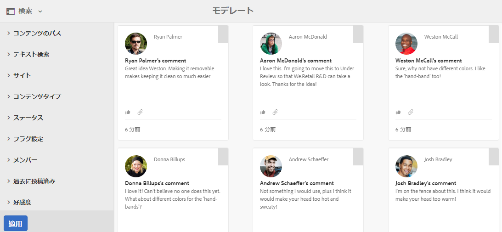

## モデレートコンソール UI {#moderation-console-ui}

左側のナビゲーションレール（オーサー環境では表示され、パブリッシュ環境では表示されない）の他に、モデレート UI の主な領域は次のとおりです。

* **[上部ナビゲーションバー](#top-navigation-bar)**
* **[ツールバー](#toolbar)**
* **[コンテンツ領域](#content-area)**

### 上部ナビゲーションバー {#top-navigation-bar}

上部ナビゲーションバーは、すべてのコンソールで一定です。 詳しくは、 [基本操作](../../help/sites-authoring/basic-handling.md).

### ツールバー {#toolbar}

上部ナビゲーションバーの下にあるツールバーでは、左側に次の切り替えスイッチが表示されます。

* [フィルターレール](moderation.md#filter-rail) パネルが開き、コンテンツのフィルタリングに使用するプロパティを選択できます。

上部ナビゲーションバーの下にあるツールバーでは、左側に次の切り替えスイッチが表示されます。

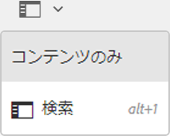

[フィルターレール](moderation.md#filter-rail)\
「検索」を選択するとパネルが開き、コンテンツをフィルタリングするプロパティを選択できます。

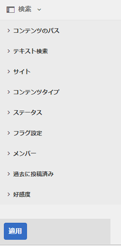

### コンテンツ領域 {#content-area}

コンテンツ領域には、投稿された UGC の情報が含まれます。

* UGC が投稿されました
* メンバー名
* メンバーアバター
* 投稿の場所
* 投稿日時
* 投稿への返信数
* [好感度](moderate-ugc.md#sentiment) 投稿に関連付けられている
* 承認されている場合は、チェックマークが表示されます
* 添付ファイルがある場合は、クリップが表示されます

>[!NOTE]
>
>コンテンツ領域には、 *無限スクロール*&#x200B;を使用すると、コンテンツの最後に達するまでスクロールを続行できます。 スクロール中でも、ツールバーはコンテンツ領域の上の固定された表示位置に保たれます。

### フィルターレール {#filter-rail}

サイドパネルアイコンをクリックすると、フィルターレールが開きます。 コンテンツ領域の左側に表示されるフィルターレールには、異なるフィルターが用意されており、それぞれのフィルターは、コンテンツ領域に表示される参照 UGC に直ちに影響を与えます。

各カテゴリ内のフィルターは次のとおりです **または**&#x200B;を組み合わせ、異なるカテゴリのフィルターを **および**&#x200B;一緒に

例えば、 **質問** および **回答**&#x200B;を選択すると、次のいずれかの **質問** *または* an **回答**.

ただし、 **質問** および **保留中**&#x200B;に含まれている場合、 **質問** および **保留中**.

>[!NOTE]
>
>コミュニティモデレーターは、モデレートコンソールの UI で事前定義済みのフィルターをブックマークできます。 これらのフィルターは URL の末尾に（クエリ文字列パラメーターとして）追加されるので、モデレーターは後でブックマークされたフィルターに戻り、これらのリンクを共有することができます。

フィルターレールが開いている場合、検索アイコンはサイドパネルを閉じるかどうかを切り替えます。 ただし、フィルターレールを閉じてユーザー生成コンテンツのみを表示する場合は、検索アイコンをクリックして、「コンテンツのみ」オプションを選択します。

#### コンテンツのパス {#content-path}

コンテンツのパスは、表示される UGC 参照を、指定したコンテンツリポジトリに配置された投稿に限定します。

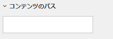

#### テキスト検索 {#text-search}

テキスト検索では、表示される UGC 参照を、入力したテキストを含む投稿に限定します。

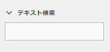

#### サイト {#site}

サイトでは、表示される参照 UGC を、選択したコミュニティサイトへの投稿に限定します。 サイトがチェックされていない場合は、UGC への参照がすべて表示されます。

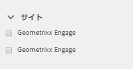

>[!NOTE]
>
>管理者が一括モデレートコンソールにアクセスすると、UGC への参照がすべて表示されます。これには、 [サイト作成ウィザード](sites-console.md)(Geometrixxサンプルなど )
>
>信頼されたコミュニティメンバーが発行時に一括モデレートコンソールにアクセスすると、そのメンバーがモデレートする権限を持つコミュニティサイト用に作成された UGC への参照のみが表示され、サイトフィルターでフィルタリングできます。

#### コンテンツタイプ {#content-type}

コンテンツタイプは、表示される参照 UGC を、選択したリソースタイプの投稿のみに制限します。 次のタイプを 1 つ以上選択できます。 何も選択しない場合は、すべてのタイプが表示されます。

* **コメント**
* **フォーラムトピック**
* **フォーラム返信**
* **Q&amp;A 質問**
* **Q&amp;A 回答**
* **ブログ記事**
* **ブログコメント**
* **カレンダー イベント**
* **カレンダーコメント**
* **ファイルライブラリフォルダー**
* **ファイルライブラリ文書**
* **アイデア**
* **アイディエーションのコメント**

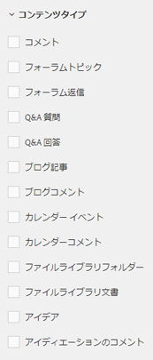

#### 追加のコンテンツタイプ {#additional-content-types}

フィルタリング対象のリソースを追加するには、次の手順に従います。

* オーサーインスタンス上
* 管理者としてサインイン
* 開く [Web コンソール](http://localhost:4502/system/console/configMgr)
* 場所 `AEM Communities Moderation Dashboard Filters`
* 編集モードで開く設定を選択します。
* フィルターするコンポーネントの ResourceType を入力します
   * 例えば、含まれる投票コンポーネントに対してフィルタを適用するには、次のように入力します。\
      `Voting=social/tally/components/hbs/voting`

* 「保存」を選択します
* コミュニティ — モデレートコンソールを更新します。

その結果、次の項目の選択可能な新しいフィルターが作成されます。 `Voting`の下に `Content Type` フィルターグループを使用します。

このフィルターを選択すると、ダッシュボードのコンテンツに、入力した ResourceTypes に一致する UGC が表示されます。

#### ステータス {#status}

ステータスは、表示される UGC 参照を、選択したステータスの投稿に制限します。選択できる投稿には、保留中、承認済み、拒否、クローズ済みの 1 つ以上の投稿、ブログ記事の下書きやスケジュール済み、Q&amp;A 質問に対する回答済みまたは未回答済みが含まれます。 何も選択しない場合は、すべてが表示されます。

>[!NOTE]
>
>「未回答」ステータスのみが選択されている場合、モデレーターには、回答済みの質問を除くすべてのコンテンツ（すべてのコンテンツタイプ）が表示されます。 「回答済みの質問」に対する責任者プロパティが存在しないのは、「未回答の質問」や、フォーラムトピック、ブログ記事、コメントなどのコンテンツの場合です。

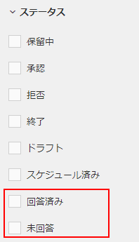

#### フラグ設定 {#flagging}

フラグ設定は、表示される参照 UGC を、フラグ付けされた投稿または非表示の投稿に限定します。

コンテンツにフラグが設定されると、 **[!UICONTROL フラグ]** ボタンをもう一度クリックします。 重要なレベルやフォローアップレベルなどのフラグレベルはありません。

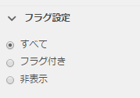

#### メンバー {#members}

メンバーは、表示される UGC 参照を、入力したメンバー名で投稿された UGC に限定します。

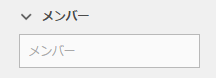

#### 過去に投稿済み {#posted-in-the-last}

最後に投稿された UGC 参照は、1 時間、1 日、1 週間、1 か月、または 1 年に投稿されたものに限定されます。

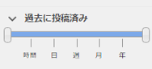

#### 好感度 {#sentiment}

[好感度](moderate-ugc.md#sentiment) 表示される UGC 参照を、好感度の値が肯定的、否定的、中立の投稿に限定します。

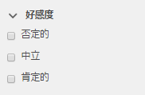

## モデレートアクション {#moderation-actions}

[モデレートアクション](moderate-ugc.md#moderation-actions) は、コンテンツ領域での 1 つ以上の選択に対して、またはコンテンツの詳細の表示時に実行できます。

投稿を一括モデレートするには、コンテンツ領域で、選択 ( ) アイコンを投稿に表示します。投稿の上にマウスを置く（デスクトップ）か、投稿の上に指を押しながら（モバイル）表示します。 これにより、複数選択モードに入り、クリックするだけで、一括モデレートする後続の投稿を選択できるようになります。 ツールバーに表示されるボタンを使用して、選択した投稿に対するモデレートアクションを実行します。 すべてのアクションで確認を求められます。

コンテンツ領域で 1 つの投稿をモデレートするには、その投稿にマウスを合わせるか（デスクトップ）、投稿上で指を押しながら（モバイル）、投稿にボタンが表示されるようにします。 1 つのコンテンツの詳細で操作する場合は、削除アクションのみが確認を求めます。

### 複数の投稿のモデレート {#moderating-multiple-posts}

一括選択モードに入るには、 `Select` 投稿のアイコン：

一括選択モードを終了するには、ツールバーのキャンセル (x) アイコンを選択します。

複数の投稿に対して実行できるモデレートアクションは次のとおりです。

* 拒否
* 削除
* 投稿を閉じる/再度開く

これらのアクションを許可するアイコンは、複数の投稿が選択されている場合にのみツールバーに表示されます。

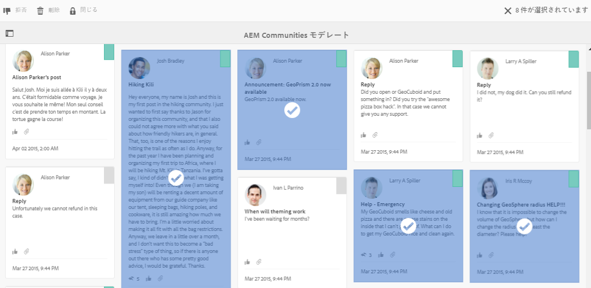

### 単一の投稿のモデレート {#moderating-a-single-post}

単一選択モードでは、次の操作が可能です。

* ユーザー名を選択してユーザーの詳細を表示
* 投稿へのリンクを選択して、コンテキスト内の投稿を表示します
* [返信](#reply)
* [許可](#allow)
* [拒否](#deny)
* [削除](#delete)
* [閉じる](#close)
* 表示 [モデレート履歴](#moderation-history)
* [詳細を表示](#viewdetails)

モデレートアクションアイコンの上のカード表示には、投稿のテキストが表示され、その下のデータは、

* 返信がある場合は、返信の数が前に付きます
* フラグが設定されている場合
* が承認されている場合
* UGC が投稿された日時

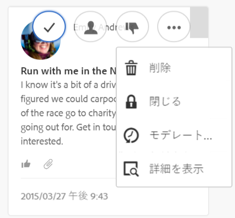

#### 返信 {#reply}

1 つの投稿を操作する場合、UGC タイプが返信をサポートし、返信を許可するように設定されている場合は、返信アイコンが表示されます。

#### 許可 {#allow}

1 つの投稿を操作する場合、その投稿にフラグが設定されているか拒否されていると、許可アイコンが表示されます。 フラグが設定されている場合、「許可」を選択するとすべてのフラグがクリアされます。

#### 拒否 {#deny}

この **拒否** モデレート操作は、モデレートされているコンテンツに対してのみ使用でき、モデレートされていないコンテンツには表示されません（複数選択モードの場合を除く）。

モデレートされていないコンテンツは常に承認されます。

モデレートされたコンテンツは、最初は「保留」状態になり、後で承認または拒否するように変更できます。

保留中の状態から離れたコンテンツは、保留中の状態に戻すことはできません。 承認または拒否としてマークされたコンテンツは、いつでも別の状態に変更できます。

#### 削除 {#delete}

単一選択または一括モードでは、項目を選択して削除できます。 削除アクションを実行すると、確認ダイアログが表示されます。 削除すると、それらの項目は直ちにコンテンツ領域から消えます。 **UGC を削除すると、リポジトリから完全に削除され、後で取得することはできなくなります。**

#### 閉じる {#close}

1 つの投稿を操作する場合、UGC タイプがそのリソースのそれ以上の投稿を防ぐ機能をサポートしている場合は、閉じるアイコンが表示されます。

#### モデレート履歴 {#moderation-history}

1 つの投稿を操作する場合、その投稿にカーソルを合わせると、モデレート履歴アイコンが表示されます。 このアイコンを選択すると、UGC 投稿に関して実行されたアクションの履歴を含むパネルが表示されます。

複数の UGC 投稿のコンテンツ領域表示に戻るには、ビュー詳細ペインの右上隅にある X を選択します。

次に例を示します。

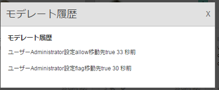

#### 詳細を表示 {#view-detail}

1 つの投稿を操作する場合、UGC を詳細モードで開くと、さらに詳細を表示できます。

これをおこなうには、投稿の上にマウスポインターを置いて、 `View Detail` アイコンをクリックして選択し、投稿の詳細を含むパネルを表示します。

複数の UGC 投稿のコンテンツ領域表示に戻るには、ビュー詳細ペインの右上隅にある X を選択します。

次に例を示します。

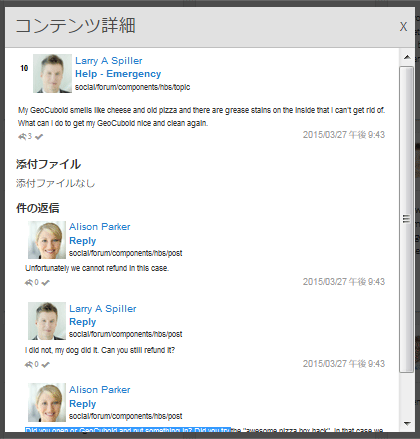
