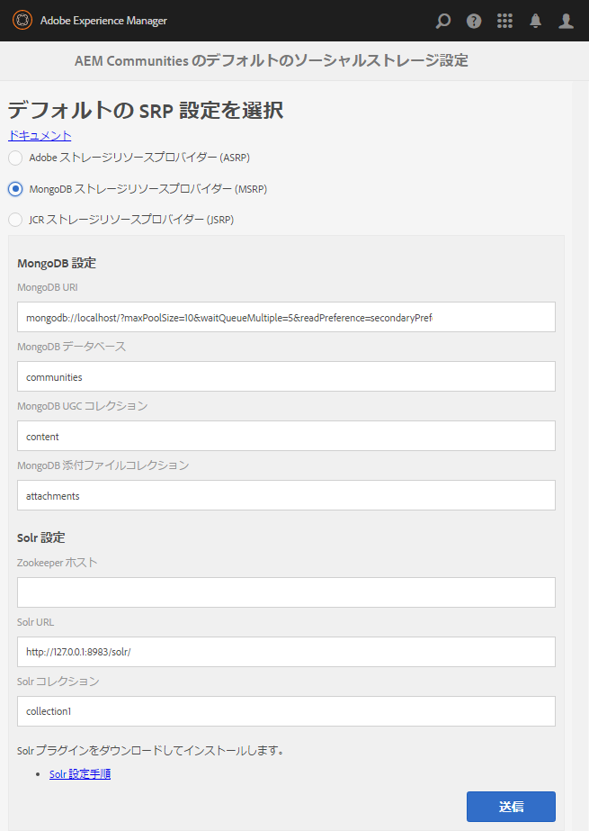

# MSRP - MongoDB ストレージリソースプロバイダー {#msrp-mongodb-storage-resource-provider}

>[!CAUTION]
>
>AEM 6.4 の拡張サポートは終了し、このドキュメントは更新されなくなりました。 詳細は、 [技術サポート期間](https://helpx.adobe.com/jp/support/programs/eol-matrix.html). サポートされているバージョンを見つける [ここ](https://experienceleague.adobe.com/docs/?lang=ja).

## MSRP について {#about-msrp}

AEM Communitiesが MSRP を共通ストアとして使用するように設定されている場合、同期やレプリケーションを必要とせずに、すべてのオーサーインスタンスとパブリッシュインスタンスからユーザー生成コンテンツ (UGC) にアクセスできます。

関連トピック [SRP オプションの特性](working-with-srp.md#characteristics-of-srp-options) および [推奨されるトポロジ](topologies.md).

## 要件 {#requirements}

* [MongoDB](https://www.mongodb.org/):

   * バージョン 2.6 以降
   * モンゴや共有を設定する必要がない
   * の使用を強くお勧めします [レプリカセット](#mongoreplicaset)
   * AEMと同じホスト上で実行するか、リモートで実行できます

* [Apache Solr](https://lucene.apache.org/solr/):

   * バージョン 4.10 またはバージョン 5
   * Solr には Java 1.7 以降が必要です
   * サービスは不要
   * 実行モードの選択：
      * スタンドアロンモード
      * [SolrCloud モード](solr.md#solrcloud-mode) （実稼動環境に推奨）
   * 多言語検索 (MLS) の選択
      * [標準の MLS のインストール](solr.md#installing-standard-mls)
      * [高度な MLS のインストール](solr.md#installing-advanced-mls)

## MongoDB 設定 {#mongodb-configuration}

### MSRP を選択 {#select-msrp}

この [ストレージ設定コンソール](srp-config.md) では、使用する SRP の実装を指定するデフォルトのストレージ設定を選択できます。

オーサー環境でストレージ設定コンソールにアクセスするには、次の手順に従います。

* グローバルナビゲーションから： **[!UICONTROL ツール/コミュニティ/ストレージ設定]**



* 選択 **[!UICONTROL MongoDB ストレージリソースプロバイダー (MSRP)]**
* **[!UICONTROL MongoDB 設定]**

   * **[!UICONTROL MongoDB URI]**

      *デフォルト*:mongodb://localhost/?maxPoolSize=10&amp;waitQueueMultiple=5&amp;readPreference=secondaryPreferred

   * **[!UICONTROL MongoDB データベース]**

      *デフォルト*:コミュニティ

   * **[!UICONTROL MongoDB UGC コレクション]**

      *デフォルト*:コンテンツ

   * **[!UICONTROL MongoDB 添付ファイルコレクション]**

      *デフォルト*:添付ファイル

* **[!UICONTROL SolrConfiguration]**

   * **[](https://cwiki.apache.org/confluence/display/solr/Using+ZooKeeper+to+Manage+Configuration+Files)Zookeeper ホスト**

      で実行する場合 [SolrCloud モード](solr.md#solrcloud-mode) 外部の ZooKeeper で、この値を `HOST:PORT` ZooKeeper の *my.server.com:2181*
ZooKeeper アンサンブルの場合は、コンマ区切りで入力します。 `HOST:PORT` 値： *host1:2181,host2:2181*
Solr をスタンドアロンモードで実行する場合は、内部 ZooKeeper を使用して空白のままにします。\
      *デフォルト*: *&lt;blank>*
   * **[!UICONTROL Solr URL]**
スタンドアロンモードで Solr との通信に使用する URL です。
SolrCloud モードで実行する場合は空白のままにします。
\
      *デフォルト*:https://127.0.0.1:8983/solr/
   * **[!UICONTROL Solr コレクション]**
Solr コレクション名です。
\
      *デフォルト*:collection1
* 「**[!UICONTROL 送信]**」を選択します。

>[!NOTE]
>
>MongoDB データベース。デフォルトの名前はです。 `communities`を、使用するデータベースの名前に設定しないでください。 [ノードストアまたはデータ（バイナリ）ストア](../../help/sites-deploying/data-store-config.md). 関連トピック [AEM 6 のストレージ要素](../../help/sites-deploying/storage-elements-in-aem-6.md).

### MongoDBレプリカセット {#mongodb-replica-set}

本番環境では、プライマリセカンダリレプリケーションと自動フェイルオーバーを実装する MongoDB サーバーのクラスターであるレプリカセットをセットアップすることを強くお勧めします。

レプリカセットの詳細については、MongoDB の [レプリケーション](https://docs.mongodb.org/manual/replication/) ドキュメント。

レプリカセットの操作と、アプリケーションと MongoDB インスタンス間の接続を定義する方法については、MongoDB の [接続文字列 URI の形式](https://docs.mongodb.org/manual/reference/connection-string/) ドキュメント。

#### レプリカセットに接続するための URL の例  {#example-url-for-connecting-to-a-replica-set}

```shell
# Example url for:

>[!CAUTION]
>
>AEM 6.4 has reached the end of extended support and this documentation is no longer updated. For further details, see our [technical support periods](https://helpx.adobe.com/support/programs/eol-matrix.html). Find the supported versions [here](https://experienceleague.adobe.com/docs/).
#     servers "mongoserver1", "mongoserver2", "mongoserver3" 

>[!CAUTION]
>
>AEM 6.4 has reached the end of extended support and this documentation is no longer updated. For further details, see our [technical support periods](https://helpx.adobe.com/support/programs/eol-matrix.html). Find the supported versions [here](https://experienceleague.adobe.com/docs/).
#     replica set 'rs0'

>[!CAUTION]
>
>AEM 6.4 has reached the end of extended support and this documentation is no longer updated. For further details, see our [technical support periods](https://helpx.adobe.com/support/programs/eol-matrix.html). Find the supported versions [here](https://experienceleague.adobe.com/docs/).
# port numbers only necessary if not default port 27017

>[!CAUTION]
>
>AEM 6.4 has reached the end of extended support and this documentation is no longer updated. For further details, see our [technical support periods](https://helpx.adobe.com/support/programs/eol-matrix.html). Find the supported versions [here](https://experienceleague.adobe.com/docs/).
mongodb://mongoserver1:<mongoport1>,mongoserver2:<mongoport2>,mongoserver3:<mongoport3>/?replicaSet=rs0&maxPoolSize=100&waitQueueMultiple=50&readPreference=secondaryPreferred
```

## Solr 設定 {#solr-configuration}

異なるコレクションを使用することで、1 つの Solr インストールをノードストア (Oak) と共通ストア (MSRP) の間で共有できます。

Oak コレクションと MSRP コレクションの両方を集中的に使用する場合は、パフォーマンス上の理由から 2 つ目の Solr をインストールすることができます。

実稼動環境の場合、 [SolrCloud モード](solr.md#solrcloud-mode) では、スタンドアロンモード（単一のローカル Solr 設定）よりも高いパフォーマンスを提供します。

設定の詳細については、 [SRP 用の Solr 設定](solr.md).

### アップグレード {#upgrading}

MSRP で設定された以前のバージョンからアップグレードする場合は、次の手順を実行する必要があります。

1. を実行します。 [AEM Communitiesへのアップグレード](upgrade.md)
1. 新しい Solr 設定ファイルをインストールします
   * の場合 [標準の MLS](solr.md#installing-standard-mls)
   * の場合 [高度な MLS](solr.md#installing-advanced-mls)
1. MSRP のインデックス再作成の節を参照 [MSRP インデックス再作成ツール](#msrp-reindex-tool)

## 設定の公開 {#publishing-the-configuration}

MSRP は、すべてのオーサーインスタンスとパブリッシュインスタンスで共通ストアとして識別する必要があります。

パブリッシュ環境で同じ設定を使用できるようにするには、次の手順を実行します。

* 作成者：
   * メインメニューからに移動します。 **[!UICONTROL [ ツール ] > [ 操作 ] > [ レプリケーション ]]**
   * 選択 **[!UICONTROL ツリーをアクティベート]**
   * **[!UICONTROL 開始パス]**:
      * 参照先 `/etc/socialconfig/srpc/`
   * 選択 **[!UICONTROL 有効化]**

## ユーザーデータの管理 {#managing-user-data}

以下に関する情報： *ユーザー*, *ユーザープロファイル* および *ユーザーグループ*&#x200B;パブリッシュ環境に入力されることが多い場合は、次にアクセスします。

* [ユーザー同期](sync.md)
* [ユーザーとユーザーグループの管理](users.md)

## MSRP インデックス再作成ツール {#msrp-reindex-tool}

新しい設定ファイルをインストールしたり、破損した Solr インデックスを修復する際に、MSRP 用の Solr のインデックスを再作成するための HTTP エンドポイントがあります。

このツールを使用すると、MongoDB は *真実* （MSRP 用）バックアップは MongoDB からのみ取得する必要があります。

UGC ツリー全体のインデックスを再作成することも、*path *data パラメーターで指定された特定のサブツリーのみを再作成することもできます。

このツールは、cURL または他の HTTP ツールを使用してコマンドラインから実行できます。

インデックス再作成時には、メモリとパフォーマンスの間のトレードオフがあります。このトレードオフは、*batchSize *data パラメータで制御し、バッチごとに再インデックスされる UGC レコードの数を指定します。

適切なデフォルト値は 5000 です。

* メモリが問題の場合は、より小さい数値を指定します
* 速度が問題の場合は、速度を上げるために大きい数値を指定します

### cURL コマンドを使用した MSRP インデックス再作成ツールの実行 {#running-msrp-reindex-tool-using-curl-command}

次の cURL コマンドは、MSRP に格納された UGC を再インデックスする HTTP リクエストに必要な事項を示しています。

基本的な形式は次のとおりです。

cURL -u *サインイン* -d *データ* *reindex-url*

*サインイン* = administrator-id:password\
例：admin:admin

*データ* = &quot;batchSize=*サイズ*&amp;path=*path&quot;*

*サイズ* =操作ごとにインデックスを再作成する UGC エントリの数\
`/content/usergenerated/asi/mongo/`

*パス* =再インデックスする UGC のツリーのルート位置

* すべての UGC を再インデックスするには、 `asipath`プロパティ\
   `/etc/socialconfig/srpc/defaultconfiguration`
* インデックスを一部の UGC に制限するには、次のサブツリーを指定します。 `asipath`

*reindex-url* = SRP のインデックス再作成のエンドポイント\
`http://localhost:4503/services/social/datastore/mongo/reindex`

>[!NOTE]
>
>次の場合、 [DSRP Solr のインデックス再作成](dsrp.md)の場合、URL は **/services/social/datastore/rdb/reindex**

### MSRP インデックス再作成の例 {#msrp-reindex-example}

```shell
curl -s -u admin:admin -d 'batchSize=10000&path=/content/usergenerated/asi/mongo/' http://localhost:4503/services/social/datastore/mongo/reindex
```

## MSRP のデモ方法 {#how-to-demo-msrp}

デモ環境または開発環境用に MSRP を設定するには、 [デモ用に MongoDB を設定する方法](demo-mongo.md).

## トラブルシューティング {#troubleshooting}

### MongoDB で UGC が表示されない {#ugc-not-visible-in-mongodb}

ストレージオプションの設定を確認して、MSRP がデフォルトのプロバイダーに設定されていることを確認します。 デフォルトでは、ストレージリソースプロバイダーは JSRP です。

すべてのオーサーインスタンスとパブリッシュAEMインスタンスで、 [ストレージ設定コンソール](srp-config.md) AEMリポジトリを確認します。

* JCR で、 [/etc/socialconfig](http://localhost:4502/crx/de/index.jsp#/etc/socialconfig/)

   * 次を含まない [srpc](http://localhost:4502/crx/de/index.jsp#/etc/socialconfig/srpc) ノードの場合、ストレージプロバイダーが JSRP であることを意味します。
   * srpc ノードが存在し、ノードが含まれる場合 [defaultconfiguration](http://localhost:4502/crx/de/index.jsp#/etc/socialconfig/srpc/defaultconfiguration)の場合、デフォルトの設定のプロパティでは、MSRP をデフォルトのプロバイダーとして定義する必要があります

### アップグレード後に UGC が消える {#ugc-disappears-after-upgrade}

既存のAEM Communities 6.0 サイトからアップグレードする場合は、既存の UGC を、 [SRP](srp.md) AEM Communities 6.3 にアップグレードした後の API

この目的で、GitHub で利用できるオープンソースツールがあります。

* [AEM Communities UGC 移行ツール](https://github.com/Adobe-Marketing-Cloud/communities-ugc-migration)

移行ツールは、AEMソーシャルコミュニティの以前のバージョンから UGC を書き出し、AEM Communities 6.1 以降に読み込むようにカスタマイズできます。

### エラー — 未定義のフィールド provider_id {#error-undefined-field-provider-id}

ログに次のエラーが表示される場合は、Solr スキーマファイルが正しく設定されていないことを示します。

#### JsonMappingException:未定義のフィールド provider_id {#jsonmappingexception-undefined-field-provider-id}

```xml
Caused by: com.fasterxml.jackson.databind.JsonMappingException: undefined field provider_id
at com.fasterxml.jackson.databind.ser.DefaultSerializerProvider.serializeValue(DefaultSerializerProvider.java:129)
at com.fasterxml.jackson.databind.ObjectMapper.writeValue(ObjectMapper.java:1819)
at com.adobe.cq.social.scf.core.BaseSocialComponent.toJSONString(BaseSocialComponent.java:196)
... 124 common frames omitted
```

エラーを解決するには、 [標準の MLS のインストール](solr.md#installing-standard-mls)，確実に

* XML 設定ファイルが正しい Solr の場所にコピーされました
* 新しい設定ファイルが既存の設定ファイルに置き換えられた後に Solr が再起動されました

### MongoDB へのセキュア接続が失敗する {#secure-connection-to-mongodb-fails}

MongoDB サーバーへのセキュア接続を試みても、クラス定義が見つからず、失敗した場合は、MongoDB ドライバーバンドルを更新する必要があります。 `mongo-java-driver`：パブリック maven リポジトリから入手できます。

1. からドライバをダウンロードします。 [https://search.maven.org/#artifactdetails%7Corg.mongodb%7Cmongo-java-driver%7C2.13.2%7Cjar](https://search.maven.org/#artifactdetails%7Corg.mongodb%7Cmongo-java-driver%7C2.13.2%7Cjar) ( バージョン2.13.2以降 )
1. バンドルをAEMインスタンスの「crx-quickstart/install」フォルダーにコピーします。
1. AEMインスタンスを再起動します。

## リソース {#resources}

* [MongoDB を備えた AEM](../../help/sites-deploying/aem-with-mongodb.md)
* [MongoDB ドキュメント](https://docs.mongodb.org/)
