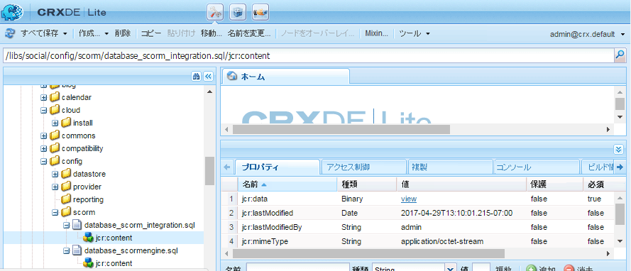
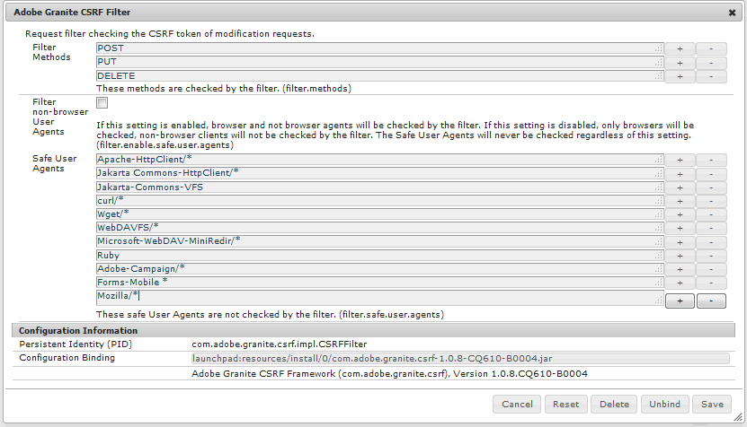

# イネーブルメント機能のための MySQL 設定 {#mysql-configuration-for-enablement-features}

MySQL は、主にイネーブルメントリソースの SCORM 追跡およびレポートデータに使用されるリレーショナルデータベースです。 ビデオの一時停止/再開の追跡など、その他の機能に関する表が含まれています。

以下の手順では、MySQL サーバーへの接続、イネーブルメントデータベースの確立、データベースへの初期データの入力の方法について説明します。

## 要件 {#requirements}

コミュニティのイネーブルメント機能用に MySQL を設定する前に、必ず

* インストール [MySQL サーバー](https://dev.mysql.com/downloads/mysql/) Community Server バージョン 5.6
   * バージョン 5.7 は SCORM ではサポートされていません
   * オーサーAEMインスタンスと同じサーバーである可能性があります
* すべてのAEMインスタンスで、公式の [MySQL 用 JDBC ドライバー](deploy-communities.md#jdbc-driver-for-mysql)
* インストール [MySQL workbench](https://dev.mysql.com/downloads/tools/workbench/)
* すべてのAEMインスタンスで、 [SCORM パッケージ](enablement.md#scorm)

## MySQL のインストール {#installing-mysql}

ターゲット OS の手順に従って、MySQL をダウンロードし、インストールする必要があります。

### 小文字のテーブル名 {#lower-case-table-names}

SQL では大文字と小文字が区別されないので、大文字と小文字が区別されるオペレーティングシステムでは、すべてのテーブル名を小文字にする設定を含める必要があります。

例えば、Linux OS ですべての小文字テーブル名を指定するには、次のようにします。

* ファイルを編集 `/etc/my.cnf`
* 内 `[mysqld]` セクションで、次の行を追加します。
   `lower_case_table_names = 1`

### UTF8 文字セット {#utf-character-set}

より多言語サポートを提供するには、UTF8 文字セットを使用する必要があります。

MySQL を UTF8 の文字セットに変更します。
* mysql> SET NAMES &#39;utf8&#39;;

MySQL データベースをデフォルトの UTF8 に変更します。
* ファイルを編集 `/etc/my.cnf`
* 内 `[client]` セクションで、次の行を追加します。
   `default-character-set=utf8`
* 内 `[mysqld]` セクションで、次の行を追加します。
   `character-set-server=utf8`

## MySQL Workbench のインストール {#installing-mysql-workbench}

MySQL Workbench には、スキーマと初期データをインストールする SQL スクリプトを実行するための UI が用意されています。

ターゲット OS の手順に従って、MySQL Workbench をダウンロードし、インストールする必要があります。

## イネーブルメント接続 {#enablement-connection}

MySQL Workbench を初めて起動したときは、他の目的で既に使用されている場合を除き、接続はまだ表示されません。

### 新しい接続設定 {#new-connection-settings}

1. の右にある「+」アイコンを選択します。 `MySQL Connections`.
1. ダイアログ内 `Setup New Connection`を使用する場合は、プラットフォームのデモ用に適切な値を入力します。オーサーAEMインスタンスと MySQL を同じサーバー上に置きます。
   * 接続名： `Enablement`
   * 接続方法： `Standard (TCP/IP)`
   * ホスト名： `127.0.0.1`
   * ユーザー名: `root`
   * パスワード: `no password by default`
   * デフォルトのスキーマ： `leave blank`
1. 選択 `Test Connection` 実行中の MySQL サービスへの接続を検証するには、以下を実行します。

**備考**:

* デフォルトのポートは `3306`
* この `Connection Name` 次の項目を選択しました： `datasource` 名前を入力 [JDBC OSGi 設定](#configure-jdbc-connections)

#### 接続成功 {#successful-connection}

#### 新しいイネーブルメント接続 {#new-enablement-connection}

## データベース設定 {#database-setup}

新しいイネーブルメント接続を開くと、テストスキーマとデフォルトのユーザーアカウントが存在することに注意してください。

### SQL スクリプトの取得 {#obtain-sql-scripts}

SQL スクリプトは、オーサーインスタンスでCRXDE Liteを使用して取得されます。 この [SCORM パッケージ](deploy-communities.md#scorm) をインストールする必要があります。

1. 参照してCRXDE Lite
   * 例： [http://localhost:4502/crx/de](http://localhost:4502/crx/de)
1. を展開します。 `/libs/social/config/scorm/` フォルダー
1. ダウンロード `database_scormengine.sql`
1. ダウンロード `database_scorm_integration.sql`

スキーマをダウンロードする方法の 1 つは、次の操作です。

* を選択します。 `jcr:content`sql ファイルのノード
* の値 `jcr:data`プロパティは表示リンクです
* データをローカルファイルに保存するには、表示リンクを選択します

### SCORM データベースを作成 {#create-scorm-database}

作成するイネーブルメント SCORM データベースは次のとおりです。

* name: `ScormEngineDB`
* スクリプトから作成：
   * スキーマ: `database_scormengine.sql`
   * データ： `database_scorm_integration.sql`
以下の手順に従います (
[open](#step-open-sql-file), [execute](#step-execute-sql-script)) をインストールします。 [SQL スクリプト](#obtain-sql-scripts) . [更新](#refresh) 必要に応じて、スクリプトの実行結果を確認します。

データをインストールする前に、必ずスキーマをインストールしてください。

>[!CAUTION]
>
>データベース名が変更された場合は、
>
>* [JDBC 設定](#configure-jdbc-connections)
>* [SCORM 設定](#configure-scorm)
>

#### 手順 1:SQL ファイルを開く {#step-open-sql-file}

MySQL Workbench 内

* [ ファイル ] プルダウンメニューから
* 選択 `Open SQL Script ...`
* この順序で、次のいずれかを選択します。
   1. `database_scormengine.sql`
   1. `database_scorm_integration.sql`

#### 手順 2:SQL スクリプトを実行 {#step-execute-sql-script}

手順 1 で開いたファイルの Workbench ウィンドウで、 `lightening (flash) icon` スクリプトを実行します。

なお、 `database_scormengine.sql` SCORM データベースを作成するスクリプトの完了には 1 分かかる場合があります。

#### 更新 {#refresh}

スクリプトを実行した後、 `SCHEMAS`セクション `Navigator` 新しいデータベースを確認するために。 「スキーマ」の右にある更新アイコンを使用します。

#### 結果：scorenginedb {#result-scormenginedb}

SCHEMAS をインストールして更新した後、 **`scormenginedb`** が表示されます。

## JDBC 接続の設定 {#configure-jdbc-connections}

の OSGi 設定 **Day Commons JDBC Connections Pool** MySQL JDBC ドライバーを設定します。

すべてのパブリッシュインスタンスとオーサーAEMインスタンスは、同じ MySQL サーバーを指す必要があります。

MySQL をAEMとは異なるサーバーで実行する場合は、JDBC コネクタの「localhost」の代わりにサーバーホスト名を指定する必要があります ( これにより、 [ScormEngine](#configurescormengineservice) 設定 ) を参照してください。

* 各オーサーおよびパブリッシュAEMインスタンスで
* 管理者権限でサインインしています
* 次にアクセス： [web コンソール](../../help/sites-deploying/configuring-osgi.md)
   * 例： [http://localhost:4502/system/console/configMgr](http://localhost:4502/system/console/configMgr)
* を `Day Commons JDBC Connections Pool`
* を選択します。 `+` 新しい設定を作成するアイコン

* 次の値を入力します。
   * **[!UICONTROL JDBC ドライバークラス]**: `com.mysql.jdbc.Driver`
   * **DBC 接続 URIJ**: `jdbc:mysql://localhost:3306/aem63reporting` MySQL サーバーが「this」AEMサーバーと同じでない場合は、localhost の代わりにサーバーを指定します
   * **[!UICONTROL ユーザー名]**:Root にするか、MySQL サーバー用に設定されたユーザー名を入力します（「root」でない場合）。
   * **[!UICONTROL パスワード]**:MySQL のパスワードが設定されていない場合はこのフィールドをクリアし、設定されていない場合は MySQL ユーザー名用に設定されたパスワードを入力します
   * **[!UICONTROL データソース名]**:次に対して入力した名前： [MySQL 接続](#new-connection-settings)（例： &#39;enablement&#39;）
* 選択 **[!UICONTROL 保存]**

## Scorm の設定 {#configure-scorm}

### AEM Communities ScormEngine サービス {#aem-communities-scormengine-service}

の OSGi 設定 **AEM Communities ScormEngine サービス** イネーブルメントコミュニティが MySQL サーバーを使用するために SCORM を設定します。

この設定は、 [SCORM パッケージ](deploy-communities.md#scorm-package) がインストールされている。

すべてのパブリッシュインスタンスとオーサーインスタンスが同じ MySQL サーバーを指しています。

MySQL をAEMとは異なるサーバーで実行する場合は、ScormEngine サービスの「localhost」の代わりにサーバーホスト名を指定する必要があります。このホスト名は通常、 [JDBC 接続](#configure-jdbc-connections) config.

* 各オーサーおよびパブリッシュAEMインスタンスで
* 管理者権限でサインインしています
* 次にアクセス： [web コンソール](../../help/sites-deploying/configuring-osgi.md)
   * 例： [http://localhost:4502/system/console/configMgr](http://localhost:4502/system/console/configMgr)
* を `AEM Communities ScormEngine Service`
* 編集アイコンを選択します。
   
* 次のパラメータ値が [JDBC 接続](#configurejdbcconnectionspool) config:
   * **[!UICONTROL JDBC 接続 URI]**: `jdbc:mysql://localhost:3306/ScormEngineDB` *ScormEngineDB* は、SQL スクリプトのデフォルトのデータベース名です
   * **[!UICONTROL ユーザー名]**:Root にするか、MySQL サーバー用に設定されたユーザー名を入力します（「root」でない場合）。
   * **[!UICONTROL パスワード]**:MySQL のパスワードが設定されていない場合はこのフィールドをクリアし、設定されていない場合は MySQL ユーザー名用に設定されたパスワードを入力します
* 次のパラメーターに関して：
   * **[!UICONTROL Scorm ユーザーパスワード]**:編集しない

      内部でのみ使用します。 AEM Communitiesが SCORM エンジンと通信する際に使用する特別なサービスユーザー用です。
* 選択 **[!UICONTROL 保存]**

### AdobeGranite CSRF フィルタ {#adobe-granite-csrf-filter}

イネーブルメントコースがすべてのブラウザで正しく機能するようにするには、CSRF フィルタでチェックされていないユーザーエージェントとして Mozilla を追加する必要があります。

* 各パブリッシュAEMインスタンスで
* 管理者権限でサインインしています
* 次にアクセス： [web コンソール](../../help/sites-deploying/configuring-osgi.md)
   * 例： [http://localhost:4503/system/console/configMgr](http://localhost:4503/system/console/configMgr)
* 場所 `Adobe Granite CSRF Filter`
* 編集アイコンを選択します。
   
* を選択します。 `[+]` 安全なユーザーエージェントを追加するためのアイコン
* `Mozilla/*` と入力します。
* 選択 **[!UICONTROL 保存]**
