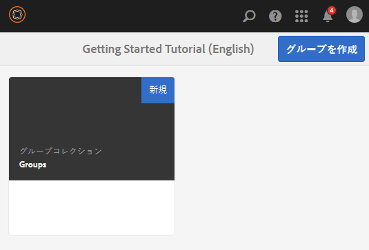
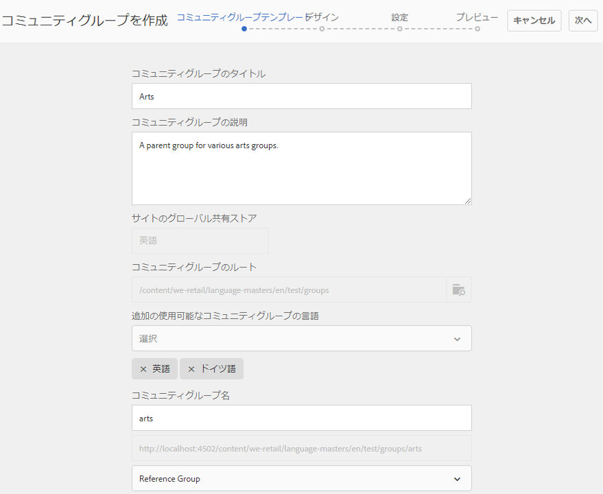
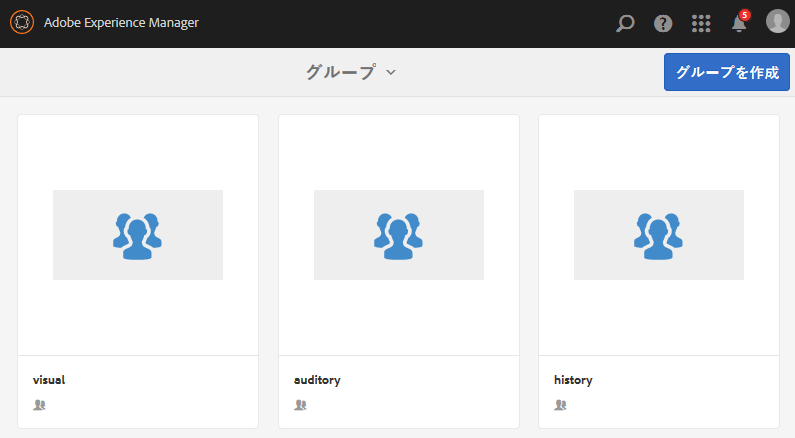
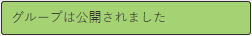

# ネストされたグループの作成 {#authoring-nested-groups}

## オーサー環境でのグループの作成 {#creating-groups-on-author}

オーサー環境で、グローバルナビゲーションから、

* 選択 **[!UICONTROL コミュニティ/サイト]**
* 選択 **[!UICONTROL エンゲージフォルダー]** 開ける
* のカードを選択します。 **[!UICONTROL 入門チュートリアル]**  英語サイト
   * カード画像を選択
   * 実行 *not* アイコンを選択

そうすると、[グループコンソール](groups.md)に移動します。

グループ機能は、グループのインスタンスが作成されるフォルダーとして表示されます。グループフォルダーを選択して、開きます。公開時に作成されたグループが表示されます。

## メインの Arts グループの作成 {#create-main-arts-group}

このグループを作成できるのは、engage のサイト構造にグループ機能が含まれているからです。サイトの `Reference Template` デフォルトでは、有効なグループテンプレートを選択できます。 したがって、この新しいグループ用に選択されたテンプレートが `Reference Group`.

これらのコンソールは、コミュニティサイトコンソールによく似ています。

* 選択 **[!UICONTROL グループを作成]**
*  `1 Community Group Template` の下）で、次の手順をおこないます。
   * コミュニティグループのタイトル：Arts
   * コミュニティグループの説明：A parent group for various arts groups.
   * コミュニティグループのルート：デフォルトのまま&#x200B;**
   * 追加の使用可能なコミュニティグループの言語：プルダウンメニューを使用して、使用可能なコミュニケーショングループの言語を選択します。このメニューには、親コミュニティサイトを作成できる言語がすべて表示されます。この中から言語を選択することで、1 回の手順で複数のロケールにグループを作成できます。指定した複数の言語で、それぞれのコミュニティサイトのグループコンソールに同じグループが作成されます。
   * コミュニティグループ名：arts
   * テンプレート：プルダウンして選択 `Reference Group`
   *  `Next`

      

引き続き、他のパネルで以下の値を設定します。

* **2 デザイン**
   * デザインを変更したり、親サイトのデザインをデフォルトにすることもできます
   * 「**[!UICONTROL 次へ]**」を選択します。
* **3 設定**
   * **モデレート**
      * 空のままにする（親サイトから継承）
   * **メンバーシップ**
      * デフォルトを使用 `Optional Membership`
   * **サムネール**
      * `optional`
   *  `Next`
* 「**[!UICONTROL 作成]**」を選択します。

### Arts グループ内でのグループのネスト {#nesting-groups-within-arts-group}

この `groups` フォルダーには、2 つのグループが含まれるようになりました（ページの更新が必要になる場合があります）。

#### グループの公開 {#publish-group}

`arts` グループ内でネストされるグループを作成する前に、`arts` カードにカーソルを合わせ、公開アイコンを選択してそのグループを公開します。

グループが公開されたことが確認されるまで待機します。

この `arts` グループには、 `groups` フォルダー内に作成されますが、空で新しいグループを作成できるフォルダー内に作成されます。 arts グループフォルダーに移動し、それぞれ異なるメンバーシップ設定を持つネストされた 3 つのグループを作成します。

1. Visiual
   * タイトル: `Visual Arts`
   * 名前：`visual`
   * テンプレート: `Reference Group`
   * メンバーシップ：選択 `Optional Membership`
すべてのメンバーに対して開かれているパブリックグループ
1. Auditory
   * タイトル: `Auditory Arts`
   * 名前：`auditory`
   * テンプレート: `Reference Group`
   * メンバーシップ：選択 `Required Membership`
メンバーが参加できる、オープンなグループ

1. History

   * タイトル: `Art History`
   * 名前：`history`
   * テンプレート: `Reference Group`
   * メンバーシップ：選択 `Restricted Membership`
招待メンバーの例としてのみ参照可能な、シークレットグループ 
[デモユーザー](tutorials.md#demo-users) `emily.andrews@mailinator.com`

ページを更新して、ネストされた 3 つのグループ（サブコミュニティ）すべてを表示します。

必要に応じて、コミュニティサイトコンソールからネストされたグループに移動するには、次の手順を実行します。

* 選択 **[!UICONTROL エンゲージフォルダー]**
* 選択 **[!UICONTROL 入門チュートリアル]** カード
* 選択 **[!UICONTROL グループフォルダー]**
* 選択 **[!UICONTROL アートカード]**
* 選択 **[!UICONTROL グループフォルダー]**

## グループの公開 {#publishing-groups}

メインのコミュニティサイトを公開したら、以下のことが必要になります。

* 各グループを個別に公開
   * グループが公開されたことの確認を待機中
* 内にネストされたグループを公開する前に親グループを公開する
   * すべてのグループは、トップダウン方式で公開する必要があります。

## パブリッシュ環境でのエクスペリエンス {#experience-on-publish}

ログイン時に様々なグループが表示されます。例えば、 [デモユーザー](tutorials.md#demo-users) 使用対象

* Art/History グループメンバー：emily.andrews@mailinator.com／password
   * 制限された（秘密の）グループ、アート/履歴が表示されます
   * オプション（公開）のグループを表示できます
   * 制限付き（開いた）グループに参加できます
* グループマネージャー：aaron.mcdonald@mailinator.com／password
   * オプション（公開）のグループを表示できます
   * 制限された（オープン）グループに参加できます。
   * 制限付き（秘密鍵）グループは表示されません

オーサー環境で Communities の[メンバーコンソールとグループコンソール](members.md)にアクセスすると、コミュニティグループに対応する様々なメンバーグループに他のユーザーを追加できます。
