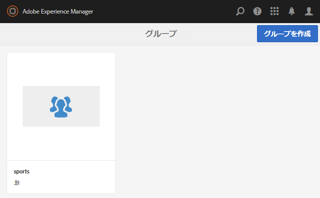

# ネストされたグループの作成 {#authoring-nested-groups}

>[!CAUTION]
>
>AEM 6.4 の拡張サポートは終了し、このドキュメントは更新されなくなりました。 詳細は、 [技術サポート期間](https://helpx.adobe.com/jp/support/programs/eol-matrix.html). サポートされているバージョンを見つける [ここ](https://experienceleague.adobe.com/docs/?lang=ja).

## オーサー環境でのグループの作成 {#creating-groups-on-author}

オーサー環境で、グローバルナビゲーションから

* 選択 **[!UICONTROL コミュニティ/サイト]**
* 選択 **[!UICONTROL エンゲージフォルダー]** 開ける
* のカードを選択します。 **[!UICONTROL 入門チュートリアル]**  英語サイト
   * カード画像を選択
   * 実行 *not* アイコンを選択

その結果、 [グループコンソール](groups.md):

グループ機能は、グループのインスタンスが作成されるフォルダーとして表示されます。 グループフォルダを選択して開きます。 公開時に作成されたグループが表示されます。

## メインアートグループを作成 {#create-main-arts-group}

このグループは、エンゲージメントのサイト構造にグループ機能が含まれているので作成できます。 サイトの `Reference Template` デフォルトでは、有効なグループテンプレートを選択できます。 したがって、この新しいグループ用に選択されたテンプレートが `Reference Group`.

これらのコンソールは、コミュニティサイトコンソールと非常に似ています。

* 選択 **[!UICONTROL グループを作成]**
*  `1 Community Group Template`：
   * コミュニティグループのタイトル：芸術
   * コミュニティグループの説明：様々な芸術グループの親グループ。
   * コミュニティグループのルート： *デフォルトのままにする*
   * 追加の利用可能なコミュニティグループの言語：プルダウンメニューを使用して、利用可能なコミュニティグループの言語を選択します。 親コミュニティサイトが作成されたすべての言語がメニューに表示されます。 ユーザーは、この 1 つの手順で、複数のロケールでグループを作成するために、これらの言語の中から選択できます。 各コミュニティサイトのグループコンソールで、指定した複数の言語で同じグループが作成されます。
   * コミュニティグループ名：芸術
   * テンプレート：プルダウンして選択 `Reference Group`
   * `Next` を選択します。

      

次の設定を使用して、他のパネルを続行します。

* **2 デザイン**
   * デザインを変更したり、親サイトのデザインをデフォルトにすることもできます
   * 選択 **[!UICONTROL 次へ]**
* **3 設定**
   * **モデレート**
      * 空のままにする（親サイトから継承）
   * **メンバーシップ**
      * デフォルトを使用 `Optional Membership`
   * **サムネール**
      * `optional`
   * `Next` を選択します。
* 選択 **[!UICONTROL 作成]**

### Arts Group 内のグループのネスト {#nesting-groups-within-arts-group}

この `groups` フォルダーには、2 つのグループが含まれるようになりました（ページの更新が必要になる場合があります）。

#### グループを公開 {#publish-group}

内にネストされたグループを作成する前に `arts`グループの上に `arts` カードを選択し、公開アイコンを選択して公開します。

グループが公開されたことを確認するまで待ちます。

この `arts` グループには、 `groups` フォルダー内に作成されますが、空で新しいグループを作成できるフォルダー内に作成されます。 arts グループフォルダーに移動し、それぞれ異なるメンバーシップ設定を持つネストされた 3 つのグループを作成します。

1. Visiual
   * タイトル: `Visual Arts`
   * 名前：`visual`
   * テンプレート: `Reference Group`
   * メンバーシップ：選択 `Optional Membership`
すべてのメンバーに対して開かれているパブリックグループ
1. 聴覚
   * タイトル: `Auditory Arts`
   * 名前：`auditory`
   * テンプレート: `Reference Group`
   * メンバーシップ：選択 `Required Membership`
メンバーが参加できる、オープンなグループ

1. History

   * タイトル: `Art History`
   * 名前：`history`
   * テンプレート: `Reference Group`
   * メンバーシップ：選択 `Restricted Membership`
招待メンバーの例としてのみ参照可能な、シークレットグループ 
[デモユーザー](tutorials.md#demo-users) `emily.andrews@mailinator.com`

ページを更新して、ネストされた 3 つのグループ（サブコミュニティ）をすべて表示します。

必要に応じて、コミュニティサイトコンソールからネストされたグループに移動します。

* 選択 **[!UICONTROL エンゲージフォルダー]**
* 選択 **[!UICONTROL 入門チュートリアル]** カード
* 選択 **[!UICONTROL グループフォルダー]**
* 選択 **[!UICONTROL アートカード]**
* 選択 **[!UICONTROL グループフォルダー]**

## 発行グループ {#publishing-groups}

メインのコミュニティサイトを公開した後、次の操作を行う必要があります。

* 各グループを個別に公開
   * グループが公開されたことの確認を待機中
* 内にネストされたグループを公開する前に親グループを公開する
   * すべてのグループは、トップダウン方式で公開する必要があります。

## 公開時のエクスペリエンス {#experience-on-publish}

ログイン時に様々なグループが表示されます。例えば、 [デモユーザー](tutorials.md#demo-users) 使用対象

* アート/履歴グループのメンバー：emily.andrews@mailinator.com/password
   * 制限された（秘密の）グループ、アート/履歴が表示されます
   * オプション（公開）のグループを表示できます
   * 制限付き（開いた）グループに参加できます
* グループマネージャ：aaron.mcdonald@mailinator.com/password
   * オプション（公開）のグループを表示できます
   * 制限付き（開く）グループに参加できます
   * 制限付き（秘密鍵）グループは表示されません

コミュニティにアクセス [メンバーコンソールとグループコンソール](members.md) オーサー環境で、コミュニティグループに対応する様々なメンバーグループに他のユーザーを追加します。
