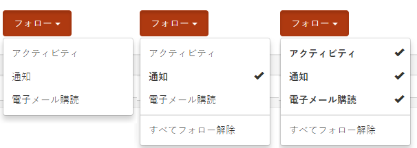
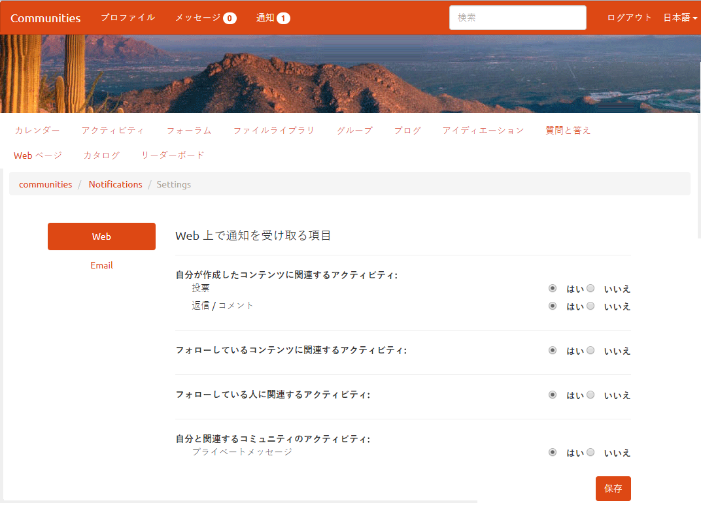
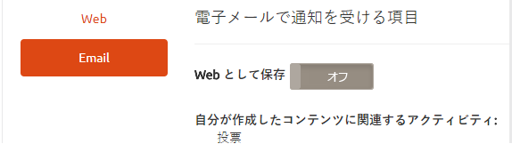
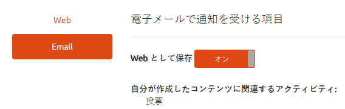
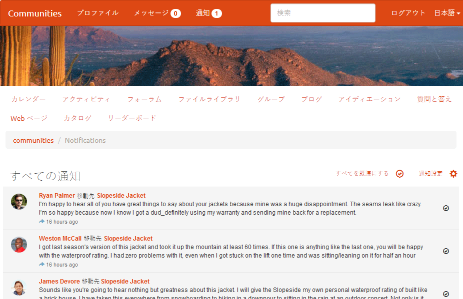
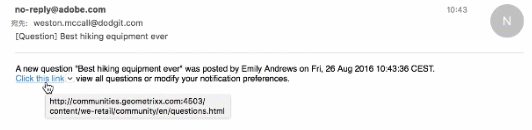

# コミュニティの通知 {#communities-notifications}

## 概要 {#overview}

AEM Communities には、サインインしているコミュニティメンバーにとって興味深いイベントを表示する通知セクションが用意されています。

通知は[アクティビティ](essentials-activities.md)や[購読](subscriptions.md)と同様に、以下に基づいて生成されます。

* コンテンツを投稿するメンバー
* 別のメンバーに従うことを選択したメンバー
* 特定のトピック、記事、およびコンテンツの他のスレッドに従うことを選択したメンバー

通知は以下の点でアクティビティや購読と異なります。

* 通知セクションへのリンクは、コミュニティサイトのヘッダーに常に存在します
   * アクティビティには [アクティビティストリーム機能](functions.md#activity-stream-function) コミュニティサイトの構造に含まれる
   * 購読にはが必要です [電子メールの設定](email.md)
* 通知の実装は、拡張性とプラグ可能なチャネルを通じて行われます
   * アクティビティは Web でのみ使用できます
   * 購読は E メールでのみ利用できます

Communities [FP1](deploy-communities.md#latestfeaturepack) 以降、使用可能な通知チャネルは以下のとおりです。

* Web チャネル ( `Notifications` リンク
* E メールチャネル（E メールが正しく設定されている場合に使用可能）

今後のチャネルとしてモバイルおよびデスクトップがあります。

### 要件 {#requirements}

**電子メールの設定**

通知の電子メールチャネルを機能させるには、電子メールを設定する必要があります。

電子メールを設定する手順については、[電子メールの設定](analytics.md)を参照してください。

**フォローの有効化**

フォローを有効にするようにコンポーネントを設定する必要があります。次の機能を使用できます。 [ブログ](blog-feature.md), [フォーラム](forum.md), [Q&amp;A](working-with-qna.md), [カレンダー](calendar.md), [filelibrary](file-library.md)、および [コメント](comments.md).

以下の点に注意してください。

* コミュニティ内で使用されるコンポーネント [サイトテンプレート](sites.md) および [グループテンプレート](tools-groups.md) は、既に次を許可するように設定されている可能性があります

* メンバープロファイルは、他のメンバーがフォローできるように既に設定されています

## フォローによる通知 {#notifications-from-following}

「**フォロー**」ボタンを使用すると、エントリをアクティビティや購読、通知としてフォローできます。毎回 **フォロー** ボタンが選択されている場合、選択のオン/オフを切り替えることができます。 この `Email Subscriptions` 選択が存在するのは、設定時のみです。

フォロー方法が選択されると、ボタンのテキストが「**フォロー中**」に変わります。 便宜上、 `Unfollow All` をクリックして、すべてのメソッドをオフにします。

この **フォロー** ボタンが表示されます

* 別のメンバーのプロファイルを表示する場合
* フォーラム、Q&amp;A、ブログなどのメイン機能ページ
   * その一般的な機能のすべてのアクティビティに従う
* フォーラムトピック、Q&amp;A 質問、ブログ記事などの特定のエントリ
   * その特定のエントリのすべてのアクティビティに従う

## 通知設定の管理 {#managing-notification-settings}

通知ページから通知設定リンクを選択すると、各メンバーは通知の受信方法を管理することができます。

Web チャネルは常に有効になっています。

電子メールチャネルでは、Web チャネルの場合と同様の設定が用意されていますが、別途適切な[電子メールの設定](email.md)が必要です。

電子メールチャネルは、デフォルトでオフになっています。

これはメンバーがオンにすることもできますが、それでも電子メールの設定によって決まります。

## 通知の表示 {#viewing-notifications}

### Web 通知 {#web-notifications}

A [ウィザードが作成したコミュニティサイト](sites-console.md) に、 `Notifications` 機能を使用します。 メッセージとは異なり、通知はすべてのコミュニティサイトに対して作成されますが、メッセージはサイト作成プロセス中に有効にする必要があります。

公開されたサイトにアクセスする際に、 `Notifications` リンクは、メンバーのすべての通知を表示します。

### メール通知 {#email-notifications}

電子メールチャネルを有効にすると、メンバーは、Web 上のコンテンツへのリンクが記載されている電子メールを受信します。

