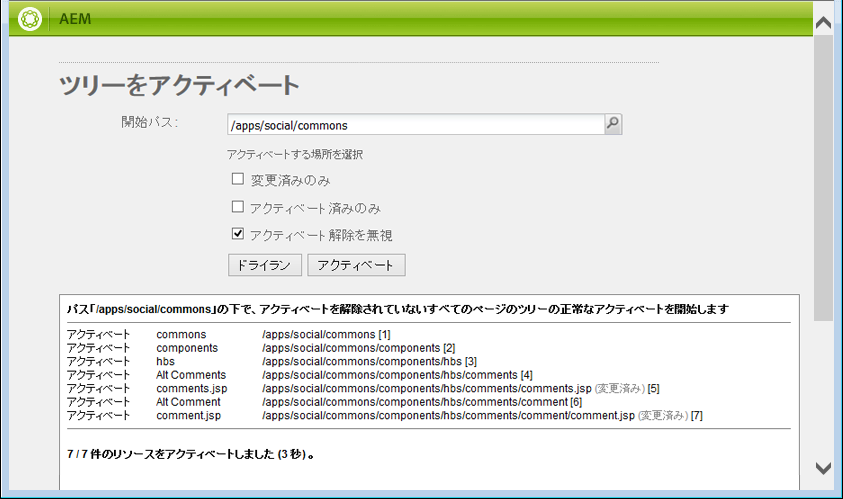
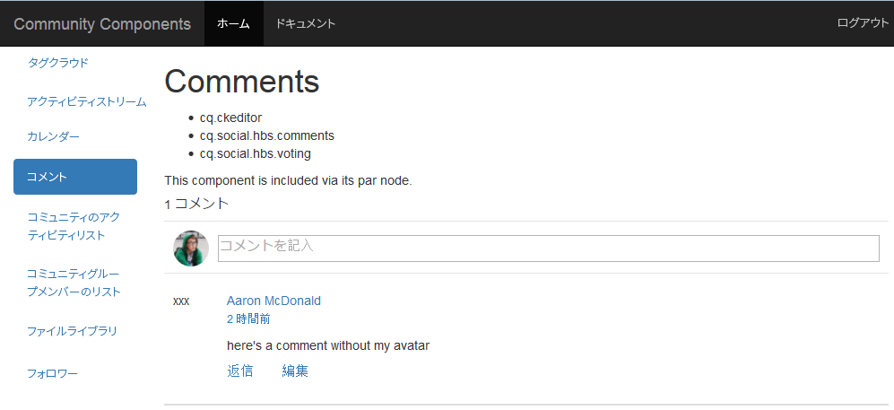

# 外観の変更 {#alter-the-appearance}

>[!CAUTION]
>
>AEM 6.4 の拡張サポートは終了し、このドキュメントは更新されなくなりました。 詳細は、 [技術サポート期間](https://helpx.adobe.com/jp/support/programs/eol-matrix.html). サポートされているバージョンを見つける [ここ](https://experienceleague.adobe.com/docs/?lang=ja).

## スクリプトの変更 {#modify-the-script}

comment.hbs スクリプトは、各コメントの全体的なHTMLを作成します。

投稿された各コメントの横にアバターを表示しないには、次のようにします。

1. コピー `comment.hbs`から `libs`から `apps`
   1. `/libs/social/commons/components/hbs/comments/comment/comment.hbs` を選択します。
   1. 選択 **[!UICONTROL コピー]**
   1. `/apps/social/commons/components/hbs/comments/comment` を選択します。
   1. 選択 **[!UICONTROL 貼り付け]**
1. オーバーレイを開く `comment.hbs`
   * ノードをダブルクリック  `comment.hbs`in `/apps/social/commons/components/hbs/comments/comment folder`
1. 次の行を探し、削除するかコメントアウトします。

   ```xml
   <aside class="scf-comment-author">
           </img>
   ```

行を削除するか、&#39;で囲みます&lt;!> — 」と「 —>」でコメントアウトします。 また、アバターがあった場所を視覚的に示すインジケーターとして、文字「xxx」が追加されています。

```xml
<!-- do not display avatar with comment
    <aside class="scf-comment-author">
        </img>
```

## オーバーレイの複製 {#replicate-the-overlay}

レプリケーションツールを使用して、オーバーレイされたコメントコンポーネントをパブリッシュインスタンスにプッシュします。

>[!NOTE]
>
>より堅牢なレプリケーション形式は、パッケージマネージャーでパッケージを作成し、 [有効化](../../help/sites-administering/package-manager.md#replicating-packages) それは。 パッケージはエクスポートおよびアーカイブできます。

グローバルナビゲーションから、 **[!UICONTROL ツール/導入/レプリケーション]** その後 **[!UICONTROL ツリーをアクティベート]**.

「開始パス」に、と入力します。 `/apps/social/commons` を選択し、 **[!UICONTROL 有効化]**.



## 結果を表示 {#view-results}

パブリッシュインスタンスに管理者 ( http://localhost:4503/crx/deなど ) としてログインした場合は、オーバーレイされたコンポーネントが存在することを確認できます。

ログアウトし、再ログインした場合 `aaron.mcdonald@mailinator.com/password` ページを更新すると、投稿されたコメントがアバターと共に表示されなくなり、代わりに単純な「xxx」が表示されます。


